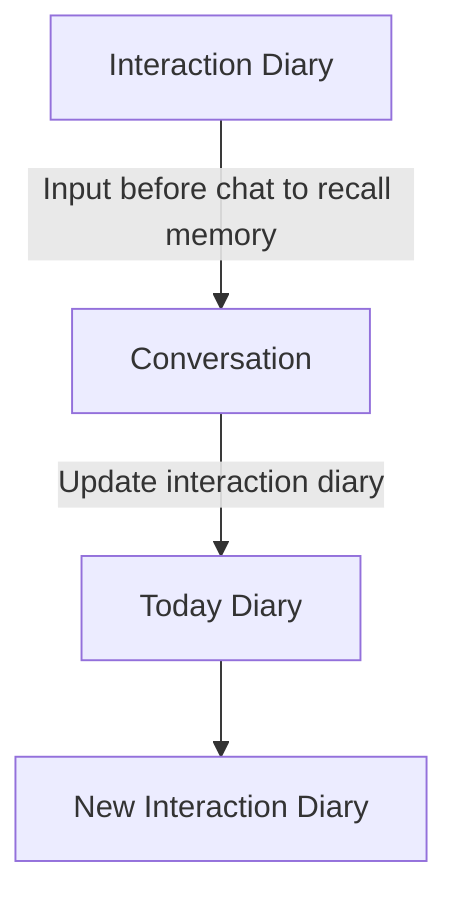

# URDairy – AI-Powered Emotional Support and Diary System

 <!-- Replace with actual logo if available -->

**URDairy** is an innovative project that combines artificial intelligence (AI) and psychological principles to create a conversational companion. It provides emotional support and generates structured diaries to help users reflect on their daily experiences and foster self-growth. Built with a modern tech stack, URDairy leverages an Electron frontend, FastAPI backend, and a dual-memory system (Redis and PostgreSQL) to deliver a seamless experience.

## Features
- **Chat System**: Interact via text or voice with an empathetic AI companion.  
- **Daily Diary**: Automatically generates a structured diary (400-600 words) from conversations, including events, emotions (with valence/arousal scores), reflections, and next steps.  
- **Interaction Diary**: Tracks long-term insights like life domains (e.g., family, work), emotional patterns, and key events, akin to a counselor's notes.  
- **Privacy-First**: Daily diaries are stored locally, while interaction diaries reside on the server.  

## Tech Stack
- **Frontend**: Electron (desktop), HTML/CSS/JavaScript (web)  
- **Backend**: FastAPI with Grok AI (plans for local models like RoBERTa, Deepface)  
- **Memory**: Redis (short-term chat history), PostgreSQL (long-term user data)  
- **Deployment**: Docker-ready for easy setup  

## Diary Generation Flow
URDairy's diary generation process is a cyclical workflow that ensures continuity and personalization. Below is the flow represented in [Mermaid](https://mermaid-js.github.io/mermaid/#/) syntax:




## Multi-Model Support

URDairy now supports multiple Grok AI models:

- **Grok 2**: Original Grok model
- **Grok 3**: New enhanced Grok model

You can set the default model in the environment configuration or dynamically choose different models at runtime. For details, please refer to [grok_chatbot/MODELS_GUIDE.md](grok_chatbot/MODELS_GUIDE.md).

## Development Environment Setup

### Frontend (Electron)

```bash
cd desktop
npm install
npm start
```

### Backend (FastAPI)

```bash
cd grok_chatbot
pip install -r requirements.txt
python -m app.main
```

## Configuration

Before running the application, the following configuration is required:

1. Create `.env` file (reference `.env.example`)
2. Add necessary API keys and configurations
3. Configure database connection parameters

## Special Thanks

- xAI team for providing Grok API
- All contributors and test users

## License

MIT License

