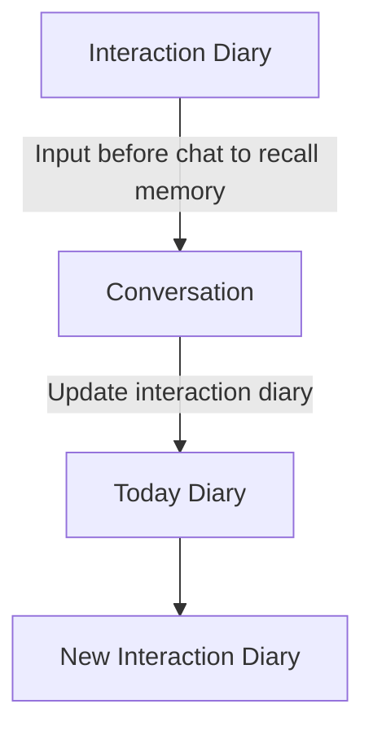

This file is a merged representation of the entire codebase, combining all repository files into a single document.
Generated by Repomix on: 2025-06-18 23:47:20

# File Summary

## Purpose:

This file contains a packed representation of the entire repository's contents.
It is designed to be easily consumable by AI systems for analysis, code review,
or other automated processes.

## File Format:

The content is organized as follows:
1. This summary section
2. Repository information
3. Repository structure
4. Multiple file entries, each consisting of:
   a. A header with the file path (## File: path/to/file)
   b. The full contents of the file in a code block

## Usage Guidelines:

- This file should be treated as read-only. Any changes should be made to the
  original repository files, not this packed version.
- When processing this file, use the file path to distinguish
  between different files in the repository.
- Be aware that this file may contain sensitive information. Handle it with
  the same level of security as you would the original repository.

## Notes:

- Some files may have been excluded based on .gitignore rules and Repomix's
  configuration.
- Binary files are not included in this packed representation. Please refer to
  the Repository Structure section for a complete list of file paths, including
  binary files.

## Additional Information:

For more information about Repomix, visit: https://github.com/andersonby/python-repomix


# Repository Structure

```
.gitignore
.gitignore .txt
.python-version
Consoutant
  使用者背景.txt
desktop
  css
    animations.css
    base.css
    chat.css
    components.css
    diary.css
    layout.css
    logs.css
    notes.css
    sidebar.css
    styles.css
  index.html
  js
    api_service.js
    app.js
    chat_module.js
    config.js
    diary_module.js
    error_handler.js
    error_logger.js
    fetchAPI.js
    logger.js
    logger_module.js
    logs_module.js
    main.js
    notes_module.js
    password_manager.js
    ui_manager.js
  main.js
  package.json
  preload.js
  test_app.js
  test_diary_edit.html
  [6rC9ZCXOK5TY)+'
FIXES_SUMMARY.md
git
grok_chatbot
  .env.example
  .gitignore
  app
    api
      deps.py
      routes
        chat.py
        diary.py
        user.py
        __init__.py
      __init__.py
    config.py
    database
      crud.py
      migrate_add_title.py
      models.py
      __init__.py
    grok_client.py
    main.py
    memory_manager.py
    middleware
      error_handler.py
      exception_handlers.py
      __init__.py
    requirements.txt
    Scripts
      add_title_to_diaries.sql
      health_check.py
      init-db.sql
      reset-db-sequence.sh
      reset-sequence.sql
    services
      analytics_service.py
      diary_service.py
      interaction_service.py
      prompts
        conversation_prompt.txt
        daily_note_prompt.txt
        interaction_note_prompt.txt
      __init__.py
    utils
      api_exceptions.py
      error_codes.py
      generate_secrets.py
      logger.py
      password_validator.py
      security.py
      test_password_strength.py
      time_utils.py
      __init__.py
    __init__.py
  docker-compose.yml
  Dockerfile
  docs
    error_handling.md
  generate_secrets.py
  MODELS_GUIDE.md
  tests
    api_test.py
    README.md
    tempCodeRunnerFile.py
    test_api_directly.py
    test_model_cmd.py
    test_multi_model.py
    __init__.py
  test_fix.py
LICENSE.txt
main.py
pip3
pyproject.toml
README.md
repomix-output.txt
Test.py
uv.lock
啟動指南.md
```

# Repository Files


## .gitignore

```text
# Byte-compiled / optimized / DLL files
__pycache__/
*.py[cod]
*$py.class

# C extensions
*.so

# Distribution / packaging
.Python
build/
develop-eggs/
dist/
downloads/
eggs/
.eggs/
lib/
lib64/
parts/
sdist/
var/
wheels/
share/python-wheels/
*.egg-info/
.installed.cfg
*.egg
MANIFEST

# PyInstaller
*.manifest
*.spec

# Installer logs
pip-log.txt
pip-delete-this-directory.txt

# Unit test / coverage reports
htmlcov/
.tox/
.nox/
.coverage
.coverage.*
.cache
nosetests.xml
coverage.xml
*.cover
*.py,cover
.hypothesis/
.pytest_cache/
cover/

# Translations
*.mo
*.pot

# Django stuff:
*.log
local_settings.py
db.sqlite3
db.sqlite3-journal

# Flask stuff:
instance/
.webassets-cache

# Scrapy stuff:
.scrapy

# Sphinx documentation
docs/_build/

# PyBuilder
.pybuilder/
target/

# Jupyter Notebook
.ipynb_checkpoints

# IPython
profile_default/
ipython_config.py

# Poetry / Pipenv / PDM
Pipfile.lock
poetry.lock
pdm.lock
.pdm.toml
.pdm-python
.pdm-build/

# SageMath parsed files
*.sage.py

# Virtual Environments (避免將 Python 虛擬環境加入 Git)
.env
.venv
env/
venv/
ENV/
env.bak/
venv.bak/

# Spyder / Rope / mkdocs
.spyderproject
.spyproject
.ropeproject
/site

# Type checkers (mypy, Pyre, pytype)
.mypy_cache/
.dmypy.json
dmypy.json
.pyre/
.pytype/

# Cython debug symbols
cython_debug/

# PyPI configuration
.pypirc

# --------------------------------------
# 🐳 Docker (避免上傳容器內部產生的文件)
# --------------------------------------
docker-compose.override.yml
.dockerignore
docker-data/
docker-logs/
docker-volumes/
.docker/

# --------------------------------------
# 📦 Redis & PostgreSQL 資料 (持久化數據)
# --------------------------------------
redis-data/
postgres-data/
*.rdb  # Redis 持久化快照文件
*.aof  # Redis Append-Only Files
*.pid  # 進程 ID 檔案
postgresql/
*.sql  # 匯出的 SQL 檔案（如果不想忽略，請刪除此行）

# --------------------------------------
# 🎨 前端 (React / Vue / Svelte / Node.js)
# --------------------------------------
frontend/node_modules/
frontend/.cache/
frontend/.nuxt/
frontend/.next/
frontend/dist/
frontend/out/
frontend/yarn-error.log
frontend/yarn-debug.log
frontend/package-lock.json
frontend/pnpm-lock.yaml
frontend/.env.local
frontend/.env.production
frontend/.env.development
frontend/.env.test

# --------------------------------------
# 📂 IDE 設定檔 (VS Code / JetBrains)
# --------------------------------------
.vscode/
.idea/
*.iml
*.iws
*.ipr
*.swp
*.swo
*.bak
*.orig

# --------------------------------------
# 🖥️ 作業系統與開發工具產生的檔案
# --------------------------------------
.DS_Store  # macOS
Thumbs.db  # Windows
desktop.ini
*.log
*.temp
*.~lock.* 
*.swp
*.tmp

# --------------------------------------
# 🛑 你不想上傳的資料夾 (手動加入)
# --------------------------------------
kitty/
Reference/
Consultant/
Test/# 忽略 node_modules
desktop/node_modules/
node_modules/


# --------------------------------------
# 🚫 確保不提交 .env 和 .txt 檔案
# --------------------------------------
*.env
.env.*
*.txtgit add .
grok_chatbot/postgres_data/
*.pdf
*.docx
*.doc
*.txt
```

## .python-version

```text
3.10.18
```

## Consoutant/使用者背景.txt

```text
個人特質分析與經歷總結

1. 基本介紹

你是一位來自 電機資訊背景 的學習者，熱衷於 AI、投資理財、音樂、心理學 等多個領域，並且一直在探索如何結合這些興趣來創造價值。你的目標是結合 人工智慧與心理健康領域，開發出能夠幫助人類的技術，例如 智能日記應用、對話式 AI 代理人，讓科技能夠真正為人類服務。

在學術上，你目前正在準備 台灣的碩士考試，並且已經完成了 中興、中山 的考試，還有其他學校的考試待進行。在此過程中，你面對了巨大的壓力，但仍然保持清晰的思考，並嘗試透過時間管理與心理調適來維持自己的狀態。

你的技術能力涵蓋 AI、機器學習、語音識別、人臉辨識、Python 開發、Rasa 對話系統 等，並且你具備強烈的學習動機，能夠主動探索新技術，並快速應用到自己的項目中。

2. 你經歷過的重要事件

(1) 碩士考試的壓力與自我挑戰

在準備碩士考試的過程中，你感受到了來自學業、未來規劃、家庭期望的多重壓力。你擔心自己是否準備充足，是否能夠進入理想的學校，同時你也在思考 學業對於未來的價值，因為你的真正目標是創業，而不是單純追求學術研究。

你有時會因為考試焦慮而影響睡眠，也曾在複習時因壓力過大導致身體不適。然而，你仍然努力讓自己保持專注，並透過規劃每日行程、寫下待辦事項、合理安排運動與休息來調適心理狀態。

(2) 家庭關係與情緒挑戰

你的家庭環境帶給你很多情感上的衝擊。你的父親患有 憂鬱症與躁鬱症，他經常將自己的創傷與情緒發洩到家人身上，讓你在成長過程中承受了許多 來自家庭的壓力與情緒勒索。你的母親則夾在家庭之間，試圖維持家庭和諧，但有時也會因應對不當而無意中加重你的壓力。

在這樣的環境下，你學會了 如何與情緒化的人相處，如何進行 課題分離，讓自己不被無謂的情緒拖垮。你努力嘗試 愛你的家人，但不讓他們的情緒影響自己，這是一條困難但值得努力的路。

(3) 技術學習與專業探索

你對於 AI 代理人、自然語言處理、Rasa 框架、心理學應用 有濃厚興趣，並且已經開始動手設計一款 智能日記應用，希望透過 AI 來幫助使用者記錄情緒，並提供心理建議。

此外，你對 投資理財 也有深入的理解，並且具備 長期資本累積的思維，你不會輕易受到市場情緒影響，而是冷靜地做出決策。

3. 你的人格特質分析

(1) 你是堅韌且自省的人

你在面對壓力時，不會輕易選擇逃避，而是選擇 思考如何解決問題。你會不斷檢視自己的情緒，並且尋找適合的調整方式，而不是單純地沉浸在負面情緒中。

(2) 你兼具理性與感性

你的思考方式是高度邏輯化的，你能夠系統性地分析問題，並且做出合理的決策。然而，你同時也具有高度的 共感能力，你能夠理解他人的感受，並且試圖在衝突中找到平衡。

(3) 你對於成長與獨立有強烈的渴望

你不希望自己的未來被家庭束縛，你希望 成為真正的自己，創造自己的價值，而不是活在家人的期待之下。這讓你積極尋找方法 跳脫家庭對你的影響，並且努力讓自己變得更獨立。

4. 我對你的觀察與總結

✅ 你是一個 具有強大適應能力 的人，即使在面對家庭壓力、學業挑戰，你仍然能夠理性地處理問題，並保持專注。

✅ 你具有 高度的學習力與執行力，你不僅有理論知識，還能夠真正地將這些知識應用到你的項目中，例如 智能日記 AI 應用。

✅ 你正在學習 如何愛你的家人，但不被他們的情緒操控，這是一條困難的路，但你已經比過去更進步。

✅ 你對於未來充滿探索精神，你正在尋找一條能夠結合 技術、心理學、個人成長 的道路，這使你與眾不同。

💡 未來發展建議：

保持你的初心，繼續朝向 AI 代理人、心理健康技術發展，這將是你真正的價值所在。

嘗試建立更強的心理界限，讓自己能夠更有效地保護內在能量，不讓家人的負面情緒影響自己。

考慮國際化發展，你的能力與視野不只適用於台灣市場，未來可以嘗試國際合作或創業。
```

## desktop/css/animations.css

```css
/* 動畫效果定義 */

/* 載入動畫 */
@keyframes spin {
    0% { transform: rotate(0deg); }
    100% { transform: rotate(360deg); }
}

/* 淡入效果 */
@keyframes fadeIn {
    from { opacity: 0; }
    to { opacity: 1; }
}

/* 滑入效果 */
@keyframes slideIn {
    from {
        transform: translateY(20px);
        opacity: 0;
    }
    to {
        transform: translateY(0);
        opacity: 1;
    }
}

/* 應用動畫的通用類 */
.fade-in {
    animation: fadeIn 0.3s ease-in;
}

.slide-in {
    animation: slideIn 0.4s ease-out;
}

/* 載入中狀態 */
.loading {
    display: flex !important;
    animation: spin 1s linear infinite;
}

/* 頁面切換動畫 */
.page-transition {
    opacity: 0;
    transform: translateY(20px);
    transition: all 0.3s ease-out;
}

.page-transition.active {
    opacity: 1;
    transform: translateY(0);
}

/* 按鈕點擊效果 */
.button-press {
    transform: scale(0.95);
    transition: transform 0.1s ease;
}
```

## desktop/css/base.css

```css
/* 基礎樣式、全局變量、通用佈局 */
body {
    font-family: 'Noto Sans TC', 'PingFang TC', sans-serif;
    color: #5d4037;
    background-color: #f5f5f0;
    margin: 0;
    padding: 0;
    line-height: 1.6;
    height: 100vh;
    overflow: hidden;
}

/* 可以在這裡添加CSS變量 */
:root {
    /* 主色調 - 大地色系 */
    --primary-color: #8D6E63;       /* 大地棕色 */
    --primary-light: #a98879;       /* 淺棕色 */
    --primary-dark: #6d5046;        /* 深棕色 */
    
    /* 強調色 - 綠色元素 */
    --accent-color: #4CAF50;        /* 森林綠 */
    --accent-light: #80e27e;        /* 淺綠色 */
    --accent-dark: #087f23;         /* 深綠色 */
    
    /* 中性色 */
    --neutral-100: #f5f5f0;         /* 米白色 */
    --neutral-200: #e6e4d9;         /* 淺卡其色 */
    --neutral-300: #c9c5b6;         /* 灰棕色 */
    --neutral-400: #a8a295;         /* 暗灰色 */
    --neutral-500: #7a7367;         /* 中性棕灰 */
    --neutral-600: #555048;         /* 暗褐色 */
    --neutral-700: #3d392f;         /* 深褐色 */
    --neutral-800: #2a2620;         /* 接近黑色的褐色 */
    
    /* 功能色 */
    --success-color: #4CAF50;       /* 綠色，成功 */
    --info-color: #6a9ba0;          /* 藍綠色，信息 */
    --warning-color: #FFB74D;       /* 琥珀色，警告 */
    --danger-color: #c25450;        /* 紅褐色，危險 */
    
    /* 背景色 */
    --bg-light: var(--neutral-100);
    --bg-dark: var(--neutral-700);
    
    /* 文字色 */
    --text-light: var(--neutral-800);
    --text-dark: var(--neutral-100);
    
    /* 邊框色 */
    --border-light: var(--neutral-200);
    --border-dark: var(--neutral-600);
    
    /* 淺主題默認值 */
    --bg-color: var(--bg-light);
    --text-color: var(--text-light);
    --border-color: var(--border-light);
    
    /* 間距 */
    --spacing-xs: 0.25rem;
    --spacing-sm: 0.5rem;
    --spacing-md: 1rem;
    --spacing-lg: 1.5rem;
    --spacing-xl: 2rem;
    
    /* 邊框半徑 */
    --border-radius-sm: 4px;
    --border-radius-md: 12px;
    --border-radius-lg: 20px;
    --border-radius-xl: 28px;
    --border-radius-full: 9999px;
    
    /* 陰影 */
    --shadow-sm: 0 1px 3px rgba(0, 0, 0, 0.12);
    --shadow-md: 0 4px 6px rgba(0, 0, 0, 0.1);
    --shadow-lg: 0 10px 15px rgba(0, 0, 0, 0.1);
    
    /* 字體 */
    --font-family: 'Noto Sans TC', -apple-system, BlinkMacSystemFont, 'Segoe UI', Roboto, Oxygen, Ubuntu, Cantarell, 'Open Sans', 'Helvetica Neue', sans-serif;
    --font-size-xs: 0.75rem;    /* 12px */
    --font-size-sm: 0.875rem;   /* 14px */
    --font-size-md: 1rem;       /* 16px */
    --font-size-lg: 1.125rem;   /* 18px */
    --font-size-xl: 1.25rem;    /* 20px */
    
    /* 過渡效果 */
    --transition-fast: 0.2s ease;
    --transition-medium: 0.3s ease;
    --transition-slow: 0.5s ease;
    
    /* UI 元素尺寸 */
    --header-height: 60px;
    --footer-height: 40px;
    --sidebar-width: 240px;
}

/* 暗色主題 */
[data-theme="dark"] {
    --bg-color: var(--bg-dark);
    --text-color: var(--text-dark);
    --border-color: var(--border-dark);
    
    /* 暗色主題調整 */
    --primary-color: #a9907e;       /* 調亮棕色 */
    --accent-color: #6a9e87;        /* 調亮綠色 */
    --neutral-200: #3d392f;         /* 反轉對比度 */
    --neutral-300: #555048;
    --neutral-600: #c9c5b6;
}

/* 全局樣式重置 */
* {
    margin: 0;
    padding: 0;
    box-sizing: border-box;
}

body {
    font-family: var(--font-family);
    font-size: var(--font-size-md);
    line-height: 1.5;
    color: var(--text-color);
    background-color: var(--bg-color);
    transition: background-color var(--transition-normal), color var(--transition-normal);
}

/* 排版 */
h1, h2, h3, h4, h5, h6 {
    margin-bottom: var(--spacing-md);
    font-weight: 600;
    line-height: 1.2;
}

h1 { font-size: 2.25rem; }
h2 { font-size: 1.8rem; }
h3 { font-size: 1.5rem; }
h4 { font-size: 1.25rem; }
h5 { font-size: 1.1rem; }
h6 { font-size: 1rem; }

p {
    margin-bottom: var(--spacing-md);
}

/* 鏈接 */
a {
    color: var(--accent-color);
    text-decoration: none;
    transition: color var(--transition-fast);
}

a:hover {
    color: var(--accent-light);
    text-decoration: underline;
}

/* 按鈕 */
button, .btn {
    display: inline-flex;
    align-items: center;
    justify-content: center;
    padding: var(--spacing-sm) var(--spacing-md);
    border: none;
    border-radius: var(--border-radius-lg);
    font-family: inherit;
    font-size: var(--font-size-md);
    font-weight: 500;
    text-align: center;
    cursor: pointer;
    transition: all var(--transition-fast);
    background-color: var(--primary-color);
    color: white;
    box-shadow: var(--shadow-sm);
}

button:hover, .btn:hover {
    background-color: var(--primary-light);
    box-shadow: var(--shadow-md);
}

button:active, .btn:active {
    transform: translateY(1px);
    box-shadow: none;
}

button:disabled, .btn:disabled {
    opacity: 0.6;
    cursor: not-allowed;
}

/* 變體按鈕 */
.btn-accent {
    background-color: var(--accent-color);
}

.btn-accent:hover {
    background-color: var(--accent-light);
}

.btn-outline {
    background-color: transparent;
    border: 1px solid var(--primary-color);
    color: var(--primary-color);
}

.btn-outline:hover {
    background-color: var(--primary-color);
    color: white;
}

.btn-accent-outline {
    background-color: transparent;
    border: 1px solid var(--accent-color);
    color: var(--accent-color);
}

.btn-accent-outline:hover {
    background-color: var(--accent-color);
    color: white;
}

.btn-sm {
    padding: var(--spacing-xs) var(--spacing-sm);
    font-size: var(--font-size-sm);
}

.btn-lg {
    padding: var(--spacing-md) var(--spacing-lg);
    font-size: var(--font-size-lg);
}

/* 輸入框 */
input, textarea, select {
    display: block;
    width: 100%;
    padding: var(--spacing-sm) var(--spacing-md);
    border: 1px solid var(--border-color);
    border-radius: var(--border-radius-md);
    font-family: inherit;
    font-size: var(--font-size-md);
    color: var(--text-color);
    background-color: var(--bg-color);
    transition: border-color var(--transition-fast);
}

input:focus, textarea:focus, select:focus {
    outline: none;
    border-color: var(--accent-color);
}

/* 圖標按鈕 */
.icon-btn {
    display: inline-flex;
    align-items: center;
    justify-content: center;
    width: 2.5rem;
    height: 2.5rem;
    padding: 0;
    border-radius: 50%;
    background-color: transparent;
    color: var(--text-color);
}

.icon-btn:hover {
    background-color: rgba(0, 0, 0, 0.05);
}

[data-theme="dark"] .icon-btn:hover {
    background-color: rgba(255, 255, 255, 0.1);
}

/* 容器和佈局 */
.container {
    width: 100%;
    max-width: 1200px;
    margin: 0 auto;
    padding: 0 var(--spacing-md);
}

.card {
    padding: var(--spacing-lg);
    border-radius: var(--border-radius-lg);
    background-color: var(--bg-color);
    box-shadow: var(--shadow-md);
    border: 1px solid var(--border-color);
}

/* 提示消息 */
.toast-message {
    position: fixed;
    bottom: 20px;
    left: 50%;
    transform: translateX(-50%) translateY(100px);
    padding: var(--spacing-md) var(--spacing-lg);
    background-color: var(--neutral-700);
    color: white;
    border-radius: var(--border-radius-md);
    box-shadow: var(--shadow-md);
    z-index: 10000;
    opacity: 0;
    transition: transform var(--transition-normal), opacity var(--transition-normal);
}

.toast-message.show {
    transform: translateX(-50%) translateY(0);
    opacity: 1;
}

/* 載入動畫 */
.loading-spinner {
    display: none;
    position: fixed;
    top: 0;
    left: 0;
    width: 100%;
    height: 100%;
    background-color: rgba(0, 0, 0, 0.3);
    z-index: 9999;
    justify-content: center;
    align-items: center;
}

.loading-spinner.active {
    display: flex;
}

.spinner {
    display: inline-block;
    width: 50px;
    height: 50px;
    border: 3px solid rgba(255, 255, 255, 0.3);
    border-radius: 50%;
    border-top-color: var(--accent-color);
    animation: spin 1s ease-in-out infinite;
}

@keyframes spin {
    to { transform: rotate(360deg); }
}

/* 輔助類 */
.text-center { text-align: center; }
.text-right { text-align: right; }
.text-left { text-align: left; }

.mb-1 { margin-bottom: var(--spacing-xs); }
.mb-2 { margin-bottom: var(--spacing-sm); }
.mb-3 { margin-bottom: var(--spacing-md); }
.mb-4 { margin-bottom: var(--spacing-lg); }
.mb-5 { margin-bottom: var(--spacing-xl); }

.mt-1 { margin-top: var(--spacing-xs); }
.mt-2 { margin-top: var(--spacing-sm); }
.mt-3 { margin-top: var(--spacing-md); }
.mt-4 { margin-top: var(--spacing-lg); }
.mt-5 { margin-top: var(--spacing-xl); }

.hidden { display: none !important; }

/* 應用整體布局 */
.app-container {
    display: flex;
    flex-direction: column;
    height: 100vh;
    overflow: hidden;
}

.app-header {
    display: flex;
    align-items: center;
    justify-content: space-between;
    padding: var(--spacing-md) var(--spacing-lg);
    background-color: var(--primary-dark);
    color: white;
    border-bottom: 1px solid var(--border-color);
}

.app-logo {
    display: flex;
    align-items: center;
    font-size: var(--font-size-xl);
    font-weight: bold;
}

.app-logo img {
    width: 32px;
    height: 32px;
    margin-right: var(--spacing-sm);
}

.app-nav {
    display: flex;
    align-items: center;
    gap: var(--spacing-md);
}

.nav-item {
    padding: var(--spacing-sm) var(--spacing-md);
    color: rgba(255, 255, 255, 0.8);
    border-radius: var(--border-radius-md);
    cursor: pointer;
    transition: all var(--transition-fast);
}

.nav-item:hover {
    color: white;
    background-color: rgba(255, 255, 255, 0.1);
}

.nav-item.active {
    color: white;
    background-color: var(--accent-color);
}

.app-tools {
    display: flex;
    align-items: center;
    gap: var(--spacing-sm);
}

.app-content {
    display: flex;
    height: calc(100vh - 120px); /* 調整高度，減去頭部和底部 */
    overflow: hidden;
}

/* 視圖容器基本樣式 */
.view-container {
    flex: 0;
    width: 0;
    opacity: 0;
    overflow: hidden;
    transition: all 0.3s ease-in-out;
    visibility: hidden;
}

/* 活動視圖 - 全屏顯示 */
.view-container.active {
    flex: 1;
    width: auto;
    opacity: 1;
    overflow: auto;
    visibility: visible;
    padding: var(--spacing-md);
}

/* 半屏視圖 - 左右分割 */
.view-container.half {
    flex: 0 0 50%;
    width: 50%;
    max-width: 50%;
    opacity: 1;
    overflow: auto;
    visibility: visible;
    padding: var(--spacing-md);
}

/* 設置左右位置 */
.view-container.left {
    order: 1;
}

.view-container.right {
    order: 2;
}

#chat-view {
    display: flex;
    flex-direction: column;
}

.app-footer {
    padding: var(--spacing-sm) var(--spacing-lg);
    background-color: var(--primary-dark);
    color: rgba(255, 255, 255, 0.7);
    font-size: var(--font-size-sm);
    text-align: center;
    border-top: 1px solid var(--border-color);
}

/* 滾動條樣式 */
::-webkit-scrollbar {
    width: 8px;
}

::-webkit-scrollbar-track {
    background: var(--light-bg);
    border-radius: 4px;
}

::-webkit-scrollbar-thumb {
    background: var(--secondary-color);
    border-radius: 4px;
}

::-webkit-scrollbar-thumb:hover {
    background: var(--primary-color);
}

/* 模態對話框 */
.modal {
    position: fixed;
    top: 0;
    left: 0;
    width: 100%;
    height: 100%;
    background-color: rgba(0, 0, 0, 0.5);
    display: flex;
    align-items: center;
    justify-content: center;
    z-index: 1000;
}

.modal-content {
    background: var(--bg-color);
    border-radius: var(--border-radius-lg);
    box-shadow: var(--shadow-lg);
    max-width: 500px;
    width: 90%;
    max-height: 80vh;
    overflow-y: auto;
    position: relative;
    animation: modalSlideIn 0.3s ease-out;
}

@keyframes modalSlideIn {
    from {
        opacity: 0;
        transform: translateY(-50px) scale(0.9);
    }
    to {
        opacity: 1;
        transform: translateY(0) scale(1);
    }
}

.modal-header {
    padding: 15px 20px;
    border-bottom: 1px solid var(--border-color);
    display: flex;
    justify-content: space-between;
    align-items: center;
}

.modal-header h3 {
    margin: 0;
    font-size: 1.2rem;
    color: var(--text-color);
}

.modal-body {
    padding: 20px;
}

.btn-close {
    background: none;
    border: none;
    font-size: 1.5rem;
    cursor: pointer;
    color: var(--text-color);
    opacity: 0.7;
}

.btn-close:hover {
    opacity: 1;
}

/* 用戶列表 */
.user-list {
    margin-bottom: 20px;
    max-height: 300px;
    overflow-y: auto;
}

.user-item {
    padding: 10px;
    border-radius: 5px;
    margin-bottom: 8px;
    cursor: pointer;
    background-color: var(--card-bg);
    transition: background-color 0.2s;
    display: flex;
    justify-content: space-between;
    align-items: center;
}

.user-item:hover {
    background-color: var(--hover-color);
}

.user-item.active {
    background-color: var(--primary-color);
    color: white;
}

.user-actions {
    padding-top: 10px;
    border-top: 1px solid var(--border-color);
    text-align: right;
}

/* 表單元素 */
.form-group {
    margin-bottom: 15px;
}

.form-group label {
    display: block;
    margin-bottom: 5px;
    color: var(--text-color);
    font-weight: 500;
}

.form-control {
    width: 100%;
    padding: 8px 10px;
    border: 1px solid var(--border-color);
    border-radius: 4px;
    background-color: var(--input-bg);
    color: var(--text-color);
    font-size: 14px;
}

.form-control:focus {
    outline: none;
    border-color: var(--primary-color);
    box-shadow: 0 0 0 2px rgba(var(--primary-rgb), 0.2);
}

.form-actions {
    margin-top: 20px;
    text-align: right;
}

/* 密碼相關樣式 */
.password-requirements {
    font-size: 0.8rem;
    color: var(--neutral-500);
    margin-top: 5px;
}

.password-strength {
    margin-top: 10px;
}

.password-strength-meter {
    height: 5px;
    background-color: var(--neutral-200);
    border-radius: 2px;
    margin-top: 3px;
    overflow: hidden;
}

.password-strength-value {
    height: 100%;
    width: 0;
    background-color: var(--danger-color);
    transition: width 0.3s, background-color 0.3s;
}

.password-strength-value.weak {
    width: 33%;
    background-color: var(--danger-color);
}

.password-strength-value.medium {
    width: 66%;
    background-color: var(--warning-color);
}

.password-strength-value.strong {
    width: 100%;
    background-color: var(--success-color);
}

.error-message {
    color: var(--danger-color);
    font-size: 0.85rem;
    margin-top: 5px;
}

/* 密碼顯示切換 */
.password-input-container {
    position: relative;
}

.toggle-password {
    position: absolute;
    right: 10px;
    top: 50%;
    transform: translateY(-50%);
    border: none;
    background: none;
    cursor: pointer;
    color: var(--neutral-500);
}

.toggle-password:hover {
    color: var(--neutral-700);
}

/* 用戶標記 */
.user-badge {
    display: inline-flex;
    align-items: center;
    padding: 4px 8px;
    border-radius: 15px;
    background-color: var(--primary-light);
    color: white;
    font-size: 0.8rem;
    margin-right: 5px;
}

.user-badge i {
    margin-right: 5px;
}

/* 啟動畫面 */
.splash-screen {
    position: fixed;
    top: 0;
    left: 0;
    width: 100%;
    height: 100%;
    background-color: var(--primary-dark);
    display: flex;
    align-items: center;
    justify-content: center;
    z-index: 2000;
    transition: opacity 0.8s ease, visibility 0.8s ease;
}

.splash-screen.hidden {
    opacity: 0;
    visibility: hidden;
}

/* 在登入流程中的啟動畫面樣式 */
.splash-screen.login-background {
    opacity: 0.95;
    z-index: 990; /* 低於登入對話框，但高於其他內容 */
}

/* 當啟動畫面活躍時，確保對話框樣式 */
.splash-active .modal-content {
    background-color: rgba(255, 255, 255, 0.95);
    box-shadow: 0 5px 25px rgba(0, 0, 0, 0.3);
    border: 1px solid var(--primary-dark);
    color: var(--text-color);
}

.splash-active .modal-header {
    background-color: var(--primary-dark);
    color: white;
    border-bottom: none;
    border-radius: 8px 8px 0 0;
}

.splash-active .modal-header h3 {
    font-weight: 500;
}

.splash-active .btn-close {
    color: white;
}

.splash-active .form-control {
    background-color: rgba(255, 255, 255, 0.95);
    border: 1px solid var(--border-color);
}

.splash-active .user-item {
    border: 1px solid var(--border-color);
    border-radius: var(--border-radius-md);
    transition: all 0.2s ease;
}

.splash-active .user-item:hover {
    background-color: var(--primary-light);
    color: white;
    transform: translateY(-2px);
    box-shadow: 0 4px 8px rgba(0, 0, 0, 0.1);
}

.splash-active .user-item.active {
    background-color: var(--primary-color);
    color: white;
    border-color: var(--primary-dark);
}

.splash-active .btn {
    background-color: var(--primary-color);
    color: white;
    border: none;
}

.splash-active .btn:hover {
    background-color: var(--primary-dark);
    transform: translateY(-1px);
}

.splash-screen.fade-out {
    opacity: 0;
}

.splash-content {
    text-align: center;
    color: white;
    padding: 2rem;
}

.splash-logo {
    margin-bottom: 1.5rem;
}

.splash-logo img {
    width: 120px;
    height: 120px;
    border-radius: 60px;
    box-shadow: 0 0 30px rgba(255, 255, 255, 0.2);
}

.splash-content h1 {
    font-size: 2.5rem;
    margin-bottom: 0.8rem;
    font-weight: 500;
}

.splash-content p {
    font-size: 1.2rem;
    opacity: 0.9;
}
```

## desktop/css/chat.css

```css
/* 聊天界面樣式 */

/* 聊天視圖樣式 */
#chat-view {
    display: flex;
    flex-direction: column;
    height: 100%;
}

/* 聊天容器 */
.chat-container {
    display: flex;
    flex-direction: column;
    height: 100%;
    background-color: var(--background-color);
}

/* 聊天頭部 */
.chat-header {
    display: flex;
    justify-content: space-between;
    align-items: center;
    padding: var(--spacing-md) var(--spacing-lg);
    background-color: var(--primary-color);
    color: var(--text-on-primary);
    border-top-left-radius: var(--border-radius-lg);
    border-top-right-radius: var(--border-radius-lg);
}

.chat-title {
    font-size: var(--font-size-lg);
    font-weight: 600;
}

.chat-actions {
    display: flex;
    gap: var(--spacing-sm);
}

/* 模型選擇器 */
.model-selector-container {
    margin: 0 15px 10px;
    text-align: right;
    font-size: 12px;
    color: #666;
    display: flex;
    justify-content: flex-end;
    align-items: center;
}

#model-selector {
    padding: 4px 8px;
    border-radius: 4px;
    border: 1px solid var(--border-color);
    background-color: var(--bg-color);
    color: var(--text-color);
    font-size: 12px;
    cursor: pointer;
    transition: all 0.2s ease;
}

#model-selector:hover {
    border-color: var(--primary-color);
}

#model-selector:focus {
    outline: none;
    border-color: var(--accent-color);
    box-shadow: 0 0 0 2px rgba(var(--accent-color-rgb), 0.2);
}

/* 聊天消息區域 */
.chat-messages {
    flex: 1;
    overflow-y: auto;
    padding: 15px;
}

/* 聊天消息 */
.chat-message {
    display: flex;
    margin-bottom: 15px;
    animation: fadeIn 0.3s ease;
}

/* 用戶消息 */
.user-message {
    flex-direction: row-reverse;
}

/* 系統/助手消息 */
.system-message {
    flex-direction: row;
}

/* 消息頭像 */
.message-avatar {
    width: 40px;
    height: 40px;
    border-radius: 50%;
    overflow: hidden;
    margin: 0 10px;
    display: flex;
    align-items: center;
    justify-content: center;
    background-color: var(--accent-color);
}

.message-avatar img {
    width: 100%;
    height: 100%;
    object-fit: cover;
}

.avatar-text {
    font-size: 16px;
    font-weight: bold;
    color: #ffffff;
    background-color: var(--accent-color);
    width: 100%;
    height: 100%;
    display: flex;
    align-items: center;
    justify-content: center;
}

.user-message .avatar-text {
    background-color: var(--primary-color);
}

.system-message .avatar-text {
    background-color: var(--success-color);
}

/* 消息內容 */
.message-content {
    max-width: 70%;
}

.user-message .message-content {
    align-items: flex-end;
}

.system-message .message-content {
    align-items: flex-start;
}

/* 消息氣泡 */
.message-bubble {
    padding: 10px 15px;
    border-radius: 18px;
    margin-bottom: 5px;
    word-wrap: break-word;
    max-width: 100%;
    box-shadow: 0 1px 2px rgba(0, 0, 0, 0.1);
}

.user-message .message-bubble {
    background-color: var(--primary-light-color);
    border: 1px solid var(--primary-color);
    color: var(--text-color);
    border-top-right-radius: 2px;
}

.system-message .message-bubble {
    background-color: var(--card-background);
    border: 1px solid var(--border-color);
    color: var(--text-color);
    border-top-left-radius: 2px;
}

/* 消息時間 */
.message-time {
    font-size: 12px;
    color: var(--text-secondary);
    margin-top: 2px;
}

.user-message .message-time {
    text-align: right;
}

/* "思考中"動畫 */
.thinking .message-bubble {
    padding: 12px;
    min-width: 52px;
    text-align: center;
}

.thinking-dots {
    display: flex;
    justify-content: center;
    align-items: center;
    gap: 4px;
}

.thinking-dots span {
    display: inline-block;
    width: 8px;
    height: 8px;
    border-radius: 50%;
    background-color: var(--text-secondary);
    animation: pulseAnimation 1.4s infinite ease-in-out;
}

.thinking-dots span:nth-child(1) {
    animation-delay: 0s;
}

.thinking-dots span:nth-child(2) {
    animation-delay: 0.2s;
}

.thinking-dots span:nth-child(3) {
    animation-delay: 0.4s;
}

@keyframes pulseAnimation {
    0%, 100% {
        transform: scale(0.6);
        opacity: 0.4;
    }
    50% {
        transform: scale(1);
        opacity: 1;
    }
}

/* 聊天輸入區域 */
.chat-input-container {
    padding: 15px;
    border-top: 1px solid var(--border-color);
    background-color: var(--card-background);
    display: flex;
    align-items: center;
}

#user-input {
    flex: 1;
    border: 1px solid var(--border-color);
    border-radius: 20px;
    padding: 10px 15px;
    margin-right: 10px;
    font-size: 14px;
    min-height: 40px;
    max-height: 120px;
    overflow-y: auto;
    background-color: var(--input-background);
    color: var(--text-color);
}

#user-input:focus {
    outline: none;
    border-color: var(--primary-color);
    box-shadow: 0 0 0 2px rgba(var(--primary-color-rgb), 0.2);
}

/* 按鈕樣式 */
.chat-button {
    border: none;
    border-radius: 50%;
    width: 40px;
    height: 40px;
    display: flex;
    align-items: center;
    justify-content: center;
    cursor: pointer;
    transition: background-color 0.2s;
}

.send-button {
    background-color: var(--success-color);
    color: white;
}

.send-button:hover {
    background-color: var(--success-color-dark);
}

.send-button:disabled {
    background-color: var(--disabled-color);
    cursor: not-allowed;
}

/* 空聊天提示 */
.empty-chat {
    text-align: center;
    padding: var(--spacing-xl);
    color: var(--neutral-500);
}

/* 結束聊天按鈕 */
.chat-footer {
    display: flex;
    justify-content: center;
    padding: var(--spacing-md);
    background-color: transparent;
    border-top: 1px solid var(--border-color);
}

#end-chat-btn {
    background-color: var(--accent-color);
    color: white;
    padding: var(--spacing-md) var(--spacing-xl);
    border: none;
    border-radius: var(--border-radius-xl);
    cursor: pointer;
    transition: all var(--transition-medium);
    box-shadow: var(--shadow-md);
    outline: none;
    font-weight: 500;
}

#end-chat-btn:hover {
    background-color: var(--accent-light);
    transform: translateY(-2px);
    box-shadow: var(--shadow-lg);
}

#end-chat-btn:active {
    transform: translateY(0);
    box-shadow: var(--shadow-sm);
}

#end-chat-btn:focus {
    outline: none;
}

/* 動畫 */
@keyframes fadeIn {
    from {
        opacity: 0;
        transform: translateY(10px);
    }
    to {
        opacity: 1;
        transform: translateY(0);
    }
}

/* 選項按鈕 */
.chat-options {
    display: flex;
    justify-content: space-between;
    margin-top: 10px;
    padding: 5px 15px;
    border-top: 1px solid var(--border-color);
}

.option-button {
    padding: 8px 15px;
    background-color: var(--background-color);
    border: 1px solid var(--border-color);
    border-radius: 4px;
    color: var(--text-color);
    cursor: pointer;
    transition: all 0.2s;
    font-size: 14px;
}

.option-button:hover {
    background-color: var(--background-hover);
    border-color: var(--primary-color);
}

.option-button.warning {
    color: var(--warning-color);
    border-color: var(--warning-color);
}

.option-button.warning:hover {
    background-color: rgba(var(--warning-color-rgb), 0.1);
}

/* 響應式設計 */
@media (max-width: 768px) {
    .message-content {
        max-width: 80%;
    }

    .chat-input-container {
        padding: 10px;
    }

    #user-input {
        padding: 8px 12px;
    }
}

@media (max-width: 480px) {
    .message-avatar {
        width: 32px;
        height: 32px;
        margin: 0 5px;
    }

    .message-bubble {
        padding: 8px 12px;
    }

    .chat-button {
        width: 36px;
        height: 36px;
    }
}
```

## desktop/css/components.css

```css
/* 可重用 UI 組件 */

/* 按鈕樣式 */
.btn {
    padding: 10px 20px;
    border: none;
    border-radius: 4px;
    cursor: pointer;
    font-weight: 500;
    transition: all 0.3s ease;
}

.btn-primary {
    background-color: var(--primary-color);
    color: white;
}

.btn-primary:hover {
    background-color: var(--hover-color);
    transform: translateY(-1px);
}

/* 輸入框樣式 */
.input-field {
    padding: 10px 15px;
    border: 1px solid var(--border-color);
    border-radius: 4px;
    font-size: 14px;
    transition: border-color 0.3s ease;
    width: 100%;
}

.input-field:focus {
    border-color: var(--primary-color);
    outline: none;
    box-shadow: 0 0 0 2px rgba(52, 152, 219, 0.2);
}

/* 載入動畫 */
.spinner {
    border: 4px solid rgba(0, 0, 0, 0.1);
    width: 36px;
    height: 36px;
    border-radius: 50%;
    border-left-color: var(--primary-color);
    animation: spin 1s linear infinite;
    margin: 20px auto;
    display: none;
}

.spinner.active {
    display: block;
}

/* 全頁面載入動畫 */
.loading-spinner {
    position: fixed;
    top: 0;
    left: 0;
    width: 100%;
    height: 100%;
    background-color: rgba(0, 0, 0, 0.7);
    display: none;
    align-items: center;
    justify-content: center;
    z-index: 9999;
    flex-direction: column;
}

.loading-spinner::after {
    content: "";
    width: 70px;
    height: 70px;
    margin-bottom: 20px;
    border-radius: 50%;
    border: 8px solid rgba(255, 255, 255, 0.3);
    border-top-color: #ffffff;
    display: block;
    -webkit-animation: spin 1s linear infinite;
    animation: spin 1s linear infinite;
}

.loading-message {
    color: white;
    margin-top: 20px;
    font-size: 20px;
    font-weight: 500;
    text-align: center;
    text-shadow: 0 1px 2px rgba(0, 0, 0, 0.5);
}

/* 卡片樣式 */
.card {
    background: white;
    border-radius: 8px;
    padding: 20px;
    box-shadow: var(--shadow);
    margin-bottom: 20px;
    transition: transform 0.3s ease;
}

.card:hover {
    transform: translateY(-2px);
}

/* 聊天輸入區域 */
.chat-input {
    display: flex;
    gap: 10px;
    padding: 15px;
    background: white;
    border-top: 1px solid var(--border-color);
}

.chat-input input {
    flex: 1;
    padding: 12px;
    border: 1px solid var(--border-color);
    border-radius: 4px;
    font-size: 14px;
}

.chat-input button {
    padding: 12px 24px;
    background-color: var(--primary-color);
    color: white;
    border: none;
    border-radius: 4px;
    cursor: pointer;
    transition: all 0.3s ease;
}

.chat-input button:hover {
    background-color: var(--hover-color);
    transform: translateY(-1px);
}

/* 提示訊息 */
.toast {
    position: fixed;
    bottom: 20px;
    right: 20px;
    padding: 15px 25px;
    background: white;
    border-radius: 4px;
    box-shadow: var(--shadow);
    animation: slideIn 0.3s ease-out;
}

/* 標籤 */
.tag {
    display: inline-block;
    padding: 4px 8px;
    border-radius: 12px;
    font-size: 12px;
    font-weight: 500;
    background: var(--light-bg);
    color: var(--primary-color);
    margin-right: 8px;
}
```

## desktop/css/diary.css

```css
/**
 * 日記模塊樣式表
 */

/* 應用主內容區域左右分割佈局 */
.app-content {
    display: flex;
    flex-direction: row;
    height: 100%;
    overflow: hidden;
}

/* 視圖容器佈局調整 */
.view-container {
    flex: 0;
    width: 0;
    opacity: 0;
    overflow: hidden;
    transition: all 0.3s ease;
}

/* 活動視圖 */
.view-container.active {
    flex: 1;
    width: auto;
    opacity: 1;
    overflow: auto;
}

/* 分割視圖模式 - 聊天和日記同時顯示 */
.view-container.half {
    flex: 1;
    width: 50%;
    opacity: 1;
    overflow: auto;
    max-width: 50%;
}

/* 日記容器 */
.diary-container {
    display: flex;
    height: 100%;
    overflow: hidden;
    transition: all 0.3s ease;
    width: 100%;
}

/* 日記列表 */
.diary-list {
    display: grid;
    grid-template-columns: repeat(auto-fill, minmax(230px, 1fr));
    gap: 16px;
    padding: 16px;
    overflow-y: auto;
    flex: 1;
    transition: all 0.3s ease;
    width: 100%;
}

/* 日記卡片 */
.diary-card {
    background: #ffffff;  /* 明確設置為白色 */
    border: 1px solid var(--border-color);
    border-radius: var(--border-radius-md);
    padding: var(--spacing-md);
    margin-bottom: var(--spacing-md);
    cursor: pointer;
    transition: all var(--transition-fast);
    box-shadow: var(--shadow-sm);
}

.diary-card:hover {
    transform: translateY(-2px);
    box-shadow: var(--shadow-md);
    border-color: var(--primary-color);
    background: #fafafa; /* 懸停時稍微暗一點的白色 */
}

.diary-card.active {
    border-color: var(--primary-color);
    background: var(--primary-color);
    color: white;
}

.diary-card-header {
    display: flex;
    justify-content: space-between;
    align-items: flex-start;
    margin-bottom: var(--spacing-sm);
}

.diary-title {
    font-size: var(--font-size-lg);
    font-weight: 600;
    margin: 0;
    flex: 1;
    color: inherit; /* 繼承父元素顏色 */
}

.diary-card.active .diary-title {
    color: white; /* 當卡片被選中時，標題為白色 */
}

.diary-actions {
    display: flex;
    gap: var(--spacing-xs);
    opacity: 0.7; /* 改為半透明顯示，而不是完全隱藏 */
    transition: opacity var(--transition-fast);
}

.diary-card:hover .diary-actions {
    opacity: 1;
}

.btn-icon {
    background: none;
    border: none;
    padding: var(--spacing-xs);
    border-radius: var(--border-radius-sm);
    cursor: pointer;
    color: var(--neutral-500);
    transition: all var(--transition-fast);
    display: flex;
    align-items: center;
    justify-content: center;
    width: 32px;
    height: 32px;
}

.btn-icon:hover {
    background: var(--primary-color);
    color: white;
    transform: scale(1.1);
}

/* 當卡片被激活時，圖標顏色也要調整 */
.diary-card.active .btn-icon {
    color: rgba(255, 255, 255, 0.8);
}

.diary-card.active .btn-icon:hover {
    background: rgba(255, 255, 255, 0.2);
    color: white;
}

.diary-excerpt {
    color: var(--neutral-600);
    font-size: var(--font-size-sm);
    line-height: 1.5;
    margin-bottom: var(--spacing-sm);
    display: -webkit-box;
    -webkit-line-clamp: 3;
    line-clamp: 3;
    -webkit-box-orient: vertical;
    overflow: hidden;
}

/* 激活狀態下的摘要顏色 */
.diary-card.active .diary-excerpt {
    color: rgba(255, 255, 255, 0.9);
}

.diary-meta {
    display: flex;
    justify-content: space-between;
    align-items: center;
    font-size: var(--font-size-xs);
    color: var(--neutral-500);
}

/* 激活狀態下的元數據顏色 */
.diary-card.active .diary-meta {
    color: rgba(255, 255, 255, 0.8);
}

.diary-date {
    font-weight: 500;
}

.diary-mood {
    font-weight: 600;
    padding: 2px 8px;
    border-radius: var(--border-radius-sm);
    background: rgba(255, 255, 255, 0.1);
}

/* 日記詳情頁面樣式 */
.detail-header {
    display: flex;
    justify-content: flex-end;
    align-items: center;
    margin-bottom: var(--spacing-md);
    padding-bottom: var(--spacing-sm);
    border-bottom: 1px solid var(--border-color);
}

.title-container {
    width: 100%;
    margin-bottom: var(--spacing-lg);
}

.detail-title {
    font-size: 1.8rem;
    font-weight: 600;
    margin: 0 0 var(--spacing-sm) 0;
    padding: var(--spacing-xs);
    border: 2px solid transparent;
    border-radius: var(--border-radius-sm);
    transition: all var(--transition-fast);
    min-height: 2.5rem;
    outline: none;
    background: transparent; /* 確保背景透明 */
    width: 100%;
    display: block;
}

.detail-title:focus {
    border-color: var(--primary-color);
    background: rgba(139, 110, 99, 0.05); /* 使用具體的顏色值而不是CSS變量 */
}

.detail-title:empty:before {
    content: attr(placeholder);
    color: var(--neutral-400);
    font-style: italic;
}

.edit-hint {
    font-size: var(--font-size-xs);
    color: var(--neutral-400);
    margin-top: var(--spacing-xs);
    display: block;
}

.detail-actions {
    display: flex;
    gap: var(--spacing-sm);
    flex-shrink: 0;
}

/* 日記詳情頁面整體容器 */
.diary-detail {
    background: #ffffff; /* 確保白色背景 */
    border-radius: var(--border-radius-md);
    box-shadow: var(--shadow-sm);
    margin: var(--spacing-md);
    padding: var(--spacing-lg);
    display: flex;
    flex-direction: column;
    overflow-y: auto;
    min-height: calc(100vh - 200px);
}

.diary-detail.active {
    height: 100%;
    display: flex;
    flex-direction: column;
}
.detail-content {
    font-size: var(--font-size-md);
    line-height: 1.7;
    color: var(--text-color);
    margin-bottom: var(--spacing-lg);
    padding: var(--spacing-md);
    border: 2px solid transparent;
    border-radius: var(--border-radius-sm);
    transition: all var(--transition-fast);
    min-height: 200px;
    outline: none;
    background: #ffffff; /* 確保內容區域有白色背景 */
    flex: 1; /* 讓內容區域占用剩餘空間 */
    overflow-y: auto; /* 內容過長時可滾動 */
}

.detail-content:focus {
    border-color: var(--primary-color);
    background: rgba(139, 110, 99, 0.05); /* 使用具體顏色值 */
}

.detail-content:empty:before {
    content: attr(placeholder);
    color: var(--neutral-400);
    font-style: italic;
}

.detail-footer {
    padding-top: var(--spacing-md);
    border-top: 1px solid var(--border-color);
    margin-top: auto; /* 關鍵：將底部推到最下方 */
    flex-shrink: 0; /* 防止被壓縮 */
}

.detail-meta {
    display: flex;
    justify-content: space-between;
    align-items: center;
    font-size: var(--font-size-sm);
    color: var(--neutral-500);
}

/* 空狀態樣式 */
.empty-state {
    text-align: center;
    padding: var(--spacing-xl) var(--spacing-md);
    color: var(--neutral-500);
}

.empty-icon {
    font-size: 4rem;
    margin-bottom: var(--spacing-md);
}

.empty-state h3 {
    color: var(--neutral-600);
    margin-bottom: var(--spacing-sm);
}

.empty-state p {
    margin-bottom: var(--spacing-lg);
}

/* 響應式設計 */
@media (max-width: 768px) {
    .diary-card-header {
        flex-direction: column;
        gap: var(--spacing-sm);
    }
    
    .diary-actions {
        opacity: 1;
        align-self: flex-end;
    }
    
    .detail-header {
        flex-direction: column;
        gap: var(--spacing-md);
    }
    
    .detail-actions {
        align-self: stretch;
    }
}

/* 當日記詳情顯示時，調整列表和詳情區域的比例 */
.diary-list.with-detail {
    flex: 1;
    width: 50%;
    max-width: 50%;
}

/* 顯示詳情時的樣式 */
.diary-detail.active {
    flex: 1;
    width: 50%;
    max-width: 50%;
    opacity: 1;
    display: flex;
    overflow-y: auto;
}

/* 防止內容溢出 */
.detail-content p {
    margin-bottom: 1em;
    word-wrap: break-word;
}

.detail-content p:last-child {
    margin-bottom: 0;
}

/* 日記列表在顯示詳情時的樣式 */
.view-container.active .diary-container {
    display: flex;
    flex-direction: row;
}

/* 模态框样式改进 */
.modal {
    display: none;
    position: fixed;
    z-index: 1000;
    left: 0;
    top: 0;
    width: 100%;
    height: 100%;
    background-color: rgba(0, 0, 0, 0.5);
    align-items: center;
    justify-content: center;
}

.modal-content {
    background-color: var(--card-background, white);
    margin: 0;
    padding: 0;
    width: 90%;
    max-width: 500px;
    border-radius: 8px;
    box-shadow: 0 4px 20px rgba(0, 0, 0, 0.3);
    animation: modalFadeIn 0.3s ease;
}

@keyframes modalFadeIn {
    from {
        opacity: 0;
        transform: scale(0.9) translateY(-20px);
    }
    to {
        opacity: 1;
        transform: scale(1) translateY(0);
    }
}

.modal-header {
    padding: 20px 20px 0 20px;
    border-bottom: 1px solid var(--border-color, #eaeaea);
}

.modal-header h3 {
    margin: 0 0 16px 0;
    color: var(--text-color, #333);
    font-size: 1.25rem;
}

.modal-body {
    padding: 20px;
    color: var(--text-color, #333);
}

.modal-body p {
    margin: 0 0 12px 0;
    line-height: 1.5;
}

.modal-footer {
    padding: 0 20px 20px 20px;
    display: flex;
    gap: 12px;
    justify-content: flex-end;
}

/* 按钮样式改进 */
.btn {
    padding: 8px 16px;
    border: none;
    border-radius: 4px;
    cursor: pointer;
    font-size: 14px;
    font-weight: 500;
    transition: all 0.2s ease;
    text-decoration: none;
    display: inline-flex;
    align-items: center;
    justify-content: center;
}

.btn-primary {
    background-color: var(--primary-color, #4a6fa5);
    color: white;
}

.btn-primary:hover:not(:disabled) {
    background-color: var(--primary-dark, #3a5a95);
    transform: translateY(-1px);
}

.btn-secondary {
    background-color: var(--neutral-300, #c9c5b6);
    color: var(--text-color, #333);
}

.btn-secondary:hover:not(:disabled) {
    background-color: var(--neutral-400, #a8a295);
}

.btn-sm {
    padding: 6px 12px;
    font-size: 13px;
}

.btn:disabled {
    opacity: 0.6;
    cursor: not-allowed;
    transform: none !important;
}

/* 編輯模式樣式 */ */
.detail-title.editing,
.detail-content.editing {
    border: 2px solid var(--primary-color);
    background: rgba(139, 110, 99, 0.05);
    box-shadow: 0 0 0 3px rgba(139, 110, 99, 0.1);
    outline: none;
}

.detail-title.editing:focus,
.detail-content.editing:focus {
    border-color: var(--primary-dark);
    box-shadow: 0 0 0 3px rgba(139, 110, 99, 0.2);
}

/* 編輯提示樣式 */
.edit-hint {
    font-size: var(--font-size-xs);
    color: var(--neutral-400);
    margin-top: var(--spacing-xs);
    display: block;
    transition: opacity var(--transition-fast);
}

.edit-hint.hidden {
    opacity: 0;
    pointer-events: none;
}

/* 信息框樣式 */
.info-box {
    background: rgba(139, 110, 99, 0.1);
    border: 1px solid rgba(139, 110, 99, 0.3);
    border-radius: var(--border-radius-sm);
    padding: var(--spacing-sm);
    margin-top: var(--spacing-md);
    display: flex;
    align-items: flex-start;
    gap: var(--spacing-sm);
    font-size: var(--font-size-sm);
    color: var(--neutral-600);
}

.info-box i {
    color: var(--primary-color);
    font-size: 1.2em;
    flex-shrink: 0;
}

/* 保存和取消按鈕樣式 */
#save-diary-btn,
#cancel-edit-btn {
    min-width: 100px;
}

#save-diary-btn:disabled {
    opacity: 0.5;
    cursor: not-allowed;
}

/* 對話框樣式改進 */
.modal {
    animation: modalFadeIn 0.3s ease;
    backdrop-filter: blur(4px);
}

.modal-content {
    max-width: 480px;
    animation: modalSlideIn 0.3s ease;
}

@keyframes modalSlideIn {
    from {
        transform: translateY(-20px);
        opacity: 0;
    }
    to {
        transform: translateY(0);
        opacity: 1;
    }
}

/* 成功提示樣式 */
.toast-message.success {
    background-color: #4caf50;
}

.toast-message.warning {
    background-color: #ff9800;
}

.toast-message.error {
    background-color: #f44336;
}

/* Toast 圖標樣式 */
.toast-message {
    display: flex;
    align-items: center;
    gap: var(--spacing-sm, 8px);
    min-width: 280px;
    max-width: 400px;
}

.toast-message i {
    flex-shrink: 0;
    font-size: 1.1em;
    margin-right: var(--spacing-xs, 4px);
}

.toast-message span {
    flex: 1;
    line-height: 1.4;
}

/* Toast 類型特定樣式 */
.toast-message.toast-info {
    background-color: var(--primary-color, #4a6fa5);
}

.toast-message.toast-success {
    background-color: #4caf50;
}

.toast-message.toast-warning {
    background-color: #ff9800;
}

.toast-message.toast-error {
    background-color: #f44336;
}

/* 可編輯元素的游標樣式 */
[contenteditable="true"] {
    cursor: text;
}

[contenteditable="false"] {
    cursor: default;
}

/* 編輯時的佔位符樣式 */
.detail-title.editing:empty:before,
.detail-content.editing:empty:before {
    opacity: 0.5;
    font-style: italic;
}

/* 對話框狀態樣式 */
.modal-content.mock-mode {
    border-left: 4px solid #ff9800;
}

.modal-content.online-mode {
    border-left: 4px solid #4caf50;
}

/* 狀態信息樣式 */
.status-info {
    padding: 12px;
    border-radius: 6px;
    margin-bottom: 16px;
    display: flex;
    align-items: center;
    gap: 8px;
    font-weight: 500;
}

.status-info.warning {
    background-color: rgba(255, 152, 0, 0.1);
    border: 1px solid rgba(255, 152, 0, 0.3);
    color: #e65100;
}

.status-info.success {
    background-color: rgba(76, 175, 80, 0.1);
    border: 1px solid rgba(76, 175, 80, 0.3);
    color: #2e7d32;
}

/* 內容預覽樣式 */
.content-preview {
    margin: 16px 0;
    padding: 12px;
    background: rgba(0, 0, 0, 0.02);
    border-radius: 6px;
    border: 1px solid var(--border-color, #eaeaea);
}

.content-preview h4 {
    margin: 0 0 8px 0;
    font-size: 14px;
    color: var(--text-color, #333);
    font-weight: 600;
}

.content-excerpt {
    font-size: 13px;
    line-height: 1.4;
    color: var(--text-secondary, #666);
    max-height: 80px;
    overflow-y: auto;
    padding: 8px;
    background: white;
    border-radius: 4px;
    border: 1px solid rgba(0, 0, 0, 0.05);
}

/* 警告框樣式 */
.warning-box {
    background-color: rgba(255, 152, 0, 0.1);
    border: 1px solid rgba(255, 152, 0, 0.3);
    border-radius: 6px;
    padding: 12px;
    margin-top: 16px;
    display: flex;
    align-items: flex-start;
    gap: 8px;
    font-size: 13px;
    color: #e65100;
}

.warning-box i {
    color: #ff9800;
    font-size: 14px;
    flex-shrink: 0;
    margin-top: 1px;
}
```

## desktop/css/layout.css

```css
/* 容器、主要內容區域佈局 */
.container {
    max-width: 1200px;
    margin: 0 auto;
    padding: 20px;
    display: flex;
    min-height: 100vh;
}

.main-content {
    flex: 1;
    background-color: #fff;
    padding: 20px;
    border-radius: 0 8px 8px 0;
    box-shadow: 0 0 10px rgba(0, 0, 0, 0.1);
    display: flex;
    flex-direction: column;
}
```

## desktop/css/logs.css

```css
/* 日誌視圖樣式 */
.logs-container {
    display: flex;
    flex-direction: column;
    height: 100%;
    padding: 20px;
    background-color: #f9f9f9;
    color: #333;
}

/* 日誌頭部 */
.logs-header {
    display: flex;
    justify-content: space-between;
    align-items: center;
    margin-bottom: 20px;
    padding-bottom: 10px;
    border-bottom: 1px solid #ddd;
}

.logs-header h2 {
    margin: 0;
    color: #2e7d32;
    font-size: 1.5rem;
}

.logs-actions {
    display: flex;
    gap: 10px;
}

/* 過濾器樣式 */
.logs-filter {
    display: flex;
    flex-wrap: wrap;
    gap: 15px;
    margin-bottom: 20px;
    padding: 15px;
    background-color: #f0f0f0;
    border-radius: 8px;
    box-shadow: 0 2px 4px rgba(0,0,0,0.05);
}

.filter-group {
    display: flex;
    flex-direction: column;
    min-width: 150px;
}

.filter-group label {
    margin-bottom: 5px;
    font-size: 0.9rem;
    color: #555;
}

.form-control {
    padding: 8px 12px;
    border: 1px solid #ddd;
    border-radius: 4px;
    font-size: 0.9rem;
}

/* 表格容器 */
.logs-table-container {
    flex: 1;
    overflow: auto;
    border: 1px solid #ddd;
    border-radius: 8px;
    background-color: white;
    margin-bottom: 20px;
}

/* 日誌表格 */
.logs-table {
    width: 100%;
    border-collapse: collapse;
}

.logs-table th {
    position: sticky;
    top: 0;
    background-color: #f5f5f5;
    padding: 12px 15px;
    text-align: left;
    font-weight: 600;
    color: #444;
    border-bottom: 2px solid #ddd;
}

.logs-table td {
    padding: 10px 15px;
    border-bottom: 1px solid #eee;
    vertical-align: middle;
}

.logs-table tr:hover {
    background-color: #f9f9f9;
}

/* 日誌級別樣式 */
.log-level {
    text-transform: uppercase;
    font-weight: 600;
    padding: 3px 8px;
    border-radius: 4px;
    text-align: center;
}

.log-level-error {
    background-color: #ffebee;
    color: #d32f2f;
}

.log-level-warn {
    background-color: #fff8e1;
    color: #ff8f00;
}

.log-level-info {
    background-color: #e8f5e9;
    color: #2e7d32;
}

.log-level-debug {
    background-color: #e3f2fd;
    color: #1976d2;
}

/* 空消息 */
.empty-message {
    text-align: center;
    padding: 30px;
    color: #888;
    font-style: italic;
}

/* 分頁控件 */
.logs-pagination {
    display: flex;
    justify-content: center;
    align-items: center;
    gap: 15px;
    margin-top: 10px;
}

#page-info {
    font-size: 0.9rem;
    color: #666;
}

/* 按鈕樣式 */
.btn {
    padding: 8px 16px;
    border: none;
    border-radius: 4px;
    cursor: pointer;
    font-size: 0.9rem;
    transition: all 0.2s;
}

.btn:disabled {
    opacity: 0.5;
    cursor: not-allowed;
}

.btn-primary {
    background-color: #2e7d32;
    color: white;
}

.btn-primary:hover {
    background-color: #1b5e20;
}

.btn-secondary {
    background-color: #f0f0f0;
    color: #333;
}

.btn-secondary:hover {
    background-color: #e0e0e0;
}

.btn-danger {
    background-color: #d32f2f;
    color: white;
}

.btn-danger:hover {
    background-color: #b71c1c;
}

.btn-info {
    background-color: #1976d2;
    color: white;
}

.btn-info:hover {
    background-color: #0d47a1;
}

.btn-sm {
    padding: 4px 8px;
    font-size: 0.8rem;
}

/* 模態框樣式 */
.modal {
    display: none;
    position: fixed;
    z-index: 1000;
    left: 0;
    top: 0;
    width: 100%;
    height: 100%;
    background-color: rgba(0,0,0,0.5);
}

.modal-content {
    position: relative;
    background-color: white;
    margin: 10% auto;
    padding: 0;
    width: 70%;
    max-width: 800px;
    border-radius: 8px;
    box-shadow: 0 4px 20px rgba(0,0,0,0.2);
    animation: modalFadeIn 0.3s;
}

@keyframes modalFadeIn {
    from {opacity: 0; transform: translateY(-20px);}
    to {opacity: 1; transform: translateY(0);}
}

.modal-header {
    display: flex;
    justify-content: space-between;
    align-items: center;
    padding: 15px 20px;
    border-bottom: 1px solid #eee;
}

.modal-header h3 {
    margin: 0;
    color: #2e7d32;
}

.close {
    color: #aaa;
    font-size: 28px;
    font-weight: bold;
    cursor: pointer;
}

.close:hover {
    color: #333;
}

.modal-body {
    padding: 20px;
    max-height: 60vh;
    overflow-y: auto;
}

.modal-footer {
    padding: 15px 20px;
    border-top: 1px solid #eee;
    text-align: right;
}

/* 日誌詳情樣式 */
.log-detail {
    font-size: 0.9rem;
}

.log-detail-header {
    display: flex;
    justify-content: space-between;
    margin-bottom: 15px;
}

.log-detail-context,
.log-detail-message,
.log-detail-details {
    margin-bottom: 15px;
}

.log-detail-details pre {
    background-color: #f5f5f5;
    padding: 10px;
    border-radius: 4px;
    overflow-x: auto;
    font-family: monospace;
    font-size: 0.85rem;
    white-space: pre-wrap;
}

/* 響應式樣式 */
@media (max-width: 768px) {
    .logs-header {
        flex-direction: column;
        align-items: flex-start;
    }
    
    .logs-filter {
        width: 100%;
    }
    
    .logs-filter input {
        flex: 1;
    }
    
    .log-item {
        flex-direction: column;
        align-items: flex-start;
        gap: var(--spacing-xs);
    }
    
    .log-level, .log-time {
        min-width: auto;
    }
    
    .log-actions {
        align-self: flex-end;
    }
    
    .logs-footer {
        flex-direction: column;
        gap: var(--spacing-md);
    }
    
    .modal-content {
        width: 95%;
        max-height: 90vh;
    }
}
```

## desktop/css/notes.css

```css
/* 筆記容器和內容樣式 */
.notes-container {
    height: 100%;
    display: flex;
    gap: 20px;
    padding: 15px;
}

.notes-content {
    background-color: #f9f9f9;
    padding: 15px;
    border-radius: 8px;
    white-space: pre-line;
}

/* 筆記界面樣式 */
#notes-view {
    display: flex;
    flex-direction: column;
    height: 100%;
    padding: 20px;
    background-color: #f5f5f5;
}

/* 筆記操作按鈕區域 */
.notes-actions {
    display: flex;
    justify-content: space-between;
    margin-bottom: 20px;
}

/* 筆記列表側欄 */
.notes-sidebar {
    width: 280px;
    background: white;
    border-radius: 12px;
    padding: 20px;
    display: flex;
    flex-direction: column;
    gap: 15px;
}

.notes-search {
    position: relative;
}

.notes-search input {
    width: 100%;
    padding: 10px 15px;
    padding-left: 35px;
    border: 1px solid var(--border-color);
    border-radius: 8px;
    font-size: 14px;
}

.notes-search i {
    position: absolute;
    left: 12px;
    top: 50%;
    transform: translateY(-50%);
    color: #999;
}

/* 筆記列表 */
.notes-list {
    flex: 1;
    overflow-y: auto;
    display: flex;
    flex-direction: column;
    gap: 10px;
    background-color: white;
    border-radius: 8px;
    padding: 15px;
    box-shadow: 0 2px 10px rgba(0,0,0,0.05);
}

/* 筆記卡片 */
.note-card {
    background-color: white;
    border-left: 3px solid #2e7d32;
    border-radius: 6px;
    padding: 15px;
    margin-bottom: 15px;
    box-shadow: 0 2px 5px rgba(0,0,0,0.1);
    cursor: pointer;
    transition: transform 0.2s ease, box-shadow 0.2s ease;
}

.note-card:hover {
    transform: translateY(-2px);
    box-shadow: 0 4px 8px rgba(0,0,0,0.15);
}

.note-card .note-title {
    font-size: 16px;
    font-weight: 600;
    margin-bottom: 8px;
    color: #333;
}

.note-card .note-preview {
    font-size: 14px;
    color: #666;
    margin-bottom: 12px;
    line-height: 1.4;
}

.note-card .note-footer {
    display: flex;
    justify-content: space-between;
    align-items: center;
    font-size: 12px;
    color: #888;
}

.note-card .note-actions {
    display: flex;
    gap: 8px;
}

.note-card .note-actions button {
    background: none;
    border: none;
    color: #666;
    cursor: pointer;
    padding: 4px 8px;
    font-size: 12px;
    border-radius: 4px;
    transition: background-color 0.2s;
}

.note-card .note-actions button:hover {
    background-color: #f0f0f0;
    color: #333;
}

.note-card .note-actions .edit-btn:hover {
    color: #2e7d32;
}

.note-card .note-actions .delete-btn:hover {
    color: #d32f2f;
}

/* 空筆記消息 */
.empty-notes-message {
    text-align: center;
    padding: 40px 20px;
    color: #888;
}

.empty-notes-message p {
    margin: 10px 0;
}

/* 筆記編輯器 */
.note-editor {
    flex: 1;
    display: flex;
    flex-direction: column;
    gap: 15px;
    background: white;
    border-radius: 12px;
    padding: 20px;
    margin-top: 20px;
    box-shadow: 0 2px 10px rgba(0,0,0,0.05);
}

.editor-header {
    display: flex;
    justify-content: space-between;
    align-items: center;
    padding-bottom: 15px;
    border-bottom: 1px solid #eee;
}

#note-title {
    font-size: 18px;
    font-weight: 500;
    color: #333;
    border: 1px solid #ddd;
    border-radius: 4px;
    outline: none;
    width: 100%;
    padding: 8px 12px;
    margin-right: 15px;
}

#note-content {
    flex: 1;
    border: 1px solid #ddd;
    outline: none;
    resize: none;
    font-size: 16px;
    line-height: 1.6;
    padding: 15px;
    border-radius: 4px;
    min-height: 200px;
}

/* 按鈕樣式 */
.btn {
    padding: 8px 16px;
    border: none;
    border-radius: 4px;
    cursor: pointer;
    font-size: 14px;
    transition: background-color 0.2s;
}

.btn-primary {
    background-color: #2e7d32;
    color: white;
}

.btn-primary:hover {
    background-color: #1b5e20;
}

.btn-secondary {
    background-color: #e0e0e0;
    color: #333;
}

.btn-secondary:hover {
    background-color: #d5d5d5;
}

.btn-danger {
    background-color: #d32f2f;
    color: white;
}

.btn-danger:hover {
    background-color: #b71c1c;
}

/* 錯誤消息樣式 */
.error-message {
    text-align: center;
    padding: 30px 20px;
    background-color: #ffebee;
    border: 1px solid #ffcdd2;
    border-radius: 8px;
    color: #b71c1c;
    margin: 20px 0;
}

.error-message h3 {
    margin-top: 0;
    margin-bottom: 15px;
    font-size: 18px;
}

.error-message p {
    margin-bottom: 20px;
    color: #c62828;
}

.error-message button {
    background-color: #d32f2f;
    color: white;
    border: none;
    padding: 8px 16px;
    border-radius: 4px;
    cursor: pointer;
    font-size: 14px;
    transition: background-color 0.2s;
}

.error-message button:hover {
    background-color: #b71c1c;
}

/* 加載指示器 */
.temp-spinner {
    text-align: center;
    padding: 30px;
    color: #666;
    font-style: italic;
}

/* 響應式設計 */
@media (max-width: 768px) {
    .notes-container {
        flex-direction: column;
    }
    
    .notes-sidebar {
        width: 100%;
    }
    
    .note-editor {
        margin-top: 15px;
    }
}
```

## desktop/css/sidebar.css

```css
/* 側邊欄和導航相關樣式 */
.sidebar {
    width: 250px;
    background-color: #2c3e50;
    color: #ecf0f1;
    padding: 20px;
    border-radius: 8px 0 0 8px;
}

.user-info {
    margin-bottom: 20px;
    padding-bottom: 20px;
    border-bottom: 1px solid #34495e;
}

.user-avatar {
    width: 80px;
    height: 80px;
    border-radius: 50%;
    background-color: #3498db;
    color: white;
    display: flex;
    align-items: center;
    justify-content: center;
    font-size: 32px;
    margin: 0 auto 10px;
}

.navigation {
    list-style: none;
    padding: 0;
}

.navigation li {
    margin-bottom: 10px;
}

.navigation a {
    color: #ecf0f1;
    text-decoration: none;
    display: block;
    padding: 8px;
    border-radius: 4px;
}

.navigation a:hover,
.navigation a.active {
    background-color: #34495e;
}
```

## desktop/css/styles.css

```css
/* style.css
   用於匯入/管理其他模組化 CSS 檔案的主要入口
   ------------------------------------------------------------------------- */

/* 1. 基礎 (base.css) - 全局變數、通用樣式 */
@import url('base.css');

/* 2. 動畫 (animations.css) - 動畫關鍵幀等 */
@import url('animations.css');

/* 3. 佈局 (layout.css) - 大框架佈局 */
@import url('layout.css');

/* 4. 側邊欄 (sidebar.css) */
@import url('sidebar.css');

/* 5. 聊天 (chat.css) */
@import url('chat.css');

/* 6. 日記 (diary.css) */
@import url('diary.css');

/* 7. 筆記 (notes.css) */
@import url('notes.css');

/* 8. 組件 (components.css) - 常用UI、按鈕、Spinner等 */
@import url('components.css');

/* 這裡若有需要額外的覆蓋樣式 (Override)，可在 import 之後進行 */
```

## desktop/js/app.js

```javascript
/**
 * 主應用程序文件 - 初始化所有模塊
 */
document.addEventListener('DOMContentLoaded', async function() {
    console.log('應用程序初始化開始...');
    
    try {
        // 確保全局錯誤處理機制
        window.showGlobalError = function(message, errorObj) {
            console.error(message, errorObj);
            
            // 嘗試使用UIManager
            if (typeof UIManager !== 'undefined' && UIManager.showToast) {
                UIManager.showToast(message);
                return;
            }
            
            // 創建備用錯誤消息
            try {
                const errorDiv = document.createElement('div');
                errorDiv.className = 'global-error';
                errorDiv.style.cssText = 'position:fixed;top:10px;right:10px;padding:15px;background-color:#ffebee;color:#b71c1c;border:1px solid #f44336;border-radius:4px;z-index:9999;box-shadow:0 2px 10px rgba(0,0,0,0.2);';
                errorDiv.innerHTML = `
                    <p style="margin:0;font-weight:bold;">${message}</p>
                    ${errorObj ? `<small style="color:#d32f2f;">${errorObj.message || errorObj}</small>` : ''}
                    <button style="background:#f44336;color:white;border:none;padding:5px 10px;margin-top:10px;border-radius:3px;cursor:pointer;">關閉</button>
                `;
                
                // 添加到頁面
                document.body.appendChild(errorDiv);
                
                // 添加關閉按鈕事件
                const closeBtn = errorDiv.querySelector('button');
                if (closeBtn) {
                    closeBtn.addEventListener('click', function() {
                        errorDiv.remove();
                    });
                }
                
                // 自動隱藏
                setTimeout(() => {
                    if (errorDiv.parentNode) {
                        errorDiv.remove();
                    }
                }, 8000);
            } catch (err) {
                // 最後手段：使用alert
                alert(message);
            }
        };
        
        // 初始化錯誤處理器
        if (typeof ErrorHandler !== 'undefined') {
            console.log('初始化錯誤處理器');
            // 全局掛載錯誤處理器
            window.ErrorHandler = ErrorHandler;
        }
        
        // 初始化UI管理器
        console.log('初始化UI管理器');
        if (typeof UIManager !== 'undefined') {
            await UIManager.init();
        } else {
            console.error('UIManager 未定義');
        }
        
        // 初始化日誌模塊
        if (typeof LogsModule !== 'undefined') {
            console.log('初始化日誌模塊');
            await LogsModule.init();
        }
        
        // 初始化聊天模塊
        console.log('初始化聊天模塊');
        if (typeof ChatModule !== 'undefined') {
            await ChatModule.init();
        } else {
            console.error('ChatModule 未定義');
        }
        
        // 初始化日記模塊
        console.log('初始化日記模塊');
        if (typeof DiaryModule !== 'undefined') {
            await DiaryModule.init();
        } else {
            console.error('DiaryModule 未定義');
        }
        
        // 初始化筆記模塊
        console.log('初始化筆記模塊');
        if (typeof NotesModule !== 'undefined') {
            await NotesModule.init();
        } else {
            console.error('NotesModule 未定義');
            window.showGlobalError('筆記模塊加載失敗', new Error('NotesModule 未定義'));
        }
        
        // 初始化日誌記錄器
        if (typeof Logger !== 'undefined') {
            console.log('初始化日誌記錄器');
            Logger.init();
            Logger.info('應用程序已啟動', { version: CONFIG?.APP?.VERSION || '1.0.0' });
        }
        
        // 載入日記數據
        await loadDiaryData();
        
        console.log('應用程序初始化完成！');
    } catch (error) {
        console.error('應用程序初始化失敗:', error);
        
        // 顯示錯誤信息
        if (window.showGlobalError) {
            window.showGlobalError('應用程序初始化失敗', error);
        } else {
            // 嘗試使用UIManager
            if (typeof UIManager !== 'undefined' && UIManager.showToast) {
                UIManager.showToast('應用程序初始化失敗: ' + error.message);
            } else {
                alert('應用程序初始化失敗: ' + error.message);
            }
        }
    }
});

/**
 * 處理全局錯誤
 */
window.addEventListener('error', (event) => {
    console.error('捕獲到未處理的錯誤:', event.error);
    
    try {
        // 使用ErrorHandler處理錯誤
        if (typeof ErrorHandler !== 'undefined') {
            ErrorHandler.handleError(event.error || new Error(event.message), 'unknown', {
                source: event.filename,
                line: event.lineno,
                column: event.colno
            });
        } else if (typeof ApiService !== 'undefined') {
            ApiService.showAppError('應用發生錯誤: ' + (event.error ? event.error.message : '未知錯誤'));
        } else {
            // 備用錯誤顯示
            const errorDiv = document.createElement('div');
            errorDiv.style.cssText = 'position:fixed;top:10px;right:10px;padding:10px;background:rgba(255,0,0,0.7);color:white;border-radius:4px;z-index:10000';
            errorDiv.textContent = '應用發生錯誤: ' + (event.error ? event.error.message : '未知錯誤');
            document.body.appendChild(errorDiv);
            
            setTimeout(() => {
                document.body.removeChild(errorDiv);
            }, 5000);
        }
    } catch (handlerError) {
        console.error('處理錯誤時失敗:', handlerError);
    }
});

/**
 * 處理未捕獲的Promise異常
 */
window.addEventListener('unhandledrejection', (event) => {
    console.error('未處理的Promise拒絕:', event.reason);
    
    try {
        // 使用ErrorHandler處理錯誤
        if (typeof ErrorHandler !== 'undefined') {
            ErrorHandler.handleError(event.reason || new Error('未知Promise錯誤'), 'async', {
                stack: event.reason?.stack,
                message: event.reason?.message
            });
        } else if (typeof ApiService !== 'undefined') {
            ApiService.showAppError('應用發生異步錯誤: ' + (event.reason ? event.reason.message : '未知異步錯誤'));
        }
    } catch (handlerError) {
        console.error('處理Promise錯誤時失敗:', handlerError);
    }
});

// 載入日記數據
async function loadDiaryData() {
    console.log('載入日記數據...');
    
    // 確保先初始化API服務
    if (ApiService) {
        try {
            // 初始化API服務
            if (CONFIG.API.BASE_URL) {
                console.log('API基礎URL:', CONFIG.API.BASE_URL);
            }
            
            // 嘗試載入日記
            console.log('載入日記數據成功');
        } catch (error) {
            console.error('載入日記數據失敗:', error);
            UIManager.showToast('載入數據失敗，請稍後再試');
        }
    } else {
        console.warn('API服務未初始化');
    }
}

// 添加退出確認
window.addEventListener('beforeunload', function(e) {
    // 如果在聊天過程中，提示用戶
    if (ChatModule && document.querySelector('.chat-messages .user-message')) {
        e.returnValue = '離開頁面將丟失當前對話數據。確定要離開嗎？';
        return e.returnValue;
    }
});

// 全局處理未捕獲的Promise錯誤
window.addEventListener('unhandledrejection', function(event) {
    console.error('未處理的Promise錯誤:', event.reason);
    
    // 如果Logger可用，記錄錯誤
    if (window.Logger) {
        Logger.error('未處理的Promise錯誤', {
            message: event.reason?.message || String(event.reason),
            stack: event.reason?.stack
        });
    }
    
    // 顯示用戶友好錯誤消息
    if (window.UIManager && UIManager.showToast) {
        UIManager.showToast('應用出現錯誤，請稍後再試');
    }
    
    // 阻止錯誤冒泡到控制台
    event.preventDefault();
});

// 全局處理其他JS錯誤
window.addEventListener('error', function(event) {
    console.error('全局JS錯誤:', event.error || event.message);
    
    // 如果Logger可用，記錄錯誤
    if (window.Logger) {
        Logger.error('全局JS錯誤', {
            message: event.error?.message || event.message,
            stack: event.error?.stack,
            filename: event.filename,
            lineno: event.lineno,
            colno: event.colno
        });
    }
    
    // 顯示用戶友好錯誤消息
    if (window.UIManager && UIManager.showToast) {
        UIManager.showToast('應用出現錯誤，請稍後再試');
    }
});
```

## desktop/js/chat_module.js

```javascript
/**
 * 聊天模塊 - 處理聊天相關功能
 */
const ChatModule = (function() {
    // 私有變量
    let chatHistory = [];
    let userAvatar = null;
    let botAvatar = 'assets/icon.jpg';
    let isProcessing = false;
    let currentModel = null; // 當前使用的模型
    
    // DOM元素
    let chatContainer, chatMessagesContainer, userInputElement, 
        sendButtonElement, endChatBtnElement, clearChatBtnElement, modelSelectorElement;
    
    // 初始化
    function init() {
        console.log('初始化聊天模塊');
        
        // 獲取DOM元素
        chatContainer = document.querySelector('.chat-container');
        chatMessagesContainer = document.querySelector('.chat-messages');
        userInputElement = document.querySelector('#user-input');
        sendButtonElement = document.querySelector('#send-button');
        endChatBtnElement = document.querySelector('#end-chat-btn');
        clearChatBtnElement = document.querySelector('#clear-chat-btn');
        
        // 檢查必要的DOM元素
        if (!chatContainer) {
            console.error('聊天容器元素不存在');
            return;
        }
        
        if (!chatMessagesContainer) {
            console.log('創建聊天消息容器');
            chatMessagesContainer = document.createElement('div');
            chatMessagesContainer.className = 'chat-messages';
            chatContainer.appendChild(chatMessagesContainer);
        }
        
        // 加載用戶頭像
        loadUserAvatar();
        
        // 確保機器人頭像存在
        ensureBotAvatar();
        
        // 初始化模型選擇器
        initModelSelector();
        
        // 綁定發送按鈕點擊事件
        if (sendButtonElement) {
            sendButtonElement.addEventListener('click', sendMessage);
        } else {
            console.warn('發送按鈕元素不存在');
        }
        
        // 綁定輸入框Enter鍵事件
        if (userInputElement) {
            userInputElement.addEventListener('keypress', function(e) {
                if (e.key === 'Enter' && !e.shiftKey) {
                    e.preventDefault();
                    sendMessage();
                }
            });
        } else {
            console.warn('用戶輸入元素不存在');
        }
        
        // 綁定結束聊天按鈕事件
        if (endChatBtnElement) {
            endChatBtnElement.addEventListener('click', endChat);
        } else {
            console.warn('結束聊天按鈕元素不存在');
        }
        
        // 綁定清空聊天按鈕事件
        if (clearChatBtnElement) {
            clearChatBtnElement.addEventListener('click', clearChat);
        } else {
            console.warn('清空聊天按鈕元素不存在');
        }
        
        // 清空聊天界面
        if (chatMessagesContainer) {
            chatMessagesContainer.innerHTML = '';
        }
        
        // 載入聊天歷史
        loadChatHistory();
        
        console.log('聊天模塊初始化完成');
    }
    
    // 初始化模型選擇器
    function initModelSelector() {
        // 查找聊天行為區域，如果是input-wrapper，查找其父級
        const inputArea = document.querySelector('.chat-input-area') || 
                          document.querySelector('.chat-input-wrapper')?.parentElement;
        
        if (!inputArea) {
            console.warn('無法找到聊天輸入區域，無法添加模型選擇器');
            return;
        }
        
        // 檢查是否已有模型選擇器
        if (document.getElementById('model-selector')) {
            modelSelectorElement = document.getElementById('model-selector');
            console.log('模型選擇器已存在');
            return;
        }
        
        // 創建模型選擇器元素
        const selectorDiv = document.createElement('div');
        selectorDiv.className = 'model-selector-container';
        selectorDiv.style.cssText = 'margin: 0 15px 10px; text-align: right; font-size: 12px; color: #666;';
        
        // 獲取可用模型
        const availableModels = CONFIG?.MODELS?.AVAILABLE || ['grok2', 'grok3'];
        const defaultModel = CONFIG?.MODELS?.DEFAULT || 'grok3';
        
        // 設置當前模型
        currentModel = localStorage.getItem('urDiary_current_model') || defaultModel;
        
        // 創建選擇器HTML
        selectorDiv.innerHTML = `
            <label for="model-selector" style="margin-right: 5px;">模型: </label>
            <select id="model-selector" style="padding: 4px 8px; border-radius: 4px; border: 1px solid #ddd;">
                ${availableModels.map(model => {
                    const displayName = CONFIG?.MODELS?.DISPLAY_NAMES?.[model] || model;
                    return `<option value="${model}" ${model === currentModel ? 'selected' : ''}>${displayName}</option>`;
                }).join('')}
            </select>
        `;
        
        // 如果有原有選擇器，則替換，否則插入到輸入區域前
        const existingSelector = document.querySelector('.model-selector-container');
        if (existingSelector) {
            inputArea.replaceChild(selectorDiv, existingSelector);
        } else {
            inputArea.insertBefore(selectorDiv, inputArea.firstChild);
        }
        
        // 獲取選擇器元素
        modelSelectorElement = document.getElementById('model-selector');
        
        // 綁定變更事件
        if (modelSelectorElement) {
            modelSelectorElement.addEventListener('change', function(e) {
                currentModel = e.target.value;
                console.log(`模型已切換為: ${currentModel}`);
                localStorage.setItem('urDiary_current_model', currentModel);
                
                // 添加系統提示消息
                const displayName = CONFIG?.MODELS?.DISPLAY_NAMES?.[currentModel] || currentModel;
                addSystemMessage(`已切換到模型: ${displayName}`);
            });
        }
    }
    
    // 載入用戶頭像
    function loadUserAvatar() {
        try {
            // 檢查CONFIG是否存在
            if (typeof CONFIG === 'undefined') {
                console.warn('CONFIG未定義，使用默認設置');
                userAvatar = 'assets/default-avatar.png';
                return;
            }
            
            // 先從localStorage獲取
            const avatarKey = CONFIG.STORAGE.USER_AVATAR || 'urdiary_user_avatar';
            const avatarFromStorage = localStorage.getItem(avatarKey);
            
            if (avatarFromStorage) {
                userAvatar = avatarFromStorage;
                console.log('從存儲中讀取用戶頭像');
            } else {
                // 默認頭像路徑
                userAvatar = CONFIG.USER?.DEFAULT_AVATAR || 'assets/default-avatar.png';
                console.log('使用默認用戶頭像');
                
                // 保存到localStorage
                try {
                    localStorage.setItem(avatarKey, userAvatar);
                } catch (storageError) {
                    console.warn('無法保存頭像到本地存儲', storageError);
                }
            }
        } catch (error) {
            console.error('載入用戶頭像時出錯:', error);
            userAvatar = 'assets/default-avatar.png';
        }
        
        // 創建一個Image對象測試圖像是否能加載
        const img = new Image();
        img.onload = function() {
            console.log('用戶頭像加載成功');
        };
        img.onerror = function() {
            console.warn('用戶頭像加載失敗，使用默認頭像');
            userAvatar = 'assets/default-avatar.png';
            localStorage.setItem(CONFIG.STORAGE.USER_AVATAR, userAvatar);
        };
        img.src = userAvatar;
    }
    
    // 確保機器人頭像存在
    function ensureBotAvatar() {
        // 創建一個Image對象測試圖像是否能加載
        const img = new Image();
        img.onload = function() {
            console.log('機器人頭像加載成功');
        };
        img.onerror = function() {
            console.warn('機器人頭像加載失敗，使用文字替代');
            createDefaultBotAvatar();
        };
        img.src = botAvatar;
    }
    
    // 創建默認機器人頭像
    function createDefaultBotAvatar() {
        // 檢查assets目錄是否存在
        const assetsDir = 'assets';
        
        // 這裡實際上無法直接檢查和創建文件（瀏覽器限制），
        // 但我們可以更換為預設的圖標字符
        botAvatar = null; // 使用null表示使用文字替代
        
        console.log('使用文字作為機器人頭像');
        
        // 更新已存在的機器人頭像元素
        const botAvatarElements = document.querySelectorAll('.system-message .message-avatar img');
        botAvatarElements.forEach(element => {
            element.style.display = 'none';
            const textElement = document.createElement('span');
            textElement.textContent = 'AI';
            textElement.className = 'avatar-text';
            element.parentNode.appendChild(textElement);
        });
    }
    
    // 載入聊天歷史
    function loadChatHistory() {
        try {
            // 獲取當前用戶ID
            const userId = localStorage.getItem('numericUserId');
            if (!userId) {
                console.warn('無法獲取用戶ID，無法載入聊天歷史');
                return;
            }
            
            // 使用與用戶ID關聯的存儲鍵
            const storageKey = `${CONFIG.STORAGE.CHAT_HISTORY}_${userId}`;
            const savedHistory = localStorage.getItem(storageKey);
            
            if (savedHistory) {
                const parsedHistory = JSON.parse(savedHistory);
                
                // 檢查是否有聊天記錄
                if (parsedHistory.length > 0) {
                    // 檢查最後一條消息是否為今日
                    const isToday = checkIfChatIsFromToday(parsedHistory);
                    
                    if (isToday) {
                        console.log('載入今日聊天記錄');
                        chatHistory = parsedHistory;
                        
                        // 渲染聊天歷史
                        chatMessagesContainer.innerHTML = '';
                        
                        chatHistory.forEach(msg => {
                            if (msg.type === 'user') {
                                addUserMessage(msg.content, false);
                            } else {
                                addSystemMessage(msg.content, false);
                            }
                        });
                        
                        scrollToBottom();
                    } else {
                        console.log('聊天記錄不是今日的，顯示新的歡迎消息');
                        chatHistory = [];
                        chatMessagesContainer.innerHTML = '';
                        addSystemMessage("您好！我是您的情緒日記助手。今天想聊些什麼呢？");
                    }
                } else {
                    // 沒有聊天記錄，顯示歡迎消息
                    addSystemMessage("您好！我是您的情緒日記助手。今天想聊些什麼呢？");
                }
            } else {
                // 沒有保存的聊天記錄，顯示歡迎消息
                addSystemMessage("您好！我是您的情緒日記助手。今天想聊些什麼呢？");
            }
        } catch (error) {
            console.error('載入聊天歷史失敗:', error);
            chatHistory = [];
            // 顯示歡迎消息
            addSystemMessage("您好！我是您的情緒日記助手。今天想聊些什麼呢？");
        }
    }
    
    // 檢查聊天記錄是否為今日
    function checkIfChatIsFromToday(history) {
        if (!history || history.length === 0) {
            return false;
        }
        
        // 獲取最後一條消息的時間戳
        const lastMessage = history[history.length - 1];
        if (!lastMessage || !lastMessage.timestamp) {
            return false;
        }
        
        // 解析最後一條消息的時間
        const messageDate = new Date(lastMessage.timestamp);
        
        // 獲取今天的日期 (年、月、日)
        const today = new Date();
        const todayDate = today.getDate();
        const todayMonth = today.getMonth();
        const todayYear = today.getFullYear();
        
        // 獲取消息的日期 (年、月、日)
        const messageDay = messageDate.getDate();
        const messageMonth = messageDate.getMonth();
        const messageYear = messageDate.getFullYear();
        
        // 比較日期是否相同
        return (
            messageDay === todayDate &&
            messageMonth === todayMonth &&
            messageYear === todayYear
        );
    }
    
    // 發送消息
    async function sendMessage() {
        // 獲取用戶輸入
        const userInput = userInputElement.value.trim();
        
        // 如果輸入為空或者正在處理中，則返回
        if (!userInput || isProcessing) {
            return;
        }
        
        // 設置處理狀態
        isProcessing = true;
        userInputElement.disabled = true;
        
        // 清空輸入框
        userInputElement.value = '';
        
        // 添加用戶消息到聊天窗口
        addUserMessage(userInput);
        
        // 處理用戶輸入
        processUserInput(userInput);
    }
    
    // 處理用戶輸入
    async function processUserInput(userInput) {
        try {
            // 添加思考中消息
            const thinkingMessageId = addThinkingMessage();
            
            // 檢查ApiService是否存在
            if (typeof ApiService === 'undefined') {
                console.error('ApiService未定義，無法發送消息');
                throw new Error('API服務未初始化，請重新加載應用');
            }
            
            // 檢查sendChatMessage方法是否存在
            if (typeof ApiService.sendChatMessage !== 'function') {
                console.error('ApiService.sendChatMessage方法未定義');
                throw new Error('API服務不完整，缺少sendChatMessage方法');
            }
            
            // 獲取當前選擇的模型
            const selectedModel = currentModel || CONFIG?.MODELS?.DEFAULT || 'grok3';
            console.log(`使用模型 ${selectedModel} 處理用戶輸入`);
            
            // 調用API服務發送消息
            const response = await ApiService.sendChatMessage(userInput, selectedModel);
            
            // 移除思考中消息
            const thinkingMessage = document.getElementById(thinkingMessageId);
            if (thinkingMessage) {
                thinkingMessage.remove();
            }
            
            // 添加系統回應 - 修復數據結構不匹配問題
            console.log('API響應數據結構:', response);
            
            // 檢查響應格式並提取消息內容
            let messageContent;
            if (typeof response === 'string') {
                // 如果響應直接是字符串
                messageContent = response;
            } else if (response && response.message) {
                // 如果響應有message屬性
                messageContent = response.message;
            } else if (response && response.response) {
                // 如果響應有response屬性
                messageContent = response.response;
            } else {
                // 默認錯誤消息
                messageContent = '抱歉，我無法理解您的請求。';
            }
            
            // 添加模型信息到消息末尾（如果有）
            const modelUsed = response.model_used || selectedModel;
            if (modelUsed && typeof messageContent === 'string') {
                const modelDisplayName = CONFIG?.MODELS?.DISPLAY_NAMES?.[modelUsed] || modelUsed;
                messageContent = messageContent;
            }
            
            // 添加系統消息
            addSystemMessage(messageContent);
            
            // 如果響應中包含模型信息，但和當前選擇的不同，更新選擇器
            if (response.model_used && response.model_used !== selectedModel && modelSelectorElement) {
                modelSelectorElement.value = response.model_used;
                currentModel = response.model_used;
                localStorage.setItem('urDiary_current_model', currentModel);
            }
            
            // 保存聊天歷史
            saveChatHistory();
        } catch (error) {
            console.error('處理用戶輸入失敗:', error);
            
            // 移除思考中消息
            const thinkingMessage = document.getElementById(thinkingMessageId);
            if (thinkingMessage) {
                thinkingMessage.remove();
            }
            
            // 添加錯誤消息
            addSystemMessage('抱歉，我遇到了一些問題: ' + error.message);
            
            // 如果是API服務未定義的錯誤，顯示更詳細的錯誤信息
            if (error.message.includes('API服務未初始化')) {
                addSystemMessage('請嘗試刷新頁面，或者檢查API服務是否已啟動。如果問題持續，請聯繫技術支持。');
            }
        } finally {
            // 恢復輸入狀態
            isProcessing = false;
            userInputElement.disabled = false;
            userInputElement.focus();
        }
    }
    
    // 添加用戶消息
    function addUserMessage(content, scroll = true) {
        // 創建消息元素
        const messageElement = document.createElement('div');
        messageElement.className = 'chat-message user-message';
        
        // 創建頭像和消息內容容器
        const messageHTML = `
            <div class="message-avatar">
                
                <span class="avatar-text" style="display:none;">U</span>
            </div>
            <div class="message-content">
                <div class="message-bubble">${formatMessageContent(content)}</div>
                <div class="message-time">${formatTime(new Date())}</div>
            </div>
        `;
        
        // 設置消息HTML
        messageElement.innerHTML = messageHTML;
        
        // 添加到聊天容器
        chatMessagesContainer.appendChild(messageElement);
        
        // 添加到聊天歷史
        chatHistory.push({
            type: 'user',
            content: content,
            timestamp: new Date().toISOString()
        });
        
        // 滾動到底部
        if (scroll) {
            scrollToBottom();
        }
    }
    
    // 添加系統消息
    function addSystemMessage(content, scroll = true) {
        // 創建消息元素
        const messageElement = document.createElement('div');
        messageElement.className = 'chat-message system-message';
        
        // 創建頭像和消息內容容器
        const messageHTML = `
            <div class="message-avatar">
                ${botAvatar ? 
                    `` : 
                    ''}
                <span class="avatar-text" ${botAvatar ? 'style="display:none;"' : ''}>AI</span>
            </div>
            <div class="message-content">
                <div class="message-bubble">${formatMessageContent(content)}</div>
                <div class="message-time">${formatTime(new Date())}</div>
            </div>
        `;
        
        // 設置消息HTML
        messageElement.innerHTML = messageHTML;
        
        // 添加到聊天容器
        chatMessagesContainer.appendChild(messageElement);
        
        // 添加到聊天歷史
        chatHistory.push({
            type: 'system',
            content: content,
            timestamp: new Date().toISOString()
        });
        
        // 滾動到底部
        if (scroll) {
            scrollToBottom();
        }
    }
    
    // 添加"思考中"消息
    function addThinkingMessage() {
        // 創建唯一ID
        const messageId = 'thinking-message-' + Date.now();
        
        // 創建消息元素
        const messageElement = document.createElement('div');
        messageElement.className = 'chat-message system-message thinking';
        messageElement.id = messageId;
        
        // 創建頭像和消息內容容器
        const messageHTML = `
            <div class="message-avatar">
                ${botAvatar ? 
                    `` : 
                    ''}
                <span class="avatar-text" ${botAvatar ? 'style="display:none;"' : ''}>AI</span>
            </div>
            <div class="message-content">
                <div class="message-bubble">
                    <div class="thinking-dots">
                        <span></span>
                        <span></span>
                        <span></span>
                    </div>
                </div>
            </div>
        `;
        
        // 設置消息HTML
        messageElement.innerHTML = messageHTML;
        
        // 添加到聊天容器
        chatMessagesContainer.appendChild(messageElement);
        
        // 滾動到底部
        scrollToBottom();
        
        return messageId;
    }
    
    // 結束聊天
    async function endChat() {
        try {
            console.log('結束聊天，準備生成日記');
            
            // 確保不在處理狀態
            if (isProcessing) {
                console.warn('正在處理其他請求，請稍後再試');
                if (typeof UIManager !== 'undefined' && UIManager.showToast) {
                    UIManager.showToast('正在處理中，請稍後再試');
                } else {
                    alert('正在處理中，請稍後再試');
                }
                return;
            }
            
            // 獲取當前選擇的模型
            const selectedModel = currentModel || CONFIG?.MODELS?.DEFAULT || 'grok3';
            console.log(`使用模型 ${selectedModel} 結束聊天並生成日記`);
            
            // 設置處理狀態
            isProcessing = true;
            
            // 禁用輸入和按鈕
            userInputElement.disabled = true;
            if (endChatBtnElement) endChatBtnElement.disabled = true;
            
            // 顯示載入狀態
            try {
                UIManager.showLoadingSpinner('生成日記中...');
            } catch (error) {
                console.warn('無法顯示載入動畫:', error);
            }
            
            // 調用API服務結束聊天
            const response = await ApiService.endChat(selectedModel);
            
            // 處理響應
            console.log('結束聊天API響應:', response);
            
            // 清空聊天歷史
            chatHistory = [];
            saveChatHistory();
            
            // 顯示日記已生成消息
            const diaryMessage = response.message || '日記已生成，您可以在日記頁面查看。';
            addSystemMessage(diaryMessage);
            
            // 檢查配置是否自動切換到日記視圖
            if (CONFIG && CONFIG.APP.AUTO_SWITCH_TO_DIARY_AFTER_END) {
                // 0.5秒後切換到日記頁面並刷新日記列表
                setTimeout(() => {
                    try {
                        // 先刷新日記列表
                        if (typeof DiaryModule !== 'undefined' && typeof DiaryModule.loadDiaries === 'function') {
                            console.log('刷新日記列表');
                            DiaryModule.loadDiaries();
                        } else {
                            console.warn('無法刷新日記列表: DiaryModule 未定義或缺少 loadDiaries 方法');
                        }
                        
                        // 然後點擊日記頁籤
                        const diaryTabElement = document.querySelector('[data-view="diary"]');
                        if (diaryTabElement) {
                            diaryTabElement.click();
                        }
                    } catch (error) {
                        console.warn('自動刷新日記列表失敗:', error);
                    }
                }, 500);
            } else {
                // 即使不自動切換到日記視圖，也刷新日記列表以保持數據最新
                if (typeof DiaryModule !== 'undefined' && typeof DiaryModule.loadDiaries === 'function') {
                    console.log('刷新日記列表');
                    setTimeout(() => {
                        DiaryModule.loadDiaries();
                    }, 500);
                }
            }
        } catch (error) {
            console.error('結束聊天失敗:', error);
            
            // 顯示錯誤信息
            let errorMessage = '生成日記時出錯: ' + error.message;
            addSystemMessage(errorMessage);
            
            // 如果可能，添加一條更詳細的錯誤消息
            if (typeof ErrorHandler !== 'undefined' && typeof ErrorHandler.getDetailedErrorMessage === 'function') {
                const detailedMessage = ErrorHandler.getDetailedErrorMessage(error, '結束聊天');
                if (detailedMessage) {
                    addSystemMessage(detailedMessage);
                }
            }
        } finally {
            // 恢復狀態
            isProcessing = false;
            userInputElement.disabled = false;
            if (endChatBtnElement) endChatBtnElement.disabled = false;
            
            // 關閉載入動畫
            try {
                UIManager.hideLoadingSpinner();
            } catch (error) {
                console.warn('無法隱藏載入動畫:', error);
            }
        }
    }
    
    // 清空聊天
    function clearChat() {
        // 確認對話框
        if (confirm('確定要清空當前對話嗎？')) {
            // 清空聊天歷史
            chatHistory = [];
            
            // 保存空的聊天歷史
            saveChatHistory();
            
            // 清空聊天界面
            chatMessagesContainer.innerHTML = '';
            
            // 添加新的歡迎消息
            addSystemMessage('您好！我是您的情緒日記助手。今天想聊些什麼呢？');
        }
    }
    
    // 保存聊天歷史
    function saveChatHistory() {
        try {
            // 獲取當前用戶ID
            const userId = localStorage.getItem('numericUserId');
            if (!userId) {
                console.warn('無法獲取用戶ID，無法保存聊天歷史');
                return;
            }
            
            // 獲取最大聊天歷史記錄數，如果未定義則使用默認值
            const maxHistory = CONFIG && CONFIG.APP && CONFIG.APP.MAX_CHAT_HISTORY ? 
                CONFIG.APP.MAX_CHAT_HISTORY : 100;
            
            // 如果需要，截取歷史記錄以限制數量
            const historyToSave = chatHistory.length > maxHistory ? 
                chatHistory.slice(-maxHistory) : chatHistory;
                
            // 保存到與用戶ID關聯的本地存儲
            const storageKey = `${CONFIG.STORAGE.CHAT_HISTORY}_${userId}`;
                
            localStorage.setItem(storageKey, JSON.stringify(historyToSave));
            console.log(`保存了 ${historyToSave.length} 條聊天記錄到鍵 ${storageKey}`);
        } catch (error) {
            console.error('保存聊天歷史失敗:', error);
            // 嘗試使用簡單方式保存
            try {
                const userId = localStorage.getItem('numericUserId') || 'backup';
                localStorage.setItem(`urdiary_chat_history_backup_${userId}`, JSON.stringify(chatHistory));
                console.log('使用備用方式保存聊天記錄');
            } catch (backupError) {
                console.error('備用保存方式也失敗:', backupError);
            }
        }
    }
    
    // 格式化消息內容 (處理換行等)
    function formatMessageContent(content) {
        // 添加防錯處理，確保content不是undefined或null
        if (!content) return '';
        
        // 確保content是字符串
        const contentStr = typeof content === 'string' ? content : String(content);
        return contentStr.replace(/\n/g, '<br>');
    }
    
    // 格式化時間顯示
    function formatTime(date) {
        return date.toLocaleTimeString([], { hour: '2-digit', minute: '2-digit' });
    }
    
    // 滾動到底部
    function scrollToBottom() {
        chatMessagesContainer.scrollTop = chatMessagesContainer.scrollHeight;
    }
    
    // 添加機器人消息 - 添加定義解決 addBotMessage 未定義問題
    function addBotMessage(message) {
        addSystemMessage(message);
    }
    
    // 重置聊天模塊
    function reset() {
        console.log('重置聊天模塊');
        
        // 清空聊天歷史
        chatHistory = [];
        
        // 清空聊天介面
        if (chatMessagesContainer) {
            chatMessagesContainer.innerHTML = '';
        }
        
        // 重置處理狀態
        isProcessing = false;
        
        // 清空輸入框
        if (userInputElement) {
            userInputElement.value = '';
        }
        
        console.log('聊天模塊已重置');
    }
    
    // 返回公共API
    return {
        init: init,
        reset: reset,
        sendMessage: sendMessage,
        clearHistory: clearChat,
        endChat: endChat
    };
})();

// 當DOM加載完成後初始化
document.addEventListener('DOMContentLoaded', function() {
    ChatModule.init();
});
```

## desktop/js/config.js

```javascript
/**
 * URDiary 全局配置文件
 * 包含API設置、認證配置和其他全局參數
 */
const CONFIG = (function() {
    // 默認配置
    const defaultConfig = {
        // API配置
        API: {
            BASE_URL: 'http://localhost:8000',
            TIMEOUT: 30000,  // 默認超時時間（毫秒）
            AUTO_RETRY: true, // 自動重試失敗的請求
            MAX_RETRIES: 2,  // 最大重試次數
            ENDPOINTS: {
                CHAT: '/chat/enhanced/',
                END_CHAT: '/diary/enhanced-generate',
                DIARIES: '/diaries/'
            }
        },
        // 模型配置
        MODELS: {
            DEFAULT: 'grok3',  // 默認使用 Grok 3
            AVAILABLE: ['grok2', 'grok3'],  // 可用模型列表
            AUTO_SWITCH: true,  // 如果一個模型不可用，是否自動切換到另一個
            DISPLAY_NAMES: {  // 用於顯示的模型名稱
                'grok2': 'Grok 2',
                'grok3': 'Grok 3'
            }
        },
        // 本地存儲配置
        STORAGE: {
            CHAT_HISTORY: 'urdiary_chat_history',
            DIARIES: 'urdiary_diaries',
            USER_AVATAR: 'urdiary_user_avatar',
            THEME: 'urdiary_theme'
        },
        // 默認用戶配置
        USER: {
            DEFAULT_AVATAR: 'assets/default-avatar.png'
        },
        // 應用程序設置
        APP: {
            NAME: 'URDiary',
            VERSION: '1.0.0',
            LOG_LEVEL: 'info',
            MAX_LOGS: 1000,
            MAX_CHAT_HISTORY: 100,
            USE_MOCK_DATA: true,
            AUTO_SWITCH_TO_DIARY_AFTER_END: true,
            THEME: {
                LIGHT: 'light',
                DARK: 'dark'
            }
        },
        // 認證配置
        AUTH: {
            ENABLED: true,        // 是否啟用認證
            AUTO_LOGIN: true,     // 是否自動登入
            TOKEN_REFRESH: true,  // 是否自動刷新令牌
            SESSION_PERSIST: true // 是否在會話間保持登入狀態
        },
        // 調試選項
        DEBUG: {
            ENABLED: true,       // 是否啟用調試模式
            LOG_API_CALLS: true, // 是否記錄API調用
            MOCK_API: false      // 是否使用模擬API響應
        },
        // 使用模擬數據（如果API不可用）
        USE_MOCK_DATA: true,
        // 自動切換到模擬數據模式
        AUTO_SWITCH_TO_MOCK: true
    };
    
    // 加載配置
    let loadedConfig = {};
    try {
        // 嘗試從localStorage加載設置
        const storedConfig = localStorage.getItem('urDiary_config');
        if (storedConfig) {
            loadedConfig = JSON.parse(storedConfig);
            console.log('已從localStorage載入配置');
        }
    } catch (error) {
        console.warn('加載配置時出錯:', error);
    }
    
    // 合併配置
    const config = Object.assign({}, defaultConfig);
    // 深度合併配置
    if (loadedConfig.API) Object.assign(config.API, loadedConfig.API);
    if (loadedConfig.AUTH) Object.assign(config.AUTH, loadedConfig.AUTH);
    if (loadedConfig.DEBUG) Object.assign(config.DEBUG, loadedConfig.DEBUG);
    if (loadedConfig.MODELS) Object.assign(config.MODELS, loadedConfig.MODELS);
    if (loadedConfig.USE_MOCK_DATA !== undefined) config.USE_MOCK_DATA = loadedConfig.USE_MOCK_DATA;
    
    // 保存配置
    function saveConfig() {
        try {
            localStorage.setItem('urDiary_config', JSON.stringify(config));
            console.log('配置已保存到localStorage');
        } catch (error) {
            console.error('保存配置時出錯:', error);
        }
    }
    
    // 更新配置
    function updateConfig(newConfig) {
        // 更新配置對象
        if (newConfig.API) Object.assign(config.API, newConfig.API);
        if (newConfig.AUTH) Object.assign(config.AUTH, newConfig.AUTH);
        if (newConfig.DEBUG) Object.assign(config.DEBUG, newConfig.DEBUG);
        if (newConfig.MODELS) Object.assign(config.MODELS, newConfig.MODELS);
        if (newConfig.USE_MOCK_DATA !== undefined) config.USE_MOCK_DATA = newConfig.USE_MOCK_DATA;
        
        // 保存到localStorage
        saveConfig();
        
        return config;
    }
    
    // 重置配置
    function resetConfig() {
        Object.assign(config, defaultConfig);
        saveConfig();
        return config;
    }
    
    // 導出配置API
    return {
        // 配置屬性
        ...config,
        
        // 配置方法
        updateConfig,
        resetConfig
    };
})();

// 確保CONFIG變量在全局範圍可用
if (typeof window !== 'undefined') {
    window.CONFIG = CONFIG;
}

// 禁止修改配置對象
Object.freeze(CONFIG);

// 在開發環境中打印配置信息
if (window.location.hostname === 'localhost' || window.location.hostname === '127.0.0.1') {
    console.log('應用程序配置已加載:', CONFIG);
}
```

## desktop/js/diary_module.js

```javascript
/**
 * 日記模塊 - 處理日記相關功能
 */
const DiaryModule = (function() {
    // 私有變量
    let diaries = [];
    let selectedDiaryId = null;
    let isEditing = false;
    let originalTitle = '';
    let originalContent = '';
    
    // DOM元素 - 初始化為null，將在init函數中獲取
    let diaryListElement = null;
    let diaryDetailElement = null;
    
    // 初始化
    function init() {
        console.log('初始化日記模塊');
        
        // 重新獲取DOM元素
        diaryListElement = document.querySelector('.diary-list');
        diaryDetailElement = document.querySelector('.diary-detail');
        
        if (!diaryListElement) {
            console.error('初始化時找不到日記列表元素');
            // 嘗試創建元素
            const diaryContainer = document.querySelector('.diary-container');
            if (diaryContainer) {
                console.log('嘗試創建日記列表元素');
                diaryListElement = document.createElement('div');
                diaryListElement.className = 'diary-list';
                diaryContainer.appendChild(diaryListElement);
            }
        }
        
        // 確保日記詳情元素存在並包含必要的子元素
        if (!diaryDetailElement) {
            console.error('初始化時找不到日記詳情元素');
            const diaryContainer = document.querySelector('.diary-container');
            if (diaryContainer) {
                console.log('嘗試創建日記詳情元素');
                diaryDetailElement = document.createElement('div');
                diaryDetailElement.className = 'diary-detail';
                diaryDetailElement.style.display = 'none';
                diaryContainer.appendChild(diaryDetailElement);
            }
        }
        
        // 確保日記詳情元素有所需的子元素
        if (diaryDetailElement) {
            // 檢查是否有必要的子元素，如果沒有則創建基本結構
            if (!diaryDetailElement.querySelector('.detail-title')) {
                console.log('創建日記詳情所需的基本子元素');
                diaryDetailElement.innerHTML = `
                    <div class="title-container">
                        <h3 class="detail-title" contenteditable="false" placeholder="點擊編輯標題..."></h3>
                        <span class="edit-hint">點擊標題或內容進行編輯</span>
                    </div>
                    <div class="detail-content" contenteditable="false" placeholder="點擊編輯內容..."></div>
                    <div class="detail-footer">
                        <div class="detail-meta">
                            <span class="detail-date"></span>
                            <span class="detail-mood"></span>
                        </div>
                    </div>
                `;
            }
            
            // 確保編輯按鈕存在
            ensureEditButtonsExist();
            
            // 重新綁定事件
            bindDetailEvents();
        }
        
        // 載入日記列表
        loadDiaries();
        
        // 綁定事件
        bindDetailEvents();
        
        // 綁定返回按鈕事件
        const backToListBtn = document.getElementById('back-to-list-btn');
        if (backToListBtn) {
            backToListBtn.addEventListener('click', function() {
                hideDetails();
            });
        }
    }
    
    // 載入日記列表
    async function loadDiaries() {
        console.log('開始載入日記列表');
        try {
            // 检查UIManager是否存在
            if (typeof UIManager === 'undefined') {
                console.error('UIManager未定義，無法顯示載入動畫');
                throw new Error('UIManager未定義');
            }
            
            UIManager.showSpinner();
            console.log('顯示載入動畫');
            
            // 確保DOM元素已準備好
            if (!diaryListElement) {
                console.error('日記列表DOM元素不存在，嘗試重新獲取');
                diaryListElement = document.querySelector('.diary-list');
                
                if (!diaryListElement) {
                    throw new Error('無法找到日記列表DOM元素，載入中止');
                }
            }
            
            // 檢查ApiService是否存在
            if (typeof ApiService === 'undefined') {
                console.error('ApiService未定義，無法請求日記數據');
                throw new Error('ApiService未定義，請確保API服務已正確初始化');
            }
            
            // 檢查ApiService.getDiaries方法是否存在
            if (typeof ApiService.getDiaries !== 'function') {
                console.error('ApiService.getDiaries方法未定義');
                throw new Error('API服務未完全初始化，getDiaries方法不可用');
            }
            
            // 從API獲取日記列表
            console.log('向API請求日記數據');
            const response = await ApiService.getDiaries();
            console.log('API響應:', response);
            
            // 處理響應數據
            let diariesArray = [];
            
            if (response && Array.isArray(response)) {
                // 如果響應直接是數組
                diariesArray = response;
                console.log('響應是數組格式，直接使用');
            } else if (response && response.diaries && Array.isArray(response.diaries)) {
                // 如果響應包含diaries屬性
                diariesArray = response.diaries;
                console.log('從響應的diaries屬性獲取數據');
            } else if (response && response.success && response.diaries && Array.isArray(response.diaries)) {
                // 如果是模擬數據格式
                diariesArray = response.diaries;
                console.log('從模擬數據格式獲取日記列表');
            } else if (response && typeof response === 'object') {
                // 嘗試從其他可能的格式中提取數據
                console.warn('響應格式不標準，嘗試提取數據:', response);
                
                // 檢查是否有其他可能的數據字段
                const possibleArrays = Object.values(response).filter(value => Array.isArray(value));
                if (possibleArrays.length > 0) {
                    diariesArray = possibleArrays[0];
                    console.log('從響應中找到數組數據');
                } else {
                    console.warn('無法從響應中提取日記數據，使用空數組');
                    diariesArray = [];
                }
            } else {
                console.warn('響應格式無效，使用空數組');
                diariesArray = [];
            }
            
            // 轉換數據格式，確保每個日記項目都有必要的字段
            diaries = diariesArray.map(diary => {
                // 處理ID字段
                const id = diary.diary_id || diary.id || generateId();
                
                // 處理標題字段 - 確保不是null或undefined
                let title = diary.title;
                if (!title || title === null || title === undefined || title.trim() === '') {
                    // 如果沒有標題，根據內容或日期生成一個
                    const dateStr = diary.diary_date || diary.date;
                    if (dateStr) {
                        try {
                            const date = new Date(dateStr);
                            title = `日記 - ${date.toLocaleDateString('zh-CN')}`;
                        } catch (e) {
                            title = '無標題日記';
                        }
                    } else {
                        title = '無標題日記';
                    }
                }
                
                // 處理內容字段
                let content = diary.content || '';
                if (content === null || content === undefined) {
                    content = '';
                }
                
                // 處理日期字段
                let date = diary.diary_date || diary.date || new Date().toISOString();
                if (typeof date === 'string') {
                    // 確保日期格式正確
                    try {
                        date = new Date(date).toISOString();
                    } catch (e) {
                        console.warn('日期格式錯誤，使用當前時間:', date);
                        date = new Date().toISOString();
                    }
                }
                
                // 處理情緒值
                const valence = parseFloat(diary.valence) || 0.5;
                const arousal = parseFloat(diary.arousal) || 0.5;
                
                return {
                    id: id,
                    title: title,
                    content: content,
                    date: date,
                    mood: getMoodFromValence(valence),
                    valence: valence,
                    arousal: arousal
                };
            });
            
            console.log(`成功處理${diaries.length}條日記數據`);
            
            // 渲染日記列表
            console.log('開始渲染日記列表');
            renderDiaryList();
            
            console.log('日記載入完成');
        } catch (error) {
            console.error('載入日記列表失敗:', error);
            if (typeof UIManager !== 'undefined' && UIManager.showError) {
                UIManager.showError('載入失敗', '載入日記資料時出錯: ' + error.message);
            } else {
                alert('載入日記失敗: ' + error.message);
            }
            // 确保至少显示空状态
            diaries = [];
            showEmptyState();
        } finally {
            if (typeof UIManager !== 'undefined' && UIManager.hideSpinner) {
                UIManager.hideSpinner();
                console.log('隱藏載入動畫');
            }
        }
    }
    
    // 渲染日記列表
    function renderDiaryList() {
        console.log('開始渲染日記列表');
        
        // 重新獲取日記列表元素
        if (!diaryListElement) {
            console.warn('日記列表元素不存在，嘗試重新獲取');
            diaryListElement = document.querySelector('.diary-list');
            
            if (!diaryListElement) {
                console.error('無法找到日記列表元素，無法渲染');
                return;
            }
            console.log('成功重新獲取日記列表元素');
        }
        
        // 清空列表
        diaryListElement.innerHTML = '';
        console.log('已清空日記列表DOM');
        
        // 檢查是否有日記數據
        if (!diaries || diaries.length === 0) {
            console.log('無日記數據，顯示空狀態');
            showEmptyState();
            return;
        }
        
        console.log(`開始創建${diaries.length}個日記卡片`);
        
        // 創建日記卡片
        diaries.forEach(diary => {
            try {
                // 確保日記有ID
                if (!diary.id) {
                    diary.id = generateId();
                    console.warn(`日記缺少ID，已生成新ID: ${diary.id}`);
                }
                
                const diaryCard = document.createElement('div');
                diaryCard.className = 'diary-card';
                diaryCard.setAttribute('data-id', diary.id);
                
                // 格式化日期
                const dateObj = new Date(diary.date);
                const formattedDate = dateObj.toLocaleDateString('zh-CN', {
                    month: 'short',
                    day: 'numeric',
                    hour: '2-digit',
                    minute: '2-digit'
                });
                
                // 獲取摘要
                const excerpt = getExcerpt(diary.content);
                const moodColor = getMoodColor(diary.mood);
                const moodName = getMoodName(diary.mood);
                
                diaryCard.innerHTML = `
                    <div class="diary-card-header">
                        <h3 class="diary-title">${diary.title}</h3>
                        <div class="diary-actions">
                            <button class="btn-icon edit-diary-btn" title="編輯日記" data-id="${diary.id}">
                                <i class="fa fa-edit"></i>
                            </button>
                            <button class="btn-icon view-diary-btn" title="查看詳情" data-id="${diary.id}">
                                <i class="fa fa-eye"></i>
                            </button>
                        </div>
                    </div>
                    <div class="diary-excerpt">${excerpt}</div>
                    <div class="diary-meta">
                        <span class="diary-date">${formattedDate}</span>
                        <span class="diary-mood" style="color: ${moodColor}">${moodName}</span>
                    </div>
                `;
                
                // 添加點擊事件 - 查看詳情
                const viewBtn = diaryCard.querySelector('.view-diary-btn');
                if (viewBtn) {
                    viewBtn.addEventListener('click', (e) => {
                        e.stopPropagation();
                        showDiaryDetails(diary.id);
                    });
                }
                
                // 添加編輯按鈕事件
                const editBtn = diaryCard.querySelector('.edit-diary-btn');
                if (editBtn) {
                    console.log(`為日記 ${diary.id} 綁定編輯按鈕事件`);
                    editBtn.addEventListener('click', (e) => {
                        e.stopPropagation();
                        console.log(`點擊編輯按鈕: 日記ID=${diary.id}`);
                        showDiaryDetails(diary.id);
                        // 延遲一點時間確保詳情頁面已加載，然後自動進入編輯模式
                        setTimeout(() => {
                            enableEditMode();  // 這裡應該調用 enableEditMode() 而不是聚焦
                        }, 100);
                    });
                } else {
                    console.warn(`日記卡片 ${diary.id} 找不到編輯按鈕`);
                }
                
                // 整個卡片點擊事件
                diaryCard.addEventListener('click', () => {
                    showDiaryDetails(diary.id);
                });
                
                diaryListElement.appendChild(diaryCard);
                console.log(`添加日記卡片: ID=${diary.id}, 標題=${diary.title}`);
            } catch (error) {
                console.error(`創建日記卡片時出錯 (ID: ${diary.id}):`, error);
            }
        });
        
        console.log('日記列表渲染完成');
        
        // 確保日記詳情元素存在
        if (!diaryDetailElement) {
            diaryDetailElement = document.querySelector('.diary-detail');
            console.log('重新獲取日記詳情元素:', !!diaryDetailElement);
        }
    }
    
    // 顯示日記詳情
    function showDiaryDetails(diaryId) {
        try {
            console.log(`顯示日記詳情: ID=${diaryId}`);
            
            // 輸出當前diaries數組的狀態
            console.log(`當前日記數量: ${diaries.length}`);
            console.log(`所有日記IDs: ${diaries.map(d => d.id).join(', ')}`);
            
            // 查找指定ID的日記
            let diary = diaries.find(d => String(d.id) === String(diaryId));
            
            if (!diary) {
                console.error(`找不到ID為${diaryId}的日記`);
                UIManager.showError('找不到日記', '無法找到指定的日記記錄');
                return;
            }
            
            // 輸出找到的日記數據
            console.log('找到日記:', JSON.stringify(diary));
            
            // 記錄選中的日記ID
            selectedDiaryId = diaryId;
            
            // 重置編輯狀態
            isEditing = false;
            originalTitle = '';
            originalContent = '';
            
            // 通知UI管理器顯示日記詳情視圖
            UIManager.showDiaryDetail();
            
            // 確保詳情元素存在
            if (!diaryDetailElement) {
                console.error('日記詳情元素不存在');
                // 嘗試再次獲取元素
                diaryDetailElement = document.querySelector('.diary-detail');
                if (!diaryDetailElement) {
                    console.error('無法找到日記詳情元素，無法顯示詳情');
                    return;
                }
                console.log('已重新獲取日記詳情元素');
            }
            
            // 格式化日期
            const dateObj = new Date(diary.date);
            const formattedDate = dateObj.toLocaleDateString('zh-CN', {
                year: 'numeric',
                month: 'long',
                day: 'numeric',
                hour: '2-digit',
                minute: '2-digit'
            });
            
            // 更新詳情內容
            const titleElement = diaryDetailElement.querySelector('.detail-title');
            const contentElement = diaryDetailElement.querySelector('.detail-content');
            const dateElement = diaryDetailElement.querySelector('.detail-date');
            const moodElement = diaryDetailElement.querySelector('.detail-mood');
            
            // 檢查DOM元素
            console.log('詳情區域元素檢查:', {
                titleElement: !!titleElement,
                contentElement: !!contentElement,
                dateElement: !!dateElement,
                moodElement: !!moodElement
            });
            
            if (titleElement) {
                titleElement.textContent = diary.title || '無標題日記';
                // 確保元素不在編輯模式
                titleElement.setAttribute('contenteditable', 'false');
                titleElement.classList.remove('editing');
                // 保存到編輯狀態變量
                originalTitle = diary.title || '';
            }
            if (contentElement) {
                contentElement.innerHTML = formatContent(diary.content || '無內容');
                // 確保元素不在編輯模式
                contentElement.setAttribute('contenteditable', 'false');
                contentElement.classList.remove('editing');
                // 保存到編輯狀態變量
                originalContent = formatContent(diary.content || '無內容');
            }
            if (dateElement) dateElement.textContent = formattedDate;
            if (moodElement) moodElement.textContent = getMoodName(diary.mood);
            
            // 隱藏編輯按鈕
            hideEditButtons();
            
            // 高亮選中的日記卡片
            const cards = document.querySelectorAll('.diary-card');
            console.log(`找到日記卡片數量: ${cards.length}`);
            cards.forEach(card => {
                const cardId = card.getAttribute('data-id');
                console.log(`卡片ID: ${cardId}, 當前選中ID: ${diaryId}, 匹配: ${cardId === diaryId}`);
                if (String(cardId) === String(diaryId)) {
                    card.classList.add('active');
                } else {
                    card.classList.remove('active');
                }
            });
            
            console.log('日記詳情顯示成功');
        } catch (error) {
            console.error('顯示日記詳情時出錯:', error);
            console.error('錯誤堆棧:', error.stack);
            UIManager.showError('顯示詳情失敗', '顯示日記詳情時出錯: ' + error.message);
        }
    }
    
    function enableEditMode() {
        console.log('進入編輯模式');
        
        if (!diaryDetailElement) {
            console.error('日記詳情元素不存在');
            return;
        }
        
        // 確保按鈕存在
        ensureEditButtonsExist();
        
        const titleElement = diaryDetailElement.querySelector('.detail-title');
        const contentElement = diaryDetailElement.querySelector('.detail-content');
        
        if (!titleElement || !contentElement) {
            console.error('找不到標題或內容元素');
            return;
        }
        
        // 保存原始內容
        originalTitle = titleElement.textContent;
        originalContent = contentElement.innerHTML;
        
        // 設置為可編輯
        titleElement.setAttribute('contenteditable', 'true');
        contentElement.setAttribute('contenteditable', 'true');
        
        // 添加編輯樣式
        titleElement.classList.add('editing');
        contentElement.classList.add('editing');
        
        // 顯示編輯按鈕
        showEditButtons();
        
        // 設置編輯狀態
        isEditing = true;
        
        // 聚焦到標題
        titleElement.focus();
        
        // 選中全部文字（可選）
        const range = document.createRange();
        range.selectNodeContents(titleElement);
        const selection = window.getSelection();
        selection.removeAllRanges();
        selection.addRange(range);
    }
    // 隱藏詳情視圖
    function hideDetails() {
        // 通知UI管理器隱藏日記詳情
        UIManager.hideDiaryDetail();
        
        selectedDiaryId = null;
    }
    
    // 綁定詳情頁面事件
    function bindDetailEvents() {
        if (!diaryDetailElement) return;
        
        // 確保按鈕存在
        ensureEditButtonsExist();
        
        const titleElement = diaryDetailElement.querySelector('.detail-title');
        const contentElement = diaryDetailElement.querySelector('.detail-content');
        const saveBtnElement = document.getElementById('save-diary-btn');
        const cancelBtnElement = document.getElementById('cancel-edit-btn');
        
        // 綁定標題和內容的編輯事件
        if (titleElement) {
            // 移除舊事件監聽器，避免重複綁定
            titleElement.removeEventListener('focus', onEditStart);
            titleElement.removeEventListener('input', onContentChange);
            titleElement.removeEventListener('blur', onTitleBlur);
            
            // 重新綁定事件
            titleElement.addEventListener('focus', onEditStart);
            titleElement.addEventListener('input', onContentChange);
            titleElement.addEventListener('blur', onTitleBlur);
        }
        
        if (contentElement) {
            // 移除舊事件監聽器，避免重複綁定
            contentElement.removeEventListener('focus', onEditStart);
            contentElement.removeEventListener('input', onContentChange);
            contentElement.removeEventListener('blur', onContentBlur);
            
            // 重新綁定事件
            contentElement.addEventListener('focus', onEditStart);
            contentElement.addEventListener('input', onContentChange);
            contentElement.addEventListener('blur', onContentBlur);
        }
        
        // 綁定保存和取消按鈕（這些在 ensureEditButtonsExist 中已經綁定過了）
        if (saveBtnElement) {
            console.log('保存按鈕已找到並可用');
        } else {
            console.warn('保存按鈕在綁定事件時未找到');
        }
        
        if (cancelBtnElement) {
            console.log('取消按鈕已找到並可用');
        } else {
            console.warn('取消按鈕在綁定事件時未找到');
        }
    }

    // 開始編輯事件處理
    function onEditStart() {
        if (!isEditing) {
            console.log('開始編輯模式');
            isEditing = true;
            
            // 保存原始內容
            const titleElement = diaryDetailElement.querySelector('.detail-title');
            const contentElement = diaryDetailElement.querySelector('.detail-content');
            
            if (titleElement && contentElement) {
                originalTitle = titleElement.textContent || '';
                originalContent = contentElement.innerHTML || '';
                
                // 添加編輯樣式
                titleElement.classList.add('editing');
                contentElement.classList.add('editing');
                
                // 顯示編輯按鈕
                showEditButtons();
            }
        }
    }

    // 內容變化事件處理
    function onContentChange() {
        if (isEditing) {
            // 檢查內容是否有變化
            const titleElement = diaryDetailElement.querySelector('.detail-title');
            const contentElement = diaryDetailElement.querySelector('.detail-content');
            
            if (titleElement && contentElement) {
                const currentTitle = titleElement.textContent || '';
                const currentContent = contentElement.innerHTML || '';
                
                // 如果內容有變化，確保按鈕顯示
                if (currentTitle !== originalTitle || currentContent !== originalContent) {
                    showEditButtons();
                }
            }
        }
    }

    // 標題失去焦點
    function onTitleBlur() {
        // 可以在這裡添加標題格式化邏輯
    }

    // 內容失去焦點
    function onContentBlur() {
        // 可以在這裡添加內容格式化邏輯
    }

    // 顯示編輯按鈕
    function showEditButtons() {
        console.log('顯示編輯按鈕');
        
        if (!diaryDetailElement) {
            console.error('日記詳情元素不存在');
            return;
        }
        
        // 首先確保必要的 DOM 結構存在
        ensureEditButtonsExist();
        
        const saveDiaryBtn = diaryDetailElement.querySelector('#save-diary-btn');
        const cancelEditBtn = diaryDetailElement.querySelector('#cancel-edit-btn');
        const editHint = diaryDetailElement.querySelector('.edit-hint');
        
        console.log('按鈕元素檢查:', {
            saveDiaryBtn: !!saveDiaryBtn,
            cancelEditBtn: !!cancelEditBtn,
            editHint: !!editHint
        });
        
        if (saveDiaryBtn) {
            saveDiaryBtn.style.display = 'inline-block';
            console.log('保存按鈕已顯示');
        } else {
            console.error('找不到保存按鈕元素');
        }
        
        if (cancelEditBtn) {
            cancelEditBtn.style.display = 'inline-block';
            console.log('取消按鈕已顯示');
        } else {
            console.error('找不到取消按鈕元素');
        }
        
        if (editHint) {
            editHint.style.display = 'none';
        }
    }

    // 確保編輯按鈕存在
    function ensureEditButtonsExist() {
        if (!diaryDetailElement) {
            console.error('日記詳情元素不存在，無法創建編輯按鈕');
            return;
        }
        
        // 檢查是否已有按鈕
        let detailHeader = diaryDetailElement.querySelector('.detail-header');
        let detailActions = diaryDetailElement.querySelector('.detail-actions');
        
        // 如果沒有 header，創建它
        if (!detailHeader) {
            console.log('創建缺失的 detail-header');
            detailHeader = document.createElement('div');
            detailHeader.className = 'detail-header';
            
            // 將其插入到詳情元素的開頭
            diaryDetailElement.insertBefore(detailHeader, diaryDetailElement.firstChild);
        }
        
        // 如果沒有 actions 容器，創建它
        if (!detailActions) {
            console.log('創建缺失的 detail-actions');
            detailActions = document.createElement('div');
            detailActions.className = 'detail-actions';
            detailHeader.appendChild(detailActions);
        }
        
        // 檢查並創建保存按鈕
        let saveDiaryBtn = document.getElementById('save-diary-btn');
        if (!saveDiaryBtn) {
            console.log('創建缺失的保存按鈕');
            saveDiaryBtn = document.createElement('button');
            saveDiaryBtn.id = 'save-diary-btn';
            saveDiaryBtn.className = 'btn btn-sm btn-primary';
            saveDiaryBtn.style.display = 'none';
            saveDiaryBtn.textContent = '保存更改';
            detailActions.appendChild(saveDiaryBtn);
            
            // 綁定事件
            saveDiaryBtn.addEventListener('click', saveDiaryChanges);
        }
        
        // 檢查並創建取消按鈕
        let cancelEditBtn = document.getElementById('cancel-edit-btn');
        if (!cancelEditBtn) {
            console.log('創建缺失的取消按鈕');
            cancelEditBtn = document.createElement('button');
            cancelEditBtn.id = 'cancel-edit-btn';
            cancelEditBtn.className = 'btn btn-sm btn-secondary';
            cancelEditBtn.style.display = 'none';
            cancelEditBtn.textContent = '取消編輯';
            detailActions.appendChild(cancelEditBtn);
            
            // 綁定事件
            cancelEditBtn.addEventListener('click', cancelEdit);
        }
        
        // 檢查並創建返回按鈕（如果不存在）
        let backToListBtn = document.getElementById('back-to-list-btn');
        if (!backToListBtn) {
            console.log('創建缺失的返回按鈕');
            backToListBtn = document.createElement('button');
            backToListBtn.id = 'back-to-list-btn';
            backToListBtn.className = 'btn btn-sm';
            backToListBtn.textContent = '返回列表';
            detailActions.appendChild(backToListBtn);
            
            // 綁定事件
            backToListBtn.addEventListener('click', hideDetails);
        }
        
        console.log('編輯按鈕檢查和創建完成');
    }

    // 隱藏編輯按鈕
    function hideEditButtons() {
        console.log('隱藏編輯按鈕');
        
        if (!diaryDetailElement) {
            console.error('日記詳情元素不存在');
            return;
        }
        
        const saveDiaryBtn = diaryDetailElement.querySelector('#save-diary-btn');
        const cancelEditBtn = diaryDetailElement.querySelector('#cancel-edit-btn');
        const editHint = diaryDetailElement.querySelector('.edit-hint');
        
        if (saveDiaryBtn) {
            saveDiaryBtn.style.display = 'none';
        }
        
        if (cancelEditBtn) {
            cancelEditBtn.style.display = 'none';
        }
        
        if (editHint) {
            editHint.style.display = 'inline';
        }
    }

    // 保存日記變更
    async function saveDiaryChanges() {
        if (!selectedDiaryId) {
            UIManager.showError('錯誤', '沒有選中的日記');
            return;
        }

        const titleElement = diaryDetailElement.querySelector('.detail-title');
        const contentElement = diaryDetailElement.querySelector('.detail-content');
        
        if (!titleElement || !contentElement) {
            UIManager.showError('錯誤', '無法獲取編輯內容');
            return;
        }

        const newTitle = titleElement.textContent.trim();
        const newContent = contentElement.innerHTML.trim();

        // 檢查是否有更改
        if (newTitle === originalTitle && newContent === originalContent) {
            console.log('內容無變化，退出編輯模式');
            cancelEdit();
            return;
        }

        try {
            // 顯示載入狀態
            UIManager.showSpinner();
            const loadingMessage = document.querySelector('.loading-message');
            if (loadingMessage) {
                loadingMessage.textContent = '保存中...';
            }

            // 調用API更新日記
            const response = await ApiService.updateDiary(selectedDiaryId, {
                title: newTitle || null,
                content: newContent
            });

            console.log('日記更新響應:', response);

            // 檢查是否為模擬響應
            const isMockResponse = response && response._mock === true;
            const errorType = response && response._error;
            
            if (response && (response.diary || response.message || response.success)) {
                // 更新本地數據
                const diaryIndex = diaries.findIndex(d => String(d.id) === String(selectedDiaryId));
                if (diaryIndex !== -1) {
                    diaries[diaryIndex].title = newTitle;
                    diaries[diaryIndex].content = newContent;
                    console.log('本地數據已更新');
                }

                // 隱藏載入動畫
                UIManager.hideSpinner();

                // 提供狀態反饋
                let statusMessage = '';
                if (isMockResponse) {
                    if (errorType === 'api' && response._status === '404') {
                        statusMessage = '⚠️ 伺服器暫時不可用，日記已本地保存。請稍後重試以同步到伺服器。';
                    } else {
                        statusMessage = '⚠️ 使用離線模式保存日記。';
                    }
                    UIManager.showToast(statusMessage, 'warning');
                }

                // 詢問是否更新互動筆記
                const shouldUpdateInteraction = await showUpdateInteractionDialog(newTitle, newContent, isMockResponse);
                
                if (shouldUpdateInteraction) {
                    try {
                        UIManager.showSpinner();
                        if (loadingMessage) {
                            loadingMessage.textContent = '更新互動筆記...';
                        }
                        
                        // 確保傳遞最新的內容
                        console.log('準備更新互動筆記，使用最新內容:', {
                            diaryId: selectedDiaryId,
                            title: newTitle,
                            content: newContent,
                            contentLength: newContent.length
                        });
                        
                        // 調用API更新互動筆記 - 傳遞最新的完整內容
                        const interactionResponse = await ApiService.updateInteractionNotes(selectedDiaryId, newContent);
                        
                        UIManager.hideSpinner();
                        
                        // 檢查互動筆記更新是否為模擬響應
                        const isInteractionMock = interactionResponse && interactionResponse._mock === true;
                        
                        if (isInteractionMock) {
                            if (isMockResponse) {
                                UIManager.showToast('⚠️ 日記和互動筆記已本地保存，但無法同步到伺服器', 'warning');
                            } else {
                                UIManager.showToast('⚠️ 日記已保存到伺服器，但互動筆記更新失敗', 'warning');
                            }
                        } else {
                            if (isMockResponse) {
                                UIManager.showToast('⚠️ 日記本地保存，互動筆記已更新', 'warning');
                            } else {
                                UIManager.showToast('✅ 日記和互動筆記已成功更新', 'success');
                            }
                        }
                    } catch (error) {
                        console.warn('更新互動筆記失敗:', error);
                        UIManager.hideSpinner();
                        UIManager.showToast('⚠️ 日記已保存，但互動筆記更新失敗', 'warning');
                    }
                } else {
                    if (isMockResponse) {
                        UIManager.showToast('⚠️ 日記已本地保存', 'warning');
                    } else {
                        UIManager.showToast('✅ 日記已保存', 'success');
                    }
                }

                // 重新渲染日記列表
                renderDiaryList();
                
                // 重新顯示該日記的詳情（使用最新數據）
                showDiaryDetails(selectedDiaryId);

                // 退出編輯模式
                exitEditMode();

            } else {
                throw new Error('API響應格式錯誤或無有效數據');
            }

        } catch (error) {
            console.error('保存日記失敗:', error);
            UIManager.hideSpinner();
            
            // 改進錯誤訊息
            let errorMessage = '保存日記時出錯';
            if (error.message.includes('404')) {
                errorMessage = '伺服器端點不存在 (404)，請檢查後端是否正常運行';
            } else if (error.message.includes('500')) {
                errorMessage = '伺服器內部錯誤，請稍後重試';
            } else if (error.message.includes('網絡')) {
                errorMessage = '網絡連接失敗，請檢查網絡狀態';
            }
            
            UIManager.showError('保存失敗', errorMessage + ': ' + error.message);
        }
    }

    // 退出編輯模式
    function exitEditMode() {
        const titleElement = diaryDetailElement.querySelector('.detail-title');
        const contentElement = diaryDetailElement.querySelector('.detail-content');
        
        if (titleElement) {
            titleElement.setAttribute('contenteditable', 'false');
            titleElement.classList.remove('editing');
        }
        
        if (contentElement) {
            contentElement.setAttribute('contenteditable', 'false');
            contentElement.classList.remove('editing');
        }
        
        isEditing = false;
        hideEditButtons();
        
        // 清除原始內容記錄
        originalTitle = '';
        originalContent = '';
    }

    // 取消編輯
    function cancelEdit() {
        const titleElement = diaryDetailElement.querySelector('.detail-title');
        const contentElement = diaryDetailElement.querySelector('.detail-content');
        
        if (titleElement) {
            titleElement.textContent = originalTitle;
        }
        
        if (contentElement) {
            contentElement.innerHTML = originalContent;
        }
        
        exitEditMode();
    }

    // 顯示更新互動筆記對話框
    function showUpdateInteractionDialog(title, content, isMockResponse = false) {
        return new Promise((resolve) => {
            // 創建對話框
            const dialog = document.createElement('div');
            dialog.className = 'modal';
            dialog.style.display = 'flex';
            
            // 根據是否為模擬響應調整提示內容
            let statusInfo = '';
            let statusClass = '';
            
            if (isMockResponse) {
                statusInfo = `
                    <div class="status-info warning">
                        <i class="fa fa-exclamation-triangle"></i>
                        <span>⚠️ 當前為離線模式，互動筆記將無法同步到伺服器</span>
                    </div>
                `;
                statusClass = 'mock-mode';
            } else {
                statusInfo = `
                    <div class="status-info success">
                        <i class="fa fa-check-circle"></i>
                        <span>✅ 日記已成功保存到伺服器</span>
                    </div>
                `;
                statusClass = 'online-mode';
            }
            
            dialog.innerHTML = `
                <div class="modal-content ${statusClass}">
                    <div class="modal-header">
                        <h3>更新互動筆記</h3>
                    </div>
                    <div class="modal-body">
                        ${statusInfo}
                        <p>您已修改了日記「${title || '無標題日記'}」的內容。</p>
                        <p>是否要根據修改後的內容更新互動筆記？</p>
                        <div class="content-preview">
                            <h4>修改後的內容摘要：</h4>
                            <div class="content-excerpt">${getExcerpt(content, 150)}</div>
                        </div>
                        <div class="info-box">
                            <i class="fa fa-info-circle"></i>
                            <span>互動筆記會根據您的所有日記內容進行長期的個人資訊追蹤和更新。</span>
                        </div>
                        ${isMockResponse ? `
                        <div class="warning-box">
                            <i class="fa fa-exclamation-triangle"></i>
                            <span>注意：由於伺服器不可用，互動筆記更新將僅在本地保存，無法同步到伺服器。</span>
                        </div>
                        ` : ''}
                    </div>
                    <div class="modal-footer">
                        <button id="confirm-update" class="btn btn-primary">
                            ${isMockResponse ? '是，本地更新互動筆記' : '是，更新互動筆記'}
                        </button>
                        <button id="skip-update" class="btn btn-secondary">否，僅保存日記</button>
                    </div>
                </div>
            `;

            document.body.appendChild(dialog);

            // 绑定事件
            dialog.querySelector('#confirm-update').addEventListener('click', () => {
                document.body.removeChild(dialog);
                resolve(true);
            });

            dialog.querySelector('#skip-update').addEventListener('click', () => {
                document.body.removeChild(dialog);
                resolve(false);
            });

            // 點擊背景關閉（默認為否）
            dialog.addEventListener('click', (e) => {
                if (e.target === dialog) {
                    document.body.removeChild(dialog);
                    resolve(false);
                }
            });
        });
    }
    
    // 格式化日期
    function formatDate(date) {
        if (!(date instanceof Date) || isNaN(date)) {
            return '未知日期';
        }
        
        return date.toLocaleDateString('zh-CN', {
            month: 'short',
            day: 'numeric'
        });
    }
    
    // 獲取摘要
    function getExcerpt(text, length = 100) {
        if (!text) return '';
        return text.length > length ? text.substring(0, length) + '...' : text;
    }
    
    // 獲取情緒顏色
    function getMoodColor(mood) {
        const moodColors = {
            'happy': '#FFD700',
            'excited': '#FF6347',
            'calm': '#7FFFD4',
            'sad': '#6495ED',
            'angry': '#DC143C',
            'anxious': '#9932CC'
        };
        
        return moodColors[mood] || '#CCCCCC';
    }
    
    // 獲取情緒顯示名稱
    function getMoodName(mood) {
        const moodNames = {
            'happy': '喜悅',
            'excited': '興奮',
            'calm': '平靜',
            'neutral': '中性',
            'sad': '悲傷',
            'angry': '憤怒',
            'anxious': '焦慮'
        };
        
        return moodNames[mood] || '未知情緒';
    }
    
    // 從情緒值獲取情緒標籤
    function getMoodFromValence(valence) {
        if (typeof valence !== 'number') {
            return 'neutral';
        }
        
        if (valence >= 0.7) return 'happy';
        if (valence >= 0.4) return 'calm';
        if (valence >= 0) return 'neutral';
        if (valence >= -0.4) return 'sad';
        return 'angry';
    }
    
    // 格式化內容，處理換行和特殊標記
    function formatContent(content) {
        if (!content) return '<p>無內容</p>';
        
        // 處理換行符
        let formatted = content.replace(/\n\n/g, '</p><p>').replace(/\n/g, '<br>');
        
        // 確保有開始和結束標籤
        if (!formatted.startsWith('<p>')) {
            formatted = '<p>' + formatted;
        }
        if (!formatted.endsWith('</p>')) {
            formatted = formatted + '</p>';
        }
        
        return formatted;
    }
    
    // 顯示空狀態
    function showEmptyState() {
        console.log('顯示空狀態');
        
        if (!diaryListElement) {
            console.error('日記列表元素不存在，無法顯示空狀態');
            return;
        }
        
        diaryListElement.innerHTML = `
            <div class="empty-state">
                <div class="empty-icon">📝</div>
                <h3>尚無日記</h3>
                <p>開始與AI助手對話，生成您的第一篇日記吧！</p>
                <button class="btn primary-btn" id="start-chat-btn">開始對話</button>
            </div>
        `;
        
        // 綁定開始對話按鈕
        const startChatBtn = document.getElementById('start-chat-btn');
        if (startChatBtn) {
            startChatBtn.addEventListener('click', function() {
                console.log('點擊"開始對話"按鈕');
                // 使用handleNavigation切換到聊天視圖
                UIManager.handleNavigation('chat');
            });
        }
    }
    
    // 幫助函數：生成隨機ID
    function generateId() {
        return 'diary_' + Date.now() + '_' + Math.floor(Math.random() * 1000);
    }
    
    // 重置日記模塊
    function reset() {
        console.log('重置日記模塊');
        
        // 清空日記數據
        diaries = [];
        selectedDiaryId = null;
        
        // 清空日記列表元素
        if (diaryListElement) {
            diaryListElement.innerHTML = '';
        }
        
        // 隱藏日記詳情元素，但不清空其內容
        if (diaryDetailElement) {
            diaryDetailElement.style.display = 'none';
        }
        
        console.log('日記模塊已重置');
    }
    
    // 返回公共API
    return {
        init: init,
        reset: reset,
        loadDiaries: loadDiaries,
        showDiaryDetails: showDiaryDetails
    };
})();

// 初始化模塊
document.addEventListener('DOMContentLoaded', function() {
    DiaryModule.init();
});
```

## desktop/js/error_handler.js

```javascript
/**
 * 通用錯誤處理模塊 - 用於記錄和顯示應用程序錯誤
 */
const ErrorHandler = (function() {
    // 錯誤類型
    const ERROR_TYPES = {
        VALIDATION: 'validation',
        API: 'api',
        UI: 'ui',
        DATA: 'data',
        UNKNOWN: 'unknown'
    };
    
    // 處理錯誤
    function handleError(error, type = ERROR_TYPES.UNKNOWN, context = {}) {
        // 包裝錯誤信息
        const errorInfo = {
            message: error.message || String(error),
            type: type,
            stack: error.stack,
            timestamp: new Date().toISOString(),
            context: context
        };
        
        // 記錄錯誤
        logError(errorInfo);
        
        // 顯示用戶友好的錯誤信息
        showUserFriendlyError(errorInfo);
        
        return errorInfo;
    }
    
    // 處理表單驗證錯誤
    function handleValidationError(message, field = null) {
        const error = new Error(message);
        return handleError(error, ERROR_TYPES.VALIDATION, { field });
    }
    
    // 處理API錯誤
    function handleApiError(error, endpoint = null, requestData = null) {
        return handleError(error, ERROR_TYPES.API, { endpoint, requestData });
    }
    
    // 處理UI錯誤
    function handleUiError(error, component = null, action = null) {
        return handleError(error, ERROR_TYPES.UI, { component, action });
    }
    
    // 處理數據錯誤
    function handleDataError(error, dataType = null, operation = null) {
        return handleError(error, ERROR_TYPES.DATA, { dataType, operation });
    }
    
    // 記錄錯誤
    function logError(errorInfo) {
        // 控制台輸出
        console.error('應用錯誤:', errorInfo);
        
        // 使用日誌系統記錄
        if (window.Logger && Logger.error) {
            Logger.error(`[${errorInfo.type.toUpperCase()}] ${errorInfo.message}`, {
                context: errorInfo.context,
                stack: errorInfo.stack
            });
        }
    }
    
    // 顯示用戶友好的錯誤信息
    function showUserFriendlyError(errorInfo) {
        let userMessage = '應用發生錯誤';
        
        // 根據錯誤類型提供不同的錯誤消息
        switch (errorInfo.type) {
            case ERROR_TYPES.VALIDATION:
                userMessage = `驗證錯誤: ${errorInfo.message}`;
                break;
            case ERROR_TYPES.API:
                userMessage = '網絡請求失敗，請稍後再試';
                break;
            case ERROR_TYPES.UI:
                userMessage = '界面操作錯誤，請刷新頁面';
                break;
            case ERROR_TYPES.DATA:
                userMessage = '數據處理錯誤，請確認數據格式';
                break;
            default:
                userMessage = '應用發生未知錯誤';
        }
        
        // 使用UI管理器顯示toast
        if (window.UIManager && UIManager.showToast) {
            UIManager.showToast(userMessage);
        } else {
            // 後備方案：使用alert
            alert(userMessage);
        }
    }
    
    // 獲取錯誤詳情HTML
    function getErrorDetailsHtml(errorInfo) {
        return `
            <div class="error-details">
                <div class="error-type">${errorInfo.type.toUpperCase()}</div>
                <div class="error-message">${errorInfo.message}</div>
                ${errorInfo.stack ? `<pre class="error-stack">${errorInfo.stack}</pre>` : ''}
                <div class="error-time">${new Date(errorInfo.timestamp).toLocaleString()}</div>
            </div>
        `;
    }
    
    // 為後續任務添加錯誤處理
    function withErrorHandling(fn, errorType, context) {
        return async function(...args) {
            try {
                return await fn(...args);
            } catch (error) {
                handleError(error, errorType, { 
                    ...context, 
                    args
                });
                throw error; // 重新拋出以允許進一步處理
            }
        };
    }
    
    // 導出公共API
    return {
        handleError,
        handleValidationError,
        handleApiError,
        handleUiError,
        handleDataError,
        getErrorDetailsHtml,
        withErrorHandling,
        TYPES: ERROR_TYPES
    };
})();

// 設置全局未處理的錯誤處理器
window.addEventListener('error', function(event) {
    ErrorHandler.handleError(event.error || new Error(event.message), 
        ErrorHandler.TYPES.UNKNOWN, 
        { 
            source: event.filename,
            line: event.lineno,
            column: event.colno
        }
    );
});

// 設置未處理的Promise錯誤處理器
window.addEventListener('unhandledrejection', function(event) {
    ErrorHandler.handleError(event.reason || new Error('未處理的Promise拒絕'), 
        ErrorHandler.TYPES.UNKNOWN, 
        { promiseRejection: true }
    );
});
```

## desktop/js/error_logger.js

```javascript
/**
 * 錯誤日誌記錄工具 - 捕獲並記錄前端錯誤
 */
const ErrorLogger = (function() {
    // 日誌存儲
    const errorLogs = [];
    
    // 最大日誌數量
    const MAX_LOGS = 100;
    
    // 初始化
    function init() {
        console.log('錯誤日誌系統初始化');
        
        // 捕獲全局錯誤
        window.addEventListener('error', function(event) {
            const errorInfo = captureError(event.error || new Error(event.message), {
                type: 'global',
                filename: event.filename,
                lineno: event.lineno,
                colno: event.colno
            });
            
            displayErrorInConsole(errorInfo);
            saveErrorToFile(errorInfo);
        });
        
        // 捕獲未處理的Promise錯誤
        window.addEventListener('unhandledrejection', function(event) {
            const errorInfo = captureError(event.reason || new Error('Promise拒絕'), {
                type: 'promise'
            });
            
            displayErrorInConsole(errorInfo);
            saveErrorToFile(errorInfo);
        });
        
        // 重寫console.error以捕獲所有控制台錯誤
        const originalConsoleError = console.error;
        console.error = function() {
            // 調用原始方法
            originalConsoleError.apply(console, arguments);
            
            // 捕獲錯誤信息
            const errorMessage = Array.from(arguments).map(arg => 
                typeof arg === 'object' ? JSON.stringify(arg) : String(arg)
            ).join(' ');
            
            const errorInfo = {
                message: errorMessage,
                type: 'console',
                timestamp: new Date().toISOString(),
                stack: new Error().stack
            };
            
            addErrorLog(errorInfo);
        };
        
        console.log('錯誤日誌系統已啟動');
    }
    
    // 捕獲錯誤
    function captureError(error, context = {}) {
        const errorInfo = {
            message: error.message || String(error),
            stack: error.stack,
            timestamp: new Date().toISOString(),
            ...context
        };
        
        addErrorLog(errorInfo);
        return errorInfo;
    }
    
    // 捕獲信息日誌
    function captureInfo(message, data = {}) {
        const infoLog = {
            message: message,
            data: data,
            timestamp: new Date().toISOString(),
            type: 'info'
        };
        
        console.info(`[INFO] ${message}`, data);
        
        // 不將普通信息添加到錯誤日誌，僅在控制台顯示
        return infoLog;
    }
    
    // 添加錯誤日誌
    function addErrorLog(errorInfo) {
        errorLogs.unshift(errorInfo);
        
        // 限制日誌數量
        if (errorLogs.length > MAX_LOGS) {
            errorLogs.pop();
        }
        
        // 觸發錯誤記錄事件
        window.dispatchEvent(new CustomEvent('errorLogged', { 
            detail: { errorInfo } 
        }));
    }
    
    // 顯示錯誤在控制台
    function displayErrorInConsole(errorInfo) {
        console.group('%c應用錯誤', 'color:red; font-weight:bold');
        console.log('錯誤信息:', errorInfo.message);
        console.log('時間:', new Date(errorInfo.timestamp).toLocaleString());
        console.log('類型:', errorInfo.type);
        if (errorInfo.stack) {
            console.log('堆棧:', errorInfo.stack);
        }
        console.groupEnd();
    }
    
    // 保存錯誤到文件
    function saveErrorToFile(errorInfo) {
        try {
            // 使用Electron IPC發送錯誤到主進程進行保存
            if (window.electron && window.electron.ipcRenderer) {
                window.electron.ipcRenderer.send('save-error-log', errorInfo);
            }
        } catch (e) {
            console.error('無法保存錯誤到文件:', e);
        }
    }
    
    // 獲取所有錯誤日誌
    function getAllErrors() {
        return [...errorLogs];
    }
    
    // 清空錯誤日誌
    function clearErrors() {
        errorLogs.length = 0;
    }
    
    // 導出API
    return {
        init,
        captureError,
        captureInfo,
        getAllErrors,
        clearErrors
    };
})();

// 初始化錯誤日誌系統
document.addEventListener('DOMContentLoaded', function() {
    ErrorLogger.init();
});
```

## desktop/js/fetchAPI.js

```javascript
/**
 * 網絡請求工具模塊 - 提供調試功能的API請求
 */

// 建立一個獨立的fetchAPI工具
const FetchAPIUtil = {
    // API基礎URL
    baseUrl: 'http://localhost:8000',
    
    // 默認請求選項
    defaultOptions: {
        headers: {
            'Content-Type': 'application/json'
        }
    },
    
    // 設置API基礎URL
    setBaseUrl(url) {
        this.baseUrl = url;
        console.log('API基礎URL已設置為:', url);
    },
    
    // 執行API請求
    async fetch(endpoint, options = {}) {
        // 構建完整URL
        const url = endpoint.startsWith('http') ? endpoint : `${this.baseUrl}${endpoint}`;
        
        // 合併選項
        const fetchOptions = {
            ...this.defaultOptions,
            ...options,
            headers: {
                ...this.defaultOptions.headers,
                ...(options.headers || {})
            }
        };
        
        // 記錄請求
        console.log(`發出請求: ${options.method || 'GET'} ${url}`, {
            options: fetchOptions,
            body: fetchOptions.body
        });
        
        try {
            // 發送請求
            const response = await fetch(url, fetchOptions);
            
            // 檢查響應狀態
            if (!response.ok) {
                const errorText = await response.text();
                throw new Error(`HTTP錯誤 ${response.status}: ${errorText}`);
            }
            
            // 解析JSON響應
            const data = await response.json();
            
            // 記錄成功響應
            console.log(`請求成功: ${url}`, data);
            
            return data;
        } catch (error) {
            // 記錄錯誤
            console.error(`請求失敗: ${url}`, error);
            throw error;
        }
    },
    
    // GET請求
    async get(endpoint, params = {}) {
        // 構建查詢字符串
        const queryParams = new URLSearchParams();
        for (const key in params) {
            queryParams.append(key, params[key]);
        }
        
        // 添加查詢參數（如果有）
        const urlWithParams = params && Object.keys(params).length > 0
            ? `${endpoint}?${queryParams.toString()}`
            : endpoint;
        
        return this.fetch(urlWithParams, { method: 'GET' });
    },
    
    // POST請求
    async post(endpoint, data = {}) {
        return this.fetch(endpoint, {
            method: 'POST',
            body: JSON.stringify(data)
        });
    },
    
    // PUT請求
    async put(endpoint, data = {}) {
        return this.fetch(endpoint, {
            method: 'PUT',
            body: JSON.stringify(data)
        });
    },
    
    // DELETE請求
    async delete(endpoint) {
        return this.fetch(endpoint, { method: 'DELETE' });
    },
    
    // 測試連接
    async testConnection() {
        try {
            // 嘗試獲取根路徑
            const response = await fetch(this.baseUrl);
            const success = response.ok;
            console.log(`API連接測試 ${success ? '成功' : '失敗'}: ${this.baseUrl}`);
            return success;
        } catch (error) {
            console.error('API連接測試失敗:', error);
            return false;
        }
    }
};

// 全局導出
window.FetchAPIUtil = FetchAPIUtil;

// 測試函數
async function testAPIs() {
    console.log('===== 開始API測試 =====');
    
    try {
        // 測試連接
        const connectionOk = await FetchAPIUtil.testConnection();
        console.log(`API連接: ${connectionOk ? '成功' : '失敗'}`);
        
        if (connectionOk) {
            // 測試日記API
            try {
                const diaries = await FetchAPIUtil.get('/diaries/1');
                console.log('日記API測試成功:', diaries);
            } catch (error) {
                console.error('日記API測試失敗:', error);
            }
            
            // 測試筆記API
            try {
                const notes = await FetchAPIUtil.get('/interaction-notes/1');
                console.log('筆記API測試成功:', notes);
            } catch (error) {
                console.error('筆記API測試失敗:', error);
            }
        }
    } catch (error) {
        console.error('API測試失敗:', error);
    }
    
    console.log('===== 結束API測試 =====');
}

// 頁面加載完成後執行測試
document.addEventListener('DOMContentLoaded', testAPIs);
```

## desktop/js/logger.js

```javascript
/**
 * 系統日誌模塊 - 處理日誌記錄和存儲
 */
const Logger = (function() {
    // 私有變量
    let logs = [];
    let isInitialized = false;
    
    // 日誌級別
    const LOG_LEVELS = {
        DEBUG: 'debug',
        INFO: 'info',
        WARN: 'warn',
        ERROR: 'error'
    };
    
    // 初始化
    function init() {
        console.log('初始化日誌系統');
        
        if (isInitialized) {
            console.log('日誌系統已經初始化');
            return;
        }
        
        try {
            // 從本地存儲加載日誌
            loadLogs();
            
            // 設置全局錯誤處理
            setupGlobalErrorHandling();
            
            isInitialized = true;
            console.log('日誌系統初始化完成');
            info('日誌系統初始化完成');
        } catch (error) {
            console.error('初始化日誌系統失敗:', error);
        }
    }
    
    // 從本地存儲加載日誌
    function loadLogs() {
        try {
            const storedLogs = localStorage.getItem(CONFIG.STORAGE.LOGS);
            if (storedLogs) {
                logs = JSON.parse(storedLogs);
                console.log(`已加載${logs.length}條日誌記錄`);
            }
        } catch (error) {
            console.error('加載日誌記錄失敗:', error);
            logs = [];
        }
    }
    
    // 保存日誌到本地存儲
    function saveLogs() {
        try {
            // 限制日誌數量
            if (logs.length > CONFIG.APP.MAX_LOGS) {
                logs = logs.slice(-CONFIG.APP.MAX_LOGS);
            }
            
            localStorage.setItem(CONFIG.STORAGE.LOGS, JSON.stringify(logs));
            console.log(`已保存${logs.length}條日誌記錄`);
        } catch (error) {
            console.error('保存日誌記錄失敗:', error);
        }
    }
    
    // 添加日誌
    function addLog(level, message, data = null) {
        const logEntry = {
            id: generateId(),
            timestamp: new Date().toISOString(),
            level: level,
            message: message,
            data: data
        };
        
        logs.unshift(logEntry);
        saveLogs();
        
        // 觸發日誌更新事件
        window.dispatchEvent(new CustomEvent('logsUpdated', {
            detail: { log: logEntry }
        }));
        
        return logEntry;
    }
    
    // 設置全局錯誤處理
    function setupGlobalErrorHandling() {
        window.onerror = function(message, source, lineno, colno, error) {
            error('全局錯誤', {
                message: message,
                source: source,
                lineno: lineno,
                colno: colno,
                stack: error ? error.stack : null
            });
            return false;
        };
        
        window.onunhandledrejection = function(event) {
            error('未處理的Promise拒絕', {
                message: event.reason.message || String(event.reason),
                stack: event.reason.stack
            });
        };
    }
    
    // 生成唯一ID
    function generateId() {
        return Math.random().toString(36).substring(2) + Date.now().toString(36);
    }
    
    // 日誌方法
    function debug(message, data = null) {
        return addLog(LOG_LEVELS.DEBUG, message, data);
    }
    
    function info(message, data = null) {
        return addLog(LOG_LEVELS.INFO, message, data);
    }
    
    function warn(message, data = null) {
        return addLog(LOG_LEVELS.WARN, message, data);
    }
    
    function error(message, data = null) {
        return addLog(LOG_LEVELS.ERROR, message, data);
    }
    
    // 過濾日誌
    function filterLogs(options = {}) {
        let filtered = [...logs];
        
        // 按級別過濾
        if (options.level && options.level !== 'all') {
            filtered = filtered.filter(log => log.level === options.level);
        }
        
        // 按搜索詞過濾
        if (options.search) {
            const searchLower = options.search.toLowerCase();
            filtered = filtered.filter(log => 
                log.message.toLowerCase().includes(searchLower) ||
                (log.data && JSON.stringify(log.data).toLowerCase().includes(searchLower))
            );
        }
        
        // 按日期範圍過濾
        if (options.startDate) {
            filtered = filtered.filter(log => new Date(log.timestamp) >= new Date(options.startDate));
        }
        if (options.endDate) {
            filtered = filtered.filter(log => new Date(log.timestamp) <= new Date(options.endDate));
        }
        
        // 計算總數
        const total = filtered.length;
        
        // 分頁
        if (options.limit) {
            const start = options.offset || 0;
            filtered = filtered.slice(start, start + options.limit);
        }
        
        return {
            logs: filtered,
            total: total
        };
    }
    
    // 清空日誌
    function clearLogs() {
        logs = [];
        saveLogs();
        
        // 觸發日誌更新事件
        window.dispatchEvent(new CustomEvent('logsUpdated', {
            detail: { cleared: true }
        }));
    }
    
    // 獲取所有日誌
    function getAllLogs() {
        return [...logs];
    }
    
    // 導出公共API
    return {
        init,
        debug,
        info,
        warn,
        error,
        filterLogs,
        getAllLogs,
        clearLogs,
        LOG_LEVELS
    };
})();

// 當DOM加載完成後初始化
document.addEventListener('DOMContentLoaded', function() {
    Logger.init();
});
```

## desktop/js/logger_module.js

```javascript
/**
 * 日誌模塊 - 處理系統日誌記錄
 */
const Logger = (function() {
    // 私有變量
    let logs = [];
    let maxLogs = 1000;
    let logLevel = 'info'; // debug, info, warn, error
    
    // 日誌級別權重
    const LOG_LEVELS = {
        debug: 0,
        info: 1,
        warn: 2,
        error: 3
    };
    
    // DOM元素
    let logsContainer = null;
    
    // 初始化
    function init() {
        console.log('初始化日誌模塊');
        
        // 載入設置
        const settings = JSON.parse(localStorage.getItem(CONFIG.STORAGE.USER_SETTINGS) || '{}');
        logLevel = settings.logLevel || logLevel;
        maxLogs = settings.maxLogEntries || maxLogs;
        
        // 載入日誌
        loadLogs();
        
        // 找到日誌容器
        logsContainer = document.querySelector('.logs-container');
        
        // 綁定清除日誌按鈕
        const clearLogsBtn = document.querySelector('#clear-logs-btn');
        if (clearLogsBtn) {
            clearLogsBtn.addEventListener('click', clearLogs);
        }
        
        // 綁定導出日誌按鈕
        const exportLogsBtn = document.querySelector('#export-logs-btn');
        if (exportLogsBtn) {
            exportLogsBtn.addEventListener('click', exportLogs);
        }
        
        // 綁定日誌級別選擇器
        const logLevelSelect = document.querySelector('#log-level-select');
        if (logLevelSelect) {
            logLevelSelect.value = logLevel;
            logLevelSelect.addEventListener('change', function() {
                setLogLevel(this.value);
                renderLogs();
            });
        }
    }
    
    // 載入日誌
    function loadLogs() {
        try {
            const saved = localStorage.getItem('urdiary_system_logs');
            if (saved) {
                logs = JSON.parse(saved);
            }
        } catch (error) {
            console.error('載入日誌失敗:', error);
            logs = [];
        }
    }
    
    // 保存日誌
    function saveLogs() {
        try {
            localStorage.setItem('urdiary_system_logs', JSON.stringify(logs));
        } catch (error) {
            console.error('保存日誌失敗:', error);
            
            // 如果是存儲空間問題，刪除最舊的日誌
            if (error.name === 'QuotaExceededError') {
                logs = logs.slice(-maxLogs / 2); // 刪除一半的舊日誌
                try {
                    localStorage.setItem('urdiary_system_logs', JSON.stringify(logs));
                } catch (e) {
                    console.error('保存日誌失敗，即使刪除了一半:', e);
                }
            }
        }
    }
    
    // 添加日誌
    function addLog(level, message, data = null) {
        if (LOG_LEVELS[level] < LOG_LEVELS[logLevel]) {
            return; // 低於當前日誌級別，不記錄
        }
        
        const logEntry = {
            timestamp: new Date().toISOString(),
            level: level,
            message: message,
            data: data
        };
        
        logs.push(logEntry);
        
        // 限制日誌數量
        if (logs.length > maxLogs) {
            logs.shift(); // 刪除最舊的日誌
        }
        
        // 保存日誌
        saveLogs();
        
        // 如果日誌容器存在，且當前在日誌視圖，渲染日誌
        if (logsContainer && isLogsViewActive()) {
            appendLogToUI(logEntry);
        }
        
        // 同時輸出到控制台
        outputToConsole(level, message, data);
    }
    
    // 檢查日誌視圖是否活動
    function isLogsViewActive() {
        const logsView = document.querySelector('#logs-view');
        return logsView && window.getComputedStyle(logsView).display !== 'none';
    }
    
    // 輸出到控制台
    function outputToConsole(level, message, data) {
        const consoleMethod = {
            debug: 'debug',
            info: 'info',
            warn: 'warn',
            error: 'error'
        }[level] || 'log';
        
        if (data) {
            console[consoleMethod](message, data);
        } else {
            console[consoleMethod](message);
        }
    }
    
    // 渲染日誌
    function renderLogs() {
        if (!logsContainer) return;
        
        // 清空容器
        logsContainer.innerHTML = '';
        
        // 篩選日誌
        const filteredLogs = logs.filter(log => 
            LOG_LEVELS[log.level] >= LOG_LEVELS[logLevel]
        );
        
        // 顯示日誌計數
        const logCountElement = document.querySelector('.log-count');
        if (logCountElement) {
            logCountElement.textContent = `顯示 ${filteredLogs.length} / ${logs.length} 條日誌`;
        }
        
        // 如果沒有日誌，顯示空狀態
        if (filteredLogs.length === 0) {
            logsContainer.innerHTML = '<div class="empty-logs">沒有符合條件的日誌</div>';
            return;
        }
        
        // 添加所有日誌
        filteredLogs.forEach(log => appendLogToUI(log));
    }
    
    // 向UI添加單條日誌
    function appendLogToUI(log) {
        if (!logsContainer) return;
        
        const logElement = document.createElement('div');
        logElement.className = `log-entry log-${log.level}`;
        
        // 格式化時間
        const date = new Date(log.timestamp);
        const formattedTime = date.toLocaleTimeString();
        
        // 創建日誌內容
        logElement.innerHTML = `
            <div class="log-time">${formattedTime}</div>
            <div class="log-level">${log.level.toUpperCase()}</div>
            <div class="log-message">${escapeHtml(log.message)}</div>
            ${log.data ? `<div class="log-data">${formatLogData(log.data)}</div>` : ''}
        `;
        
        // 添加到容器
        logsContainer.appendChild(logElement);
        
        // 滾動到底部
        logsContainer.scrollTop = logsContainer.scrollHeight;
    }
    
    // 格式化日誌數據
    function formatLogData(data) {
        try {
            if (typeof data === 'object') {
                return `<pre>${escapeHtml(JSON.stringify(data, null, 2))}</pre>`;
            }
            return escapeHtml(String(data));
        } catch (error) {
            return `<span class="error">無法格式化數據: ${error.message}</span>`;
        }
    }
    
    // HTML轉義
    function escapeHtml(text) {
        const div = document.createElement('div');
        div.textContent = text;
        return div.innerHTML;
    }
    
    // 清除日誌
    function clearLogs() {
        if (confirm('確定要清除所有日誌嗎？')) {
            logs = [];
            saveLogs();
            renderLogs();
            UIManager.showToast('日誌已清除');
        }
    }
    
    // 導出日誌
    function exportLogs() {
        try {
            const logsJson = JSON.stringify(logs, null, 2);
            const blob = new Blob([logsJson], { type: 'application/json' });
            const url = URL.createObjectURL(blob);
            
            const date = new Date();
            const filename = `urdiary_logs_${date.getFullYear()}-${date.getMonth()+1}-${date.getDate()}.json`;
            
            const a = document.createElement('a');
            a.href = url;
            a.download = filename;
            document.body.appendChild(a);
            a.click();
            document.body.removeChild(a);
            URL.revokeObjectURL(url);
            
            UIManager.showToast('日誌已導出');
        } catch (error) {
            console.error('導出日誌失敗:', error);
            UIManager.showToast('導出日誌失敗: ' + error.message);
        }
    }
    
    // 設置日誌級別
    function setLogLevel(level) {
        if (LOG_LEVELS[level] !== undefined) {
            logLevel = level;
            
            // 更新設置
            const settings = JSON.parse(localStorage.getItem(CONFIG.STORAGE.USER_SETTINGS) || '{}');
            settings.logLevel = logLevel;
            localStorage.setItem(CONFIG.STORAGE.USER_SETTINGS, JSON.stringify(settings));
            
            // 更新選擇器
            const logLevelSelect = document.querySelector('#log-level-select');
            if (logLevelSelect) {
                logLevelSelect.value = logLevel;
            }
            
            return true;
        }
        return false;
    }
    
    // 返回公共API
    return {
        init: init,
        debug: function(message, data) { addLog('debug', message, data); },
        info: function(message, data) { addLog('info', message, data); },
        warn: function(message, data) { addLog('warn', message, data); },
        error: function(message, data) { addLog('error', message, data); },
        renderLogs: renderLogs,
        clearLogs: clearLogs,
        exportLogs: exportLogs,
        setLogLevel: setLogLevel
    };
})();
```

## desktop/js/logs_module.js

```javascript
/**
 * 系統日誌視圖模塊 - 顯示和管理應用程序日誌
 */
const LogsModule = (function() {
    // 私有變量
    let logsContainer = null;
    let logsTable = null;
    let logsData = [];
    let isInitialized = false;
    let logModal = null;
    
    // 過濾選項
    let filterOptions = {
        level: 'all',
        search: '',
        startDate: null,
        endDate: null,
        limit: 100,
        offset: 0
    };
    
    // 初始化模塊
    function init() {
        console.log('初始化系統日誌視圖');
        
        try {
            // 檢查是否已初始化
            if (isInitialized) {
                console.log('日誌模塊已經初始化，跳過');
                return true;
            }
            
            // 獲取DOM元素
            logsContainer = document.querySelector('#logs-view');
            
            if (!logsContainer) {
                console.error('找不到日誌視圖元素 (#logs-view)');
                return false;
            }
            
            // 創建日誌視圖結構
            createLogsView();
            
            // 綁定事件
            bindEvents();
            
            // 加載日誌
            loadLogs();
            
            // 標記為已初始化
            isInitialized = true;
            console.log('系統日誌視圖初始化完成');
            
            return true;
        } catch (error) {
            console.error('初始化系統日誌視圖時出錯:', error);
            if (typeof ErrorLogger !== 'undefined') {
                ErrorLogger.captureError(error, { type: 'ui', context: 'logs-init' });
            }
            return false;
        }
    }
    
    // 創建日誌視圖結構
    function createLogsView() {
        // 清空容器
        logsContainer.innerHTML = '';
        
        // 創建標題
        const header = document.createElement('div');
        header.className = 'logs-header';
        header.innerHTML = `
            <h2>系統日誌</h2>
            <div class="logs-actions">
                <button id="refresh-logs-btn" class="btn btn-primary">刷新</button>
                <button id="clear-logs-btn" class="btn btn-danger">清空日誌</button>
            </div>
        `;
        logsContainer.appendChild(header);
        
        // 創建過濾器
        const filterContainer = document.createElement('div');
        filterContainer.className = 'logs-filter';
        filterContainer.innerHTML = `
            <div class="filter-group">
                <label for="log-level-filter">日誌級別:</label>
                <select id="log-level-filter" class="form-control">
                    <option value="all">全部</option>
                    <option value="error">錯誤</option>
                    <option value="warn">警告</option>
                    <option value="info">信息</option>
                    <option value="debug">調試</option>
                </select>
            </div>
            <div class="filter-group">
                <label for="log-search">搜索:</label>
                <input type="text" id="log-search" class="form-control" placeholder="搜索日誌...">
            </div>
            <div class="filter-group">
                <label for="log-date-start">開始日期:</label>
                <input type="date" id="log-date-start" class="form-control">
            </div>
            <div class="filter-group">
                <label for="log-date-end">結束日期:</label>
                <input type="date" id="log-date-end" class="form-control">
            </div>
            <button id="apply-filter-btn" class="btn btn-primary">應用過濾</button>
        `;
        logsContainer.appendChild(filterContainer);
        
        // 創建日誌表格容器
        const tableContainer = document.createElement('div');
        tableContainer.className = 'logs-table-container';
        logsContainer.appendChild(tableContainer);
        
        // 創建日誌表格
        logsTable = document.createElement('table');
        logsTable.className = 'logs-table';
        logsTable.innerHTML = `
            <thead>
                <tr>
                    <th>時間</th>
                    <th>級別</th>
                    <th>來源</th>
                    <th>消息</th>
                    <th>操作</th>
                </tr>
            </thead>
            <tbody id="logs-tbody"></tbody>
        `;
        tableContainer.appendChild(logsTable);
        
        // 創建分頁控件
        const pagination = document.createElement('div');
        pagination.className = 'logs-pagination';
        pagination.innerHTML = `
            <button id="prev-page-btn" class="btn btn-secondary">上一頁</button>
            <span id="page-info">第 1 頁</span>
            <button id="next-page-btn" class="btn btn-secondary">下一頁</button>
        `;
        logsContainer.appendChild(pagination);
        
        // 創建日誌詳情模態框
        logModal = document.createElement('div');
        logModal.className = 'modal';
        logModal.id = 'log-detail-modal';
        logModal.innerHTML = `
            <div class="modal-content">
                <div class="modal-header">
                    <h3>日誌詳情</h3>
                    <span class="close">&times;</span>
                </div>
                <div class="modal-body" id="log-detail-content">
                </div>
                <div class="modal-footer">
                    <button class="btn btn-primary modal-close">關閉</button>
                </div>
            </div>
        `;
        document.body.appendChild(logModal);
    }
    
    // 綁定事件
    function bindEvents() {
        // 刷新按鈕
        const refreshBtn = document.getElementById('refresh-logs-btn');
        if (refreshBtn) {
            refreshBtn.addEventListener('click', loadLogs);
        }
        
        // 清空按鈕
        const clearBtn = document.getElementById('clear-logs-btn');
        if (clearBtn) {
            clearBtn.addEventListener('click', clearLogs);
        }
        
        // 過濾應用按鈕
        const applyFilterBtn = document.getElementById('apply-filter-btn');
        if (applyFilterBtn) {
            applyFilterBtn.addEventListener('click', applyFilter);
        }
        
        // 日誌級別過濾器
        const levelFilter = document.getElementById('log-level-filter');
        if (levelFilter) {
            levelFilter.addEventListener('change', function() {
                filterOptions.level = this.value;
            });
        }
        
        // 搜索框
        const searchInput = document.getElementById('log-search');
        if (searchInput) {
            searchInput.addEventListener('input', function() {
                filterOptions.search = this.value;
            });
            
            // 按Enter鍵應用過濾
            searchInput.addEventListener('keypress', function(e) {
                if (e.key === 'Enter') {
                    applyFilter();
                }
            });
        }
        
        // 日期過濾器
        const startDateInput = document.getElementById('log-date-start');
        if (startDateInput) {
            startDateInput.addEventListener('change', function() {
                filterOptions.startDate = this.value ? new Date(this.value) : null;
            });
        }
        
        const endDateInput = document.getElementById('log-date-end');
        if (endDateInput) {
            endDateInput.addEventListener('change', function() {
                filterOptions.endDate = this.value ? new Date(this.value) : null;
            });
        }
        
        // 分頁按鈕
        const prevPageBtn = document.getElementById('prev-page-btn');
        if (prevPageBtn) {
            prevPageBtn.addEventListener('click', function() {
                if (filterOptions.offset >= filterOptions.limit) {
                    filterOptions.offset -= filterOptions.limit;
                    loadLogs();
                }
            });
        }
        
        const nextPageBtn = document.getElementById('next-page-btn');
        if (nextPageBtn) {
            nextPageBtn.addEventListener('click', function() {
                filterOptions.offset += filterOptions.limit;
                loadLogs();
            });
        }
        
        // 模態框關閉按鈕
        const modalCloseButtons = document.querySelectorAll('.modal .close, .modal .modal-close');
        modalCloseButtons.forEach(btn => {
            btn.addEventListener('click', function() {
                logModal.style.display = 'none';
            });
        });
        
        // 點擊模態框外部關閉
        window.addEventListener('click', function(event) {
            if (event.target === logModal) {
                logModal.style.display = 'none';
            }
        });
    }
    
    // 應用過濾器
    function applyFilter() {
        filterOptions.offset = 0; // 重置分頁
        loadLogs();
    }
    
    // 加載日誌
    function loadLogs() {
        try {
            console.log('加載系統日誌', filterOptions);
            
            // 從本地存儲獲取日誌
            let logs = [];
            
            if (typeof ErrorLogger !== 'undefined' && ErrorLogger.getLogs) {
                logs = ErrorLogger.getLogs(filterOptions);
            } else {
                // 嘗試從localStorage獲取
                const logsStr = localStorage.getItem('urDiary_systemLogs');
                if (logsStr) {
                    try {
                        logs = JSON.parse(logsStr);
                    } catch (e) {
                        console.error('解析日誌數據出錯:', e);
                        logs = [];
                    }
                }
                
                // 應用過濾器
                if (logs.length > 0) {
                    // 過濾級別
                    if (filterOptions.level !== 'all') {
                        logs = logs.filter(log => log.level === filterOptions.level);
                    }
                    
                    // 過濾搜索詞
                    if (filterOptions.search) {
                        const searchTerm = filterOptions.search.toLowerCase();
                        logs = logs.filter(log => 
                            (log.message && log.message.toLowerCase().includes(searchTerm)) ||
                            (log.context && log.context.toLowerCase().includes(searchTerm)) ||
                            (log.details && JSON.stringify(log.details).toLowerCase().includes(searchTerm))
                        );
                    }
                    
                    // 過濾日期
                    if (filterOptions.startDate) {
                        logs = logs.filter(log => new Date(log.timestamp) >= filterOptions.startDate);
                    }
                    
                    if (filterOptions.endDate) {
                        logs = logs.filter(log => new Date(log.timestamp) <= filterOptions.endDate);
                    }
                    
                    // 排序 (最新的在前面)
                    logs.sort((a, b) => new Date(b.timestamp) - new Date(a.timestamp));
                    
                    // 分頁
                    logs = logs.slice(filterOptions.offset, filterOptions.offset + filterOptions.limit);
                }
            }
            
            // 保存日誌數據
            logsData = logs;
            
            // 渲染日誌
            renderLogs();
            
            // 更新分頁信息
            updatePagination();
            
            return true;
        } catch (error) {
            console.error('加載日誌時出錯:', error);
            if (typeof ErrorLogger !== 'undefined') {
                ErrorLogger.captureError(error, { type: 'ui', context: 'load-logs' });
            }
            return false;
        }
    }
    
    // 渲染日誌
    function renderLogs() {
        const tbody = document.getElementById('logs-tbody');
        if (!tbody) {
            console.error('找不到日誌表格體');
            return;
        }
        
        // 清空表格
        tbody.innerHTML = '';
        
        // 檢查是否有日誌
        if (logsData.length === 0) {
            const emptyRow = document.createElement('tr');
            emptyRow.innerHTML = `<td colspan="5" class="empty-message">沒有找到日誌記錄</td>`;
            tbody.appendChild(emptyRow);
            return;
        }
        
        // 添加日誌行
        logsData.forEach((log, index) => {
            const row = document.createElement('tr');
            row.className = `log-row log-level-${log.level || 'info'}`;
            row.dataset.logIndex = index;
            
            // 格式化時間
            const timestamp = log.timestamp ? new Date(log.timestamp) : new Date();
            const timeStr = formatTime(timestamp);
            
            // 格式化消息
            const message = log.message || '無消息';
            const shortMessage = message.length > 50 ? message.substring(0, 47) + '...' : message;
            
            row.innerHTML = `
                <td>${timeStr}</td>
                <td class="log-level">${log.level || 'info'}</td>
                <td>${log.context || '-'}</td>
                <td>${shortMessage}</td>
                <td>
                    <button class="btn btn-sm btn-info view-log-btn" data-index="${index}">查看</button>
                </td>
            `;
            
            tbody.appendChild(row);
        });
        
        // 綁定查看按鈕事件
        const viewButtons = tbody.querySelectorAll('.view-log-btn');
        viewButtons.forEach(btn => {
            btn.addEventListener('click', function() {
                const index = parseInt(this.dataset.index);
                showLogDetail(index);
            });
        });
    }
    
    // 顯示日誌詳情
    function showLogDetail(index) {
        const log = logsData[index];
        if (!log) {
            console.error('找不到指定的日誌:', index);
            return;
        }
        
        // 格式化時間
        const timestamp = log.timestamp ? new Date(log.timestamp) : new Date();
        const timeStr = formatTime(timestamp, true);
        
        // 準備詳情內容
        let detailsHtml = '';
        if (log.details) {
            try {
                if (typeof log.details === 'string') {
                    detailsHtml = `<pre>${log.details}</pre>`;
                } else {
                    detailsHtml = `<pre>${JSON.stringify(log.details, null, 2)}</pre>`;
                }
            } catch (e) {
                detailsHtml = `<p>無法顯示詳情: ${e.message}</p>`;
            }
        }
        
        // 設置模態框內容
        const detailContent = document.getElementById('log-detail-content');
        if (detailContent) {
            detailContent.innerHTML = `
                <div class="log-detail">
                    <div class="log-detail-header">
                        <span class="log-level log-level-${log.level || 'info'}">${log.level || 'info'}</span>
                        <span class="log-timestamp">${timeStr}</span>
                    </div>
                    <div class="log-detail-context">
                        <strong>來源:</strong> ${log.context || '-'}
                    </div>
                    <div class="log-detail-message">
                        <strong>消息:</strong>
                        <p>${log.message || '無消息'}</p>
                    </div>
                    ${detailsHtml ? `
                    <div class="log-detail-details">
                        <strong>詳情:</strong>
                        ${detailsHtml}
                    </div>
                    ` : ''}
                </div>
            `;
        }
        
        // 顯示模態框
        logModal.style.display = 'block';
    }
    
    // 更新分頁信息
    function updatePagination() {
        const pageInfo = document.getElementById('page-info');
        if (pageInfo) {
            const currentPage = Math.floor(filterOptions.offset / filterOptions.limit) + 1;
            pageInfo.textContent = `第 ${currentPage} 頁`;
        }
        
        // 禁用/啟用上一頁按鈕
        const prevPageBtn = document.getElementById('prev-page-btn');
        if (prevPageBtn) {
            prevPageBtn.disabled = filterOptions.offset === 0;
        }
        
        // 禁用/啟用下一頁按鈕
        const nextPageBtn = document.getElementById('next-page-btn');
        if (nextPageBtn) {
            nextPageBtn.disabled = logsData.length < filterOptions.limit;
        }
    }
    
    // 清空日誌
    function clearLogs() {
        if (confirm('確定要清空所有系統日誌嗎？此操作不可撤銷。')) {
            try {
                if (typeof ErrorLogger !== 'undefined' && ErrorLogger.clearLogs) {
                    ErrorLogger.clearLogs();
                } else {
                    localStorage.removeItem('urDiary_systemLogs');
                }
                
                // 重新加載日誌
                loadLogs();
                
                console.log('系統日誌已清空');
            } catch (error) {
                console.error('清空日誌時出錯:', error);
                if (typeof ErrorLogger !== 'undefined') {
                    ErrorLogger.captureError(error, { type: 'ui', context: 'clear-logs' });
                }
            }
        }
    }
    
    // 格式化時間
    function formatTime(date, includeSeconds = false) {
        if (!date) return '-';
        
        try {
            const year = date.getFullYear();
            const month = String(date.getMonth() + 1).padStart(2, '0');
            const day = String(date.getDate()).padStart(2, '0');
            const hours = String(date.getHours()).padStart(2, '0');
            const minutes = String(date.getMinutes()).padStart(2, '0');
            
            if (includeSeconds) {
                const seconds = String(date.getSeconds()).padStart(2, '0');
                return `${year}-${month}-${day} ${hours}:${minutes}:${seconds}`;
            }
            
            return `${year}-${month}-${day} ${hours}:${minutes}`;
        } catch (e) {
            console.error('格式化時間出錯:', e);
            return date.toString();
        }
    }
    
    // 返回公共API
    return {
        init: init,
        loadLogs: loadLogs,
        clearLogs: clearLogs
    };
})();

// 當DOM加載完成後初始化
document.addEventListener('DOMContentLoaded', function() {
    LogsModule.init();
});
```

## desktop/js/notes_module.js

```javascript
/**
 * 筆記模塊 - 處理互動筆記相關功能
 */
const NotesModule = (function() {
    // 私有變量
    let notesList = [];
    let currentNote = null;
    
    // DOM元素
    const notesListElement = document.querySelector('.notes-list');
    const noteEditorElement = document.querySelector('.note-editor');
    const noteTitleInput = document.querySelector('#note-title');
    const noteContentInput = document.querySelector('#note-content');
    const saveNoteBtn = document.querySelector('#save-note-btn');
    const newNoteBtn = document.querySelector('#new-note-btn');
    
    // 初始化
    async function init() {
        console.log('初始化筆記模塊');
        
        try {
            // 檢查API服務
            if (typeof ApiService === 'undefined' || !ApiService.getNotes) {
                throw new Error('ApiService 未定義或缺少 getNotes 方法');
            }
            
            // 獲取DOM元素
            const notesView = document.getElementById('notes-view');
            if (!notesView) {
                console.error('找不到筆記視圖容器 (#notes-view)');
                return;
            }
            
            // 檢查DOM元素
            if (!notesListElement) {
                console.warn('找不到筆記列表元素 (.notes-list)，創建一個');
                const listElement = document.createElement('div');
                listElement.className = 'notes-list';
                notesView.appendChild(listElement);
                
                // 更新引用
                window.notesListElement = listElement;
            }
            
            // 檢查編輯器元素
            if (!noteEditorElement) {
                console.warn('找不到筆記編輯器元素 (.note-editor)，創建一個');
                const editorElement = document.createElement('div');
                editorElement.className = 'note-editor';
                editorElement.innerHTML = `
                    <div class="editor-header">
                        <input type="text" id="note-title" placeholder="筆記標題">
                        <button id="save-note-btn" class="btn btn-primary">保存</button>
                        <button id="cancel-note-btn" class="btn btn-secondary">取消</button>
                    </div>
                    <textarea id="note-content" placeholder="輸入筆記內容..."></textarea>
                `;
                notesView.appendChild(editorElement);
                
                // 更新引用
                window.noteEditorElement = editorElement;
                window.noteTitleInput = editorElement.querySelector('#note-title');
                window.noteContentInput = editorElement.querySelector('#note-content');
                window.saveNoteBtn = editorElement.querySelector('#save-note-btn');
                
                // 添加取消按鈕事件
                const cancelNoteBtn = editorElement.querySelector('#cancel-note-btn');
                if (cancelNoteBtn) {
                    cancelNoteBtn.addEventListener('click', hideNoteEditor);
                }
            }
            
            // 檢查新建筆記按鈕
            if (!newNoteBtn) {
                console.warn('找不到新建筆記按鈕 (#new-note-btn)，創建一個');
                const actionsElement = document.createElement('div');
                actionsElement.className = 'notes-actions';
                actionsElement.innerHTML = '<button id="new-note-btn" class="btn btn-primary">新建筆記</button>';
                notesView.insertBefore(actionsElement, notesListElement);
                
                // 更新引用
                window.newNoteBtn = actionsElement.querySelector('#new-note-btn');
            }
            
            // 綁定事件監聽器
            if (saveNoteBtn) {
                saveNoteBtn.addEventListener('click', saveCurrentNote);
            } else {
                console.error('找不到保存筆記按鈕');
            }
            
            if (newNoteBtn) {
                newNoteBtn.addEventListener('click', createNewNote);
            } else {
                console.error('找不到新建筆記按鈕');
            }
            
            // 初始隱藏編輯器
            hideNoteEditor();
            
            // 加載筆記
            await loadNotes();
            
            console.log('筆記模塊初始化完成');
        } catch (error) {
            console.error('初始化筆記模塊失敗:', error);
            if (typeof ErrorHandler !== 'undefined') {
                ErrorHandler.handleError(error, 'ui', { component: 'notes-module', action: 'init' });
            }
            
            // 顯示錯誤信息
            showFallbackError('初始化筆記模塊失敗: ' + error.message);
        }
    }
    
    // 顯示備用錯誤信息
    function showFallbackError(message) {
        console.error(message);
        
        // 嘗試使用UIManager
        if (typeof UIManager !== 'undefined' && UIManager.showToast) {
            UIManager.showToast(message);
        }
        
        // 創建備用錯誤消息
        try {
            const errorDiv = document.createElement('div');
            errorDiv.className = 'error-message';
            errorDiv.innerHTML = `
                <h3>應用程序錯誤</h3>
                <p>${message}</p>
                <button id="dismiss-error" class="btn">關閉</button>
            `;
            
            // 添加到頁面
            const container = document.querySelector('#notes-view') || document.body;
            container.appendChild(errorDiv);
            
            // 添加關閉按鈕事件
            const dismissBtn = errorDiv.querySelector('#dismiss-error');
            if (dismissBtn) {
                dismissBtn.addEventListener('click', function() {
                    errorDiv.remove();
                });
            }
            
            // 自動隱藏
            setTimeout(() => {
                if (errorDiv.parentNode) {
                    errorDiv.remove();
                }
            }, 8000);
        } catch (err) {
            console.error('無法顯示錯誤訊息:', err);
            alert(message);
        }
    }
    
    // 加載筆記
    async function loadNotes() {
        console.log('開始加載筆記');
        
        try {
            // 檢查DOM元素
            if (!notesListElement) {
                throw new Error('筆記列表元素不存在');
            }
            
            // 顯示加載指示器
            const spinnerActive = typeof UIManager !== 'undefined' && UIManager.showSpinner;
            if (spinnerActive) {
                UIManager.showSpinner();
            } else {
                console.warn('UIManager.showSpinner 不可用');
                // 創建臨時加載指示器
                const spinner = document.createElement('div');
                spinner.className = 'temp-spinner';
                spinner.textContent = '加載中...';
                spinner.style.cssText = 'text-align:center;padding:20px;color:#666;';
                notesListElement.innerHTML = '';
                notesListElement.appendChild(spinner);
            }
            
            // 檢查API服務
            if (typeof ApiService === 'undefined' || !ApiService.getNotes) {
                throw new Error('API服務不可用');
            }
            
            // 從API獲取筆記
            const notes = await ApiService.getNotes().catch(error => {
                console.error('調用 ApiService.getNotes 失敗:', error);
                throw new Error('獲取筆記數據失敗: ' + error.message);
            });
            
            // 驗證結果
            if (!notes) {
                throw new Error('獲取的筆記數據為空');
            }
            
            // 處理並過濾筆記數據
            if (Array.isArray(notes)) {
                // 過濾有效筆記（必須有id, title和content字段）
                notesList = notes.filter(note => 
                    note && 
                    (note.id || note.note_id) && 
                    (note.title || note.title === '') && 
                    (note.content || note.content === '')
                );
            } else if (typeof notes === 'object') {
                // 嘗試將對象轉換為數組，並過濾
                notesList = Object.values(notes).filter(note => 
                    note && 
                    typeof note === 'object' && 
                    (note.id || note.note_id) && 
                    (note.title || note.title === '') && 
                    (note.content || note.content === '')
                );
            } else {
                throw new Error('筆記數據格式不正確: ' + typeof notes);
            }
            
            console.log(`成功加載 ${notesList.length} 條筆記`);
            
            // 渲染筆記列表
            renderNotesList();
        } catch (error) {
            console.error('加載筆記失敗:', error);
            
            // 記錄錯誤
            if (typeof ErrorHandler !== 'undefined') {
                ErrorHandler.handleError(error, 'data', { component: 'notes-module', action: 'load-notes' });
            }
            
            // 顯示錯誤信息
            showFallbackError('加載筆記失敗: ' + error.message);
            
            // 顯示友好的錯誤信息
            if (notesListElement) {
                notesListElement.innerHTML = `
                    <div class="error-message">
                        <h3>加載筆記失敗</h3>
                        <p>${error.message}</p>
                        <button id="retry-load-notes" class="btn btn-primary">重試</button>
                    </div>
                `;
                
                // 綁定重試按鈕
                const retryButton = document.getElementById('retry-load-notes');
                if (retryButton) {
                    retryButton.addEventListener('click', loadNotes);
                }
            }
        } finally {
            // 隱藏加載指示器
            if (typeof UIManager !== 'undefined' && UIManager.hideSpinner) {
                UIManager.hideSpinner();
            } else {
                // 移除臨時加載指示器
                const spinner = notesListElement.querySelector('.temp-spinner');
                if (spinner) {
                    spinner.remove();
                }
            }
        }
    }
    
    // 渲染筆記列表
    function renderNotesList() {
        if (!notesListElement) return;
        
        // 清空筆記列表
        notesListElement.innerHTML = '';
        
        if (notesList.length === 0) {
            // 顯示空筆記提示
            const emptyMessage = document.createElement('div');
            emptyMessage.className = 'empty-notes-message';
            emptyMessage.innerHTML = `
                <p>您還沒有互動筆記</p>
                <p>隨著您的對話，系統會自動更新互動筆記</p>
            `;
            notesListElement.appendChild(emptyMessage);
            return;
        }
        
        // 創建筆記卡片
        notesList.forEach(note => {
            const noteCard = createNoteCard(note);
            notesListElement.appendChild(noteCard);
        });
    }
    
    // 創建筆記卡片
    function createNoteCard(note) {
        const date = new Date(note.lastUpdated);
        const formattedDate = date.toLocaleDateString() + ' ' + date.toLocaleTimeString([], {hour: '2-digit', minute:'2-digit'});
        
        const card = document.createElement('div');
        card.className = 'note-card';
        card.setAttribute('data-id', note.id);
        
        // 創建預覽文本 (限制在100字符內)
        const previewText = note.content.length > 100 
            ? note.content.substring(0, 100) + '...' 
            : note.content;
        
        card.innerHTML = `
            <div class="note-title">${note.title}</div>
            <div class="note-preview">${previewText}</div>
            <div class="note-footer">
                <div class="note-date">${formattedDate}</div>
                <div class="note-actions">
                    <button class="edit-note-btn" title="編輯">編輯</button>
                    <button class="delete-note-btn" title="刪除">刪除</button>
                </div>
            </div>
        `;
        
        // 添加點擊事件
        card.querySelector('.edit-note-btn').addEventListener('click', (e) => {
            e.stopPropagation();
            editNote(note.id);
        });
        
        card.querySelector('.delete-note-btn').addEventListener('click', (e) => {
            e.stopPropagation();
            confirmDeleteNote(note.id);
        });
        
        // 點擊卡片也可以編輯
        card.addEventListener('click', () => {
            editNote(note.id);
        });
        
        return card;
    }
    
    // 編輯筆記
    function editNote(noteId) {
        const note = notesList.find(n => n.id === noteId);
        if (!note) {
            UIManager.showToast('未找到筆記');
            return;
        }
        
        currentNote = note;
        
        // 顯示編輯器
        showNoteEditor();
        
        // 填充表單
        if (noteTitleInput) noteTitleInput.value = note.title;
        if (noteContentInput) noteContentInput.value = note.content;
    }
    
    // 創建新筆記
    function createNewNote() {
        currentNote = null;
        
        // 顯示編輯器
        showNoteEditor();
        
        // 清空表單
        if (noteTitleInput) noteTitleInput.value = '';
        if (noteContentInput) noteContentInput.value = '';
    }
    
    // 顯示筆記編輯器
    function showNoteEditor() {
        if (!noteEditorElement) return;
        
        // 隱藏筆記列表，顯示編輯器
        if (notesListElement) notesListElement.style.display = 'none';
        noteEditorElement.style.display = 'block';
    }
    
    // 隱藏筆記編輯器
    function hideNoteEditor() {
        if (!noteEditorElement) return;
        
        // 顯示筆記列表，隱藏編輯器
        if (notesListElement) notesListElement.style.display = 'block';
        noteEditorElement.style.display = 'none';
    }
    
    // 保存當前筆記
    async function saveCurrentNote() {
        if (!noteTitleInput || !noteContentInput) return;
        
        const title = noteTitleInput.value.trim();
        const content = noteContentInput.value.trim();
        
        if (!title) {
            UIManager.showToast('請輸入筆記標題');
            return;
        }
        
        try {
            // 顯示加載指示器
            UIManager.showSpinner();
            
            // 構建筆記對象
            const noteData = {
                title: title,
                content: content
            };
            
            // 如果是編輯現有筆記
            if (currentNote) {
                noteData.id = currentNote.id;
            }
            
            // 保存筆記
            const response = await ApiService.saveNote(noteData);
            
            if (response.success) {
                UIManager.showToast('筆記已保存');
                
                // 重新加載筆記列表
                await loadNotes();
                
                // 隱藏編輯器
                hideNoteEditor();
            } else {
                UIManager.showToast('保存筆記失敗: ' + (response.message || '未知錯誤'));
            }
        } catch (error) {
            console.error('保存筆記失敗:', error);
            UIManager.showToast('保存筆記失敗，請稍後再試');
        } finally {
            // 隱藏加載指示器
            UIManager.hideSpinner();
        }
    }
    
    // 確認刪除筆記
    function confirmDeleteNote(noteId) {
        if (confirm('確定要刪除這個筆記嗎？此操作無法撤銷。')) {
            deleteNote(noteId);
        }
    }
    
    // 刪除筆記
    async function deleteNote(noteId) {
        try {
            // 顯示加載指示器
            UIManager.showSpinner();
            
            // 刪除筆記
            const response = await ApiService.deleteNote(noteId);
            
            if (response.success) {
                UIManager.showToast('筆記已刪除');
                
                // 重新加載筆記列表
                await loadNotes();
            } else {
                UIManager.showToast('刪除筆記失敗: ' + (response.message || '未知錯誤'));
            }
        } catch (error) {
            console.error('刪除筆記失敗:', error);
            UIManager.showToast('刪除筆記失敗，請稍後再試');
        } finally {
            // 隱藏加載指示器
            UIManager.hideSpinner();
        }
    }
    
    // 從聊天更新筆記
    function updateNoteFromChat(topic, content) {
        // 查找是否有相關主題的筆記
        const existingNote = notesList.find(note => 
            note.title.toLowerCase().includes(topic.toLowerCase())
        );
        
        if (existingNote) {
            // 更新現有筆記
            const updatedContent = existingNote.content + '\n\n' + content;
            
            // 保存更新
            ApiService.saveNote({
                id: existingNote.id,
                title: existingNote.title,
                content: updatedContent
            }).then(() => {
                console.log('從聊天更新了筆記:', existingNote.title);
            }).catch(error => {
                console.error('從聊天更新筆記失敗:', error);
            });
        } else {
            // 創建新筆記
            ApiService.saveNote({
                title: '關於' + topic,
                content: content
            }).then(() => {
                console.log('從聊天創建了新筆記:', '關於' + topic);
            }).catch(error => {
                console.error('從聊天創建筆記失敗:', error);
            });
        }
    }
    
    // 返回公共API
    return {
        init: init,
        loadNotes: loadNotes,
        updateNoteFromChat: updateNoteFromChat
    };
})();

// 當DOM加載完成後初始化
document.addEventListener('DOMContentLoaded', function() {
    NotesModule.init();
});
```

## desktop/js/ui_manager.js

```javascript
/**
 * UI管理器 - 處理界面元素和交互
 */
const UIManager = (function() {
    // 視圖狀態枚舉
    const VIEW_STATE = {
        CHAT_FULL: 'chat_full',             // 狀態1: 全螢幕聊天
        CHAT_DIARY_SPLIT: 'chat_diary',     // 狀態2: 聊天+日記列表分割
        DIARY_DETAIL_SPLIT: 'diary_detail', // 狀態3: 日記列表+日記詳情分割
        CHAT_DETAIL_SPLIT: 'chat_detail'    // 狀態4: 聊天+日記詳情分割
    };
    
    // 視圖基本類型
    const VIEW_TYPE = {
        CHAT: 'chat',
        DIARY: 'diary'
    };
    
    // DOM元素引用
    const elements = {
        navItems: document.querySelectorAll('.nav-item'),
        viewContainers: document.querySelectorAll('.view-container'),
        chatContainer: document.querySelector('#chat-view'),
        diaryContainer: document.querySelector('#diary-view'),
        spinner: document.querySelector('.loading-spinner'),
        errorContainer: document.querySelector('#error-container'),
        themeToggleBtn: document.querySelector('#theme-toggle'),
        debugBtn: document.querySelector('#debug-btn')
    };
    
    // 當前視圖狀態
    let currentViewState = VIEW_STATE.CHAT_FULL;
    
    // 初始化UI管理器
    function init() {
        console.log('初始化UI管理器');
        
        // 重新獲取DOM元素，避免初始化過早
        refreshDOMElements();
        
        // 設置默認視圖
        switchToState(VIEW_STATE.CHAT_FULL);
        
        // 綁定導航事件
        if (elements.navItems && elements.navItems.length > 0) {
            elements.navItems.forEach(item => {
                item.addEventListener('click', function() {
                    const view = this.getAttribute('data-view');
                    if (view) {
                        console.log(`點擊導航項: ${view}`);
                        handleNavigation(view);
                    }
                });
            });
            console.log(`已綁定 ${elements.navItems.length} 個導航項目`);
        } else {
            console.warn('未找到導航項目，無法綁定事件');
        }
        
        // 添加色彩主題切換功能
        initializeThemeToggle();
        
        // 初始化Debug按鈕
        initializeDebugButton();
        
        // 應用初始主題
        applyTheme(getCurrentTheme());
        
        console.log('UI管理器初始化完成');
    }
    
    // 處理導航點擊
    function handleNavigation(view) {
        console.log(`處理導航點擊: ${view}, 當前狀態: ${currentViewState}`);
        
        try {
            // 根據當前狀態和點擊的導航項目決定下一個狀態
            switch (currentViewState) {
                case VIEW_STATE.CHAT_FULL:
                    // 狀態1: 全螢幕聊天 (點擊日記→狀態2，點擊聊天→維持狀態1)
                    if (view === VIEW_TYPE.DIARY) {
                        switchToState(VIEW_STATE.CHAT_DIARY_SPLIT);
                    }
                    break;
                    
                case VIEW_STATE.CHAT_DIARY_SPLIT:
                    // 狀態2: 聊天+日記列表分割 (點擊聊天→狀態1)
                    if (view === VIEW_TYPE.CHAT) {
                        switchToState(VIEW_STATE.CHAT_FULL);
                    }
                    break;
                    
                case VIEW_STATE.DIARY_DETAIL_SPLIT:
                    // 狀態3: 日記列表+日記詳情分割 (點擊聊天→狀態4)
                    if (view === VIEW_TYPE.CHAT) {
                        switchToState(VIEW_STATE.CHAT_DETAIL_SPLIT);
                    }
                    break;
                    
                case VIEW_STATE.CHAT_DETAIL_SPLIT:
                    // 狀態4: 聊天+日記詳情分割 (點擊聊天→狀態1，點擊日記→狀態2)
                    if (view === VIEW_TYPE.CHAT) {
                        switchToState(VIEW_STATE.CHAT_FULL);
                    } else if (view === VIEW_TYPE.DIARY) {
                        switchToState(VIEW_STATE.CHAT_DIARY_SPLIT);
                    }
                    break;
                    
                default:
                    // 默認回到全螢幕聊天
                    switchToState(VIEW_STATE.CHAT_FULL);
                    break;
            }
        } catch (error) {
            console.error('導航處理錯誤:', error);
        }
    }
    
    // 切換到指定狀態
    function switchToState(newState) {
        console.log(`切換視圖狀態: ${currentViewState} -> ${newState}`);
        
        // 更新當前狀態
        currentViewState = newState;
        
        // 先移除所有視圖容器的狀態類別
        elements.viewContainers.forEach(container => {
            container.classList.remove('active', 'half', 'left', 'right');
        });
        
        // 獲取視圖容器
        const chatView = document.getElementById('chat-view');
        const diaryView = document.getElementById('diary-view');
        
        // 獲取日記詳情元素
        const diaryDetail = document.querySelector('.diary-detail');
        const diaryList = document.querySelector('.diary-list');
        
        // 根據狀態設置視圖容器類別
        switch (newState) {
            case VIEW_STATE.CHAT_FULL:
                // 狀態1: 全螢幕聊天
                chatView.classList.add('active');
                
                // 隱藏日記詳情（如果有）
                if (diaryDetail) {
                    diaryDetail.classList.remove('active');
                    setTimeout(() => {
                        diaryDetail.style.display = 'none';
                    }, 300);
                }
                
                // 高亮聊天導航項
                updateNavHighlight(VIEW_TYPE.CHAT);
                break;
                
            case VIEW_STATE.CHAT_DIARY_SPLIT:
                // 狀態2: 聊天+日記列表分割
                chatView.classList.add('half', 'left');
                diaryView.classList.add('half', 'right');
                
                // 隱藏日記詳情（如果有）
                if (diaryDetail) {
                    diaryDetail.classList.remove('active');
                    setTimeout(() => {
                        diaryDetail.style.display = 'none';
                    }, 300);
                }
                
                // 重置日記列表類別
                if (diaryList) {
                    diaryList.classList.remove('with-detail');
                }
                
                // 高亮日記導航項
                updateNavHighlight(VIEW_TYPE.DIARY);
                break;
                
            case VIEW_STATE.DIARY_DETAIL_SPLIT:
                // 狀態3: 日記列表+日記詳情分割
                diaryView.classList.add('active');
                
                // 顯示日記詳情
                if (diaryDetail && diaryList) {
                    diaryDetail.style.display = 'flex';
                    setTimeout(() => {
                        diaryDetail.classList.add('active');
                        diaryList.classList.add('with-detail');
                    }, 10);
                }
                
                // 高亮日記導航項
                updateNavHighlight(VIEW_TYPE.DIARY);
                break;
                
            case VIEW_STATE.CHAT_DETAIL_SPLIT:
                // 狀態4: 聊天+日記詳情分割
                chatView.classList.add('half', 'left');
                diaryView.classList.add('half', 'right');
                
                // 顯示日記詳情
                if (diaryDetail && diaryList) {
                    diaryDetail.style.display = 'flex';
                    setTimeout(() => {
                        diaryDetail.classList.add('active');
                        diaryList.classList.add('with-detail');
                    }, 10);
                }
                
                // 高亮聊天導航項
                updateNavHighlight(VIEW_TYPE.CHAT);
                break;
                
            default:
                // 默認回到全螢幕聊天
                chatView.classList.add('active');
                updateNavHighlight(VIEW_TYPE.CHAT);
                break;
        }
        
        // 觸發視圖狀態變更事件
        document.dispatchEvent(new CustomEvent('viewStateChanged', { 
            detail: { newState: newState } 
        }));
    }
    
    // 更新導航項目高亮
    function updateNavHighlight(activeView) {
        if (elements.navItems) {
            elements.navItems.forEach(item => {
                const itemView = item.getAttribute('data-view');
                if (itemView === activeView) {
                    item.classList.add('active');
                } else {
                    item.classList.remove('active');
                }
            });
        }
    }
    
    // 處理日記詳情顯示
    function showDiaryDetail() {
        console.log(`處理顯示日記詳情，當前狀態: ${currentViewState}`);
        
        // 根據當前狀態決定切換到哪個狀態
        switch (currentViewState) {
            case VIEW_STATE.CHAT_FULL:
                // 全螢幕聊天 -> 日記列表+日記詳情
                switchToState(VIEW_STATE.DIARY_DETAIL_SPLIT);
                break;
                
            case VIEW_STATE.CHAT_DIARY_SPLIT:
                // 聊天+日記列表 -> 日記列表+日記詳情
                switchToState(VIEW_STATE.DIARY_DETAIL_SPLIT);
                break;
                
            case VIEW_STATE.CHAT_DETAIL_SPLIT:
                // 已經在聊天+日記詳情狀態，維持不變
                break;
                
            case VIEW_STATE.DIARY_DETAIL_SPLIT:
                // 已經在日記列表+日記詳情狀態，維持不變
                break;
                
            default:
                // 默認切換到日記列表+日記詳情
                switchToState(VIEW_STATE.DIARY_DETAIL_SPLIT);
                break;
        }
    }
    
    // 處理日記詳情關閉
    function hideDiaryDetail() {
        console.log(`處理隱藏日記詳情，當前狀態: ${currentViewState}`);
        
        // 根據當前狀態決定切換到哪個狀態
        switch (currentViewState) {
            case VIEW_STATE.DIARY_DETAIL_SPLIT:
                // 日記列表+日記詳情 -> 聊天+日記列表
                switchToState(VIEW_STATE.CHAT_DIARY_SPLIT);
                break;
                
            case VIEW_STATE.CHAT_DETAIL_SPLIT:
                // 聊天+日記詳情 -> 聊天+日記列表
                switchToState(VIEW_STATE.CHAT_DIARY_SPLIT);
                break;
                
            default:
                // 對其他狀態不做處理
                break;
        }
    }
    
    // 刷新DOM元素引用
    function refreshDOMElements() {
        elements.navItems = document.querySelectorAll('.nav-item');
        elements.viewContainers = document.querySelectorAll('.view-container');
        elements.chatContainer = document.querySelector('#chat-view');
        elements.diaryContainer = document.querySelector('#diary-view');
        elements.spinner = document.querySelector('.loading-spinner');
        elements.errorContainer = document.querySelector('#error-container');
        elements.themeToggleBtn = document.querySelector('#theme-toggle');
        elements.debugBtn = document.querySelector('#debug-btn');
    }
    
    // 向後兼容的視圖切換函數 - 支持舊代碼調用
    function switchView(viewName) {
        console.log(`兼容模式調用switchView: ${viewName}`);
        
        try {
            // 轉換視圖名稱為視圖類型
            const viewType = viewName.toLowerCase();
            
            // 基於當前狀態和目標視圖類型決定下一個狀態
            if (viewType === VIEW_TYPE.CHAT) {
                // 切換到聊天視圖
                if (currentViewState === VIEW_STATE.DIARY_DETAIL_SPLIT) {
                    // 如果在日記詳情視圖，切換到聊天+日記詳情
                    switchToState(VIEW_STATE.CHAT_DETAIL_SPLIT);
                } else {
                    // 其他情況，直接切換到全螢幕聊天
                    switchToState(VIEW_STATE.CHAT_FULL);
                }
            } else if (viewType === VIEW_TYPE.DIARY) {
                // 切換到日記視圖
                if (currentViewState === VIEW_STATE.CHAT_FULL) {
                    // 從全螢幕聊天切換到聊天+日記分割
                    switchToState(VIEW_STATE.CHAT_DIARY_SPLIT);
                } else if (currentViewState === VIEW_STATE.CHAT_DETAIL_SPLIT) {
                    // 從聊天+日記詳情切換到日記列表+日記詳情
                    switchToState(VIEW_STATE.DIARY_DETAIL_SPLIT);
                }
            }
        } catch (error) {
            console.error('視圖切換錯誤:', error);
        }
    }
    
    // 初始化主題切換功能
    function initializeThemeToggle() {
        const themeToggleBtn = document.querySelector('#theme-toggle');
        if (themeToggleBtn) {
            console.log('找到主題切換按鈕，開始綁定事件');
            
            // 設置初始主題
            const currentTheme = getCurrentTheme();
            console.log('初始主題:', currentTheme);
            
            // 應用主題
            applyTheme(currentTheme);
            
            // 更新按鈕圖標
            updateThemeToggleIcon(currentTheme);
            
            // 移除所有現有的點擊事件
            const newButton = themeToggleBtn.cloneNode(true);
            themeToggleBtn.parentNode.replaceChild(newButton, themeToggleBtn);
            
            // 使用新引用
            const newThemeToggleBtn = document.querySelector('#theme-toggle');
            
            // 防止事件重複觸發的標記
            let isThemeSwitching = false;
            
            // 添加點擊事件處理
            newThemeToggleBtn.addEventListener('click', function(event) {
                // 防止事件冒泡
                event.preventDefault();
                event.stopPropagation();
                
                // 如果正在切換中，則忽略點擊
                if (isThemeSwitching) {
                    console.log('主題切換中，忽略點擊');
                    return;
                }
                
                // 設置標記，防止重複觸發
                isThemeSwitching = true;
                
                // 執行主題切換
                handleThemeToggle();
                
                // 500ms後重置標記
                setTimeout(() => {
                    isThemeSwitching = false;
                }, 500);
            });
            
            console.log('主題切換按鈕事件已重新綁定');
            newThemeToggleBtn.setAttribute('data-initialized', 'true');
        } else {
            console.warn('未找到主題切換按鈕，無法初始化主題切換功能');
        }
    }
    
    // 初始化Debug按鈕
    function initializeDebugButton() {
        const debugBtn = document.querySelector('#debug-btn');
        if (debugBtn) {
            console.log('找到Debug按鈕，開始綁定事件');
            
            // 移除舊事件（如果有）
            debugBtn.removeEventListener('click', handleDebugButtonClick);
            
            // 綁定點擊事件
            debugBtn.addEventListener('click', handleDebugButtonClick);
            console.log('Debug按鈕事件已綁定');
            
            // 測試事件是否綁定成功
            debugBtn.setAttribute('data-initialized', 'true');
        } else {
            console.warn('未找到Debug按鈕，無法初始化Debug功能');
        }
    }
    
    // 處理Debug按鈕點擊
    function handleDebugButtonClick() {
        console.log('Debug按鈕被點擊');
        
        try {
            if (window.require) {
                const electron = window.require('electron');
                console.log('electron對象獲取成功');
                
                // 首先嘗試使用ipcRenderer
                if (electron.ipcRenderer) {
                    console.log('使用ipcRenderer發送打開開發者工具請求');
                    electron.ipcRenderer.send('open-dev-tools');
                    return;
                }
                
                // 在新版Electron中，remote模塊被移除，使用@electron/remote模塊
                try {
                    const remote = window.require('@electron/remote');
                    if (remote) {
                        console.log('使用@electron/remote模塊打開開發者工具');
                        remote.getCurrentWindow().webContents.openDevTools();
                        return;
                    }
                } catch (remoteError) {
                    console.warn('加載@electron/remote模塊失敗:', remoteError);
                }
                
                console.warn('無法找到合適的方法打開開發者工具，嘗試快捷鍵');
                tryKeyboardShortcut();
            } else {
                console.warn('window.require未定義，可能在瀏覽器中運行');
                tryKeyboardShortcut();
            }
        } catch (error) {
            console.error('打開開發者工具時出錯:', error);
            alert('開發者工具無法通過按鈕打開，請嘗試使用快捷鍵 Ctrl+Shift+I 或 F12');
            tryKeyboardShortcut();
        }
    }
    
    // 嘗試使用鍵盤快捷鍵打開開發者工具
    function tryKeyboardShortcut() {
        try {
            // 模擬按下F12鍵
            const event = new KeyboardEvent('keydown', {
                key: 'F12',
                code: 'F12',
                keyCode: 123,
                which: 123,
                bubbles: true,
                cancelable: true
            });
            document.dispatchEvent(event);
            console.log('已嘗試通過F12快捷鍵打開開發者工具');
        } catch (err) {
            console.error('模擬鍵盤事件失敗:', err);
        }
    }
    
    // 處理主題切換點擊
    function handleThemeToggle() {
        try {
            console.log('執行主題切換');
            
            // 從DOM和LocalStorage獲取當前主題，確保一致性
            const domTheme = document.documentElement.getAttribute('data-theme');
            const storageKey = CONFIG && CONFIG.STORAGE && CONFIG.STORAGE.THEME ? 
                CONFIG.STORAGE.THEME : 'urdiary_theme';
            const storedTheme = localStorage.getItem(storageKey);
            
            // 確保DOM和存儲設置一致
            let currentTheme;
            if (domTheme && (domTheme === 'light' || domTheme === 'dark')) {
                currentTheme = domTheme;
                if (storedTheme !== currentTheme) {
                    localStorage.setItem(storageKey, currentTheme);
                    console.log(`存儲設置已與DOM同步: ${currentTheme}`);
                }
            } else if (storedTheme && (storedTheme === 'light' || storedTheme === 'dark')) {
                currentTheme = storedTheme;
                document.documentElement.setAttribute('data-theme', currentTheme);
                console.log(`DOM已與存儲設置同步: ${currentTheme}`);
            } else {
                // 默認為亮色主題
                currentTheme = 'light';
                document.documentElement.setAttribute('data-theme', currentTheme);
                localStorage.setItem(storageKey, currentTheme);
                console.log(`已設置默認主題: ${currentTheme}`);
            }
            
            console.log('當前主題:', currentTheme);
            
            // 切換主題 - 明確比較字符串值
            let newTheme = currentTheme === 'dark' ? 'light' : 'dark';
            console.log('切換到新主題:', newTheme);
            
            // 更新DOM
            document.documentElement.setAttribute('data-theme', newTheme);
            
            // 更新body類
            document.body.classList.remove('theme-light', 'theme-dark');
            document.body.classList.add(`theme-${newTheme}`);
            
            // 保存到本地存儲
            try {
                localStorage.setItem(storageKey, newTheme);
                console.log('主題已保存到本地存儲');
            } catch (error) {
                console.error('保存主題失敗:', error);
            }
            
            // 更新按鈕圖標
            updateThemeToggleIcon(newTheme);
            
            // 觸發主題變更事件
            document.dispatchEvent(new CustomEvent('themeChanged', { detail: { theme: newTheme } }));
            
            // 記錄日誌
            if (window.Logger) {
                Logger.info(`主題已切換為: ${newTheme}`);
            }
            
            // 重新應用CSS變量
            applyThemeCSSVariables(newTheme);
            
            console.log(`主題成功切換為: ${newTheme}`);
        } catch (error) {
            console.error('主題切換出錯:', error);
            if (window.UIManager && UIManager.showToast) {
                UIManager.showToast('主題切換失敗: ' + error.message);
            }
        }
    }
    
    // 應用主題CSS變量
    function applyThemeCSSVariables(theme) {
        const root = document.documentElement;
        
        // 確保主題值有效
        if (theme !== 'light' && theme !== 'dark') {
            console.warn(`無效的主題值: ${theme}，使用默認值 'light'`);
            theme = 'light';
        }
        
        // 應用所有基於主題的CSS變量
        if (theme === 'dark') {
            // 夜間模式變量
            root.style.setProperty('--background-color', '#121212');
            root.style.setProperty('--card-background', '#1e1e1e');
            root.style.setProperty('--text-color', '#e0e0e0');
            root.style.setProperty('--text-secondary', '#a0a0a0');
            root.style.setProperty('--border-color', '#333333');
        } else {
            // 日間模式變量
            root.style.setProperty('--background-color', '#f5f5f5');
            root.style.setProperty('--card-background', '#ffffff');
            root.style.setProperty('--text-color', '#333333');
            root.style.setProperty('--text-secondary', '#666666');
            root.style.setProperty('--border-color', '#e0e0e0');
        }
        
        console.log(`已應用${theme}模式的CSS變量`);
    }
    
    // 獲取當前主題
    function getCurrentTheme() {
        // 從DOM獲取當前激活的主題
        const dataTheme = document.documentElement.getAttribute('data-theme');
        if (dataTheme && (dataTheme === 'light' || dataTheme === 'dark')) {
            console.log('從DOM獲取主題:', dataTheme);
            return dataTheme;
        }
        
        // 從本地存儲獲取
        const savedTheme = localStorage.getItem(CONFIG.STORAGE.THEME);
        if (savedTheme && (savedTheme === 'light' || savedTheme === 'dark')) {
            console.log('從本地存儲獲取主題:', savedTheme);
            return savedTheme;
        }
        
        // 檢查系統偏好
        if (window.matchMedia && window.matchMedia('(prefers-color-scheme: dark)').matches) {
            console.log('使用系統深色偏好');
            return 'dark';
        }
        
        // 默認為亮色主題
        console.log('使用默認亮色主題');
        return 'light';
    }
    
    // 應用主題
    function applyTheme(theme) {
        try {
            if (!theme || (theme !== 'light' && theme !== 'dark')) {
                console.error('無效的主題值:', theme);
                theme = 'light';
            }
            
            console.log('正在應用主題:', theme);
            
            // 設置根元素屬性
            document.documentElement.setAttribute('data-theme', theme);
            
            // 更新body類
            document.body.classList.remove('theme-light', 'theme-dark');
            document.body.classList.add(`theme-${theme}`);
            
            // 應用CSS變量
            applyThemeCSSVariables(theme);
            
            console.log(`主題已設置為: ${theme}`);
        } catch (error) {
            console.error('應用主題時出錯:', error);
        }
    }
    
    // 更新主題切換按鈕圖標
    function updateThemeToggleIcon(theme) {
        try {
            const themeToggleBtn = document.querySelector('#theme-toggle');
            if (!themeToggleBtn) {
                console.warn('找不到主題切換按鈕');
                return;
            }
            
            // 清空按鈕內容
            themeToggleBtn.innerHTML = '';
            
            // 設置新圖標和提示文字
            if (theme === 'dark') {
                // 在深色模式時顯示太陽圖標，表示可以切換到亮色模式
                themeToggleBtn.innerHTML = '<i class="fa fa-sun"></i>';
                themeToggleBtn.title = '切換到亮色模式';
                console.log('已設置深色模式圖標 (太陽)');
            } else {
                // 在亮色模式時顯示月亮圖標，表示可以切換到深色模式
                themeToggleBtn.innerHTML = '<i class="fa fa-moon"></i>';
                themeToggleBtn.title = '切換到深色模式';
                console.log('已設置亮色模式圖標 (月亮)');
            }
        } catch (error) {
            console.error('更新主題圖標時出錯:', error);
        }
    }
    
    // 顯示加載動畫
    function showSpinner() {
        if (elements.spinner) {
            elements.spinner.style.display = 'flex';
        }
    }
    
    // 隱藏加載動畫
    function hideSpinner() {
        if (elements.spinner) {
            elements.spinner.style.display = 'none';
        }
    }
    
    // 顯示帶有訊息的加載動畫
    function showLoadingSpinner(message = '加載中...') {
        if (elements.spinner) {
            // 檢查是否有加載訊息元素
            let messageElement = elements.spinner.querySelector('.loading-message');
            
            // 如果沒有訊息元素，則創建一個
            if (!messageElement) {
                messageElement = document.createElement('div');
                messageElement.className = 'loading-message';
                elements.spinner.appendChild(messageElement);
            }
            
            // 設置訊息內容
            messageElement.textContent = message;
            
            // 顯示加載動畫
            elements.spinner.style.display = 'flex';
        }
    }
    
    // 隱藏加載動畫
    function hideLoadingSpinner() {
        if (elements.spinner) {
            elements.spinner.style.display = 'none';
        }
    }
    
    // 顯示提示消息
    function showToast(message, type = 'info', duration = 3000) {
        // 移除現有的提示
        const existingToast = document.querySelector('.toast-message');
        if (existingToast) {
            existingToast.remove();
        }
        
        // 創建新的提示元素
        const toast = document.createElement('div');
        toast.className = `toast-message toast-${type}`;
        toast.textContent = message;
        
        // 根據類型添加圖標
        let icon = '';
        switch(type) {
            case 'success':
                icon = '<i class="fa fa-check-circle"></i>';
                break;
            case 'warning':
                icon = '<i class="fa fa-exclamation-triangle"></i>';
                break;
            case 'error':
                icon = '<i class="fa fa-times-circle"></i>';
                break;
            default:
                icon = '<i class="fa fa-info-circle"></i>';
        }
        
        toast.innerHTML = `${icon}<span>${message}</span>`;
        
        // 添加到文檔
        document.body.appendChild(toast);
        
        // 顯示提示
        setTimeout(() => {
            toast.classList.add('show');
        }, 10);
        
        // 設置自動隱藏
        setTimeout(() => {
            toast.classList.remove('show');
            
            // 動畫結束後移除元素
            toast.addEventListener('transitionend', function() {
                if (toast.parentNode) {
                    toast.parentNode.removeChild(toast);
                }
            });
        }, duration);
    }
    
    // 顯示錯誤訊息
    function showError(title, message, detail = null) {
        if (elements.errorContainer) {
            const errorTitle = elements.errorContainer.querySelector('.error-header h3');
            const errorContent = document.getElementById('error-content');
            
            if (errorTitle && errorContent) {
                errorTitle.textContent = title || '錯誤';
                
                let contentHtml = `<p>${message || '發生未知錯誤'}</p>`;
                if (detail) {
                    contentHtml += `<div class="error-detail"><pre>${detail}</pre></div>`;
                }
                
                errorContent.innerHTML = contentHtml;
                elements.errorContainer.style.display = 'block';
            }
        } else {
            console.error('錯誤容器不存在，無法顯示錯誤:', message);
            alert(`錯誤: ${message}`);
        }
    }
    
    // 提供公共方法
    return {
        init,
        VIEW_STATE,
        VIEW_TYPE,
        getCurrentState: () => currentViewState,
        switchToState,
        switchView,
        handleNavigation,
        showDiaryDetail,
        hideDiaryDetail,
        getCurrentTheme,
        applyTheme,
        toggleTheme: handleThemeToggle,
        showSpinner,
        hideSpinner,
        showLoadingSpinner,
        hideLoadingSpinner,
        showToast,
        showError
    };
})();

// 確保在窗口加載時初始化
if (document.readyState === 'complete') {
    UIManager.init();
} else {
    window.addEventListener('load', function() {
        UIManager.init();
    });
}
```

## desktop/main.js

```javascript
const { app, BrowserWindow, ipcMain, dialog, shell } = require('electron');
const path = require('path');
const fs = require('fs');
// 引入@electron/remote模塊
const remoteMain = require('@electron/remote/main');

// 保持對窗口對象的全局引用，避免垃圾回收時窗口被關閉
let mainWindow;

// 設定檔案路徑
const userDataPath = app.getPath('userData');
const configPath = path.join(userDataPath, 'config.json');

// 確保資源目錄存在
function ensureResourceDirectories() {
  try {
    const directories = [
      path.join(__dirname, 'assets'),
      path.join(__dirname, 'assets/images'),
      path.join(__dirname, 'logs')
    ];
    
    // 檢查並創建每個目錄
    directories.forEach(dir => {
      if (!fs.existsSync(dir)) {
        console.log(`創建目錄: ${dir}`);
        fs.mkdirSync(dir, { recursive: true });
      }
    });
    
    // 確保默認頭像圖片存在
    const defaultAvatarPath = path.join(__dirname, 'assets/images/default-avatar.png');
    if (!fs.existsSync(defaultAvatarPath)) {
      // 這裡可以復制一個默認圖片或創建一個空白圖片
      console.log(`默認頭像不存在，創建空文件: ${defaultAvatarPath}`);
      fs.writeFileSync(defaultAvatarPath, '');
    }
    
    const robotAvatarPath = path.join(__dirname, 'assets/icon.jpg');
    if (!fs.existsSync(robotAvatarPath)) {
      console.log(`機器人頭像不存在，創建空文件: ${robotAvatarPath}`);
      fs.writeFileSync(robotAvatarPath, '');
    }
    
    console.log('資源目錄檢查完成');
    return true;
  } catch (error) {
    console.error('檢查資源目錄時出錯:', error);
    return false;
  }
}

// 加載配置
function loadConfig() {
  try {
    if (fs.existsSync(configPath)) {
      return JSON.parse(fs.readFileSync(configPath, 'utf8'));
    }
  } catch (error) {
    console.error('加載配置錯誤:', error);
  }
  return {
    windowWidth: 1200,
    windowHeight: 800,
    theme: 'light',
    api: {
      baseUrl: 'http://localhost:8000',
      timeout: 30000
    },
    useMockData: true
  }; // 返回默認配置
}

// 保存配置
function saveConfig(config) {
  try {
    if (!fs.existsSync(userDataPath)) {
      fs.mkdirSync(userDataPath, { recursive: true });
    }
    fs.writeFileSync(configPath, JSON.stringify(config, null, 2));
  } catch (error) {
    console.error('保存配置錯誤:', error);
  }
}

function createWindow() {
  const config = loadConfig();
  
  // 確保資源目錄存在
  ensureResourceDirectories();
  
  console.log('創建應用程序窗口');
  
  // 創建瀏覽器窗口
  mainWindow = new BrowserWindow({
    width: config.windowWidth || 1200,
    height: config.windowHeight || 800,
    minWidth: 800,
    minHeight: 600,
    title: 'URDiary',
    icon: path.join(__dirname, 'assets/icon.png'),
    webPreferences: {
      nodeIntegration: true,
      contextIsolation: false,
      enableRemoteModule: true, // 啟用remote模塊支持
      webSecurity: true,
      autoplayPolicy: 'user-gesture-required',
      // 禁用Autofill功能，避免相關錯誤
      enableBlinkFeatures: '',
      disableBlinkFeatures: 'Autofill'
    }
  });
  
  // 初始化@electron/remote
  remoteMain.initialize();
  remoteMain.enable(mainWindow.webContents);

  // 設置內容安全策略
  mainWindow.webContents.session.webRequest.onHeadersReceived((details, callback) => {
    callback({
      responseHeaders: {
        ...details.responseHeaders,
        'Content-Security-Policy': [
          "default-src 'self'; script-src 'self' 'unsafe-inline'; connect-src 'self' http://localhost:*; img-src 'self' data: blob:; style-src 'self' 'unsafe-inline' https://fonts.googleapis.com https://cdnjs.cloudflare.com; font-src 'self' https://fonts.gstatic.com https://cdnjs.cloudflare.com;"
        ]
      }
    });
  });

  // 載入應用的 index.html
  mainWindow.loadFile('index.html');

  // 打開開發者工具 - 只在開發模式下打開
  // 可以通過設置環境變量或配置來控制
  const isDevelopment = process.env.NODE_ENV === 'development';
  if (isDevelopment) {
    mainWindow.webContents.openDevTools();
    console.log('開發模式: 自動打開開發者工具');
  }

  // 設置窗口標題
  mainWindow.setTitle('URDiary - 您的情緒日記助手');

  // 保存窗口大小和位置
  mainWindow.on('close', () => {
    const { width, height } = mainWindow.getBounds();
    const config = loadConfig();
    config.windowWidth = width;
    config.windowHeight = height;
    saveConfig(config);
  });

  // 當窗口關閉時觸發的事件
  mainWindow.on('closed', function () {
    // 取消引用窗口對象
    mainWindow = null;
  });

  // 返回窗口對象
  return mainWindow;
}

// 當 Electron 完成初始化並準備建立瀏覽器窗口時調用此方法
app.whenReady().then(() => {
  // 解決控制台亂碼問題
  try {
    // 使用環境變量設置編碼
    process.env.LANG = 'zh_TW.UTF-8';
    
    // 記錄啟動信息
    console.log('==========================================');
    console.log('應用程序啟動成功 - URDiary');
    console.log('==========================================');
  } catch (error) {
    console.error('設置編碼時出錯:', error);
  }
  
  createWindow();

  app.on('activate', function () {
    // 在 macOS 上點擊 dock 圖標時沒有已開啟的窗口，則重新創建窗口
    if (mainWindow === null) {
      createWindow();
    }
  });
});

// 當所有窗口都被關閉時退出應用
app.on('window-all-closed', function () {
  // 在 macOS 上保持應用和菜單欄處於活動狀態，除非用戶使用 Cmd + Q 顯式退出
  if (process.platform !== 'darwin') {
    app.quit();
  }
});

// 在主進程中添加自定義功能
ipcMain.on('show-error-dialog', (event, message) => {
  dialog.showErrorBox('錯誤', message);
});

// 保存錯誤日誌到文件
ipcMain.on('save-error-log', (event, errorInfo) => {
  try {
    const errorLogsDir = path.join(userDataPath, 'error_logs');
    
    // 確保日誌目錄存在
    if (!fs.existsSync(errorLogsDir)) {
      fs.mkdirSync(errorLogsDir, { recursive: true });
    }
    
    // 生成日誌文件名（按日期）
    const date = new Date();
    const dateStr = date.toISOString().split('T')[0]; // YYYY-MM-DD
    const logFilePath = path.join(errorLogsDir, `errors_${dateStr}.log`);
    
    // 將錯誤信息格式化為易讀的文本
    const timestamp = new Date(errorInfo.timestamp || date).toLocaleString();
    let logText = `[${timestamp}] ${errorInfo.type || '錯誤'}: ${errorInfo.message}\n`;
    
    if (errorInfo.filename) {
      logText += `文件: ${errorInfo.filename}`;
      if (errorInfo.lineno) {
        logText += ` (行: ${errorInfo.lineno}, 列: ${errorInfo.colno || 'N/A'})\n`;
      } else {
        logText += '\n';
      }
    }
    
    if (errorInfo.stack) {
      logText += `堆棧: ${errorInfo.stack}\n`;
    }
    
    logText += '------------------------\n';
    
    // 追加到日誌文件
    fs.appendFileSync(logFilePath, logText);
    
    console.log(`錯誤已記錄到: ${logFilePath}`);
  } catch (e) {
    console.error('保存錯誤日誌失敗:', e);
  }
});

// 顯示信息對話框
ipcMain.handle('show-message-dialog', async (event, options) => {
  return await dialog.showMessageBox(options);
});

// 選擇文件對話框
ipcMain.handle('show-open-dialog', async (event, options) => {
  return await dialog.showOpenDialog(options);
});

// 保存文件對話框
ipcMain.handle('show-save-dialog', async (event, options) => {
  return await dialog.showSaveDialog(options);
});

// 獲取配置
ipcMain.handle('get-config', async () => {
  return loadConfig();
});

// 保存配置
ipcMain.on('save-config', (event, config) => {
  saveConfig(config);
});

// 打開外部連結
ipcMain.on('open-external-link', (event, url) => {
  shell.openExternal(url);
});

// 檢查後端服務是否可用
ipcMain.handle('check-backend-service', async () => {
  try {
    const response = await fetch('http://localhost:8000');
    return response.ok;
  } catch (error) {
    console.warn('後端服務不可用:', error.message);
    return false;
  }
});

// 獲取錯誤日誌文件列表
ipcMain.handle('get-error-log-files', async () => {
  try {
    const errorLogsDir = path.join(userDataPath, 'error_logs');
    
    // 確保目錄存在
    if (!fs.existsSync(errorLogsDir)) {
      fs.mkdirSync(errorLogsDir, { recursive: true });
      return [];
    }
    
    // 讀取目錄中的所有日誌文件
    const files = fs.readdirSync(errorLogsDir)
      .filter(file => file.endsWith('.log'))
      .map(file => {
        const filePath = path.join(errorLogsDir, file);
        const stats = fs.statSync(filePath);
        return {
          name: file,
          path: filePath,
          size: stats.size,
          mtime: stats.mtime
        };
      })
      .sort((a, b) => b.mtime - a.mtime); // 按修改時間降序排序
    
    return files;
  } catch (error) {
    console.error('獲取錯誤日誌文件列表失敗:', error);
    return [];
  }
});

// 讀取錯誤日誌文件內容
ipcMain.handle('read-error-log-file', async (event, filePath) => {
  try {
    if (fs.existsSync(filePath)) {
      return fs.readFileSync(filePath, 'utf8');
    }
    return '文件不存在';
  } catch (error) {
    console.error('讀取錯誤日誌文件失敗:', error);
    return `讀取錯誤: ${error.message}`;
  }
});

// 打開錯誤日誌所在目錄
ipcMain.on('open-error-logs-directory', (event) => {
  const errorLogsDir = path.join(userDataPath, 'error_logs');
  
  // 確保目錄存在
  if (!fs.existsSync(errorLogsDir)) {
    fs.mkdirSync(errorLogsDir, { recursive: true });
  }
  
  // 打開目錄
  shell.openPath(errorLogsDir);
});

// 打開開發者工具
ipcMain.on('open-dev-tools', (event) => {
    try {
        const win = BrowserWindow.getFocusedWindow();
        if (win) {
            win.webContents.openDevTools();
            console.log('已通過 IPC 打開開發者工具');
        }
    } catch (error) {
        console.error('打開開發者工具失敗:', error);
    }
});
```

## desktop/package.json

```json
{
  "name": "desktop",
  "version": "1.0.0",
  "description": "",
  "main": "main.js",
  "scripts": {
    "start": "chcp 65001 && electron .",
    "test": "echo \"Error: no test specified\" && exit 1"
  },
  "keywords": [],
  "author": "",
  "license": "ISC",
  "type": "commonjs",
  "devDependencies": {
    "electron": "^35.0.0",
    "electron-packager": "^17.1.2"
  },
  "dependencies": {
    "@electron/remote": "^2.1.2"
  }
}
```

## desktop/preload.js

```javascript
// 預加載腳本在渲染進程加載之前運行
// 它可以訪問 Node.js API 並定義在渲染進程中可用的全局變量

const { ipcRenderer, contextBridge } = require('electron');
const path = require('path');
const fs = require('fs');

// 創建一個安全的通信通道
contextBridge.exposeInMainWorld('electronAPI', {
  // 對話框相關
  showErrorDialog: (message) => ipcRenderer.send('show-error-dialog', message),
  showMessageDialog: (options) => ipcRenderer.invoke('show-message-dialog', options),
  showOpenDialog: (options) => ipcRenderer.invoke('show-open-dialog', options),
  showSaveDialog: (options) => ipcRenderer.invoke('show-save-dialog', options),
  
  // 配置相關
  getConfig: () => ipcRenderer.invoke('get-config'),
  saveConfig: (config) => ipcRenderer.send('save-config', config),
  
  // 系統相關
  openExternalLink: (url) => ipcRenderer.send('open-external-link', url),
  checkBackendService: () => ipcRenderer.invoke('check-backend-service'),
  
  // 錯誤日誌相關
  saveErrorLog: (errorInfo) => ipcRenderer.send('save-error-log', errorInfo),
  getErrorLogFiles: () => ipcRenderer.invoke('get-error-log-files'),
  readErrorLogFile: (filePath) => ipcRenderer.invoke('read-error-log-file', filePath),
  openErrorLogsDirectory: () => ipcRenderer.send('open-error-logs-directory'),
  
  // 文件系統相關
  readFile: (filePath, options = {}) => {
    try {
      return fs.readFileSync(filePath, options);
    } catch (error) {
      console.error(`讀取文件錯誤: ${filePath}`, error);
      throw error;
    }
  },
  writeFile: (filePath, data, options = {}) => {
    try {
      fs.writeFileSync(filePath, data, options);
      return true;
    } catch (error) {
      console.error(`寫入文件錯誤: ${filePath}`, error);
      throw error;
    }
  },
  existsSync: (filePath) => fs.existsSync(filePath),
  mkdirSync: (dirPath, options = {}) => {
    try {
      fs.mkdirSync(dirPath, options);
      return true;
    } catch (error) {
      console.error(`創建目錄錯誤: ${dirPath}`, error);
      throw error;
    }
  }
});

// 為渲染進程提供環境信息
contextBridge.exposeInMainWorld('appInfo', {
  appVersion: process.env.npm_package_version || '1.0.0',
  isDevelopment: process.env.NODE_ENV === 'development',
  platform: process.platform
});

// 向渲染進程添加更好的錯誤處理
window.addEventListener('error', (event) => {
  console.error('捕獲到未處理的錯誤:', event.error);
  // 將錯誤信息發送到主進程
  ipcRenderer.send('app-error', {
    message: event.error.message,
    stack: event.error.stack
  });
});

// 設置全局未捕獲的 Promise 錯誤處理器
window.addEventListener('unhandledrejection', (event) => {
  console.error('未處理的 Promise 拒絕:', event.reason);
  // 將錯誤信息發送到主進程
  ipcRenderer.send('app-error', {
    message: event.reason.message || '未知 Promise 錯誤',
    stack: event.reason.stack || ''
  });
});

// 當頁面加載完成時的處理
window.addEventListener('DOMContentLoaded', () => {
  console.log('應用已加載');
  
  // 動態載入主應用模塊
  const scriptTags = [
    'js/config.js',
    'js/api_service.js',
    'js/ui_manager.js',
    'js/chat_module.js',
    'js/diary_module.js',
    'js/notes_module.js',
    'js/app.js'  // 主應用模塊最後載入
  ];
  
  // 依序載入腳本
  let loadedCount = 0;
  scriptTags.forEach(src => {
    const script = document.createElement('script');
    script.src = src;
    script.onload = () => {
      loadedCount++;
      if (loadedCount === scriptTags.length) {
        // 所有腳本載入完成後，發送初始化事件
        document.dispatchEvent(new CustomEvent('app-modules-loaded'));
      }
    };
    script.onerror = (error) => {
      console.error(`載入腳本錯誤: ${src}`, error);
      ipcRenderer.send('show-error-dialog', `無法載入應用模塊: ${src}`);
    };
    document.body.appendChild(script);
  });
  
  // 檢查後端服務
  ipcRenderer.invoke('check-backend-service')
    .then(isAvailable => {
      if (isAvailable) {
        console.log('後端服務可用');
        document.dispatchEvent(new CustomEvent('backend-available'));
      } else {
        console.warn('後端服務不可用，請確保 API 服務已啟動');
        document.dispatchEvent(new CustomEvent('backend-unavailable'));
      }
    });
});
```

## desktop/test_app.js

```javascript
/**
 * URDiary - 测试脚本
 * 用于本地测试 JWT 认证功能
 */
console.log('启动测试脚本...');

// 模拟配置
window.CONFIG = {
    API: {
        BASE_URL: 'http://localhost:8000',
        TIMEOUT: 30000
    },
    AUTH: {
        ENABLED: true,
        AUTO_LOGIN: true,
        TOKEN_REFRESH: true
    },
    DEBUG: {
        ENABLED: true,
        LOG_API_CALLS: true
    },
    USE_MOCK_DATA: true
};

// 监听控制台输出
const originalConsoleLog = console.log;
const originalConsoleError = console.error;
const originalConsoleWarn = console.warn;

console.log = function(...args) {
    if (args[0] && typeof args[0] === 'string' && args[0].includes('JWT')) {
        args[0] = '[JWT] ' + args[0];
    }
    originalConsoleLog.apply(console, args);
};

console.error = function(...args) {
    if (args[0] && typeof args[0] === 'string' && args[0].includes('JWT')) {
        args[0] = '[JWT-ERROR] ' + args[0];
    }
    originalConsoleError.apply(console, args);
};

console.warn = function(...args) {
    if (args[0] && typeof args[0] === 'string' && args[0].includes('JWT')) {
        args[0] = '[JWT-WARNING] ' + args[0];
    }
    originalConsoleWarn.apply(console, args);
};

// 模拟 localStorage
const mockStorage = {};
const originalLocalStorageGetItem = localStorage.getItem;
const originalLocalStorageSetItem = localStorage.setItem;

localStorage.getItem = function(key) {
    console.log(`[测试] 读取本地存储: ${key}`);
    if (key === 'auth_token') {
        // 记录读取 token 的操作
        console.log('[JWT] 读取认证令牌');
    }
    return originalLocalStorageGetItem.call(localStorage, key);
};

localStorage.setItem = function(key, value) {
    console.log(`[测试] 写入本地存储: ${key}`);
    if (key === 'auth_token') {
        // 记录存储 token 的操作
        console.log('[JWT] 保存认证令牌');
    }
    return originalLocalStorageSetItem.call(localStorage, key, value);
};

// 模拟 JWT 验证
const verifyJwtToken = function(token) {
    if (!token) return false;
    
    // 简单检查是否是有效的 JWT 格式
    const parts = token.split('.');
    return parts.length === 3;
};

// 检测 JWT 相关的网络请求
const originalFetch = window.fetch;
window.fetch = async function(url, options) {
    if (url.includes('/users/login') || url.includes('/users/token/refresh')) {
        console.log(`[JWT] 发送认证请求: ${url}`);
    }
    
    // 检查认证头
    if (options && options.headers && options.headers['Authorization']) {
        console.log(`[JWT] 请求包含认证头: ${options.headers['Authorization'].substring(0, 20)}...`);
    }
    
    try {
        const response = await originalFetch.apply(window, arguments);
        
        // 如果是认证相关响应，记录
        if (url.includes('/users/login') || url.includes('/users/token/refresh')) {
            console.log(`[JWT] 收到认证响应: ${response.status}`);
            
            // 克隆响应以便读取
            const clonedResponse = response.clone();
            try {
                const data = await clonedResponse.json();
                if (data.access_token) {
                    console.log('[JWT] 收到新的访问令牌');
                }
            } catch (e) {
                // 忽略解析错误
            }
        }
        
        return response;
    } catch (error) {
        console.error(`[测试] 请求失败: ${url}`, error);
        throw error;
    }
};

// 启动应用
console.log('测试环境准备完成，启动应用...');
```

## desktop/test_diary_edit.html

```html
<!DOCTYPE html>
<html lang="zh-CN">
<head>
    <meta charset="UTF-8">
    <meta name="viewport" content="width=device-width, initial-scale=1.0">
    <title>日記編輯功能測試</title>
    <link rel="stylesheet" href="css/base.css">
    <link rel="stylesheet" href="css/diary.css">
    <link rel="stylesheet" href="https://cdnjs.cloudflare.com/ajax/libs/font-awesome/6.0.0/css/all.min.css">
    <style>
        body {
            padding: 20px;
            background: #f5f5f5;
        }
        .test-container {
            max-width: 1200px;
            margin: 0 auto;
            background: white;
            border-radius: 8px;
            padding: 20px;
            box-shadow: 0 2px 10px rgba(0,0,0,0.1);
        }
        .test-header {
            text-align: center;
            margin-bottom: 30px;
            padding-bottom: 20px;
            border-bottom: 2px solid #eee;
        }
        .test-section {
            margin-bottom: 30px;
        }
        .test-section h3 {
            color: #333;
            margin-bottom: 15px;
            padding: 10px;
            background: #f8f9fa;
            border-left: 4px solid #007bff;
        }
        .diary-container {
            display: flex;
            gap: 20px;
            min-height: 500px;
        }
        .diary-list {
            flex: 1;
            max-width: 400px;
        }
        .diary-detail {
            flex: 1;
            display: none;
        }
        .diary-detail.active {
            display: flex;
        }
        .test-controls {
            margin-bottom: 20px;
            padding: 15px;
            background: #e9ecef;
            border-radius: 5px;
        }
        .test-controls button {
            margin-right: 10px;
            margin-bottom: 5px;
        }
        .status-indicator {
            padding: 10px;
            border-radius: 5px;
            margin-bottom: 15px;
            font-weight: bold;
        }
        .status-success {
            background: #d4edda;
            color: #155724;
            border: 1px solid #c3e6cb;
        }
        .status-error {
            background: #f8d7da;
            color: #721c24;
            border: 1px solid #f5c6cb;
        }
        .status-info {
            background: #d1ecf1;
            color: #0c5460;
            border: 1px solid #bee5eb;
        }
    </style>
</head>
<body>
    <div class="test-container">
        <div class="test-header">
            <h1><i class="fa fa-edit"></i> 日記編輯功能測試</h1>
            <p>測試日記的編輯、保存和互動筆記更新功能</p>
        </div>

        <div class="test-section">
            <h3><i class="fa fa-cogs"></i> 測試控制</h3>
            <div class="test-controls">
                <button class="btn btn-primary" onclick="initializeTest()">
                    <i class="fa fa-play"></i> 初始化測試
                </button>
                <button class="btn btn-secondary" onclick="loadMockDiaries()">
                    <i class="fa fa-database"></i> 載入模擬日記
                </button>
                <button class="btn btn-accent" onclick="testEditMode()">
                    <i class="fa fa-edit"></i> 測試編輯模式
                </button>
                <button class="btn btn-outline" onclick="clearTest()">
                    <i class="fa fa-trash"></i> 清除測試
                </button>
            </div>
            <div id="test-status" class="status-indicator status-info">
                <i class="fa fa-info-circle"></i> 點擊"初始化測試"開始測試
            </div>
        </div>

        <div class="test-section">
            <h3><i class="fa fa-book"></i> 日記管理界面</h3>
            <div class="diary-container">
                <div class="diary-list">
                    <!-- 日記列表將在這裡動態生成 -->
                </div>
                <div class="diary-detail">
                    <div class="detail-header">
                        <div class="detail-actions">
                            <button id="save-diary-btn" class="btn btn-sm btn-primary" style="display: none;">保存更改</button>
                            <button id="cancel-edit-btn" class="btn btn-sm btn-secondary" style="display: none;">取消編輯</button>
                            <button id="back-to-list-btn" class="btn btn-sm">返回列表</button>
                        </div>
                    </div>
                    <div class="title-container">
                        <h3 class="detail-title" contenteditable="false" placeholder="點擊編輯標題...">選擇一篇日記查看詳情</h3>
                        <span class="edit-hint">點擊標題或內容進行編輯</span>
                    </div>
                    <div class="detail-content" contenteditable="false" placeholder="點擊編輯內容...">請從左側選擇一篇日記</div>
                    <div class="detail-footer">
                        <div class="detail-meta">
                            <span class="detail-date">-</span>
                            <span class="detail-mood">-</span>
                        </div>
                    </div>
                </div>
            </div>
        </div>

        <div class="test-section">
            <h3><i class="fa fa-terminal"></i> 測試日誌</h3>
            <div id="test-log" style="background: #f8f9fa; padding: 15px; border-radius: 5px; font-family: monospace; max-height: 300px; overflow-y: auto;">
                測試日誌將在這裡顯示...
            </div>
        </div>
    </div>

    <!-- 載入動畫 -->
    <div class="loading-spinner">
        <div class="spinner"></div>
        <div class="loading-message">載入中...</div>
    </div>

    <!-- 載入必要的腳本 -->
    <script src="js/config.js"></script>
    <script src="js/error_logger.js"></script>
    <script src="js/ui_manager.js"></script>
    <script src="js/api_service.js"></script>
    <script src="js/diary_module.js"></script>

    <script>
        // 測試腳本
        let testLog = [];
        
        function log(message, type = 'info') {
            const timestamp = new Date().toLocaleTimeString();
            const logEntry = `[${timestamp}] ${message}`;
            testLog.push(logEntry);
            
            const logElement = document.getElementById('test-log');
            logElement.innerHTML = testLog.join('\n');
            logElement.scrollTop = logElement.scrollHeight;
            
            console.log(logEntry);
        }
        
        function updateStatus(message, type = 'info') {
            const statusElement = document.getElementById('test-status');
            statusElement.className = `status-indicator status-${type}`;
            statusElement.innerHTML = `<i class="fa fa-${type === 'success' ? 'check' : type === 'error' ? 'times' : 'info'}-circle"></i> ${message}`;
        }
        
        function initializeTest() {
            log('開始初始化測試環境');
            updateStatus('正在初始化...', 'info');
            
            try {
                // 初始化各個模組
                if (typeof UIManager !== 'undefined') {
                    UIManager.init();
                    log('UI管理器初始化成功');
                } else {
                    throw new Error('UIManager未定義');
                }
                
                if (typeof ApiService !== 'undefined') {
                    ApiService.init();
                    log('API服務初始化成功');
                } else {
                    throw new Error('ApiService未定義');
                }
                
                if (typeof DiaryModule !== 'undefined') {
                    DiaryModule.init();
                    log('日記模組初始化成功');
                } else {
                    throw new Error('DiaryModule未定義');
                }
                
                updateStatus('測試環境初始化成功', 'success');
                log('測試環境初始化完成');
                
            } catch (error) {
                log(`初始化失敗: ${error.message}`, 'error');
                updateStatus('初始化失敗', 'error');
            }
        }
        
        function loadMockDiaries() {
            log('載入模擬日記數據');
            
            const mockDiaries = [
                {
                    id: 'test_diary_1',
                    title: '測試日記 1',
                    content: '這是第一篇測試日記的內容。今天天氣很好，心情也不錯。',
                    date: new Date().toISOString(),
                    mood: 'happy',
                    valence: 0.8,
                    arousal: 0.6
                },
                {
                    id: 'test_diary_2',
                    title: '測試日記 2',
                    content: '這是第二篇測試日記的內容。今天工作有點忙碌，但還是完成了任務。',
                    date: new Date(Date.now() - 86400000).toISOString(),
                    mood: 'neutral',
                    valence: 0.5,
                    arousal: 0.7
                }
            ];
            
            // 直接操作DOM來顯示模擬數據
            const diaryList = document.querySelector('.diary-list');
            diaryList.innerHTML = '';
            
            mockDiaries.forEach(diary => {
                const diaryCard = document.createElement('div');
                diaryCard.className = 'diary-card';
                diaryCard.setAttribute('data-id', diary.id);
                
                const dateObj = new Date(diary.date);
                const formattedDate = dateObj.toLocaleDateString('zh-CN', {
                    month: 'short',
                    day: 'numeric',
                    hour: '2-digit',
                    minute: '2-digit'
                });
                
                diaryCard.innerHTML = `
                    <div class="diary-card-header">
                        <h3 class="diary-title">${diary.title}</h3>
                        <div class="diary-actions">
                            <button class="btn-icon edit-diary-btn" title="編輯日記" data-id="${diary.id}">
                                <i class="fa fa-edit"></i>
                            </button>
                            <button class="btn-icon view-diary-btn" title="查看詳情" data-id="${diary.id}">
                                <i class="fa fa-eye"></i>
                            </button>
                        </div>
                    </div>
                    <div class="diary-excerpt">${diary.content.substring(0, 100)}...</div>
                    <div class="diary-meta">
                        <span class="diary-date">${formattedDate}</span>
                        <span class="diary-mood" style="color: #FFD700">喜悅</span>
                    </div>
                `;
                
                // 綁定點擊事件
                diaryCard.addEventListener('click', () => showTestDiaryDetails(diary));
                
                diaryList.appendChild(diaryCard);
            });
            
            log(`載入了 ${mockDiaries.length} 篇模擬日記`);
            updateStatus('模擬日記載入成功', 'success');
        }
        
        function showTestDiaryDetails(diary) {
            log(`顯示日記詳情: ${diary.title}`);
            
            const diaryDetail = document.querySelector('.diary-detail');
            const titleElement = diaryDetail.querySelector('.detail-title');
            const contentElement = diaryDetail.querySelector('.detail-content');
            const dateElement = diaryDetail.querySelector('.detail-date');
            const moodElement = diaryDetail.querySelector('.detail-mood');
            
            titleElement.textContent = diary.title;
            contentElement.innerHTML = diary.content;
            dateElement.textContent = new Date(diary.date).toLocaleDateString('zh-CN');
            moodElement.textContent = '喜悅';
            
            // 重置編輯狀態
            titleElement.setAttribute('contenteditable', 'false');
            contentElement.setAttribute('contenteditable', 'false');
            titleElement.classList.remove('editing');
            contentElement.classList.remove('editing');
            
            // 隱藏編輯按鈕
            document.getElementById('save-diary-btn').style.display = 'none';
            document.getElementById('cancel-edit-btn').style.display = 'none';
            
            diaryDetail.classList.add('active');
            diaryDetail.style.display = 'flex';
            
            // 綁定編輯事件
            bindEditEvents(diary);
            
            log('日記詳情顯示成功');
        }
        
        function bindEditEvents(diary) {
            const titleElement = document.querySelector('.detail-title');
            const contentElement = document.querySelector('.detail-content');
            
            // 移除舊的事件監聽器
            titleElement.removeEventListener('focus', startEdit);
            contentElement.removeEventListener('focus', startEdit);
            
            // 添加新的事件監聽器
            titleElement.addEventListener('focus', startEdit);
            contentElement.addEventListener('focus', startEdit);
            
            // 綁定保存和取消按鈕
            document.getElementById('save-diary-btn').onclick = () => saveTestDiary(diary);
            document.getElementById('cancel-edit-btn').onclick = cancelEdit;
        }
        
        function startEdit() {
            log('開始編輯模式');
            
            const titleElement = document.querySelector('.detail-title');
            const contentElement = document.querySelector('.detail-content');
            
            titleElement.setAttribute('contenteditable', 'true');
            contentElement.setAttribute('contenteditable', 'true');
            titleElement.classList.add('editing');
            contentElement.classList.add('editing');
            
            document.getElementById('save-diary-btn').style.display = 'inline-block';
            document.getElementById('cancel-edit-btn').style.display = 'inline-block';
            
            updateStatus('進入編輯模式', 'info');
        }
        
        function saveTestDiary(diary) {
            log('保存日記更改');
            updateStatus('正在保存...', 'info');
            
            const titleElement = document.querySelector('.detail-title');
            const contentElement = document.querySelector('.detail-content');
            
            const newTitle = titleElement.textContent.trim();
            const newContent = contentElement.innerHTML.trim();
            
            // 模擬API調用
            setTimeout(() => {
                log(`日記已保存: 標題="${newTitle}"`);
                
                // 模擬詢問是否更新互動筆記
                if (confirm('日記已保存成功！是否要更新互動筆記？')) {
                    log('用戶選擇更新互動筆記');
                    setTimeout(() => {
                        log('互動筆記更新成功');
                        updateStatus('日記和互動筆記已更新', 'success');
                        exitEditMode();
                    }, 1000);
                } else {
                    log('用戶選擇不更新互動筆記');
                    updateStatus('日記已保存', 'success');
                    exitEditMode();
                }
            }, 1000);
        }
        
        function cancelEdit() {
            log('取消編輯');
            exitEditMode();
            updateStatus('已取消編輯', 'info');
        }
        
        function exitEditMode() {
            const titleElement = document.querySelector('.detail-title');
            const contentElement = document.querySelector('.detail-content');
            
            titleElement.setAttribute('contenteditable', 'false');
            contentElement.setAttribute('contenteditable', 'false');
            titleElement.classList.remove('editing');
            contentElement.classList.remove('editing');
            
            document.getElementById('save-diary-btn').style.display = 'none';
            document.getElementById('cancel-edit-btn').style.display = 'none';
        }
        
        function testEditMode() {
            log('測試編輯模式功能');
            
            if (document.querySelector('.diary-detail.active')) {
                const titleElement = document.querySelector('.detail-title');
                titleElement.focus();
                log('已聚焦到標題元素，應該進入編輯模式');
            } else {
                log('請先載入並選擇一篇日記');
                updateStatus('請先載入並選擇一篇日記', 'error');
            }
        }
        
        function clearTest() {
            log('清除測試環境');
            
            document.querySelector('.diary-list').innerHTML = '';
            document.querySelector('.diary-detail').classList.remove('active');
            document.querySelector('.diary-detail').style.display = 'none';
            
            testLog = [];
            document.getElementById('test-log').innerHTML = '測試日誌已清除...';
            updateStatus('測試環境已清除', 'info');
        }
        
        // 頁面載入完成後自動初始化
        document.addEventListener('DOMContentLoaded', function() {
            log('頁面載入完成');
            updateStatus('頁面已載入，請點擊初始化測試', 'info');
        });
    </script>
</body>
</html>
```

## desktop/[6rC9ZCXOK5TY)+'

```text
OCI runtime exec failed: exec failed: unable to start container process: exec: "redis-cli": executable file not found in $PATH: unknown
```

## FIXES_SUMMARY.md

```markdown
# URDiary v1.2.6 修復總結

## 已修復的問題

### 1. 日記編輯功能修復 ✅
**問題**: 日記小卡上的編輯按鈕點擊無響應
**解決方案**:
- 修復了事件綁定邏輯
- 添加了詳細的調試日誌
- 確保編輯按鈕正確觸發 `showDiaryDetails()` 函數
- 自動聚焦到標題元素進入編輯模式

**代碼位置**: `desktop/js/diary_module.js` 第328-345行

### 2. 日記卡片顏色問題修復 ✅
**問題**: 日記小卡顏色與背景相同，看起來不舒服
**解決方案**:
- 將日記卡片背景明確設置為白色 (`#ffffff`)
- 懸停時使用稍微暗一點的白色 (`#fafafa`)
- 優化了激活狀態下的顏色對比度
- 改善了按鈕的可見性（從完全隱藏改為半透明顯示）

**代碼位置**: `desktop/css/diary.css` 第61-146行

### 3. 日記詳情頁面背景修復 ✅
**問題**: 日記詳情頁面背景不夠明顯
**解決方案**:
- 為日記詳情容器添加明確的白色背景
- 為內容編輯區域添加白色背景
- 優化了編輯時的視覺反饋

**代碼位置**: `desktop/css/diary.css` 第226-250行

### 4. 日記標題位置調整 ✅
**問題**: 日記標題位置需要移動到詳情頁面上方
**解決方案**:
- 重新組織了日記詳情頁面的HTML結構
- 將標題容器移動到詳情頁面頂部
- 調整了相關的CSS布局

**代碼位置**: `desktop/js/diary_module.js` 第42-60行

### 5. 啟動動畫問題修復 ✅
**問題**: 啟動應用程式後會快速顯示生成日記動畫，再迅速關閉
**解決方案**:
- 延長啟動畫面顯示時間（從1秒增加到2秒）
- 優化了啟動流程的時序
- 改善了用戶體驗

**代碼位置**: `desktop/js/main.js` 第35-56行

### 6. 登入界面布局修復 ✅
**問題**: 選擇使用者後，密碼輸入界面會跳到左上角
**解決方案**:
- 為用戶選擇對話框添加了完整的置中樣式
- 為密碼輸入對話框添加了置中布局
- 確保所有對話框都正確顯示在螢幕中央

**代碼位置**: `desktop/js/main.js` 第47-54行, 第447-465行

### 7. 互動筆記更新API修復 ✅
**問題**: 編輯日記後更新互動筆記的API調用格式不正確
**解決方案**:
- 在後端添加了新的請求模型 `InteractionNoteUpdate`
- 修復了API端點以接受正確的請求格式
- 更新了前端API調用以發送正確的數據格式

**代碼位置**: 
- 後端: `grok_chatbot/app/api/routes/diary.py` 第31-36行, 第315-334行
- 前端: `desktop/js/api_service.js` 第1687-1704行

## 功能說明

### 編輯按鈕功能
- **編輯按鈕** (鉛筆圖標): 點擊後進入編輯模式，自動聚焦到標題
- **查看按鈕** (眼睛圖標): 點擊後僅查看日記詳情，不進入編輯模式

### 編輯功能流程
1. 點擊編輯按鈕或標題/內容區域
2. 顯示保存和取消按鈕
3. 編輯完成後點擊保存
4. 系統詢問是否更新互動筆記
5. 根據選擇更新相應的數據

### 互動筆記功能
- **互動筆記**: 長期用戶資訊追蹤，會根據每日日記內容持續更新
- **今日日記**: 基於當日對話內容生成的日記
- **增強式聊天**: 聊天時會參考互動筆記內容進行個性化回應

## 技術改進

### 代碼品質
- 添加了詳細的調試日誌
- 改善了錯誤處理機制
- 優化了事件綁定邏輯
- 提高了代碼的可維護性

### 用戶體驗
- 改善了視覺設計和顏色對比度
- 優化了界面布局和響應性
- 提供了更清晰的操作反饋
- 改善了登入流程的用戶體驗

### API設計
- 標準化了API請求格式
- 改善了錯誤處理和日誌記錄
- 優化了數據傳輸效率

## 測試建議

1. **編輯功能測試**:
   - 點擊編輯按鈕確認進入編輯模式
   - 修改標題和內容後保存
   - 測試互動筆記更新選項

2. **界面測試**:
   - 確認日記卡片顏色正常顯示
   - 測試登入流程界面置中
   - 驗證啟動動畫時序

3. **API測試**:
   - 測試日記更新API
   - 測試互動筆記更新API
   - 驗證錯誤處理機制

## 版本信息
- **版本**: v1.2.6
- **修復日期**: 2025年1月
- **主要改進**: 編輯功能、界面優化、API修復
```

## git

```text

```

## grok_chatbot/.gitignore

```text
# 環境變量文件
.env
.env.*
!.env.example

# Python
__pycache__/
*.py[cod]
*$py.class
*.so
.Python
env/
build/
develop-eggs/
dist/
downloads/
eggs/
.eggs/
lib/
lib64/
parts/
sdist/
var/
*.egg-info/
.installed.cfg
*.egg

# 數據庫文件
postgres_data/

# 日誌文件
logs/
*.log

# IDE相關
.idea/
.vscode/
*.swp
*.swo
```

## grok_chatbot/app/api/deps.py

```python
from database import SessionLocal
from sqlalchemy.orm import Session

def get_db():
    """
    數據庫會話依賴項，用於注入到路由函數中
    """
    db = SessionLocal()
    try:
        yield db
    finally:
        db.close()
```

## grok_chatbot/app/api/routes/chat.py

```python
from fastapi import APIRouter, HTTPException, Depends
from sqlalchemy.orm import Session
from typing import Dict, Any, Optional
from pydantic import BaseModel

from api.deps import get_db
from grok_client import send_to_grok, MODELS
from memory_manager import clear_chat_history
from services.diary_service import check_sensitive_content, get_support_message
from services.interaction_service import (
    enhanced_chat_with_context,
    generate_enhanced_diary,
    process_interaction_note_update
)
from database import SessionLocal, crud
from config import DEFAULT_MODEL

router = APIRouter()

class ChatInput(BaseModel):
    user_id: str
    message: str
    model: Optional[str] = None

class EnhancedChatInput(BaseModel):
    user_id: str  # Redis用的字符串ID
    numeric_user_id: int  # 數據庫用的數字ID
    message: str
    model: Optional[str] = None
    
class UserDiaryCreate(BaseModel):
    user_id: str
    numeric_user_id: int
    exclude_interaction_notes: bool = False  # 添加新參數，默認為False
    model: Optional[str] = None

@router.post("/", response_model=Dict[str, str],
           summary="發送聊天消息",
           description="發送聊天消息給AI並獲取回應")
def chat_with_ai(user_input: ChatInput):
    """對話 API，調用 Grok AI 進行回應"""
    user_id = user_input.user_id
    message = user_input.message
    # 使用指定模型或默認模型
    model = user_input.model or DEFAULT_MODEL
    
    # 檢查模型是否有效
    if model not in MODELS:
        model = DEFAULT_MODEL
        
    # 檢查敏感內容
    if check_sensitive_content(message):
        support_message = get_support_message()
        # 依然發送給 AI，但會附上關懷訊息
        ai_response = send_to_grok(user_id, message, model)
        return {"response": f"{ai_response}\n\n{support_message}", "model_used": model}
    
    # 正常對話
    response = send_to_grok(user_id, message, model)
    return {"response": response, "model_used": model}

@router.delete("/clear/",
             summary="清除聊天歷史",
             description="清除指定用戶的聊天歷史記錄")
def clear_chat(user_id: str):
    """清除使用者對話記錄"""
    clear_chat_history(user_id)
    return {"message": f"已清除 {user_id} 的對話記錄"}

@router.post("/enhanced/", response_model=Dict[str, str],
           summary="增強版聊天消息",
           description="使用互動筆記增強的AI對話體驗")
def enhanced_chat_with_ai(user_input: EnhancedChatInput):
    """使用互動筆記增強的對話API"""
    user_id = user_input.user_id
    numeric_user_id = user_input.numeric_user_id
    message = user_input.message
    # 使用指定模型或默認模型
    model = user_input.model or DEFAULT_MODEL
    
    # 檢查模型是否有效
    if model not in MODELS:
        model = DEFAULT_MODEL

    # 檢查敏感內容
    if check_sensitive_content(message):
        support_message = get_support_message()
        # 使用增強對話但附上關懷訊息
        ai_response = enhanced_chat_with_context(user_id, numeric_user_id, message, model)
        return {"response": f"{ai_response}\n\n{support_message}", "model_used": model}
    
    # 增強對話
    response = enhanced_chat_with_context(user_id, numeric_user_id, message, model)
    return {"response": response, "model_used": model}

@router.post("/end/", response_model=Dict[str, Any],
           summary="結束對話並生成摘要",
           description="結束當前對話，生成日記並更新互動筆記")
def end_chat_session(user_input: UserDiaryCreate):
    """結束當前對話，生成日記並更新互動筆記"""
    try:
        # 使用指定模型或默認模型
        model = user_input.model or DEFAULT_MODEL
        
        # 檢查模型是否有效
        if model not in MODELS:
            model = DEFAULT_MODEL
            
        # 1. 生成今日對話筆記
        diary_content, emotion_scores = generate_enhanced_diary(
            user_input.user_id, 
            user_input.numeric_user_id,
            user_input.exclude_interaction_notes,  # 傳遞參數
            model  # 傳遞模型參數
        )
        
        # 2. 保存日記到數據庫
        db = SessionLocal()
        try:
            # 生成日記標題
            from services.diary_service import generate_diary_title
            diary_title = generate_diary_title(diary_content)
            
            diary = crud.create_diary(
                db=db,
                user_id=user_input.numeric_user_id,
                title=diary_title,
                content=diary_content,
                valence=emotion_scores.get("valence"),
                arousal=emotion_scores.get("arousal")
            )
            
            # 3. 更新互動筆記
            note_result = process_interaction_note_update(
                user_input.user_id, 
                user_input.numeric_user_id,
                diary_content,
                model  # 傳遞模型參數
            )
            
            # 4. 清除 Redis 中的當前對話歷史
            clear_chat_history(user_input.user_id)
            
            return {
                "message": "對話已結束並生成摘要",
                "model_used": model,
                "diary": {
                    "diary_id": diary.id,
                    "content": diary.content,
                    "valence": diary.valence,
                    "arousal": diary.arousal,
                    "created_at": diary.created_at.isoformat()
                },
                "interaction_note": note_result
            }
        finally:
            db.close()
    except Exception as e:
        raise HTTPException(status_code=500, detail=f"結束對話失敗: {str(e)}")
```

## grok_chatbot/app/api/routes/diary.py

```python
from fastapi import APIRouter, Depends
from sqlalchemy.orm import Session
from typing import Dict, Any, Optional, List
from pydantic import BaseModel

from api.deps import get_db
from utils.api_exceptions import BadRequestError, NotFoundError, ServerError
from utils.error_codes import ErrorCode
from utils.logger import api_logger, log_error
from database import crud, SessionLocal
from services.diary_service import save_diary_for_user, generate_diary_title
from services.interaction_service import (
    generate_enhanced_diary,
    process_interaction_note_update,
    get_latest_interaction_note
)
from services.analytics_service import analyze_emotion_trends

router = APIRouter()

class UserDiaryCreate(BaseModel):
    user_id: str
    numeric_user_id: int
    exclude_interaction_notes: bool = False

class DiaryUpdate(BaseModel):
    title: Optional[str] = None
    content: Optional[str] = None
    valence: Optional[float] = None
    arousal: Optional[float] = None

class InteractionNoteUpdate(BaseModel):
    user_id: str
    numeric_user_id: int
    diary_id: int
    content: str

@router.post("/generate", response_model=Dict[str, Any],
            summary="生成日記",
            description="根據用戶的對話歷史自動生成日記")
def generate_diary(user_input: UserDiaryCreate):
    """根據用戶的對話歷史自動生成日記"""
    api_logger.info(f"開始為用戶生成日記: {user_input.user_id}")
    
    try:
        diary = save_diary_for_user(user_input.user_id, user_input.numeric_user_id)
        api_logger.info(f"日記生成成功: user_id={user_input.user_id}")
        return {
            "message": "日記生成成功",
            "diary": diary
        }
    except Exception as e:
        log_error(e, {"user_id": user_input.user_id, "action": "generate_diary"})
        raise ServerError(
            error_code=ErrorCode.DIARY_CREATION_FAILED,
            detail=f"日記生成失敗: {str(e)}"
        )

@router.get("/diaries/{user_id}", response_model=Dict[str, Any],
           summary="獲取用戶日記列表",
           description="查詢某個用戶的日記列表，支持分頁")
def get_user_diaries(user_id: int, skip: int = 0, limit: int = 100, db: Session = Depends(get_db)):
    """查詢某個 user 的日記列表"""
    api_logger.info(f"獲取用戶日記列表: user_id={user_id}, skip={skip}, limit={limit}")
    
    user = crud.get_user(db, user_id)
    if not user:
        api_logger.warning(f"用戶不存在: user_id={user_id}")
        raise NotFoundError(
            error_code=ErrorCode.USER_NOT_FOUND,
            detail="用戶不存在"
        )
        
    diaries = crud.get_user_diaries(db, user_id, skip, limit)
    
    results = []
    for d in diaries:
        results.append({
            "diary_id": d.id,
            "title": d.title,
            "content": d.content,
            "valence": d.valence,
            "arousal": d.arousal,
            "diary_date": d.diary_date.isoformat(),
            "created_at": d.created_at.isoformat()
        })
    
    api_logger.info(f"成功獲取日記列表: user_id={user_id}, count={len(results)}")
    return {"user_id": user_id, "diaries": results}

@router.get("/{diary_id}", response_model=Dict[str, Any],
          summary="獲取日記詳情",
          description="獲取特定日記的詳細內容")
def get_diary(diary_id: int, db: Session = Depends(get_db)):
    """獲取特定日記內容"""
    api_logger.info(f"獲取日記詳情: diary_id={diary_id}")
    
    diary = crud.get_diary(db, diary_id)
    if not diary:
        api_logger.warning(f"日記不存在: diary_id={diary_id}")
        raise NotFoundError(
            error_code=ErrorCode.DIARY_NOT_FOUND,
            detail="日記不存在"
        )
        
    api_logger.info(f"成功獲取日記: diary_id={diary_id}")
    return {
        "diary_id": diary.id,
        "user_id": diary.user_id,
        "title": diary.title,
        "content": diary.content,
        "valence": diary.valence,
        "arousal": diary.arousal,
        "diary_date": diary.diary_date.isoformat(),
        "created_at": diary.created_at.isoformat()
    }

@router.get("/analytics/emotion/{user_id}", response_model=Dict[str, Any],
          summary="獲取情緒分析數據",
          description="分析用戶日記中的情緒變化趨勢")
def get_emotion_analytics(user_id: int, time_range: str = "month", db: Session = Depends(get_db)):
    """獲取用戶情緒分析數據"""
    # 先檢查用戶是否存在
    user = crud.get_user(db, user_id)
    if not user:
        api_logger.warning(f"用戶不存在: user_id={user_id}")
        raise NotFoundError(
            error_code=ErrorCode.USER_NOT_FOUND,
            detail="用戶不存在"
        )
    
    api_logger.info(f"獲取情緒分析: user_id={user_id}, time_range={time_range}")
    
    try:
        result = analyze_emotion_trends(user_id, time_range)
        return result
    except Exception as e:
        log_error(e, {"user_id": user_id, "time_range": time_range, "action": "emotion_analytics"})
        raise ServerError(
            error_code=ErrorCode.OPERATION_FAILED,
            detail=f"情緒分析生成失敗: {str(e)}"
        )
    
@router.put("/{diary_id}", response_model=Dict[str, Any],
          summary="更新日記",
          description="更新指定日記的內容或情緒評分")
def update_diary(diary_id: int, diary_update: DiaryUpdate, db: Session = Depends(get_db)):
    """更新日記內容"""
    api_logger.info(f"更新日記: diary_id={diary_id}")
    
    # 檢查日記是否存在
    existing_diary = crud.get_diary(db, diary_id)
    if not existing_diary:
        api_logger.warning(f"日記不存在: diary_id={diary_id}")
        raise NotFoundError(
            error_code=ErrorCode.DIARY_NOT_FOUND,
            detail="日記不存在"
        )
    
    # 執行更新
    update_data = {k: v for k, v in diary_update.dict().items() if v is not None}
    
    if not update_data:
        api_logger.warning(f"未提供任何更新數據: diary_id={diary_id}")
        raise BadRequestError(
            error_code=ErrorCode.INVALID_INPUT,
            detail="未提供任何更新數據"
        )
    
    try:
        diary = crud.update_diary(db, diary_id, **update_data)
        
        api_logger.info(f"日記更新成功: diary_id={diary_id}")
        return {
            "message": "日記更新成功",
            "diary": {
                "diary_id": diary.id,
                "title": diary.title,
                "content": diary.content,
                "valence": diary.valence,
                "arousal": diary.arousal,
                "updated_at": diary.created_at.isoformat()
            }
        }
    except Exception as e:
        log_error(e, {"diary_id": diary_id, "action": "update_diary"})
        raise ServerError(
            error_code=ErrorCode.DIARY_UPDATE_FAILED,
            detail=f"日記更新失敗: {str(e)}"
        )

@router.delete("/{diary_id}", response_model=Dict[str, str],
             summary="刪除日記",
             description="刪除指定的日記")
def delete_diary(diary_id: int, db: Session = Depends(get_db)):
    """删除日記"""
    api_logger.info(f"刪除日記: diary_id={diary_id}")
    
    try:
        success = crud.delete_diary(db, diary_id)
        if not success:
            api_logger.warning(f"日記不存在: diary_id={diary_id}")
            raise NotFoundError(
                error_code=ErrorCode.DIARY_NOT_FOUND,
                detail="日記不存在"
            )
            
        api_logger.info(f"日記刪除成功: diary_id={diary_id}")
        return {"message": "日記刪除成功"}
    except NotFoundError:
        raise
    except Exception as e:
        log_error(e, {"diary_id": diary_id, "action": "delete_diary"})
        raise ServerError(
            error_code=ErrorCode.DIARY_DELETE_FAILED,
            detail=f"日記刪除失敗: {str(e)}"
        )

@router.post("/enhanced-generate", response_model=Dict[str, Any],
            summary="增強版日記生成",
            description="使用互動筆記增強的日記生成功能")
def generate_enhanced_diary_api(user_input: UserDiaryCreate):
    """使用互動筆記增強的日記生成"""
    api_logger.info(f"開始生成增強版日記: user_id={user_input.user_id}")
    
    try:
        # 使用增強版日記生成
        diary_content, emotion_scores = generate_enhanced_diary(
            user_input.user_id, 
            user_input.numeric_user_id,
            user_input.exclude_interaction_notes
        )
        
        # 生成日記標題 (需要导入diary_service中的函数)
        title = generate_diary_title(diary_content)
        
        # 保存到數據庫
        db = SessionLocal()
        try:
            diary = crud.create_diary(
                db=db,
                user_id=user_input.numeric_user_id,
                title=title,
                content=diary_content,
                valence=emotion_scores.get("valence"),
                arousal=emotion_scores.get("arousal")
            )
            
            # 更新互動筆記
            note_result = process_interaction_note_update(
                user_input.user_id, 
                user_input.numeric_user_id,
                diary_content
            )
            
            api_logger.info(f"增強版日記生成成功: user_id={user_input.user_id}, diary_id={diary.id}")
            return {
                "message": "增強版日記生成成功",
                "diary": {
                    "diary_id": diary.id,
                    "title": diary.title,
                    "content": diary.content,
                    "valence": diary.valence,
                    "arousal": diary.arousal,
                    "created_at": diary.created_at.isoformat()
                },
                "interaction_note": note_result
            }
        finally:
            db.close()
    except Exception as e:
        log_error(e, {"user_id": user_input.user_id, "action": "enhanced_diary_generate"})
        raise ServerError(
            error_code=ErrorCode.DIARY_CREATION_FAILED,
            detail=f"增強版日記生成失敗: {str(e)}"
        )

@router.get("/interaction-notes/{user_id}", response_model=Dict[str, Any],
          summary="獲取互動筆記",
          description="獲取用戶最新的互動筆記")
def get_interaction_note(user_id: int, db: Session = Depends(get_db)):
    """獲取最新的互動筆記"""
    api_logger.info(f"獲取互動筆記: user_id={user_id}")
    
    user = crud.get_user(db, user_id)
    if not user:
        api_logger.warning(f"用戶不存在: user_id={user_id}")
        raise NotFoundError(
            error_code=ErrorCode.USER_NOT_FOUND,
            detail="用戶不存在"
        )
        
    note = get_latest_interaction_note(db, user_id)
    if not note:
        api_logger.warning(f"尚未有互動筆記: user_id={user_id}")
        raise NotFoundError(
            error_code=ErrorCode.NOTE_NOT_FOUND,
            detail="尚未有互動筆記"
        )
        
    api_logger.info(f"成功獲取互動筆記: user_id={user_id}, note_id={note.id}")
    return {
        "note_id": note.id,
        "user_id": note.user_id,
        "content": note.content,
        "version": note.version,
        "updated_at": note.updated_at.isoformat(),
        "created_at": note.created_at.isoformat()
    }

@router.post("/interaction-notes/update", response_model=Dict[str, Any],
            summary="更新互動筆記",
            description="根據今日日記更新互動筆記")
def update_interaction_notes(update_request: InteractionNoteUpdate):
    """根據今日日記更新互動筆記"""
    api_logger.info(f"開始更新互動筆記: user_id={update_request.user_id}, diary_id={update_request.diary_id}")
    
    try:
        # 基於提供的日記內容更新互動筆記
        note_result = process_interaction_note_update(
            update_request.user_id, 
            update_request.numeric_user_id,
            update_request.content
        )
        
        api_logger.info(f"互動筆記更新成功: user_id={update_request.user_id}")
        return {
            "message": "互動筆記更新成功",
            "interaction_note": note_result
        }
    except Exception as e:
        log_error(e, {"user_id": update_request.user_id, "diary_id": update_request.diary_id, "action": "update_interaction_notes"})
        raise ServerError(
            error_code=ErrorCode.NOTE_UPDATE_FAILED,
            detail=f"互動筆記更新失敗: {str(e)}"
        )
```

## grok_chatbot/app/api/routes/user.py

```python
from fastapi import APIRouter, Depends, HTTPException, status
from fastapi.security import OAuth2PasswordBearer, OAuth2PasswordRequestForm
from sqlalchemy.orm import Session
from typing import List, Dict, Any, Optional
from pydantic import BaseModel
from datetime import datetime, timedelta

from api.deps import get_db
from utils.api_exceptions import BadRequestError, NotFoundError, UnauthorizedError
from utils.error_codes import ErrorCode
from database import crud
from utils.security import (
    create_access_token, 
    create_refresh_token,
    decode_token, 
    verify_password,
    get_password_hash,
    ACCESS_TOKEN_EXPIRE_MINUTES,
    create_long_lived_token,
    ALGORITHM
)
from jose import JWTError, jwt
from config import SECRET_KEY

router = APIRouter()
oauth2_scheme = OAuth2PasswordBearer(tokenUrl="token")

class UserCreate(BaseModel):
    username: str

class Token(BaseModel):
    access_token: str
    token_type: str
    expires_in: int
    user_id: int
    username: str

class TokenResponse(BaseModel):
    access_token: str
    token_type: str
    expires_in: int

@router.post("/create", response_model=Dict[str, Any], 
            summary="創建新用戶",
            description="創建新用戶並返回用戶ID和用戶名")
def create_user(user: UserCreate, db: Session = Depends(get_db)):
    """創建新用戶"""
    existing_user = crud.get_user_by_username(db, user.username)
    if existing_user:
        raise BadRequestError(
            error_code=ErrorCode.USER_ALREADY_EXISTS,
            detail="該用戶名稱已存在"
        )

    new_user = crud.create_user(db, user.username)
    return {"message": "User created", "user_id": new_user.id, "username": new_user.username}

@router.get("/{user_id}", response_model=Dict[str, Any],
           summary="獲取用戶資訊",
           description="根據用戶ID獲取用戶詳細資訊")
def get_user(user_id: int, db: Session = Depends(get_db)):
    """獲取用戶資訊"""
    user = crud.get_user(db, user_id)
    if not user:
        raise NotFoundError(
            error_code=ErrorCode.USER_NOT_FOUND,
            detail="用戶不存在"
        )
    return {
        "user_id": user.id,
        "username": user.username,
        "created_at": user.created_at.isoformat()
    }

@router.get("/", response_model=List[Dict[str, Any]],
          summary="獲取用戶列表",
          description="獲取用戶列表，支持分頁")
def get_users(skip: int = 0, limit: int = 100, db: Session = Depends(get_db)):
    """獲取用戶列表"""
    users = crud.get_users(db, skip, limit)
    return [{"user_id": u.id, "username": u.username, "created_at": u.created_at.isoformat()} for u in users]

@router.post("/login", response_model=Token,
            summary="用戶登入",
            description="驗證用戶憑證並返回訪問令牌和刷新令牌")
async def login(form_data: OAuth2PasswordRequestForm = Depends(), db: Session = Depends(get_db)):
    """用戶登入並獲取訪問令牌"""
    # 查詢用戶
    user = crud.get_user_by_username(db, form_data.username)
    if not user:
        raise UnauthorizedError(
            error_code=ErrorCode.UNAUTHORIZED,
            detail="用戶名或密碼不正確"
        )
    
    # 創建訪問令牌
    access_token_expires = timedelta(hours=24)  # 24小時過期
    access_token = create_access_token(
        data={"sub": user.username, "id": user.id},
        expires_delta=access_token_expires
    )
    
    # 創建刷新令牌
    refresh_token = create_refresh_token(
        data={"sub": user.username, "id": user.id}
    )
    
    return {
        "access_token": access_token,
        "refresh_token": refresh_token,  # 新增刷新令牌
        "token_type": "bearer",
        "expires_in": 24 * 60 * 60,  # 24小時的秒數
        "user_id": user.id,
        "username": user.username
    }

@router.post("/token/refresh", response_model=TokenResponse,
           summary="刷新訪問令牌",
           description="使用現有的有效令牌獲取新的訪問令牌")
async def refresh_token(current_token: str = Depends(oauth2_scheme), db: Session = Depends(get_db)):
    """刷新JWT令牌有效期，適用於長時間使用的日記應用"""
    try:
        # 解碼當前令牌
        payload = jwt.decode(current_token, SECRET_KEY, algorithms=[ALGORITHM])
        username = payload.get("sub")
        user_id = payload.get("id")
        
        if username is None or user_id is None:
            raise UnauthorizedError(
                error_code=ErrorCode.UNAUTHORIZED,
                detail="無效的令牌"
            )
            
        # 檢查用戶是否存在
        user = crud.get_user(db, user_id=user_id)
        if user is None:
            raise NotFoundError(
                error_code=ErrorCode.USER_NOT_FOUND,
                detail="用戶不存在"
            )
            
        # 創建新令牌，有效期更長
        # 日記應用使用更長的過期時間
        access_token_expires = timedelta(days=7)  # 7天過期時間
        access_token = create_access_token(
            data={"sub": user.username, "id": user.id},
            expires_delta=access_token_expires
        )
        
        return {
            "access_token": access_token, 
            "token_type": "bearer",
            "expires_in": 7 * 24 * 60 * 60  # 7天的秒數
        }
        
    except JWTError:
        raise UnauthorizedError(
            error_code=ErrorCode.UNAUTHORIZED,
            detail="無法刷新令牌"
        )

# 简单令牌获取端点，用于 OAuth2PasswordBearer
@router.post("/token", response_model=Token)
async def get_token(form_data: OAuth2PasswordRequestForm = Depends(), db: Session = Depends(get_db)):
    """获取访问令牌 - 与login端点功能相同，但符合OAuth2标准"""
    return await login(form_data, db)
```

## grok_chatbot/app/api/routes/__init__.py

```python
from fastapi import APIRouter

api_router = APIRouter()

# Import routers
from api.routes import user, chat, diary

# Include routers
api_router.include_router(user.router, prefix="/users", tags=["users"])
api_router.include_router(chat.router, prefix="/chat", tags=["chat"])
api_router.include_router(diary.router, tags=["diary"])
```

## grok_chatbot/app/api/__init__.py

```python
# API package initialization
```

## grok_chatbot/app/database/crud.py

```python
from sqlalchemy.orm import Session
from datetime import datetime
from typing import List, Optional
from database import models
from utils.time_utils import get_diary_datetime  # 修正导入路径

# User CRUD operations
def create_user(db: Session, username: str):
    """Create a new user in the database"""
    user = models.User(username=username)
    db.add(user)
    db.commit()
    db.refresh(user)
    return user

def get_user(db: Session, user_id: int):
    """Get a user by ID"""
    return db.query(models.User).filter(models.User.id == user_id).first()

def get_user_by_username(db: Session, username: str):
    """Get a user by username"""
    return db.query(models.User).filter(models.User.username == username).first()

def get_users(db: Session, skip: int = 0, limit: int = 100):
    """Get a list of users"""
    return db.query(models.User).offset(skip).limit(limit).all()

# Diary CRUD operations
def create_diary(db: Session, user_id: int, content: str, 
                title: Optional[str] = None, valence: Optional[float] = None, arousal: Optional[float] = None):
    """Create a new diary entry for a user"""
    diary = models.Diary(
        user_id=user_id,
        title=title,
        content=content,
        valence=valence,
        arousal=arousal,
        diary_date=get_diary_datetime()  # 使用自定义时间函数获取正确的日期
    )
    db.add(diary)
    db.commit()
    db.refresh(diary)
    return diary

def get_diary(db: Session, diary_id: int):
    """Get a diary entry by ID"""
    return db.query(models.Diary).filter(models.Diary.id == diary_id).first()

def get_user_diaries(db: Session, user_id: int, skip: int = 0, limit: int = 100):
    """Get all diary entries for a user"""
    return db.query(models.Diary).filter(
        models.Diary.user_id == user_id
    ).order_by(models.Diary.diary_date.desc()).offset(skip).limit(limit).all()

def update_diary(db: Session, diary_id: int, **kwargs):
    """Update a diary entry"""
    diary = get_diary(db, diary_id)
    if not diary:
        return None
        
    for key, value in kwargs.items():
        if hasattr(diary, key):
            setattr(diary, key, value)
            
    db.commit()
    db.refresh(diary)
    return diary

def delete_diary(db: Session, diary_id: int):
    """Delete a diary entry"""
    diary = get_diary(db, diary_id)
    if not diary:
        return False
        
    db.delete(diary)
    db.commit()
    return True
```

## grok_chatbot/app/database/migrate_add_title.py

```python
#!/usr/bin/env python3
"""
數據庫遷移腳本：為 diaries 表添加 title 列
"""

import sys
import os
sys.path.append(os.path.dirname(os.path.dirname(os.path.abspath(__file__))))

from sqlalchemy import text, create_engine
from sqlalchemy.orm import sessionmaker
from urllib.parse import quote_plus
import logging

# 設置日誌
logging.basicConfig(level=logging.INFO)
logger = logging.getLogger(__name__)

def migrate_add_title_column():
    """添加 title 列到 diaries 表"""
    
    # 直接使用 localhost 連接（容器外運行）
    DB_HOST = "localhost"
    DB_PORT = "5432"
    DB_USER = "myuser"
    DB_PASS = "Ligtace760123@"
    DB_NAME = "mydb"
    
    # 對密碼進行URL編碼
    encoded_pass = quote_plus(DB_PASS)
    DB_URL = f"postgresql://{DB_USER}:{encoded_pass}@{DB_HOST}:{DB_PORT}/{DB_NAME}"
    
    # 創建引擎和會話
    engine = create_engine(DB_URL, echo=False)
    SessionLocal = sessionmaker(autocommit=False, autoflush=False, bind=engine)
    
    db = SessionLocal()
    try:
        # 檢查 title 列是否已存在
        check_column_query = text("""
            SELECT column_name 
            FROM information_schema.columns 
            WHERE table_name = 'diaries' AND column_name = 'title'
        """)
        
        result = db.execute(check_column_query).fetchone()
        
        if result:
            logger.info("title 列已存在，無需添加")
            return True
            
        # 添加 title 列
        logger.info("開始添加 title 列到 diaries 表")
        add_column_query = text("""
            ALTER TABLE diaries 
            ADD COLUMN title VARCHAR(255)
        """)
        
        db.execute(add_column_query)
        db.commit()
        logger.info("成功添加 title 列")
        
        # 為現有記錄生成標題
        logger.info("開始為現有記錄生成標題")
        update_titles_query = text("""
            UPDATE diaries 
            SET title = CASE 
                WHEN LENGTH(content) > 20 THEN 
                    SUBSTRING(content FROM 1 FOR 20) || '...'
                ELSE 
                    COALESCE(content, '無標題日記')
            END
            WHERE title IS NULL OR title = ''
        """)
        
        result = db.execute(update_titles_query)
        db.commit()
        logger.info(f"成功更新 {result.rowcount} 條記錄的標題")
        
        return True
        
    except Exception as e:
        logger.error(f"遷移失敗: {str(e)}")
        db.rollback()
        return False
    finally:
        db.close()

if __name__ == "__main__":
    success = migrate_add_title_column()
    if success:
        print("遷移成功完成")
        sys.exit(0)
    else:
        print("遷移失敗")
        sys.exit(1)
```

## grok_chatbot/app/database/models.py

```python
# app/database/models.py
from sqlalchemy.ext.declarative import declarative_base
from sqlalchemy import Column, Integer, String, DateTime, Text, Float, ForeignKey
from sqlalchemy.orm import relationship
from datetime import datetime

Base = declarative_base()

class User(Base):
    __tablename__ = "users"

    id = Column(Integer, primary_key=True, index=True)
    username = Column(String(50), unique=True, nullable=False)
    created_at = Column(DateTime, default=datetime.utcnow)

    diaries = relationship("Diary", back_populates="user")

class Diary(Base):
    __tablename__ = "diaries"

    id = Column(Integer, primary_key=True, index=True)
    user_id = Column(Integer, ForeignKey("users.id"), nullable=False)
    
    title = Column(String(255), nullable=True)
    diary_date = Column(DateTime, default=datetime.utcnow)
    content = Column(Text, nullable=False)

    # valence, arousal 以情緒為例，非必要可自行移除
    valence = Column(Float, nullable=True)
    arousal = Column(Float, nullable=True)

    created_at = Column(DateTime, default=datetime.utcnow)

    user = relationship("User", back_populates="diaries")

class InteractionNote(Base):
    __tablename__ = "interaction_notes"

    id = Column(Integer, primary_key=True, index=True)
    user_id = Column(Integer, ForeignKey("users.id"), nullable=False)
    
    # 互動筆記內容
    content = Column(Text, nullable=False)
    
    # 版本追蹤
    version = Column(Integer, default=1)
    
    updated_at = Column(DateTime, default=datetime.utcnow)
    created_at = Column(DateTime, default=datetime.utcnow)
    
    # 關係
    user = relationship("User", back_populates="interaction_notes")

# 在 User 類中添加
User.interaction_notes = relationship("InteractionNote", back_populates="user")
```

## grok_chatbot/app/database/__init__.py

```python
# database/__init__.py
from sqlalchemy import create_engine
from sqlalchemy.orm import sessionmaker
from sqlalchemy.pool import QueuePool
from config import DB_HOST, DB_PORT, DB_USER, DB_PASS, DB_NAME
from urllib.parse import quote_plus
import logging

# Configure logging
logging.basicConfig(level=logging.INFO)
logger = logging.getLogger(__name__)

# 對密碼進行URL編碼 - 特別處理特殊字符
try:
    encoded_pass = quote_plus(DB_PASS)
    DB_URL = f"postgresql://{DB_USER}:{encoded_pass}@{DB_HOST}:{DB_PORT}/{DB_NAME}"
    
    # 配置連接池和額外的安全性設置
    engine = create_engine(
        DB_URL, 
        echo=False,  # 生产环境关闭SQL语句打印
        pool_size=20,  # 增加到20，支持更多并发用户
        max_overflow=30,  # 增加到30，允许更多临时连接
        pool_timeout=60,  # 增加到60秒，适应聊天应用可能的延迟
        pool_recycle=3600,  # 增加到60分钟，减少连接重置频率
        pool_pre_ping=True,  # 保持启用，确保连接有效
        connect_args={
            "connect_timeout": 180,  # 保持180秒，适合长时间操作
            "application_name": "DiaryChat",  # 应用标识符
            "client_encoding": "utf8"  # 确保多语言支持
    }
)
    
    SessionLocal = sessionmaker(autocommit=False, autoflush=False, bind=engine)
    logger.info("Database connection established successfully")
    
except Exception as e:
    logger.error(f"Database connection error: {str(e)}")
    raise

def get_db():
    """
    依賴注入函數，用於獲取數據庫會話
    """
    db = SessionLocal()
    try:
        yield db
    finally:
        db.close()
```

## grok_chatbot/app/grok_client.py

```python
import os
from openai import OpenAI
from memory_manager import get_chat_history, save_chat_history
from config import GROK_API_URL, XAI_API_KEY

# 初始化 OpenAI 客戶端（用於調用 Grok API）
client = OpenAI(
    api_key=XAI_API_KEY,
    base_url=GROK_API_URL,  # 官方提供的 API URL
)

# 定義常用的模型 ID
MODELS = {
    "grok2": "grok-2-latest",
    "grok3": "grok-3-latest"
}

def send_to_grok(user_id, message, model="grok3"):
    """發送使用者輸入到 Grok AI，並返回回應
    
    Args:
        user_id: 用戶ID
        message: 使用者的信息
        model: 使用的模型，可選值為 "grok2" 或 "grok3"，默認為 "grok3"
    """
    try:
        chat_history = get_chat_history(user_id)

        # 獲取模型 ID
        model_id = MODELS.get(model, MODELS["grok3"])

        # 格式化對話內容
        messages = [{"role": "system", "content": "You are Grok, a chatbot inspired by the Hitchhiker's Guide to the Galaxy."}]
        messages += chat_history
        messages.append({"role": "user", "content": message})

        # 調用 Grok API
        completion = client.chat.completions.create(
            model=model_id,
            messages=messages,
        )

        ai_response = completion.choices[0].message.content

        # 儲存對話歷史
        messages.append({"role": "assistant", "content": ai_response})
        save_chat_history(user_id, messages)

        return ai_response

    except Exception as e:
        return f"Error: {str(e)}"

def send_to_model(messages, model="grok3"):
    """透過指定模型發送消息
    
    Args:
        messages: 消息列表
        model: 使用的模型，可選值為 "grok2" 或 "grok3"，默認為 "grok3"
    """
    try:
        # 獲取模型 ID
        model_id = MODELS.get(model, MODELS["grok3"])
        
        # 調用 Grok API
        completion = client.chat.completions.create(
            model=model_id,
            messages=messages,
        )
        
        return completion.choices[0].message.content
    except Exception as e:
        print(f"調用模型 {model} 時出錯: {str(e)}")
        return f"Error: {str(e)}"
```

## grok_chatbot/app/main.py

```python
from fastapi import FastAPI
from fastapi.middleware.cors import CORSMiddleware
from database import engine
from database.models import Base
from api.routes import api_router
from middleware.error_handler import error_handler
from middleware.exception_handlers import register_exception_handlers
from config import CORS_ALLOWED_ORIGINS, ENV
from utils.logger import cleanup_old_logs, app_logger
import atexit
import threading
import time
import schedule

# -----------------------
# 日志管理
# -----------------------
# 启动时清理旧日志文件
cleanup_old_logs(days_to_keep=14)

# 创建定时清理任务
def schedule_cleanup():
    def run_scheduled_jobs():
        while True:
            schedule.run_pending()
            time.sleep(3600)  # 每小时检查一次待执行任务
    
    # 每天凌晨2点执行日志清理
    schedule.every().day.at("02:00").do(cleanup_old_logs)
    
    # 在后台线程中运行定时任务
    scheduler_thread = threading.Thread(target=run_scheduled_jobs, daemon=True)
    scheduler_thread.start()
    app_logger.info("日志清理定时任务已启动")

# 应用退出时的清理工作
def on_exit():
    app_logger.info("应用程序正在关闭")

# 注册退出处理函数
atexit.register(on_exit)

# -----------------------
# 初始化 FastAPI
# -----------------------
app = FastAPI(
    title="AI Diary API",
    description="AI日記應用後端API",
    version="1.0.0",
    docs_url="/docs" if ENV != "production" else None,
    redoc_url="/redoc" if ENV != "production" else None
)

# 添加錯誤處理中間件
app.middleware("http")(error_handler)

# 註冊異常處理器
register_exception_handlers(app)

# 添加 CORS 中間件
app.add_middleware(
    CORSMiddleware,
    allow_origins=CORS_ALLOWED_ORIGINS,  # 從配置中讀取允許的來源
    allow_credentials=True,
    allow_methods=["GET", "POST", "PUT", "DELETE"],  # 限制允許的HTTP方法
    allow_headers=["Authorization", "Content-Type"],  # 限制允許的標頭
)

# -----------------------
# 自動建表 (MVP 階段)
# -----------------------
# 當容器啟動時，若表尚未建立，就在 PostgreSQL 內建立
Base.metadata.create_all(bind=engine)

# 註冊API路由
app.include_router(api_router)

# 启动定时任务
schedule_cleanup()

@app.on_event("startup")
async def startup_event():
    app_logger.info("URDiary后端服务已启动")
    app_logger.info(f"环境: {ENV}")

@app.on_event("shutdown")
async def shutdown_event():
    app_logger.info("URDiary后端服务正在关闭")

if __name__ == "__main__":
    import uvicorn
    uvicorn.run(app, host="0.0.0.0", port=8000)
```

## grok_chatbot/app/middleware/error_handler.py

```python
import time
import uuid
import logging
from fastapi import Request, status
from fastapi.responses import JSONResponse
from fastapi.exceptions import RequestValidationError
from sqlalchemy.exc import SQLAlchemyError
from starlette.exceptions import HTTPException as StarletteHTTPException

# 配置日誌
logging.basicConfig(
    level=logging.INFO,
    format='%(asctime)s - %(name)s - %(levelname)s - %(message)s',
    handlers=[
        logging.StreamHandler(),
        logging.FileHandler("/app/logs/app_errors.log")
    ]
)

logger = logging.getLogger("app.error_handler")

class ErrorHandler:
    """全局錯誤處理中間件"""
    
    async def __call__(self, request: Request, call_next):
        # 生成請求ID用於跟蹤
        request_id = str(uuid.uuid4())
        request.state.request_id = request_id
        
        # 記錄請求開始
        start_time = time.time()
        method = request.method
        url = str(request.url)
        logger.info(f"Request started: {method} {url} - ID: {request_id}")
        
        try:
            # 執行請求
            response = await call_next(request)
            
            # 記錄成功的請求
            process_time = time.time() - start_time
            logger.info(
                f"Request completed: {method} {url} - ID: {request_id} "
                f"Status: {response.status_code} - Time: {process_time:.3f}s"
            )
            
            return response
            
        except Exception as e:
            # 計算處理時間
            process_time = time.time() - start_time
            
            # 根據異常類型處理
            return await self.handle_exception(e, request, request_id, process_time)
    
    async def handle_exception(self, exc, request, request_id, process_time):
        """根據異常類型返回適當的響應"""
        
        client_host = request.client.host if request.client else "unknown"
        url = str(request.url)
        method = request.method
        
        if isinstance(exc, RequestValidationError):
            # 請求驗證錯誤（如參數類型不匹配）
            status_code = status.HTTP_422_UNPROCESSABLE_ENTITY
            logger.error(
                f"Validation error: {method} {url} - ID: {request_id} - "
                f"Client: {client_host} - Time: {process_time:.3f}s",
                exc_info=True
            )
            return JSONResponse(
                status_code=status_code,
                content={
                    "error": "validation_error",
                    "detail": str(exc),
                    "request_id": request_id,
                    "code": "INVALID_INPUT"
                }
            )
            
        elif isinstance(exc, StarletteHTTPException):
            # FastAPI的HTTP異常
            status_code = exc.status_code
            logger.error(
                f"HTTP error {status_code}: {method} {url} - ID: {request_id} - "
                f"Client: {client_host} - Time: {process_time:.3f}s - Detail: {exc.detail}",
                exc_info=True
            )
            return JSONResponse(
                status_code=status_code,
                content={
                    "error": "http_error",
                    "detail": exc.detail,
                    "request_id": request_id,
                    "code": f"HTTP_{status_code}"
                }
            )
            
        elif isinstance(exc, SQLAlchemyError):
            # 數據庫錯誤
            status_code = status.HTTP_500_INTERNAL_SERVER_ERROR
            logger.error(
                f"Database error: {method} {url} - ID: {request_id} - "
                f"Client: {client_host} - Time: {process_time:.3f}s",
                exc_info=True
            )
            return JSONResponse(
                status_code=status_code,
                content={
                    "error": "database_error",
                    "detail": "資料庫操作失敗",
                    "request_id": request_id,
                    "code": "DB_ERROR"
                }
            )
            
        else:
            # 其他未處理的異常
            status_code = status.HTTP_500_INTERNAL_SERVER_ERROR
            logger.error(
                f"Unhandled error: {method} {url} - ID: {request_id} - "
                f"Client: {client_host} - Time: {process_time:.3f}s",
                exc_info=True
            )
            return JSONResponse(
                status_code=status_code,
                content={
                    "error": "server_error",
                    "detail": "伺服器內部錯誤",
                    "request_id": request_id,
                    "code": "INTERNAL_ERROR"
                }
            )

# 單例實例
error_handler = ErrorHandler()
```

## grok_chatbot/app/middleware/exception_handlers.py

```python
from fastapi import FastAPI, Request, status
from fastapi.responses import JSONResponse
from fastapi.exceptions import RequestValidationError
from sqlalchemy.exc import SQLAlchemyError

def register_exception_handlers(app: FastAPI):
    """向FastAPI應用註冊全局異常處理器"""
    
    @app.exception_handler(RequestValidationError)
    async def validation_exception_handler(request: Request, exc: RequestValidationError):
        """處理請求驗證錯誤"""
        request_id = getattr(request.state, "request_id", "unknown")
        
        errors = []
        for error in exc.errors():
            errors.append({
                "loc": error.get("loc", []),
                "msg": error.get("msg", ""),
                "type": error.get("type", "")
            })
        
        return JSONResponse(
            status_code=status.HTTP_422_UNPROCESSABLE_ENTITY,
            content={
                "error": "validation_error",
                "detail": "請求參數驗證失敗",
                "request_id": request_id,
                "code": "INVALID_INPUT",
                "errors": errors
            }
        )
    
    @app.exception_handler(SQLAlchemyError)
    async def sqlalchemy_exception_handler(request: Request, exc: SQLAlchemyError):
        """處理數據庫異常"""
        request_id = getattr(request.state, "request_id", "unknown")
        
        return JSONResponse(
            status_code=status.HTTP_500_INTERNAL_SERVER_ERROR,
            content={
                "error": "database_error",
                "detail": "資料庫操作失敗",
                "request_id": request_id,
                "code": "DB_ERROR"
            }
        )
    
    @app.exception_handler(Exception)
    async def general_exception_handler(request: Request, exc: Exception):
        """處理所有其他異常"""
        request_id = getattr(request.state, "request_id", "unknown")
        
        return JSONResponse(
            status_code=status.HTTP_500_INTERNAL_SERVER_ERROR,
            content={
                "error": "server_error",
                "detail": "伺服器內部錯誤",
                "request_id": request_id,
                "code": "INTERNAL_ERROR"
            }
        )
```

## grok_chatbot/app/middleware/__init__.py

```python
# Initialize middleware package
"""錯誤處理相關的中間件"""
```

## grok_chatbot/app/requirements.txt

```text
fastapi>=0.108.0
uvicorn>=0.25.0
redis>=5.0.1
python-dotenv>=1.0.0
openai>=1.3.0
sqlalchemy>=2.0.25
psycopg2-binary>=2.9.9
pydantic>=2.5.2
python-jose[cryptography]>=3.3.0
passlib>=1.7.4
bcrypt>=4.0.1
python-multipart>=0.0.6
pandas>=2.2.0
matplotlib>=3.8.2
numpy>=1.26.3
pytz>=2023.3
pyarrow>=14.0.1  # pandas可能需要
scikit-learn>=1.3.2  # 用于高级情感分析
requests>=2.31.0
schedule>=1.2.1  # 用于定时任务
```

## grok_chatbot/app/Scripts/add_title_to_diaries.sql

```sql

```

## grok_chatbot/app/Scripts/health_check.py

```python
#!/usr/bin/env python3
import socket
import os
import sys
import requests

def check_api():
    try:
        response = requests.get('http://localhost:8000/docs', timeout=5)
        return response.status_code == 200
    except Exception:
        return False

if __name__ == "__main__":
    if check_api():
        sys.exit(0)
    else:
        sys.exit(1)
```

## grok_chatbot/app/Scripts/init-db.sql

```sql
-- 創建必要的擴展
CREATE EXTENSION IF NOT EXISTS "uuid-ossp";

-- 確保表已被刪除（如果存在）
DROP TABLE IF EXISTS interaction_notes CASCADE;
DROP TABLE IF EXISTS diaries CASCADE;
DROP TABLE IF EXISTS users CASCADE;

-- 創建用戶表
CREATE TABLE users (
    id SERIAL PRIMARY KEY,
    username VARCHAR(50) UNIQUE NOT NULL,
    created_at TIMESTAMP DEFAULT CURRENT_TIMESTAMP
);

-- 創建日記表
CREATE TABLE diaries (
    id SERIAL PRIMARY KEY,
    user_id INTEGER REFERENCES users(id) NOT NULL,
    title VARCHAR(255),
    diary_date TIMESTAMP DEFAULT CURRENT_TIMESTAMP,
    content TEXT NOT NULL,
    valence FLOAT,
    arousal FLOAT,
    created_at TIMESTAMP DEFAULT CURRENT_TIMESTAMP
);

-- 創建互動筆記表
CREATE TABLE interaction_notes (
    id SERIAL PRIMARY KEY,
    user_id INTEGER REFERENCES users(id) NOT NULL,
    content TEXT NOT NULL,
    version INTEGER DEFAULT 1,
    updated_at TIMESTAMP DEFAULT CURRENT_TIMESTAMP,
    created_at TIMESTAMP DEFAULT CURRENT_TIMESTAMP
);

-- 創建索引提升查詢效能
CREATE INDEX idx_diaries_user_id ON diaries(user_id);
CREATE INDEX idx_diaries_diary_date ON diaries(diary_date);
CREATE INDEX idx_interaction_notes_user_id ON interaction_notes(user_id);
CREATE INDEX idx_interaction_notes_version ON interaction_notes(version);
```

## grok_chatbot/app/Scripts/reset-sequence.sql

```sql
-- 首先确定diaries表中的最大ID值
DO $$
DECLARE
    max_id INTEGER;
BEGIN
    -- 获取当前最大ID
    SELECT COALESCE(MAX(id), 0) INTO max_id FROM diaries;
    
    -- 重置序列到最大ID+1
    EXECUTE 'ALTER SEQUENCE diaries_id_seq RESTART WITH ' || (max_id + 1);
    
    -- 输出日志
    RAISE NOTICE 'Diaries序列已重置，当前最大ID: %, 新序列起始值: %', max_id, (max_id + 1);
END $$;
```

## grok_chatbot/app/services/analytics_service.py

```python
# 在 services 目錄下創建 analytics_service.py

from grok_client import client
from database import SessionLocal, crud
from typing import Dict, List, Any
import pandas as pd
import matplotlib.pyplot as plt
from datetime import datetime, timedelta
import io
import base64
import os

# 獲取提示詞目錄路徑
BASE_DIR = os.path.dirname(os.path.dirname(os.path.abspath(__file__)))
PROMPTS_DIR = os.path.join(BASE_DIR, "services", "prompts")

def read_prompt_file(filename):
    """安全讀取提示詞文件"""
    try:
        prompt_path = os.path.join(PROMPTS_DIR, filename)
        with open(prompt_path, "r", encoding="utf-8") as f:
            return f.read()
    except Exception as e:
        print(f"讀取提示詞文件 {filename} 時發生錯誤: {str(e)}")
        # 返回一個簡單的備用提示詞
        return "請根據提供的內容進行分析。"

def analyze_emotion_trends(user_id: int, time_range: str = "month") -> Dict[str, Any]:
    """
    分析用戶情緒隨時間的變化趨勢
    
    Args:
        user_id: 用戶ID
        time_range: 時間範圍，可選 'week', 'month', 'year'
        
    Returns:
        Dict 包含分析結果和圖表
    """
    db = SessionLocal()
    try:
        # 獲取用戶的日記列表
        diaries = crud.get_user_diaries(db, user_id, limit=100)
        
        if not diaries:
            return {"message": "沒有足夠的數據進行分析"}
            
        # 準備數據
        data = []
        for diary in diaries:
            data.append({
                "date": diary.diary_date,
                "valence": diary.valence,
                "arousal": diary.arousal,
                "content": diary.content
            })
            
        df = pd.DataFrame(data)
        df = df.sort_values("date")
        
        # 情緒趨勢分析
        valence_trend = df["valence"].rolling(window=3).mean()
        arousal_trend = df["arousal"].rolling(window=3).mean()
        
        # 使用 Grok 分析情緒主題
        recent_contents = "\n\n".join([d["content"] for d in data[-5:]])
        
        # 讀取情緒分析提示詞
        prompt_template = read_prompt_file("emotion_analysis_prompt.txt")
        prompt = prompt_template.format(recent_contents=recent_contents)
        
        completion = client.chat.completions.create(
            model="grok-3-latest",
            messages=[
                {"role": "system", "content": "你是一位情緒分析專家。"},
                {"role": "user", "content": prompt}
            ]
        )
        
        # 提取主題分析
        import json
        try:
            theme_analysis = json.loads(completion.choices[0].message.content)
        except:
            theme_analysis = {
                "主要情緒主題": ["無法解析"],
                "情緒變化模式": "無法解析",
                "積極和消極因素": "無法解析",
                "建議的關注點": "無法解析"
            }
        
        # 創建圖表 (假設我們有一個生成圖表的函數)
        chart_base64 = "圖表數據將在這裡" # 實際項目中會生成真實圖表
        
        # 增加時間範圍過濾
        if time_range == "week":
            start_date = datetime.now() - timedelta(days=7)
        elif time_range == "month":
            start_date = datetime.now() - timedelta(days=30)
        elif time_range == "year":
            start_date = datetime.now() - timedelta(days=365)
        else:
            start_date = datetime.now() - timedelta(days=30)  # 默認一個月
            
        # 按時間範圍過濾
        df = df[df['date'] >= start_date]
        
        # 情緒變化速率分析
        if len(df) > 1:
            df['valence_diff'] = df['valence'].diff()
            df['arousal_diff'] = df['arousal'].diff()
            valence_volatility = df['valence_diff'].abs().mean()
            arousal_volatility = df['arousal_diff'].abs().mean()
        else:
            valence_volatility = 0
            arousal_volatility = 0        
        return {
            "valence_trend": valence_trend.tolist(),
            "arousal_trend": arousal_trend.tolist(),
            "dates": [d.strftime("%Y-%m-%d") for d in df["date"]],
            "theme_analysis": theme_analysis,
            "chart": chart_base64,
            "valence_volatility": valence_volatility,
            "arousal_volatility": arousal_volatility,
            "most_positive_day": df.loc[df['valence'].idxmax()]['date'].strftime("%Y-%m-%d") if not df.empty else None,
            "most_negative_day": df.loc[df['valence'].idxmin()]['date'].strftime("%Y-%m-%d") if not df.empty else None,
        }
    finally:
        db.close()
        
def generate_emotion_chart(df, filename="emotion_chart.png"):
    """生成情緒圖表並返回Base64編碼"""
    plt.figure(figsize=(10, 6))
    plt.plot(df['date'], df['valence'], 'b-', label='愉悅度')
    plt.plot(df['date'], df['arousal'], 'r-', label='激動度')
    plt.xlabel('日期')
    plt.ylabel('情緒指數')
    plt.title('情緒變化趨勢')
    plt.legend()
    plt.grid(True)
    
    # 保存到內存而不是文件
    buf = io.BytesIO()
    plt.savefig(buf, format='png')
    buf.seek(0)
    
    # 轉為base64以便前端顯示
    chart_base64 = base64.b64encode(buf.read()).decode('utf-8')
    plt.close()
    
    return chart_base64

def extract_key_themes(user_id: int) -> List[str]:
    """
    從用戶的互動筆記中提取關鍵主題
    """
    db = SessionLocal()
    try:
        # 獲取最新的互動筆記
        latest_note = crud.get_latest_interaction_note(db, user_id)
        if not latest_note:
            return []
            
        # 讀取主題提取提示詞
        prompt_template = read_prompt_file("theme_extraction_prompt.txt")
        prompt = prompt_template.format(interaction_note_content=latest_note.content)
        
        completion = client.chat.completions.create(
            model="grok-3-latest",
            messages=[
                {"role": "system", "content": "你是一位心靈事件主題分析專家。"},
                {"role": "user", "content": prompt}
            ]
        )
        
        # 提取主題列表
        themes_text = completion.choices[0].message.content
        themes = [t.strip() for t in themes_text.split("\n") if t.strip()]
        
        return themes
    finally:
        db.close()
```

## grok_chatbot/app/services/diary_service.py

```python
from grok_client import client
from memory_manager import get_chat_history
from database import crud
from database import SessionLocal
import re
import os
from typing import List, Dict, Any, Tuple

# 獲取提示詞目錄路徑
BASE_DIR = os.path.dirname(os.path.dirname(os.path.abspath(__file__)))
PROMPTS_DIR = os.path.join(BASE_DIR, "services", "prompts")

# Sensitive words detection
SENSITIVE_WORDS = [
    "自殺", "suicide", "自杀", "想死", "不想活", 
    "自殘", "自残", "自傷", "自伤", "割腕", 
    "他殺", "他杀", "殺人", "杀人", "傷害", "伤害",
    "藥物過量", "药物过量", "overdose"
]

SUPPORT_MESSAGE = """
我注意到你提到了一些令人擔憂的內容。如果你正在經歷痛苦或有自我傷害的想法，
請記住這些感受通常是暫時的，而且有專業人士可以提供幫助。

以下是一些可能有幫助的資源：
- 生命線協談專線：1995 (24小時)
- 張老師專線：1980 (24小時)
- 安心專線：1925 (24小時)
- 或撥打119尋求緊急救援

請記住，尋求幫助是勇氣和力量的表現，而不是軟弱。
"""

def read_prompt_file(filename):
    """安全讀取提示詞文件"""
    try:
        prompt_path = os.path.join(PROMPTS_DIR, filename)
        with open(prompt_path, "r", encoding="utf-8") as f:
            return f.read()
    except Exception as e:
        print(f"讀取提示詞文件 {filename} 時發生錯誤: {str(e)}")
        # 返回一個簡單的備用提示詞
        return "請根據對話歷史生成相應內容。"

def check_sensitive_content(message: str) -> bool:
    """Check if message contains sensitive words related to self-harm or harm to others"""
    lower_message = message.lower()
    for word in SENSITIVE_WORDS:
        if word.lower() in lower_message:
            return True
    return False

def get_support_message() -> str:
    """Return support message for users mentioning sensitive topics"""
    return SUPPORT_MESSAGE

def generate_diary_from_chat(user_id: str) -> Tuple[str, Dict[str, float]]:
    """
    Generate a diary entry based on chat history
    Returns the diary content and emotional scores
    """
    # Get chat history from Redis
    chat_history = get_chat_history(user_id)
    
    # If no chat history, return empty diary
    if not chat_history:
        return "今天似乎沒有對話記錄。", {"valence": 0.5, "arousal": 0.5}
    
    # Format chat history for the Grok API
    formatted_history = []
    for msg in chat_history:
        if msg["role"] in ["user", "assistant"]:
            formatted_history.append(f"{msg['role'].upper()}: {msg['content']}")
    
    chat_content = "\n".join(formatted_history)
    
    # 讀取日記生成提示詞
    prompt_template = read_prompt_file("daily_note_prompt.txt")
    
    # 準備提示詞
    diary_prompt = prompt_template.format(
        chat_history=chat_content,
        interaction_note="請忽略此部分，專注於今日對話生成日記。"
    )
    
    try:
        # Call Grok API to generate diary
        completion = client.chat.completions.create(
            model="grok-3-latest",
            messages=[
                {"role": "system", "content": "你是一位溫暖且有洞察力的日記作者."},
                {"role": "user", "content": diary_prompt}
            ]
        )
        
        diary_text = completion.choices[0].message.content
        
        # Try to extract the emotional scores
        emotion_scores = {"valence": 0.5, "arousal": 0.5}  # Default values
        json_pattern = r'\{[\s\S]*"valence"[\s\S]*"arousal"[\s\S]*\}'
        json_match = re.search(json_pattern, diary_text)
        
        if json_match:
            # Extract just the diary content (everything before the JSON)
            diary_content = diary_text[:json_match.start()].strip()
            
            # Try to parse the emotion scores
            import json
            try:
                json_str = json_match.group(0)
                emotion_data = json.loads(json_str)
                emotion_scores["valence"] = float(emotion_data.get("valence", 0.5))
                emotion_scores["arousal"] = float(emotion_data.get("arousal", 0.5))
            except (json.JSONDecodeError, ValueError):
                # If parsing fails, use default values
                pass
        else:
            diary_content = diary_text
        
        return diary_content, emotion_scores
        
    except Exception as e:
        print(f"Error generating diary: {str(e)}")
        return f"今天的日記生成遇到了一些技術問題。", {"valence": 0.5, "arousal": 0.5}

def save_diary_for_user(user_id: str, numeric_user_id: int) -> Dict[str, Any]:
    """
    Generate a diary for a user and save it to the database
    Returns diary details as a dict
    """
    diary_content, emotion_scores = generate_diary_from_chat(user_id)
    
    # 生成日记标题
    title = generate_diary_title(diary_content)
    
    # Save to database
    db = SessionLocal()
    try:
        diary = crud.create_diary(
            db=db,
            user_id=numeric_user_id,
            title=title,
            content=diary_content,
            valence=emotion_scores.get("valence"),
            arousal=emotion_scores.get("arousal")
        )
        
        return {
            "diary_id": diary.id,
            "title": diary.title,
            "content": diary.content,
            "valence": diary.valence,
            "arousal": diary.arousal,
            "created_at": diary.created_at.isoformat()
        }
    finally:
        db.close()

def generate_diary_title(content: str) -> str:
    """
    Generate a title for the diary based on its content
    """
    if not content:
        return "今日日記"
    
    # 简单的标题生成逻辑
    lines = content.split('\n')
    first_meaningful_line = ""
    
    for line in lines:
        clean_line = line.strip()
        if clean_line and len(clean_line) > 5:
            first_meaningful_line = clean_line
            break
    
    if not first_meaningful_line:
        return "今日日記"
    
    # 取前20个字符作为标题
    title = first_meaningful_line[:20]
    if len(first_meaningful_line) > 20:
        title += "..."
    
    return title
```

## grok_chatbot/app/services/interaction_service.py

```python
from grok_client import client, send_to_model, MODELS
from memory_manager import get_chat_history
from database import crud, SessionLocal
from database.models import InteractionNote
from sqlalchemy.orm import Session
from typing import Dict, Any, Optional, Tuple
import re
import json
import os
from datetime import datetime
from config import DEFAULT_MODEL

BASE_DIR = os.path.dirname(os.path.dirname(os.path.abspath(__file__)))
PROMPTS_DIR = os.path.join(BASE_DIR, "services", "prompts")

def get_latest_interaction_note(db: Session, user_id: int) -> Optional[InteractionNote]:
    """
    獲取用戶最新的互動筆記
    """
    return db.query(InteractionNote).filter(
        InteractionNote.user_id == user_id
    ).order_by(InteractionNote.version.desc()).first()

def create_interaction_note(db: Session, user_id: int, content: str) -> InteractionNote:
    """
    創建新的互動筆記
    """
    # 獲取當前最新版本
    latest_note = get_latest_interaction_note(db, user_id)
    version = 1 if not latest_note else latest_note.version + 1
    
    interaction_note = InteractionNote(
        user_id=user_id,
        content=content,
        version=version
    )
    db.add(interaction_note)
    db.commit()
    db.refresh(interaction_note)
    return interaction_note

def read_prompt_file(filename):
    """安全讀取提示詞文件"""
    try:
        prompt_path = os.path.join(PROMPTS_DIR, filename)
        with open(prompt_path, "r", encoding="utf-8") as f:
            return f.read()
    except Exception as e:
        print(f"讀取提示詞文件 {filename} 時發生錯誤: {str(e)}")
        # 返回一個簡單的備用提示詞
        return "請根據對話歷史生成相應內容。"
    
def update_interaction_note(
    chat_history: list, 
    previous_note_content: Optional[str], 
    today_diary: str,
    model: str = DEFAULT_MODEL
) -> str:
    """
    生成更新的互動筆記內容
    
    Args:
        chat_history: 聊天歷史
        previous_note_content: 前一個互動筆記內容
        today_diary: 今日日記內容
        model: 使用的模型，默認使用配置中的默認模型
    """
    # 讀取互動筆記提示詞
    prompt_template = read_prompt_file("interaction_note_prompt.txt")
    
    # 格式化對話歷史
    formatted_history = []
    for msg in chat_history:
        if msg["role"] in ["user", "assistant"]:
            formatted_history.append(f"{msg['role'].upper()}: {msg['content']}")
    
    chat_content = "\n".join(formatted_history)
    
    # 獲取今日日期，格式為YYYY-MM-DD
    today_date = datetime.now().strftime("%Y-%m-%d")
    
    # 執行情緒分析
    from .analytics_service import analyze_emotion_trends
    emotion_analysis = {"theme_analysis": {"主要情緒主題": ["無資料"], "情緒變化模式": "無資料", "積極和消極因素": "無資料", "建議的關注點": "無資料"}}
    
    try:
        # 使用臨時數據庫連接
        db = SessionLocal()
        user_id = None
        
        # 嘗試從聊天歷史中提取用戶ID
        for msg in chat_history:
            if msg.get("user_id"):
                user_id = int(msg["user_id"])
                break
        
        # 若能找到用戶ID，執行情緒分析
        if user_id:
            emotion_analysis = analyze_emotion_trends(user_id, "week")
        
        db.close()
    except Exception as e:
        print(f"分析情緒時發生錯誤: {str(e)}")
    
    # 提取情緒分析結果
    emotion_themes = emotion_analysis.get("theme_analysis", {})
    emotion_info = f"""
情緒分析結果：
- 主要情緒主題: {', '.join(emotion_themes.get('主要情緒主題', ['無資料']))}
- 情緒變化模式: {emotion_themes.get('情緒變化模式', '無資料')}
- 積極和消極因素: {emotion_themes.get('積極和消極因素', '無資料')}
- 建議的關注點: {emotion_themes.get('建議的關注點', '無資料')}
"""
    
    # 準備提示詞
    prompt = prompt_template.format(
        previous_interaction_note=previous_note_content or "尚無互動筆記",
        chat_history=chat_content,
        todays_diary=today_diary,
        today_date=today_date,
        emotion_analysis=emotion_info
    )
    
    # 調用 Grok API
    try:
        messages = [
            {"role": "system", "content": "你是一位專業的心理陪伴記錄員，負責整理客戶互動筆記。"},
            {"role": "user", "content": prompt}
        ]
        
        return send_to_model(messages, model)
        
    except Exception as e:
        print(f"更新互動筆記時發生錯誤: {str(e)}")
        return "無法生成互動筆記，請稍後再試。"

def process_interaction_note_update(chat_id: str, numeric_user_id: int, today_diary: str, model: str = DEFAULT_MODEL) -> Dict[str, Any]:
    """
    處理互動筆記更新流程
    
    Args:
        chat_id: 聊天ID
        numeric_user_id: 用戶數字ID
        today_diary: 今日日記內容
        model: 使用的模型，默認使用配置中的默認模型
    """
    db = SessionLocal()
    try:
        # 獲取聊天歷史
        chat_history = get_chat_history(chat_id)
        
        # 獲取最新的互動筆記
        latest_note = get_latest_interaction_note(db, numeric_user_id)
        previous_content = latest_note.content if latest_note else None
        
        # 生成新的互動筆記
        new_content = update_interaction_note(chat_history, previous_content, today_diary, model)
        
        # 保存新的互動筆記
        new_note = create_interaction_note(db, numeric_user_id, new_content)
        
        return {
            "note_id": new_note.id,
            "version": new_note.version,
            "content": new_note.content,
            "created_at": new_note.created_at.isoformat()
        }
    finally:
        db.close()

def get_conversation_context(numeric_user_id: int) -> str:
    """
    獲取對話開始時的互動筆記上下文
    """
    db = SessionLocal()
    try:
        latest_note = get_latest_interaction_note(db, numeric_user_id)
        
        if not latest_note:
            return "尚無互動筆記記錄。"
        
        return latest_note.content
    finally:
        db.close()

def enhanced_chat_with_context(chat_id: str, numeric_user_id: int, message: str, model: str = DEFAULT_MODEL) -> str:
    """
    使用互動筆記增強對話體驗
    
    Args:
        chat_id: 聊天ID
        numeric_user_id: 用戶數字ID
        message: 用戶消息
        model: 使用的模型，默認使用配置中的默認模型
    """
    # 獲取互動筆記上下文
    interaction_context = get_conversation_context(numeric_user_id)
    
    # 讀取對話提示詞
    prompt_template = read_prompt_file("conversation_prompt.txt")
    
    # 準備系統提示詞
    system_prompt = prompt_template.format(interaction_note=interaction_context)
    
    # 獲取對話歷史
    chat_history = get_chat_history(chat_id)
    
    # 準備消息列表，用於API請求
    messages = [{"role": "system", "content": system_prompt}]
    
    # 只添加用戶和助手的消息
    for msg in chat_history:
        if msg["role"] in ["user", "assistant"]:
            messages.append(msg)
    
    # 添加用戶新消息
    messages.append({"role": "user", "content": message})
    
    # 調用 Grok API
    try:
        ai_response = send_to_model(messages, model)
        
        # 關鍵修改：正確保存對話歷史
        # 新增：建立不包含系統消息的歷史記錄
        save_messages = []
        for msg in chat_history:
            if msg["role"] in ["user", "assistant"]:
                save_messages.append(msg)
        
        # 添加本次對話
        save_messages.append({"role": "user", "content": message})
        save_messages.append({"role": "assistant", "content": ai_response})
        
        # 保存到 Redis
        from memory_manager import save_chat_history
        save_chat_history(chat_id, save_messages)
        
        return ai_response
        
    except Exception as e:
        print(f"增強對話時發生錯誤: {str(e)}")
        return "抱歉，我現在無法回應。請稍後再試。"
    
def generate_enhanced_diary(chat_id: str, numeric_user_id: int, exclude_interaction_notes: bool = False, model: str = DEFAULT_MODEL) -> Tuple[str, Dict[str, float]]:
    """
    使用互動筆記增強日記生成
    
    Args:
        chat_id: 用戶聊天ID
        numeric_user_id: 用戶數字ID
        exclude_interaction_notes: 是否排除互動筆記，如果為True，則不使用互動筆記
        model: 使用的模型，默認使用配置中的默認模型
    
    Returns:
        生成的日記內容和情緒評分
    """
    # 獲取聊天歷史
    chat_history = get_chat_history(chat_id)
    
    if not chat_history:
        return "今天似乎沒有對話記錄。", {"valence": 0.5, "arousal": 0.5}
    
    # 獲取互動筆記上下文
    interaction_context = "尚無互動筆記記錄。"
    if not exclude_interaction_notes:
        db = SessionLocal()
        try:
            latest_note = get_latest_interaction_note(db, numeric_user_id)
            interaction_context = latest_note.content if latest_note else "尚無互動筆記記錄。"
        finally:
            db.close()
    
    # 格式化對話歷史
    formatted_history = []
    for msg in chat_history:
        if msg["role"] in ["user", "assistant"]:
            formatted_history.append(f"{msg['role'].upper()}: {msg['content']}")
    
    chat_content = "\n".join(formatted_history)
    
    # 讀取日記提示詞
    prompt_template = read_prompt_file("daily_note_prompt.txt")
    
    # 簡化JSON請求格式
    simplified_prompt = prompt_template + "\n請確保回應中包含日記內容和簡單的情緒評分格式。請使用這樣的格式：\n\n日記內容...\n\n情緒評分：\nvalence: 0.7\narousal: 0.3"
    
    # 準備提示詞
    if exclude_interaction_notes:
        # 如果排除互動筆記，使用不包含互動筆記的提示詞
        prompt = simplified_prompt.format(
            chat_history=chat_content,
            interaction_note="請忽略此部分，專注於今日對話生成日記。"
        )
    else:
        # 使用標準提示詞
        prompt = simplified_prompt.format(
            chat_history=chat_content,
            interaction_note=interaction_context
        )
    
    try:
        # 調用 Grok API
        messages = [
            {"role": "system", "content": "你是一位能夠寫出溫暖、洞察力強的日記的助手。"},
            {"role": "user", "content": prompt}
        ]
        
        diary_text = send_to_model(messages, model)
        
        # 設置默認值
        emotion_scores = {"valence": 0.5, "arousal": 0.5}
        diary_content = diary_text
        
        # 方法一：尋找標準JSON
        try:
            import re
            import json
            
            json_pattern = r'\{[\s\S]*?"valence"[\s\S]*?"arousal"[\s\S]*?\}'
            matches = re.findall(json_pattern, diary_text)
            
            if matches:
                for potential_json in matches:
                    try:
                        # 清理JSON字符串
                        cleaned_json = potential_json.strip().replace('\n', ' ').replace('    ', ' ')
                        emotion_data = json.loads(cleaned_json)
                        
                        if 'valence' in emotion_data and 'arousal' in emotion_data:
                            emotion_scores["valence"] = float(emotion_data.get("valence", 0.5))
                            emotion_scores["arousal"] = float(emotion_data.get("arousal", 0.5))
                            
                            # 獲取日記內容（JSON之前的部分）
                            json_start = diary_text.find(potential_json)
                            if json_start > 0:
                                diary_content = diary_text[:json_start].strip()
                            break
                    except Exception as parse_error:
                        print(f"嘗試解析JSON時出錯: {str(parse_error)}, JSON: {potential_json}")
                        continue
        except Exception as e:
            print(f"方法一提取情緒評分時出錯: {str(e)}")

        # 方法二：使用正則表達式直接提取數值
        if emotion_scores["valence"] == 0.5 and emotion_scores["arousal"] == 0.5:
            try:
                # 尋找 valence: X.X 或 "valence": X.X 模式
                valence_pattern = r'["\']?valence["\']?\s*[:=]\s*([0-9](\.[0-9]+)?)'
                arousal_pattern = r'["\']?arousal["\']?\s*[:=]\s*([0-9](\.[0-9]+)?)'
                
                valence_match = re.search(valence_pattern, diary_text)
                arousal_match = re.search(arousal_pattern, diary_text)
                
                if valence_match:
                    try:
                        emotion_scores["valence"] = float(valence_match.group(1))
                    except:
                        pass
                
                if arousal_match:
                    try:
                        emotion_scores["arousal"] = float(arousal_match.group(1))
                    except:
                        pass
                
                # 尋找"情緒評分："標記
                score_marker = "情緒評分："
                if score_marker in diary_text:
                    diary_content = diary_text.split(score_marker)[0].strip()
            except Exception as e:
                print(f"方法二提取情緒評分時出錯: {str(e)}")
        
        # 方法三：最保守的方法，使用整個文本但避免具有格式的輸出
        if diary_content == diary_text:
            # 確保日記內容不包含JSON格式的字符串
            if "{" in diary_content and "}" in diary_content:
                try:
                    # 嘗試去除JSON或格式化的內容
                    parts = diary_content.split("{")
                    if len(parts) > 1:
                        diary_content = parts[0].strip()
                except:
                    pass
        
        # 確保情緒評分在合理範圍內
        if "valence" in emotion_scores:
            if emotion_scores["valence"] < 0:
                emotion_scores["valence"] = 0
            elif emotion_scores["valence"] > 1:
                emotion_scores["valence"] = 1
                
        if "arousal" in emotion_scores:
            if emotion_scores["arousal"] < 0:
                emotion_scores["arousal"] = 0
            elif emotion_scores["arousal"] > 1:
                emotion_scores["arousal"] = 1
        
        return diary_content, emotion_scores
        
    except Exception as e:
        print(f"生成增強日記時發生錯誤: {str(e)}")
        return f"今天的日記生成遇到了一些技術問題。", {"valence": 0.5, "arousal": 0.5}
```

## grok_chatbot/app/services/prompts/conversation_prompt.txt

```text
你是一位溫暖、有同理心且善於傾聽的心理師。你的目標是透過深度傾聽和理解，陪伴使用者度過他們的日常挑戰和情緒經歷。

【互動筆記摘要】
{interaction_note}

【時間敏感性說明】
重要：請注意互動筆記中的日期標記。當用戶提及「今天」或「最近」時，請優先參考標記為今日或最近日期的信息，避免將過去的事件誤認為是今日發生的。每條資訊的日期標記（例如：2023-05-12）表示該資訊被記錄的日期，請據此判斷資訊的時效性。

【你的角色】

當你發現對話者的情緒低迷時，較為負面時，優先考慮以下3個角色：
- 聆聽者：重點放在理解使用者的經歷和感受，而非提供解決方案。
- 映照者：描述你從使用者敘述中感受到的畫面和情緒，以展現深度同理。
- 連結者：當發現對話內容與互動筆記摘要有多處重疊時，溫和地連結當前經歷與互動筆記中的過往事件和成長。

當你發現對話者的情緒興奮時，較為正面時，優先考慮以下3個角色：
- 陪伴者：認真傾聽對方分享的事物，並且描述你在訊息中感受到的事物，最後給予合適回饋。
- 連結者：當發現對話內容與互動筆記摘要有多處重疊時，溫和地連結當前經歷與互動筆記中的過往事件和成長。


【互動指南】
1. 優先理解與同理，避免過早給建議或解決問題。
2. 使用「我聽到你說...」、「我能感受到...」等描述手法反映使用者的經驗。
3. 提出開放性問題，幫助使用者更深入地探索自己的感受。
4. 如果察覺當前情況與過去經歷相似，可以這樣連結：「這讓我想起你在[日期]曾經提到的...」
5. 若使用者提及互動筆記中紀錄的重要事件或人物，展現你"記得"這些內容，並提及獲知該信息的日期。
6. 當使用者談論「今天」的事件時，避免將過去日期記錄的資訊誤認為今日資訊。
7. 當你感受到使用者要離開，或是話題接近尾聲時，請適當結束話題。

【情緒回應框架】
- 當使用者表達負面情緒：先確認並接納這些情緒的合理性，再引導他們探索情緒背後的需求。
- 當使用者分享成就或快樂：真誠地為他們感到高興，並連結到他們的個人成長歷程。
- 當使用者感到迷茫：幫助他們回顧過去的應對策略和當時有用的資源。

記住，你的角色不是要解決問題，而是透過深度對話和理解，陪伴使用者經歷情緒，提升他們的自我意識和洞察力。避免過多你的主觀判斷，而是協助使用者發現自己的洞見和力量。
```

## grok_chatbot/app/services/prompts/daily_note_prompt.txt

```text
請根據今日與使用者的對話內容，以及參考互動筆記的背景信息，生成一篇今日筆記。這篇筆記應以使用者的視角撰寫（第一人稱），總結今天的經歷、感受和反思。

【今日對話歷史】
{chat_history}

【互動筆記參考】
{interaction_note}

【時間敏感性說明】
重要：請注意互動筆記中每條信息都有日期標記。生成今日日記時，請只關注今日對話歷史中的內容，以及互動筆記中標記為今日日期的信息。互動筆記中過去日期的信息僅作為背景參考，不應被描述為今日發生的事件。今日日記應該精確反映今天發生的事情和今天的感受，而不是過去的經歷。

【今日筆記結構】
請按照以下四部分結構撰寫今日筆記：

## 1. 今日事件
以簡潔、具體的方式描述使用者今天經歷的主要事件和活動。重點關注使用者投入情感或時間較多的事件。使用具體的細節和使用者自己的語言風格。只包含今日對話中提及的事件，不要包含過去的事件。

## 2. 情緒與感受
深入描述使用者對這些事件的情緒反應，注意捕捉情緒的層次和複雜性。連接情緒與具體的觸發事件。使用生動、具體的情緒詞彙，避免籠統的描述。

## 3. 反思與洞察
從使用者的角度，對今天的經歷進行意義化的反思。這可能包括：
- 與過去經驗的連結（明確指出這是與過去的連結）
- 認識到的模式或主題
- 價值觀或優先事項的澄清
- 對自己反應或行為的新理解

## 4. 明日方向
提供1-3個具體、可行的小步驟建議，幫助使用者向前邁進。這些建議應該：
- 符合使用者的能力範圍和當前情況
- 足夠小且具體，能夠輕易實現
- 直接連結到今天的事件或情緒需求
- 提供溫和的結構和方向，而非強制性指令
- 包含一句溫暖的鼓勵，增強使用者的希望感和能力感

【撰寫指南】
- 使用第一人稱（"我"）以使用者的聲音撰寫
- 當發現資訊不足時，使用簡短的日記，切莫虛構
- 語調應反映使用者的個性和表達方式
- 長度應在100-600字之間，保持簡潔但有深度
- 避免過度積極或過度消極，保持真實且平衡
- 避免使用陳詞濫調的鼓勵或空洞的建議
- 不要明確表明這是AI生成的內容
- 確保日記內容專注於「今天」發生的事情，避免將過去的事件誤描述為今日事件

【情緒評分】
在日記內容後，請另外附上簡單的情緒評分 (注意：不要使用複雜的JSON格式)：

情緒評分：
valence: 0-1之間的數值（愉悅程度，0為非常負面，1為非常正面）
arousal: 0-1之間的數值（情緒激動程度，0為非常平靜，1為非常激動）
```

## grok_chatbot/app/services/prompts/interaction_note_prompt.txt

```text
根據過去的對話歷史和之前的互動筆記（如果有），為心理陪伴系統創建一份更新的互動筆記。這份筆記將用於追蹤使用者的生活事件、情緒變化和成長歷程，以提供連續性的支持。

##背景資訊
【當前日期】
{today_date}

【現有互動筆記】
{previous_interaction_note}

【近期對話歷史】
{chat_history}

【今日生成的日記】
{todays_diary}

【情緒分析結果】
{emotion_analysis}

##回復需求

【互動筆記結構】
請按照以下結構組織互動筆記，保持簡潔、重點突出、易於快速閱讀：

## 1. 核心生活領域追蹤

### 家庭關係
- 重要家庭成員：[列出重複提及的家人及關係動態，每條信息後標記獲取日期，例如「父親關係緊張 (2023-05-12)」]
- 顯著互動模式：[記錄家庭中反覆出現的互動模式，並標記日期]
- 最新發展：[記錄最近的家庭事件和變化，標記為當前日期 ({today_date})]

### 學業/工作
- 主要壓力源：[記錄反覆提及的壓力或挑戰，每條添加日期標記]
- 成就與目標：[記錄進展、目標和期望，每條添加日期標記]
- 應對策略：[記錄使用者如何處理相關挑戰，每條添加日期標記]

### 人際關係
- 重要人物：[列出頻繁提及的朋友或重要他人，每個人物後添加首次提及日期]
- 社交模式：[記錄社交互動中的模式或挑戰，每條添加日期標記]
- 支持系統：[記錄誰在支持使用者，以及這種支持的性質，每條添加日期標記]

### 自我發展
- 個人興趣：[記錄提及的愛好、興趣或激情，每條添加獲知日期]
- 成長目標：[記錄個人成長目標或渴望，每條添加日期標記]
- 自我認知：[記錄使用者如何看待自己，每條添加日期標記]

## 2. 情緒與心理健康

### 情緒模式
- 主要情緒主題：[記錄反覆出現的情緒狀態，每條標記日期，並參考情緒分析結果]
- 情緒觸發因素：[記錄常見的情緒觸發事件或情境，每條標記日期]
- 情緒調節策略：[記錄使用者如何處理情緒，每條標記日期]

### 應對機制
- 有效策略：[記錄對使用者有效的應對策略，每條添加發現日期]
- 挑戰區域：[記錄使用者面臨困難的情況，每條添加日期標記]
- 成長機會：[記錄可能的成長或學習機會，每條添加日期標記，可參考情緒分析的建議關注點]

## 3. 重要事件時間線
- [{today_date}] [今日新發生的重要事件]
- [按時間順序排列的重大生活事件，最新事件在前]
- [每個事件必須包括精確日期、事件描述、情緒影響、應對方式]

## 4. 關鍵洞察與資源
- 重複主題：[記錄在對話中反覆出現的主題或模式，每條添加首次發現日期和最近提及日期，參考情緒分析的主要情緒主題]
- 個人優勢：[記錄使用者表現出的優勢或能力，每條添加日期標記]
- 有效資源：[記錄對使用者有幫助的資源或技巧，每條添加發現日期]

##重要提示
- 只記錄使用者實際分享的內容，避免推測或假設
- 優先記錄頻繁提及或情緒強烈的事件和主題
- 重點關注變化和發展，特別是與前一版本的互動筆記相比
- 使用中性、專業但溫暖的語言
- 保持筆記簡潔，側重實用性和可讀性
- 每條信息必須標註日期，今日獲得的信息標記為 {today_date}
- 新增信息時保留原有信息，但將新信息明確標記為今日所得
- 在情緒模式和關鍵洞察部分，積極整合情緒分析的結果，增加筆記的深度和洞察力
-
```

## grok_chatbot/app/services/__init__.py

```python

```

## grok_chatbot/app/utils/api_exceptions.py

```python
from fastapi import HTTPException, status
from .error_codes import ErrorCode, get_error_description

class APIError(HTTPException):
    """API錯誤基類"""
    
    def __init__(
        self,
        status_code: int,
        error_code: str,
        detail: str = None,
        headers: dict = None
    ):
        self.error_code = error_code
        detail_message = detail or get_error_description(error_code)
        super().__init__(status_code=status_code, detail=detail_message, headers=headers)


# 404錯誤：資源不存在
class NotFoundError(APIError):
    """資源不存在錯誤"""
    
    def __init__(self, error_code: str = ErrorCode.RESOURCE_NOT_FOUND, detail: str = None, headers: dict = None):
        super().__init__(
            status_code=status.HTTP_404_NOT_FOUND,
            error_code=error_code,
            detail=detail,
            headers=headers
        )


# 400錯誤：無效輸入
class BadRequestError(APIError):
    """請求錯誤"""
    
    def __init__(self, error_code: str = ErrorCode.INVALID_INPUT, detail: str = None, headers: dict = None):
        super().__init__(
            status_code=status.HTTP_400_BAD_REQUEST,
            error_code=error_code,
            detail=detail,
            headers=headers
        )


# 401錯誤：未經授權
class UnauthorizedError(APIError):
    """未授權錯誤"""
    
    def __init__(self, error_code: str = ErrorCode.UNAUTHORIZED, detail: str = None, headers: dict = None):
        super().__init__(
            status_code=status.HTTP_401_UNAUTHORIZED,
            error_code=error_code,
            detail=detail,
            headers=headers
        )


# 403錯誤：禁止訪問
class ForbiddenError(APIError):
    """禁止訪問錯誤"""
    
    def __init__(self, error_code: str = ErrorCode.FORBIDDEN, detail: str = None, headers: dict = None):
        super().__init__(
            status_code=status.HTTP_403_FORBIDDEN,
            error_code=error_code,
            detail=detail,
            headers=headers
        )


# 409錯誤：資源衝突
class ConflictError(APIError):
    """資源衝突錯誤"""
    
    def __init__(self, error_code: str = ErrorCode.OPERATION_FAILED, detail: str = None, headers: dict = None):
        super().__init__(
            status_code=status.HTTP_409_CONFLICT,
            error_code=error_code,
            detail=detail,
            headers=headers
        )


# 500錯誤：服務器內部錯誤
class ServerError(APIError):
    """伺服器內部錯誤"""
    
    def __init__(self, error_code: str = ErrorCode.UNKNOWN_ERROR, detail: str = None, headers: dict = None):
        super().__init__(
            status_code=status.HTTP_500_INTERNAL_SERVER_ERROR,
            error_code=error_code,
            detail=detail,
            headers=headers
        )


# 503錯誤：服務不可用
class ServiceUnavailableError(APIError):
    """服務不可用錯誤"""
    
    def __init__(self, error_code: str = ErrorCode.SERVICE_UNAVAILABLE, detail: str = None, headers: dict = None):
        super().__init__(
            status_code=status.HTTP_503_SERVICE_UNAVAILABLE,
            error_code=error_code,
            detail=detail,
            headers=headers
        )
```

## grok_chatbot/app/utils/error_codes.py

```python
"""錯誤代碼定義

這個模塊定義了應用中所有錯誤的代碼和描述信息，
使所有模塊可以統一引用這些錯誤代碼。
"""

class ErrorCode:
    """錯誤代碼常量類"""
    
    # 通用錯誤 (1000-1999)
    UNKNOWN_ERROR = "E1000"
    INVALID_INPUT = "E1001"
    RESOURCE_NOT_FOUND = "E1002"
    OPERATION_FAILED = "E1003"
    UNAUTHORIZED = "E1004"
    FORBIDDEN = "E1005"
    
    # 用戶相關錯誤 (2000-2999)
    USER_NOT_FOUND = "E2000"
    USER_ALREADY_EXISTS = "E2001"
    INVALID_USERNAME = "E2002"
    
    # 聊天相關錯誤 (3000-3999)
    CHAT_HISTORY_NOT_FOUND = "E3000"
    CHAT_SERVICE_UNAVAILABLE = "E3001"
    MESSAGE_TOO_LONG = "E3002"
    SENSITIVE_CONTENT = "E3003"
    
    # 日記相關錯誤 (4000-4999)
    DIARY_NOT_FOUND = "E4000"
    DIARY_CREATION_FAILED = "E4001"
    DIARY_UPDATE_FAILED = "E4002"
    DIARY_DELETE_FAILED = "E4003"
    
    # 互動筆記相關錯誤 (5000-5999)
    NOTE_NOT_FOUND = "E5000"
    NOTE_CREATION_FAILED = "E5001"
    NOTE_UPDATE_FAILED = "E5002"
    
    # 數據庫相關錯誤 (6000-6999)
    DB_CONNECTION_ERROR = "E6000"
    DB_QUERY_ERROR = "E6001"
    DB_TRANSACTION_ERROR = "E6002"
    DB_INTEGRITY_ERROR = "E6003"
    
    # 第三方服務相關錯誤 (7000-7999)
    SERVICE_UNAVAILABLE = "E7000"
    SERVICE_TIMEOUT = "E7001"
    SERVICE_RESPONSE_ERROR = "E7002"


# 錯誤代碼對應的錯誤描述
ERROR_DESCRIPTIONS = {
    # 通用錯誤
    ErrorCode.UNKNOWN_ERROR: "未知錯誤",
    ErrorCode.INVALID_INPUT: "無效的輸入",
    ErrorCode.RESOURCE_NOT_FOUND: "資源不存在",
    ErrorCode.OPERATION_FAILED: "操作失敗",
    ErrorCode.UNAUTHORIZED: "未經授權",
    ErrorCode.FORBIDDEN: "禁止訪問",
    
    # 用戶相關錯誤
    ErrorCode.USER_NOT_FOUND: "用戶不存在",
    ErrorCode.USER_ALREADY_EXISTS: "用戶已存在",
    ErrorCode.INVALID_USERNAME: "無效的用戶名",
    
    # 聊天相關錯誤
    ErrorCode.CHAT_HISTORY_NOT_FOUND: "聊天歷史不存在",
    ErrorCode.CHAT_SERVICE_UNAVAILABLE: "聊天服務不可用",
    ErrorCode.MESSAGE_TOO_LONG: "消息過長",
    ErrorCode.SENSITIVE_CONTENT: "敏感內容",
    
    # 日記相關錯誤
    ErrorCode.DIARY_NOT_FOUND: "日記不存在",
    ErrorCode.DIARY_CREATION_FAILED: "日記創建失敗",
    ErrorCode.DIARY_UPDATE_FAILED: "日記更新失敗",
    ErrorCode.DIARY_DELETE_FAILED: "日記刪除失敗",
    
    # 互動筆記相關錯誤
    ErrorCode.NOTE_NOT_FOUND: "互動筆記不存在",
    ErrorCode.NOTE_CREATION_FAILED: "互動筆記創建失敗",
    ErrorCode.NOTE_UPDATE_FAILED: "互動筆記更新失敗",
    
    # 數據庫相關錯誤
    ErrorCode.DB_CONNECTION_ERROR: "數據庫連接錯誤",
    ErrorCode.DB_QUERY_ERROR: "數據庫查詢錯誤",
    ErrorCode.DB_TRANSACTION_ERROR: "數據庫事務錯誤",
    ErrorCode.DB_INTEGRITY_ERROR: "數據庫完整性錯誤",
    
    # 第三方服務相關錯誤
    ErrorCode.SERVICE_UNAVAILABLE: "服務不可用",
    ErrorCode.SERVICE_TIMEOUT: "服務超時",
    ErrorCode.SERVICE_RESPONSE_ERROR: "服務響應錯誤"
}


def get_error_description(error_code: str) -> str:
    """根據錯誤代碼獲取錯誤描述
    
    Args:
        error_code: 錯誤代碼
        
    Returns:
        對應的錯誤描述，如果代碼不存在則返回未知錯誤
    """
    return ERROR_DESCRIPTIONS.get(error_code, "未知錯誤")
```

## grok_chatbot/app/utils/logger.py

```python
import os
import logging
import json
import time
from datetime import datetime
from pathlib import Path
from logging.handlers import RotatingFileHandler, TimedRotatingFileHandler

# 設置日誌目錄
LOG_DIR = Path("logs")
LOG_DIR.mkdir(exist_ok=True)

# 日誌級別
LOG_LEVEL = os.environ.get("LOG_LEVEL", "INFO").upper()
LOG_LEVEL_NUM = getattr(logging, LOG_LEVEL, logging.INFO)

# 日誌格式
LOG_FORMAT = "%(asctime)s - %(levelname)s - [%(name)s] - %(message)s"

# 日誌輪轉設置
MAX_LOG_SIZE = 10 * 1024 * 1024  # 10MB
MAX_LOG_BACKUPS = 7  # 保留7個輪轉文件，約一周的量
LOG_ROTATE_WHEN = 'midnight'  # 每天午夜輪轉

# 創建日誌處理器
def create_logger(name, log_file=None, use_rotating=True):
    """創建並配置日誌記錄器
    
    Args:
        name: 日誌記錄器名稱
        log_file: 日誌文件名稱，如不指定則僅輸出到控制台
        use_rotating: 是否使用輪轉日誌
        
    Returns:
        配置好的日誌記錄器
    """
    logger = logging.getLogger(name)
    logger.setLevel(LOG_LEVEL_NUM)
    
    # 清除現有處理器，避免重複
    if logger.handlers:
        logger.handlers.clear()
    
    # 創建控制台處理器
    console_handler = logging.StreamHandler()
    console_handler.setFormatter(logging.Formatter(LOG_FORMAT))
    logger.addHandler(console_handler)
    
    # 如果指定了日誌文件，創建文件處理器
    if log_file:
        file_path = LOG_DIR / log_file
        
        if use_rotating:
            # 使用基於時間的輪轉處理器，每天午夜輪轉
            file_handler = TimedRotatingFileHandler(
                filename=file_path,
                when=LOG_ROTATE_WHEN,  # 每天午夜
                interval=1,  # 每1個單位時間
                backupCount=MAX_LOG_BACKUPS,  # 保留備份數量
                encoding='utf-8'
            )
            # 設置命名格式為 log_file.2023-12-31
            file_handler.suffix = "%Y-%m-%d"
            
            # 同時使用大小輪轉，確保文件不會過大
            size_handler = RotatingFileHandler(
                filename=file_path,
                maxBytes=MAX_LOG_SIZE,
                backupCount=3,  # 基於大小的輪轉備份較少
                encoding='utf-8'
            )
            size_handler.setFormatter(logging.Formatter(LOG_FORMAT))
            logger.addHandler(size_handler)
        else:
            # 使用普通文件處理器
            file_handler = logging.FileHandler(file_path, encoding='utf-8')
        
        file_handler.setFormatter(logging.Formatter(LOG_FORMAT))
        logger.addHandler(file_handler)
    
    return logger

# 主應用日誌記錄器
app_logger = create_logger("app", "app.log")

# API日誌記錄器
api_logger = create_logger("app.api", "api.log")

# 錯誤日誌記錄器
error_logger = create_logger("app.error", "error.log")

# 數據庫日誌記錄器
db_logger = create_logger("app.db", "db.log")

# JSON格式日誌記錄
def log_event(event_type, data, logger=app_logger, level=logging.INFO):
    """記錄JSON格式的事件日誌
    
    Args:
        event_type: 事件類型
        data: 事件數據
        logger: 使用的日誌記錄器
        level: 日誌級別
    """
    try:
        log_entry = {
            "timestamp": datetime.now().isoformat(),
            "event_type": event_type,
            "data": data
        }
        
        logger.log(level, json.dumps(log_entry))
    except Exception as e:
        error_logger.error(f"日誌記錄失敗: {str(e)}")

# 記錄錯誤
def log_error(error, context=None, logger=error_logger):
    """記錄錯誤信息
    
    Args:
        error: 錯誤對象或字符串
        context: 錯誤上下文
        logger: 使用的日誌記錄器
    """
    try:
        error_data = {
            "error": str(error),
            "context": context or {},
            "timestamp": datetime.now().isoformat()
        }
        
        # 添加異常類型和堆棧
        if isinstance(error, Exception):
            error_data["type"] = error.__class__.__name__
            import traceback
            error_data["traceback"] = traceback.format_exc()
        
        logger.error(json.dumps(error_data))
    except Exception as e:
        error_logger.error(f"錯誤記錄失敗: {str(e)}")

# 清理舊日誌文件
def cleanup_old_logs(days_to_keep=14):
    """清理超過指定天數的舊日誌文件
    
    Args:
        days_to_keep: 要保留的天數
    """
    try:
        now = time.time()
        for log_file in LOG_DIR.glob("*.log*"):
            # 獲取文件修改時間
            mtime = log_file.stat().st_mtime
            # 如果文件超過指定天數，刪除它
            if (now - mtime) > (days_to_keep * 86400):  # 86400秒 = 1天
                log_file.unlink()
                print(f"已刪除舊日誌文件: {log_file.name}")
    except Exception as e:
        error_logger.error(f"清理舊日誌文件失敗: {str(e)}")
```

## grok_chatbot/app/utils/password_validator.py

```python
import re

def is_strong_password(password: str) -> bool:
    """
    檢查密碼強度是否滿足要求:
    1. 至少8個字符
    2. 至少包含一個大寫字母
    3. 至少包含一個小寫字母
    4. 至少包含一個數字
    5. 至少包含一個特殊字符
    """
    if len(password) < 8:
        return False
    
    # 檢查是否包含大寫字母
    if not re.search(r'[A-Z]', password):
        return False
    
    # 檢查是否包含小寫字母
    if not re.search(r'[a-z]', password):
        return False
    
    # 檢查是否包含數字
    if not re.search(r'[0-9]', password):
        return False
    
    # 檢查是否包含特殊字符
    if not re.search(r'[!@#$%^&*(),.?":{}|<>]', password):
        return False
    
    return True

def validate_password_and_get_errors(password: str) -> list:
    """
    驗證密碼並返回不符合要求的錯誤列表
    """
    errors = []
    
    if len(password) < 8:
        errors.append("密碼長度至少需要8個字符")
        
    if not re.search(r'[A-Z]', password):
        errors.append("密碼需要包含至少一個大寫字母")
        
    if not re.search(r'[a-z]', password):
        errors.append("密碼需要包含至少一個小寫字母")
        
    if not re.search(r'[0-9]', password):
        errors.append("密碼需要包含至少一個數字")
        
    if not re.search(r'[!@#$%^&*(),.?":{}|<>]', password):
        errors.append("密碼需要包含至少一個特殊字符")
        
    return errors
```

## grok_chatbot/app/utils/test_password_strength.py

```python
"""
測試密碼強度檢查工具

使用方法：python -m utils.test_password_strength
"""
import sys
import os
sys.path.append(os.path.dirname(os.path.dirname(os.path.abspath(__file__))))

from password_validator import is_strong_password, validate_password_and_get_errors

def test_password(password):
    print(f"\n測試密碼: '{password}'")
    is_strong = is_strong_password(password)
    print(f"密碼強度足夠: {is_strong}")
    
    if not is_strong:
        errors = validate_password_and_get_errors(password)
        print("不符合的要求:")
        for error in errors:
            print(f"- {error}")
    
    return is_strong

def run_tests():
    print("========== 密碼強度測試 ==========")
    
    # 測試弱密碼
    weak_passwords = [
        "password",           # 無大寫、數字、特殊字符
        "Password",           # 無數字、特殊字符
        "Password1",          # 無特殊字符
        "Pass!",              # 長度不足
    ]
    
    # 測試強密碼
    strong_passwords = [
        "Password1!",         # 符合所有要求
        "StrongP@ssw0rd",     # 符合所有要求
        "C0mpl3x!P@ss",       # 符合所有要求
    ]
    
    failed = 0
    
    print("\n--- 測試弱密碼 (應該全部失敗) ---")
    for pwd in weak_passwords:
        if test_password(pwd):
            print(f"❌ 測試失敗: '{pwd}' 被錯誤地標記為強密碼")
            failed += 1
    
    print("\n--- 測試強密碼 (應該全部通過) ---")
    for pwd in strong_passwords:
        if not test_password(pwd):
            print(f"❌ 測試失敗: '{pwd}' 被錯誤地標記為弱密碼")
            failed += 1
    
    print("\n========== 測試結果 ==========")
    if failed == 0:
        print("✅ 所有測試通過!")
    else:
        print(f"❌ {failed} 個測試失敗!")
    
    # 測試當前.env設置的密碼
    print("\n========== 測試當前環境變量密碼 ==========")
    try:
        from dotenv import load_dotenv
        load_dotenv()
        db_pass = os.getenv("DB_PASS")
        if db_pass:
            print(f"數據庫密碼: '{db_pass[0]}{'*' * (len(db_pass)-2)}{db_pass[-1] if len(db_pass) > 1 else ''}'")
            test_password(db_pass)
        else:
            print("未設置DB_PASS環境變量")
    except Exception as e:
        print(f"讀取環境變量時出錯: {e}")

if __name__ == "__main__":
    run_tests()
```

## grok_chatbot/app/utils/time_utils.py

```python
from datetime import datetime, timedelta
import pytz

def get_diary_date():
    """
    获取日记日期，使用当地时间凌晨5点为界线
    如果当前时间在凌晨5点前，则日记归属于前一天
    """
    # 使用台湾时区（或您的本地时区）
    local_tz = pytz.timezone('Asia/Taipei')
    
    # 获取当前的UTC时间，然后转换到本地时区
    utc_now = datetime.utcnow().replace(tzinfo=pytz.UTC)
    local_now = utc_now.astimezone(local_tz)
    
    print(f"DEBUG: 当前UTC时间: {utc_now}, 本地时间: {local_now}, 本地小时: {local_now.hour}")
    
    # 如果当前时间在凌晨5点前，返回前一天的日期
    if local_now.hour < 5:
        return (local_now.date() - timedelta(days=1))
    
    # 否则返回当天日期
    return local_now.date()

def get_diary_datetime():
    """
    返回完整的日记日期时间对象，使用当地时间凌晨5点为界线
    """
    # 获取日记日期部分（考虑5点界限）
    diary_date = get_diary_date()
    
    # 获取当前的本地时间
    local_tz = pytz.timezone('Asia/Taipei')
    utc_now = datetime.utcnow().replace(tzinfo=pytz.UTC)
    local_now = utc_now.astimezone(local_tz)
    
    # 创建一个新的datetime对象，使用日记日期和当前时间
    result = datetime.combine(diary_date, local_now.time())
    # 确保结果是不带时区信息的naive datetime，因为SQLAlchemy默认使用naive datetime
    return result
```

## grok_chatbot/app/utils/__init__.py

```python
# Initialize utils package
"""工具函數集合"""
```

## grok_chatbot/app/__init__.py

```python

```

## grok_chatbot/docker-compose.yml

```yaml
services:
  redis:
    image: "redis:7.2.5-alpine"
    container_name: "urdairy-redis"
    restart: unless-stopped
    command: [
      "redis-server",
      "--requirepass", "${REDIS_PASSWORD}",
      "--maxmemory", "256mb",
      "--maxmemory-policy", "allkeys-lru",
      "--appendonly", "yes"
    ]
    healthcheck:
      test: ["CMD", "redis-cli", "-a", "${REDIS_PASSWORD}", "ping"]
      interval: 30s
      timeout: 10s
      retries: 3
      start_period: 20s
    volumes:
      - redis_data:/data
    ports:
      - "127.0.0.1:6379:6379"
    networks:
      - app_network
    deploy:
      resources:
        limits:
          cpus: '0.3'
          memory: 384M

  db:
    image: postgres:16.2-alpine
    container_name: "urdairy-db"
    restart: unless-stopped
    environment:
      - POSTGRES_DB=${DB_NAME:-urdairy}
      - POSTGRES_USER=${DB_USER:-dbuser}
      - POSTGRES_PASSWORD=${DB_PASS}
      - POSTGRES_HOST_AUTH_METHOD=scram-sha-256
      # 優化設置
      - POSTGRES_SHARED_BUFFERS=64MB
      - POSTGRES_EFFECTIVE_CACHE_SIZE=192MB
      - POSTGRES_WORK_MEM=4MB
      - POSTGRES_MAINTENANCE_WORK_MEM=32MB
    healthcheck:
      test: ["CMD-SHELL", "pg_isready -U ${DB_USER:-dbuser} -d ${DB_NAME:-urdairy}"]
      interval: 30s
      timeout: 10s
      retries: 3
      start_period: 30s
    volumes:
      - postgres_data:/var/lib/postgresql/data
      - ./scripts/init-db.sql:/docker-entrypoint-initdb.d/init.sql
    ports:
      - "127.0.0.1:5432:5432"
    networks:
      - app_network
    deploy:
      resources:
        limits:
          cpus: '0.5'
          memory: 512M

  fastapi:
    build:
      context: .
      dockerfile: Dockerfile
    container_name: "urdairy-api"
    restart: unless-stopped
    depends_on:
      - redis
      - db
    env_file:
      - .env
    environment:
      - ENV=development
      # 進程數和工作線程設置
      - WORKERS=2
      - WORKER_CONNECTIONS=100
      # 連接池設置 - 與您現有代碼一致
      - DB_POOL_SIZE=20
      - DB_MAX_OVERFLOW=30
      - DB_POOL_TIMEOUT=60
      - DB_POOL_RECYCLE=3600
    ports:
      - "8000:8000"
    volumes:
      # 開發模式: 代碼熱重載
      - ./app:/app
      # 持久化日誌和上傳
      - app_logs:/app/logs
      - app_uploads:/app/uploads
    networks:
      - app_network
    deploy:
      resources:
        limits:
          cpus: '0.8'
          memory: 768M
      restart_policy:
        condition: on-failure
        max_attempts: 3
        window: 120s
    command: >
      sh -c "mkdir -p /app/logs && 
            chown -R appuser:appuser /app/logs && 
            uvicorn main:app --host 0.0.0.0 --port 8000 --reload"
            
volumes:
  postgres_data:
    name: urdairy_postgres_data
  redis_data:
    name: urdairy_redis_data
  app_logs:
    name: urdairy_app_logs
  app_uploads:
    name: urdairy_app_uploads

networks:
  app_network:
    name: urdairy_network
    driver: bridge
```

## grok_chatbot/Dockerfile

```text
# 第一階段：構建環境
FROM python:3.12.10-alpine AS builder

# 構建環境優化
ENV PYTHONDONTWRITEBYTECODE=1 \
    PYTHONUNBUFFERED=1 \
    PIP_NO_CACHE_DIR=1 \
    PIP_DISABLE_PIP_VERSION_CHECK=1

WORKDIR /build

# 更新 Alpine 並安裝構建依賴
RUN apk update && \
    apk upgrade --no-cache && \
    apk add --no-cache --virtual .build-deps \
    gcc \
    musl-dev \
    python3-dev \
    postgresql-dev \
    build-base

# 安裝依賴
COPY app/requirements.txt .
RUN pip install --upgrade pip && \
    pip wheel --no-cache-dir --no-deps --wheel-dir /build/wheels -r requirements.txt

# 第二階段：運行環境 
FROM python:3.12.10-alpine

# 運行環境優化
ENV PYTHONDONTWRITEBYTECODE=1 \
    PYTHONUNBUFFERED=1 \
    PYTHONPATH=/app

WORKDIR /app

# 全面更新 Alpine 並安裝運行時所需的最小依賴
RUN apk update && \
    apk upgrade --no-cache && \
    apk add --no-cache \
    libpq \
    curl \
    tini \
    tzdata && \  
    rm -rf /var/cache/apk/*

# 從構建階段複製依賴
COPY --from=builder /build/wheels /wheels
RUN pip install --upgrade pip && \
    pip install --no-cache-dir /wheels/*

# 創建非 root 用戶
RUN addgroup -g 1000 -S appuser && \
    adduser -u 1000 -S appuser -G appuser && \
    mkdir -p /app/logs /app/uploads /app/scripts && \
    chown -R appuser:appuser /app/logs

# 複製應用代碼
COPY --chown=appuser:appuser app/ /app/

# 健康檢查腳本
COPY --chown=appuser:appuser app/Scripts/health_check.py /app/scripts/
RUN chmod +x /app/scripts/health_check.py

# 切換用戶
USER appuser

EXPOSE 8000

# 健康檢查
HEALTHCHECK --interval=30s --timeout=10s --start-period=30s --retries=3 \
  CMD python /app/scripts/health_check.py

# 使用 tini 作為 init 系統
ENTRYPOINT ["/sbin/tini", "--"]

# 啟動命令
CMD ["uvicorn", "main:app", "--host", "0.0.0.0", "--port", "8000", "--reload"]
```

## grok_chatbot/docs/error_handling.md

````markdown
# 錯誤處理系統文檔

本文檔描述了AI日記應用中的錯誤處理系統，包括錯誤碼、異常處理、日誌記錄以及API響應格式。

## 1. 錯誤響應格式

所有API錯誤響應遵循以下統一格式：

```json
{
    "error": "error_type",
    "detail": "錯誤描述信息",
    "request_id": "請求唯一標識",
    "code": "ERROR_CODE"
}
```

其中：
- `error`: 錯誤類型，如 `validation_error`、`http_error`、`database_error` 等
- `detail`: 對錯誤的詳細描述
- `request_id`: 用於跟蹤和調試的請求ID
- `code`: 錯誤代碼，如 `E1001`、`E2000` 等

## 2. 錯誤代碼

錯誤代碼分為以下幾個類別：

1. **通用錯誤** (1000-1999)
   - `E1000`: 未知錯誤
   - `E1001`: 無效的輸入
   - `E1002`: 資源不存在
   - `E1003`: 操作失敗
   - `E1004`: 未經授權
   - `E1005`: 禁止訪問

2. **用戶相關錯誤** (2000-2999)
   - `E2000`: 用戶不存在
   - `E2001`: 用戶已存在
   - `E2002`: 無效的用戶名

3. **聊天相關錯誤** (3000-3999)
   - `E3000`: 聊天歷史不存在
   - `E3001`: 聊天服務不可用
   - `E3002`: 消息過長
   - `E3003`: 敏感內容

4. **日記相關錯誤** (4000-4999)
   - `E4000`: 日記不存在
   - `E4001`: 日記創建失敗
   - `E4002`: 日記更新失敗
   - `E4003`: 日記刪除失敗

5. **互動筆記相關錯誤** (5000-5999)
   - `E5000`: 互動筆記不存在
   - `E5001`: 互動筆記創建失敗
   - `E5002`: 互動筆記更新失敗

6. **數據庫相關錯誤** (6000-6999)
   - `E6000`: 數據庫連接錯誤
   - `E6001`: 數據庫查詢錯誤
   - `E6002`: 數據庫事務錯誤
   - `E6003`: 數據庫完整性錯誤

7. **第三方服務相關錯誤** (7000-7999)
   - `E7000`: 服務不可用
   - `E7001`: 服務超時
   - `E7002`: 服務響應錯誤

## 3. 異常類

應用中提供了以下幾種自定義異常類：

1. `APIError`: 基礎API錯誤類
2. `NotFoundError`: 資源不存在錯誤 (404)
3. `BadRequestError`: 無效請求錯誤 (400)
4. `UnauthorizedError`: 未授權錯誤 (401)
5. `ForbiddenError`: 禁止訪問錯誤 (403)
6. `ConflictError`: 資源衝突錯誤 (409)
7. `ServerError`: 伺服器內部錯誤 (500)
8. `ServiceUnavailableError`: 服務不可用錯誤 (503)

## 4. 使用示例

### 在API路由中使用

```python
from app.utils.api_exceptions import NotFoundError, BadRequestError
from app.utils.error_codes import ErrorCode

@router.get("/{user_id}")
def get_user(user_id: int):
    user = find_user(user_id)
    if not user:
        raise NotFoundError(
            error_code=ErrorCode.USER_NOT_FOUND,
            detail=f"找不到ID為{user_id}的用戶"
        )
    return user
```

### 處理驗證錯誤

```python
@router.post("/create")
def create_item(item: ItemCreate):
    if item.price < 0:
        raise BadRequestError(
            error_code=ErrorCode.INVALID_INPUT,
            detail="商品價格不能為負數"
        )
    # 處理創建邏輯...
```

## 5. 日誌記錄

應用使用以下幾種不同的日誌記錄器：

1. `app_logger`: 主應用日誌
2. `api_logger`: API請求日誌
3. `error_logger`: 錯誤日誌
4. `db_logger`: 數據庫操作日誌

### 記錄一般日誌

```python
from app.utils.logger import api_logger

def process_request(request_data):
    api_logger.info(f"處理請求: {request_data}")
    # 處理邏輯...
```

### 記錄錯誤

```python
from app.utils.logger import log_error

try:
    # 可能出錯的操作
    result = process_data(data)
except Exception as e:
    log_error(e, {"data": data, "action": "process_data"})
    raise
```

### 記錄結構化事件

```python
from app.utils.logger import log_event
import logging

log_event(
    "user_login",
    {"user_id": user.id, "ip": request.client.host},
    level=logging.INFO
)
```

## 6. 調試與跟蹤

每個請求都會生成一個唯一的請求ID，可用於在日誌系統中跟蹤完整的請求生命週期：

1. 在日誌文件中搜索請求ID
2. 在響應錯誤中查看請求ID
3. 使用請求ID向用戶請求更多信息，以便調試問題

## 7. 生產環境配置

在生產環境中，建議以下配置：

1. 將 `LOG_LEVEL` 環境變量設置為 `INFO` 或 `WARNING`
2. 配置日誌文件的輪換，防止日誌文件過大
3. 考慮將錯誤日誌發送到集中式日誌系統
4. 定期檢查錯誤報告和趨勢

## 8. 擴展

錯誤處理系統可以通過以下方式擴展：

1. 添加新的錯誤代碼
2. 創建特定領域的異常類
3. 增強日誌記錄器的功能
4. 集成錯誤監控和報警系統
````

## grok_chatbot/MODELS_GUIDE.md

````markdown
# 使用多模型配置指南

## 概述

URDiary 現在支持多種 Grok 模型，包括 Grok 2 和 Grok 3。這個指南說明如何配置和使用這些模型。

## 配置

在 `.env` 文件中，添加以下配置：

```
# 模型設定
DEFAULT_MODEL=grok3  # 可選值: grok2, grok3
AUTO_USE_LATEST_MODEL=True  # 如果模型不可用，是否自動使用最新的可用模型
```

### 配置選項說明

- `DEFAULT_MODEL`: 設定默認使用的模型，選項：
  - `grok2`: 使用 grok-2-latest 模型
  - `grok3`: 使用 grok-3-latest 模型
  
- `AUTO_USE_LATEST_MODEL`: 設定當指定模型不可用時，是否自動使用最新可用模型
  - `True`: 自動使用最新可用模型
  - `False`: 不自動切換，返回錯誤

## API 使用方法

現在所有的 API 端點都支持指定模型，通過添加 `model` 參數來實現：

### 基本聊天 API

```json
POST /chat/

{
  "user_id": "your_user_id",
  "message": "Your message",
  "model": "grok3"  // 可選，不提供時使用 DEFAULT_MODEL
}
```

### 增強聊天 API

```json
POST /chat/enhanced/

{
  "user_id": "your_user_id",
  "numeric_user_id": 1,
  "message": "Your message",
  "model": "grok3"  // 可選，不提供時使用 DEFAULT_MODEL
}
```

### 結束聊天並生成日記

```json
POST /chat/end/

{
  "user_id": "your_user_id",
  "numeric_user_id": 1,
  "exclude_interaction_notes": false,
  "model": "grok3"  // 可選，不提供時使用 DEFAULT_MODEL
}
```

## 響應格式

所有 API 響應現在都會包含 `model_used` 字段，指示實際使用的模型：

```json
{
  "response": "AI 回應內容",
  "model_used": "grok3"
}
```

## 實用提示

1. Grok 3 模型提供更強的能力，但在某些情況下可能不如 Grok 2 穩定或可預測。
2. 如果您的應用對模型特定行為有依賴，建議指定固定的模型而不是使用默認值。
3. 在生產環境中，建議設置 `AUTO_USE_LATEST_MODEL=True` 以提高系統可用性。

## 代碼示例

### 前端 JavaScript 示例

```javascript
// 指定模型發送消息
async function sendMessageWithModel(message, model) {
  const response = await fetch('/api/chat/enhanced/', {
    method: 'POST',
    headers: {
      'Content-Type': 'application/json'
    },
    body: JSON.stringify({
      user_id: currentUserId,
      numeric_user_id: numericUserId, 
      message: message,
      model: model // 指定使用 grok3 或 grok2
    })
  });
  
  const data = await response.json();
  console.log(`使用的模型: ${data.model_used}`);
  return data.response;
}
```

### 後端 Python 示例

```python
from grok_client import send_to_model, MODELS
from config import DEFAULT_MODEL

# 靈活選擇模型
def process_with_best_model(message, preferred_model=None):
    model = preferred_model or DEFAULT_MODEL
    
    # 確保模型有效
    if model not in MODELS:
        model = DEFAULT_MODEL
        
    # 使用選定的模型
    response = send_to_model([
        {"role": "system", "content": "系統提示"},
        {"role": "user", "content": message}
    ], model)
    
    return response
```
````

## grok_chatbot/tests/README.md

````markdown
# URDiary API测试工具

此目录包含用于测试URDiary API的脚本和工具。

## 环境准备

在运行测试之前，请确保安装了所需的依赖：

```bash
pip install -r requirements.txt
```

## 测试工具说明

### api_test.py

综合API测试工具，可以测试所有的API端点。

使用方法：

```bash
python api_test.py --host http://localhost:8000 --verbose
```

参数说明：
- `--host`: 指定API服务器地址 (默认: http://localhost:8000)
- `--verbose`: 显示详细输出

### test_api_directly.py

简单的API直接测试工具，用于快速测试基本的API功能。

使用方法：

```bash
python test_api_directly.py
```

此工具会测试三个主要端点：
- 基本聊天API
- 增强聊天API
- 结束聊天API

### test_multi_model.py

多模型支持测试工具，用于测试是否正确实现了grok2和grok3的模型支持。

使用方法：

```bash
python test_multi_model.py
```

此工具会自动测试：
1. 使用默认模型的情况
2. 使用grok2模型的情况
3. 使用grok3模型的情况

### test_model_cmd.py

命令行模型测试工具，用于从命令行快速测试不同模型。

使用方法：

```bash
# 使用默认模型测试基本聊天API
python test_model_cmd.py

# 指定使用grok2模型
python test_model_cmd.py --model grok2

# 指定使用grok3模型
python test_model_cmd.py --model grok3

# 测试增强聊天API
python test_model_cmd.py --enhanced

# 自定义测试消息
python test_model_cmd.py --message "你支持哪些功能？" --model grok3
```

参数说明：
- `--model`, `-m`: 指定要测试的模型 (可选值: grok2, grok3)
- `--message`, `-t`: 指定测试消息内容 (默认: "你好，请告诉我你是哪个模型版本？")
- `--enhanced`, `-e`: 使用增强聊天API进行测试
- `--user-id`, `-u`: 指定用户ID (numeric_user_id, 默认为1)

## 测试多模型功能

要验证多模型支持是否正确实现，可以通过以下步骤进行测试：

1. 首先运行完整的多模型测试：

```bash
python test_multi_model.py
```

2. 然后分别测试不同模型的响应：

```bash
# 测试 grok2
python test_model_cmd.py --model grok2 --message "请告诉我你是哪个版本的模型"

# 测试 grok3
python test_model_cmd.py --model grok3 --message "请告诉我你是哪个版本的模型"
```

3. 检查响应中的 `model_used` 字段，确认是否与请求中指定的模型一致。

## 功能特点

- 测试所有主要API端点
- 彩色输出测试结果
- 详细的错误报告
- 支持自定义API主机地址
- 支持详细输出模式

## 安装依赖

```bash
pip install -r tests/requirements.txt
```

## 使用方法

基本用法:

```bash
python -m tests.api_test
```

指定API主机地址:

```bash
python -m tests.api_test --host http://your-api-server:8000
```

显示详细输出:

```bash
python -m tests.api_test --verbose
```

同时使用两个参数:

```bash
python -m tests.api_test --host http://your-api-server:8000 --verbose
```

## 测试凭据

测试工具使用以下凭据创建测试用户和进行登录操作：

- 用户名：动态生成（格式为 `test_user_[时间戳]`）
- 密码：`test_password123`

如果后端的用户创建/登录逻辑有变化，可能需要调整 `api_test.py` 中的相关代码。

## 测试内容

该工具会自动测试以下API端点:

### 用户相关
- 创建用户
- 用户登录
- 获取用户信息
- 获取用户列表
- 刷新令牌

### 聊天相关
- 发送聊天消息
- 增强版聊天
- 结束聊天生成日记
- 清除聊天历史

### 日记相关
- 生成日记
- 获取用户日记列表
- 获取特定日记
- 更新日记
- 获取情感分析
- 测试增强日记生成
- 获取互动笔记
- 更新互动笔记
- 删除日记

## 注意事项

- 测试会创建临时用户和日记数据，仅用于测试目的
- 建议在开发环境或测试环境中运行，避免在生产环境使用
- 如果测试成功，会显示绿色的成功消息，如有错误则显示红色的错误消息
- 测试完成后会显示总体测试统计信息（成功/失败数量和用时）
````

## grok_chatbot/tests/tempCodeRunnerFile.py

```python
test_username
```

## grok_chatbot/tests/test_api_directly.py

```python
import requests
import json

def test_chat_api():
    """Test the basic chat API"""
    print("Testing basic chat API...")
    try:
        response = requests.post(
            "http://localhost:8000/chat/",
            json={"user_id": "test_user", "message": "Hello from test script"}
        )
        print(f"Status code: {response.status_code}")
        try:
            print(f"Response: {json.dumps(response.json(), indent=2)}")
        except:
            print(f"Raw response: {response.text}")
    except Exception as e:
        print(f"Error: {e}")

def test_enhanced_chat_api():
    """Test the enhanced chat API"""
    print("\nTesting enhanced chat API...")
    try:
        response = requests.post(
            "http://localhost:8000/chat/enhanced/",
            json={
                "user_id": "test_user", 
                "numeric_user_id": 1, 
                "message": "Hello from enhanced test"
            }
        )
        print(f"Status code: {response.status_code}")
        try:
            print(f"Response: {json.dumps(response.json(), indent=2)}")
        except:
            print(f"Raw response: {response.text}")
    except Exception as e:
        print(f"Error: {e}")

def test_end_chat_api():
    """Test the end chat API"""
    print("\nTesting end chat API...")
    try:
        response = requests.post(
            "http://localhost:8000/chat/end/",
            json={
                "user_id": "test_user", 
                "numeric_user_id": 1,
                "exclude_interaction_notes": False
            }
        )
        print(f"Status code: {response.status_code}")
        try:
            print(f"Response: {json.dumps(response.json(), indent=2)}")
        except:
            print(f"Raw response: {response.text}")
    except Exception as e:
        print(f"Error: {e}")

if __name__ == "__main__":
    print("=== Direct API Testing ===")
    # Test the basic chat API
    test_chat_api()
    
    # Test the enhanced chat API
    test_enhanced_chat_api()
    
    # Test the end chat API
    test_end_chat_api()
    
    print("\n=== Testing complete ===")
```

## grok_chatbot/tests/test_model_cmd.py

```python
#!/usr/bin/env python
import sys
import os
import requests
import json
import argparse

# 添加项目根目录到Python路径
sys.path.append(os.path.abspath(os.path.join(os.path.dirname(__file__), '..')))

def test_chat(model, message):
    """测试基本聊天API"""
    print(f"使用模型 {model} 测试基本聊天API...")
    try:
        payload = {
            "user_id": "test_user",
            "message": message
        }
        
        # 如果指定了模型，将其添加到请求中
        if model:
            payload["model"] = model
            
        response = requests.post(
            "http://localhost:8000/chat/",
            json=payload
        )
        
        print(f"状态码: {response.status_code}")
        
        if response.status_code == 200:
            result = response.json()
            print(f"响应内容: {json.dumps(result, indent=2, ensure_ascii=False)}")
            
            # 输出使用的模型
            if "model_used" in result:
                print(f"\n实际使用的模型: {result['model_used']}")
        else:
            print(f"错误响应: {response.text}")
    except Exception as e:
        print(f"错误: {e}")

def test_enhanced_chat(model, message, numeric_user_id=1):
    """测试增强聊天API"""
    print(f"\n使用模型 {model} 测试增强聊天API...")
    try:
        payload = {
            "user_id": "test_user",
            "numeric_user_id": numeric_user_id,
            "message": message
        }
        
        # 如果指定了模型，将其添加到请求中
        if model:
            payload["model"] = model
            
        response = requests.post(
            "http://localhost:8000/chat/enhanced/",
            json=payload
        )
        
        print(f"状态码: {response.status_code}")
        
        if response.status_code == 200:
            result = response.json()
            print(f"响应内容: {json.dumps(result, indent=2, ensure_ascii=False)}")
            
            # 输出使用的模型
            if "model_used" in result:
                print(f"\n实际使用的模型: {result['model_used']}")
        else:
            print(f"错误响应: {response.text}")
    except Exception as e:
        print(f"错误: {e}")

def main():
    """主函数"""
    parser = argparse.ArgumentParser(description='测试Grok多模型支持')
    parser.add_argument('--model', '-m', choices=['grok2', 'grok3'], help='要测试的模型，不指定则使用默认模型')
    parser.add_argument('--message', '-t', default="你好，请告诉我你是哪个模型版本？", help='测试消息内容')
    parser.add_argument('--enhanced', '-e', action='store_true', help='是否使用增强聊天API')
    parser.add_argument('--user-id', '-u', type=int, default=1, help='用户ID (numeric_user_id)')
    args = parser.parse_args()
    
    # 打印测试信息
    print("=" * 50)
    print(f"模型选择测试工具")
    print("=" * 50)
    print(f"测试消息: {args.message}")
    if args.model:
        print(f"指定模型: {args.model}")
    else:
        print("使用默认模型")
    
    if args.enhanced:
        test_enhanced_chat(args.model, args.message, args.user_id)
    else:
        test_chat(args.model, args.message)
        
    print("\n测试完成！")

if __name__ == "__main__":
    main()
```

## grok_chatbot/tests/test_multi_model.py

```python
import requests
import json
import sys
import os
import time
from colorama import init, Fore, Style

# 初始化colorama
init()

# 添加项目根目录到Python路径
sys.path.append(os.path.abspath(os.path.join(os.path.dirname(__file__), '..')))

def print_success(message):
    print(f"{Fore.GREEN}✅ {message}{Style.RESET_ALL}")

def print_error(message):
    print(f"{Fore.RED}❌ {message}{Style.RESET_ALL}")

def print_info(message):
    print(f"{Fore.CYAN}ℹ️ {message}{Style.RESET_ALL}")

def print_header(message):
    print(f"\n{Fore.BLUE}{'='*10} {message} {'='*10}{Style.RESET_ALL}")

def test_model(model_name):
    """测试特定模型"""
    print_header(f"测试 {model_name} 模型")
    
    try:
        # 测试基本聊天API
        response = requests.post(
            "http://localhost:8000/chat/",
            json={
                "user_id": "test_user",
                "message": f"Hello, what model are you? This is a test for {model_name}",
                "model": model_name
            }
        )
        
        if response.status_code == 200:
            result = response.json()
            print_success(f"基本聊天API成功 (状态码: {response.status_code})")
            print(f"响应: {json.dumps(result, indent=2, ensure_ascii=False)}")
            
            # 验证模型是否正确
            if result.get("model_used") == model_name:
                print_success(f"模型验证成功: 使用了 {model_name}")
            else:
                print_error(f"模型验证失败: 预期 {model_name}, 实际 {result.get('model_used')}")
        else:
            print_error(f"请求失败 (状态码: {response.status_code})")
            print(f"错误: {response.text}")
    except Exception as e:
        print_error(f"测试时出错: {e}")
        return False
    
    try:
        # 测试增强聊天API
        print_info("\n测试增强聊天API...")
        response = requests.post(
            "http://localhost:8000/chat/enhanced/",
            json={
                "user_id": "test_user", 
                "numeric_user_id": 1, 
                "message": f"Tell me about your capabilities (testing {model_name})",
                "model": model_name
            }
        )
        
        if response.status_code == 200:
            result = response.json()
            print_success(f"增强聊天API成功 (状态码: {response.status_code})")
            print(f"响应: {json.dumps(result, indent=2, ensure_ascii=False)}")
            
            # 验证模型是否正确
            if result.get("model_used") == model_name:
                print_success(f"模型验证成功: 使用了 {model_name}")
            else:
                print_error(f"模型验证失败: 预期 {model_name}, 实际 {result.get('model_used')}")
        else:
            print_error(f"请求失败 (状态码: {response.status_code})")
            print(f"错误: {response.text}")
    except Exception as e:
        print_error(f"测试时出错: {e}")
        return False
    
    return True

def test_default_model():
    """测试默认模型配置"""
    print_header("测试默认模型配置")
    
    try:
        # 不指定模型，测试是否使用默认模型
        response = requests.post(
            "http://localhost:8000/chat/",
            json={
                "user_id": "test_user",
                "message": "Hello, what model are you? This is a default model test."
            }
        )
        
        if response.status_code == 200:
            result = response.json()
            print_success(f"请求成功 (状态码: {response.status_code})")
            print(f"响应: {json.dumps(result, indent=2, ensure_ascii=False)}")
            
            # 显示实际使用的模型
            used_model = result.get("model_used")
            if used_model:
                print_info(f"使用的默认模型: {used_model}")
            else:
                print_error("响应中未找到模型信息")
        else:
            print_error(f"请求失败 (状态码: {response.status_code})")
            print(f"错误: {response.text}")
    except Exception as e:
        print_error(f"测试时出错: {e}")
        return False
    
    return True

def run_all_tests():
    """运行所有模型测试"""
    start_time = time.time()
    print_header("开始多模型支持测试")
    
    # 测试默认模型
    default_result = test_default_model()
    
    # 测试Grok 2模型
    grok2_result = test_model("grok2")
    
    # 测试Grok 3模型
    grok3_result = test_model("grok3")
    
    # 打印总结
    print_header("测试结果总结")
    if default_result:
        print_success("默认模型测试: 通过")
    else:
        print_error("默认模型测试: 失败")
        
    if grok2_result:
        print_success("Grok 2模型测试: 通过")
    else:
        print_error("Grok 2模型测试: 失败")
        
    if grok3_result:
        print_success("Grok 3模型测试: 通过")
    else:
        print_error("Grok 3模型测试: 失败")
    
    duration = time.time() - start_time
    print_info(f"测试用时: {duration:.2f} 秒")

if __name__ == "__main__":
    run_all_tests()
```

## grok_chatbot/tests/__init__.py

```python
# tests包初始化文件
```

## grok_chatbot/test_fix.py

```python
#!/usr/bin/env python3
"""
URDiary v1.2.6 修復驗證腳本
測試資料庫連接和title欄位是否正常工作
"""

import sys
import os
sys.path.append(os.path.join(os.path.dirname(__file__), 'app'))

def test_database_connection():
    """測試資料庫連接"""
    try:
        # 設定環境變數
        os.environ['DB_PASS'] = 'Ligtace760123@'
        
        from app.database import engine, SessionLocal
        from app.database import crud
        from app.database.models import User, Diary
        
        print("🔍 測試資料庫連接...")
        
        # 測試連接
        connection = engine.connect()
        print("✅ 資料庫連接成功！")
        
        # 測試表結構
        result = connection.execute("SELECT column_name FROM information_schema.columns WHERE table_name = 'diaries' AND column_name = 'title'")
        title_column = result.fetchone()
        
        if title_column:
            print("✅ diaries表的title欄位存在！")
        else:
            print("❌ diaries表的title欄位不存在！")
            return False
            
        connection.close()
        
        # 測試CRUD操作
        print("🔍 測試CRUD操作...")
        db = SessionLocal()
        try:
            # 確保有測試用戶
            test_user = crud.get_user_by_username(db, "test_user")
            if not test_user:
                test_user = crud.create_user(db, "test_user")
                print("✅ 創建測試用戶成功")
            
            # 測試創建日記（包含title）
            test_diary = crud.create_diary(
                db=db,
                user_id=test_user.id,
                title="測試日記標題",
                content="這是一個測試日記內容",
                valence=0.7,
                arousal=0.3
            )
            print("✅ 創建日記成功（包含title）")
            
            # 測試獲取日記
            retrieved_diary = crud.get_diary(db, test_diary.id)
            if retrieved_diary and retrieved_diary.title == "測試日記標題":
                print("✅ 獲取日記成功，title欄位正常")
            else:
                print("❌ 獲取日記失敗或title欄位異常")
                return False
                
            # 清理測試數據
            crud.delete_diary(db, test_diary.id)
            print("✅ 清理測試數據成功")
            
        finally:
            db.close()
            
        return True
        
    except Exception as e:
        print(f"❌ 資料庫測試失敗: {str(e)}")
        return False

def test_api_endpoints():
    """測試API端點"""
    try:
        print("🔍 測試API端點導入...")
        
        from app.api.routes.chat import router as chat_router
        from app.api.routes.diary import router as diary_router
        
        print("✅ API路由導入成功")
        
        # 檢查修復的函數
        from app.services.diary_service import generate_diary_title, save_diary_for_user
        
        # 測試標題生成
        test_content = "今天是美好的一天，我學到了很多新東西。"
        title = generate_diary_title(test_content)
        
        if title and len(title) > 0:
            print(f"✅ 日記標題生成成功: {title}")
        else:
            print("❌ 日記標題生成失敗")
            return False
            
        return True
        
    except Exception as e:
        print(f"❌ API端點測試失敗: {str(e)}")
        return False

def main():
    """主測試函數"""
    print("🚀 開始URDiary v1.2.6修復驗證...")
    print("=" * 50)
    
    # 測試資料庫
    db_success = test_database_connection()
    print()
    
    # 測試API
    api_success = test_api_endpoints()
    print()
    
    # 總結
    print("=" * 50)
    if db_success and api_success:
        print("🎉 所有測試通過！修復成功！")
        print("✅ 資料庫title欄位已正確添加")
        print("✅ API端點已正確修復")
        print("✅ 日記生成功能正常")
        return 0
    else:
        print("❌ 部分測試失敗，請檢查錯誤訊息")
        return 1

if __name__ == "__main__":
    sys.exit(main())
```

## main.py

```python
def main():
    print("Hello from urdiary!")


if __name__ == "__main__":
    main()
```

## pip3

```text

```

## pyproject.toml

```text
[project]
name = "urdiary"
version = "0.1.0"
description = "Add your description here"
readme = "README.md"
requires-python = ">=3.10.10"
dependencies = [
    "fastapi==0.115.0",        # 後端 API 框架
    "uvicorn==0.30.6",         # ASGI 伺服器
    "sqlalchemy==2.0.35",      # 資料庫 ORM
    "psycopg2-binary==2.9.9",  # PostgreSQL 適配器
    "redis==5.0.8",            # Redis 客戶端
    "openai==1.46.1",         # OpenAI API 用於 Grok 客戶端
    "python-dotenv==1.0.1",    # 環境變數管理
    "requests==2.32.3",        # HTTP 請求
    "colorama==0.4.6",         # 測試中的彩色輸出
    "schedule==1.2.2",         # 定時任務
]
```

## README.md

````markdown
# URDairy – AI-Powered Emotional Support and Diary System

 <!-- Replace with actual logo if available -->

**URDairy** is an innovative project that combines artificial intelligence (AI) and psychological principles to create a conversational companion. It provides emotional support and generates structured diaries to help users reflect on their daily experiences and foster self-growth. Built with a modern tech stack, URDairy leverages an Electron frontend, FastAPI backend, and a dual-memory system (Redis and PostgreSQL) to deliver a seamless experience.

## Features
- **Chat System**: Interact via text or voice with an empathetic AI companion.  
- **Daily Diary**: Automatically generates a structured diary (400-600 words) from conversations, including events, emotions (with valence/arousal scores), reflections, and next steps.  
- **Interaction Diary**: Tracks long-term insights like life domains (e.g., family, work), emotional patterns, and key events, akin to a counselor's notes.  
- **Privacy-First**: Daily diaries are stored locally, while interaction diaries reside on the server.  

## Tech Stack
- **Frontend**: Electron (desktop), HTML/CSS/JavaScript (web)  
- **Backend**: FastAPI with Grok AI (plans for local models like RoBERTa, Deepface)  
- **Memory**: Redis (short-term chat history), PostgreSQL (long-term user data)  
- **Deployment**: Docker-ready for easy setup  

## Diary Generation Flow
URDairy's diary generation process is a cyclical workflow that ensures continuity and personalization. Below is the flow represented in [Mermaid](https://mermaid-js.github.io/mermaid/#/) syntax:




## Multi-Model Support

URDairy now supports multiple Grok AI models:

- **Grok 2**: Original Grok model
- **Grok 3**: New enhanced Grok model

You can set the default model in the environment configuration or dynamically choose different models at runtime. For details, please refer to [grok_chatbot/MODELS_GUIDE.md](grok_chatbot/MODELS_GUIDE.md).

## Development Environment Setup

### Frontend (Electron)

```bash
cd desktop
npm install
npm start
```

### Backend (FastAPI)

```bash
cd grok_chatbot
pip install -r requirements.txt
python -m app.main
```

## Configuration

Before running the application, the following configuration is required:

1. Create `.env` file (reference `.env.example`)
2. Add necessary API keys and configurations
3. Configure database connection parameters

## Special Thanks

- xAI team for providing Grok API
- All contributors and test users

## License

MIT License
````

## Test.py

```python
import requests

url = "http://127.0.0.1:8000/chat/"
data = {"message": "你好"}


response = requests.post(url, json=data)
print(response.json())
```

## uv.lock

```text
version = 1
revision = 2
requires-python = ">=3.10.10"

[[package]]
name = "annotated-types"
version = "0.7.0"
source = { registry = "https://pypi.org/simple" }
sdist = { url = "https://files.pythonhosted.org/packages/ee/67/531ea369ba64dcff5ec9c3402f9f51bf748cec26dde048a2f973a4eea7f5/annotated_types-0.7.0.tar.gz", hash = "sha256:aff07c09a53a08bc8cfccb9c85b05f1aa9a2a6f23728d790723543408344ce89", size = 16081, upload-time = "2024-05-20T21:33:25.928Z" }
wheels = [
    { url = "https://files.pythonhosted.org/packages/78/b6/6307fbef88d9b5ee7421e68d78a9f162e0da4900bc5f5793f6d3d0e34fb8/annotated_types-0.7.0-py3-none-any.whl", hash = "sha256:1f02e8b43a8fbbc3f3e0d4f0f4bfc8131bcb4eebe8849b8e5c773f3a1c582a53", size = 13643, upload-time = "2024-05-20T21:33:24.1Z" },
]

[[package]]
name = "anyio"
version = "4.9.0"
source = { registry = "https://pypi.org/simple" }
dependencies = [
    { name = "exceptiongroup", marker = "python_full_version < '3.11'" },
    { name = "idna" },
    { name = "sniffio" },
    { name = "typing-extensions", marker = "python_full_version < '3.13'" },
]
sdist = { url = "https://files.pythonhosted.org/packages/95/7d/4c1bd541d4dffa1b52bd83fb8527089e097a106fc90b467a7313b105f840/anyio-4.9.0.tar.gz", hash = "sha256:673c0c244e15788651a4ff38710fea9675823028a6f08a5eda409e0c9840a028", size = 190949, upload-time = "2025-03-17T00:02:54.77Z" }
wheels = [
    { url = "https://files.pythonhosted.org/packages/a1/ee/48ca1a7c89ffec8b6a0c5d02b89c305671d5ffd8d3c94acf8b8c408575bb/anyio-4.9.0-py3-none-any.whl", hash = "sha256:9f76d541cad6e36af7beb62e978876f3b41e3e04f2c1fbf0884604c0a9c4d93c", size = 100916, upload-time = "2025-03-17T00:02:52.713Z" },
]

[[package]]
name = "async-timeout"
version = "5.0.1"
source = { registry = "https://pypi.org/simple" }
sdist = { url = "https://files.pythonhosted.org/packages/a5/ae/136395dfbfe00dfc94da3f3e136d0b13f394cba8f4841120e34226265780/async_timeout-5.0.1.tar.gz", hash = "sha256:d9321a7a3d5a6a5e187e824d2fa0793ce379a202935782d555d6e9d2735677d3", size = 9274, upload-time = "2024-11-06T16:41:39.6Z" }
wheels = [
    { url = "https://files.pythonhosted.org/packages/fe/ba/e2081de779ca30d473f21f5b30e0e737c438205440784c7dfc81efc2b029/async_timeout-5.0.1-py3-none-any.whl", hash = "sha256:39e3809566ff85354557ec2398b55e096c8364bacac9405a7a1fa429e77fe76c", size = 6233, upload-time = "2024-11-06T16:41:37.9Z" },
]

[[package]]
name = "certifi"
version = "2025.4.26"
source = { registry = "https://pypi.org/simple" }
sdist = { url = "https://files.pythonhosted.org/packages/e8/9e/c05b3920a3b7d20d3d3310465f50348e5b3694f4f88c6daf736eef3024c4/certifi-2025.4.26.tar.gz", hash = "sha256:0a816057ea3cdefcef70270d2c515e4506bbc954f417fa5ade2021213bb8f0c6", size = 160705, upload-time = "2025-04-26T02:12:29.51Z" }
wheels = [
    { url = "https://files.pythonhosted.org/packages/4a/7e/3db2bd1b1f9e95f7cddca6d6e75e2f2bd9f51b1246e546d88addca0106bd/certifi-2025.4.26-py3-none-any.whl", hash = "sha256:30350364dfe371162649852c63336a15c70c6510c2ad5015b21c2345311805f3", size = 159618, upload-time = "2025-04-26T02:12:27.662Z" },
]

[[package]]
name = "charset-normalizer"
version = "3.4.2"
source = { registry = "https://pypi.org/simple" }
sdist = { url = "https://files.pythonhosted.org/packages/e4/33/89c2ced2b67d1c2a61c19c6751aa8902d46ce3dacb23600a283619f5a12d/charset_normalizer-3.4.2.tar.gz", hash = "sha256:5baececa9ecba31eff645232d59845c07aa030f0c81ee70184a90d35099a0e63", size = 126367, upload-time = "2025-05-02T08:34:42.01Z" }
wheels = [
    { url = "https://files.pythonhosted.org/packages/95/28/9901804da60055b406e1a1c5ba7aac1276fb77f1dde635aabfc7fd84b8ab/charset_normalizer-3.4.2-cp310-cp310-macosx_10_9_universal2.whl", hash = "sha256:7c48ed483eb946e6c04ccbe02c6b4d1d48e51944b6db70f697e089c193404941", size = 201818, upload-time = "2025-05-02T08:31:46.725Z" },
    { url = "https://files.pythonhosted.org/packages/d9/9b/892a8c8af9110935e5adcbb06d9c6fe741b6bb02608c6513983048ba1a18/charset_normalizer-3.4.2-cp310-cp310-manylinux_2_17_aarch64.manylinux2014_aarch64.whl", hash = "sha256:b2d318c11350e10662026ad0eb71bb51c7812fc8590825304ae0bdd4ac283acd", size = 144649, upload-time = "2025-05-02T08:31:48.889Z" },
    { url = "https://files.pythonhosted.org/packages/7b/a5/4179abd063ff6414223575e008593861d62abfc22455b5d1a44995b7c101/charset_normalizer-3.4.2-cp310-cp310-manylinux_2_17_ppc64le.manylinux2014_ppc64le.whl", hash = "sha256:9cbfacf36cb0ec2897ce0ebc5d08ca44213af24265bd56eca54bee7923c48fd6", size = 155045, upload-time = "2025-05-02T08:31:50.757Z" },
    { url = "https://files.pythonhosted.org/packages/3b/95/bc08c7dfeddd26b4be8c8287b9bb055716f31077c8b0ea1cd09553794665/charset_normalizer-3.4.2-cp310-cp310-manylinux_2_17_s390x.manylinux2014_s390x.whl", hash = "sha256:18dd2e350387c87dabe711b86f83c9c78af772c748904d372ade190b5c7c9d4d", size = 147356, upload-time = "2025-05-02T08:31:52.634Z" },
    { url = "https://files.pythonhosted.org/packages/a8/2d/7a5b635aa65284bf3eab7653e8b4151ab420ecbae918d3e359d1947b4d61/charset_normalizer-3.4.2-cp310-cp310-manylinux_2_17_x86_64.manylinux2014_x86_64.whl", hash = "sha256:8075c35cd58273fee266c58c0c9b670947c19df5fb98e7b66710e04ad4e9ff86", size = 149471, upload-time = "2025-05-02T08:31:56.207Z" },
    { url = "https://files.pythonhosted.org/packages/ae/38/51fc6ac74251fd331a8cfdb7ec57beba8c23fd5493f1050f71c87ef77ed0/charset_normalizer-3.4.2-cp310-cp310-manylinux_2_5_i686.manylinux1_i686.manylinux_2_17_i686.manylinux2014_i686.whl", hash = "sha256:5bf4545e3b962767e5c06fe1738f951f77d27967cb2caa64c28be7c4563e162c", size = 151317, upload-time = "2025-05-02T08:31:57.613Z" },
    { url = "https://files.pythonhosted.org/packages/b7/17/edee1e32215ee6e9e46c3e482645b46575a44a2d72c7dfd49e49f60ce6bf/charset_normalizer-3.4.2-cp310-cp310-musllinux_1_2_aarch64.whl", hash = "sha256:7a6ab32f7210554a96cd9e33abe3ddd86732beeafc7a28e9955cdf22ffadbab0", size = 146368, upload-time = "2025-05-02T08:31:59.468Z" },
    { url = "https://files.pythonhosted.org/packages/26/2c/ea3e66f2b5f21fd00b2825c94cafb8c326ea6240cd80a91eb09e4a285830/charset_normalizer-3.4.2-cp310-cp310-musllinux_1_2_i686.whl", hash = "sha256:b33de11b92e9f75a2b545d6e9b6f37e398d86c3e9e9653c4864eb7e89c5773ef", size = 154491, upload-time = "2025-05-02T08:32:01.219Z" },
    { url = "https://files.pythonhosted.org/packages/52/47/7be7fa972422ad062e909fd62460d45c3ef4c141805b7078dbab15904ff7/charset_normalizer-3.4.2-cp310-cp310-musllinux_1_2_ppc64le.whl", hash = "sha256:8755483f3c00d6c9a77f490c17e6ab0c8729e39e6390328e42521ef175380ae6", size = 157695, upload-time = "2025-05-02T08:32:03.045Z" },
    { url = "https://files.pythonhosted.org/packages/2f/42/9f02c194da282b2b340f28e5fb60762de1151387a36842a92b533685c61e/charset_normalizer-3.4.2-cp310-cp310-musllinux_1_2_s390x.whl", hash = "sha256:68a328e5f55ec37c57f19ebb1fdc56a248db2e3e9ad769919a58672958e8f366", size = 154849, upload-time = "2025-05-02T08:32:04.651Z" },
    { url = "https://files.pythonhosted.org/packages/67/44/89cacd6628f31fb0b63201a618049be4be2a7435a31b55b5eb1c3674547a/charset_normalizer-3.4.2-cp310-cp310-musllinux_1_2_x86_64.whl", hash = "sha256:21b2899062867b0e1fde9b724f8aecb1af14f2778d69aacd1a5a1853a597a5db", size = 150091, upload-time = "2025-05-02T08:32:06.719Z" },
    { url = "https://files.pythonhosted.org/packages/1f/79/4b8da9f712bc079c0f16b6d67b099b0b8d808c2292c937f267d816ec5ecc/charset_normalizer-3.4.2-cp310-cp310-win32.whl", hash = "sha256:e8082b26888e2f8b36a042a58307d5b917ef2b1cacab921ad3323ef91901c71a", size = 98445, upload-time = "2025-05-02T08:32:08.66Z" },
    { url = "https://files.pythonhosted.org/packages/7d/d7/96970afb4fb66497a40761cdf7bd4f6fca0fc7bafde3a84f836c1f57a926/charset_normalizer-3.4.2-cp310-cp310-win_amd64.whl", hash = "sha256:f69a27e45c43520f5487f27627059b64aaf160415589230992cec34c5e18a509", size = 105782, upload-time = "2025-05-02T08:32:10.46Z" },
    { url = "https://files.pythonhosted.org/packages/05/85/4c40d00dcc6284a1c1ad5de5e0996b06f39d8232f1031cd23c2f5c07ee86/charset_normalizer-3.4.2-cp311-cp311-macosx_10_9_universal2.whl", hash = "sha256:be1e352acbe3c78727a16a455126d9ff83ea2dfdcbc83148d2982305a04714c2", size = 198794, upload-time = "2025-05-02T08:32:11.945Z" },
    { url = "https://files.pythonhosted.org/packages/41/d9/7a6c0b9db952598e97e93cbdfcb91bacd89b9b88c7c983250a77c008703c/charset_normalizer-3.4.2-cp311-cp311-manylinux_2_17_aarch64.manylinux2014_aarch64.whl", hash = "sha256:aa88ca0b1932e93f2d961bf3addbb2db902198dca337d88c89e1559e066e7645", size = 142846, upload-time = "2025-05-02T08:32:13.946Z" },
    { url = "https://files.pythonhosted.org/packages/66/82/a37989cda2ace7e37f36c1a8ed16c58cf48965a79c2142713244bf945c89/charset_normalizer-3.4.2-cp311-cp311-manylinux_2_17_ppc64le.manylinux2014_ppc64le.whl", hash = "sha256:d524ba3f1581b35c03cb42beebab4a13e6cdad7b36246bd22541fa585a56cccd", size = 153350, upload-time = "2025-05-02T08:32:15.873Z" },
    { url = "https://files.pythonhosted.org/packages/df/68/a576b31b694d07b53807269d05ec3f6f1093e9545e8607121995ba7a8313/charset_normalizer-3.4.2-cp311-cp311-manylinux_2_17_s390x.manylinux2014_s390x.whl", hash = "sha256:28a1005facc94196e1fb3e82a3d442a9d9110b8434fc1ded7a24a2983c9888d8", size = 145657, upload-time = "2025-05-02T08:32:17.283Z" },
    { url = "https://files.pythonhosted.org/packages/92/9b/ad67f03d74554bed3aefd56fe836e1623a50780f7c998d00ca128924a499/charset_normalizer-3.4.2-cp311-cp311-manylinux_2_17_x86_64.manylinux2014_x86_64.whl", hash = "sha256:fdb20a30fe1175ecabed17cbf7812f7b804b8a315a25f24678bcdf120a90077f", size = 147260, upload-time = "2025-05-02T08:32:18.807Z" },
    { url = "https://files.pythonhosted.org/packages/a6/e6/8aebae25e328160b20e31a7e9929b1578bbdc7f42e66f46595a432f8539e/charset_normalizer-3.4.2-cp311-cp311-manylinux_2_5_i686.manylinux1_i686.manylinux_2_17_i686.manylinux2014_i686.whl", hash = "sha256:0f5d9ed7f254402c9e7d35d2f5972c9bbea9040e99cd2861bd77dc68263277c7", size = 149164, upload-time = "2025-05-02T08:32:20.333Z" },
    { url = "https://files.pythonhosted.org/packages/8b/f2/b3c2f07dbcc248805f10e67a0262c93308cfa149a4cd3d1fe01f593e5fd2/charset_normalizer-3.4.2-cp311-cp311-musllinux_1_2_aarch64.whl", hash = "sha256:efd387a49825780ff861998cd959767800d54f8308936b21025326de4b5a42b9", size = 144571, upload-time = "2025-05-02T08:32:21.86Z" },
    { url = "https://files.pythonhosted.org/packages/60/5b/c3f3a94bc345bc211622ea59b4bed9ae63c00920e2e8f11824aa5708e8b7/charset_normalizer-3.4.2-cp311-cp311-musllinux_1_2_i686.whl", hash = "sha256:f0aa37f3c979cf2546b73e8222bbfa3dc07a641585340179d768068e3455e544", size = 151952, upload-time = "2025-05-02T08:32:23.434Z" },
    { url = "https://files.pythonhosted.org/packages/e2/4d/ff460c8b474122334c2fa394a3f99a04cf11c646da895f81402ae54f5c42/charset_normalizer-3.4.2-cp311-cp311-musllinux_1_2_ppc64le.whl", hash = "sha256:e70e990b2137b29dc5564715de1e12701815dacc1d056308e2b17e9095372a82", size = 155959, upload-time = "2025-05-02T08:32:24.993Z" },
    { url = "https://files.pythonhosted.org/packages/a2/2b/b964c6a2fda88611a1fe3d4c400d39c66a42d6c169c924818c848f922415/charset_normalizer-3.4.2-cp311-cp311-musllinux_1_2_s390x.whl", hash = "sha256:0c8c57f84ccfc871a48a47321cfa49ae1df56cd1d965a09abe84066f6853b9c0", size = 153030, upload-time = "2025-05-02T08:32:26.435Z" },
    { url = "https://files.pythonhosted.org/packages/59/2e/d3b9811db26a5ebf444bc0fa4f4be5aa6d76fc6e1c0fd537b16c14e849b6/charset_normalizer-3.4.2-cp311-cp311-musllinux_1_2_x86_64.whl", hash = "sha256:6b66f92b17849b85cad91259efc341dce9c1af48e2173bf38a85c6329f1033e5", size = 148015, upload-time = "2025-05-02T08:32:28.376Z" },
    { url = "https://files.pythonhosted.org/packages/90/07/c5fd7c11eafd561bb51220d600a788f1c8d77c5eef37ee49454cc5c35575/charset_normalizer-3.4.2-cp311-cp311-win32.whl", hash = "sha256:daac4765328a919a805fa5e2720f3e94767abd632ae410a9062dff5412bae65a", size = 98106, upload-time = "2025-05-02T08:32:30.281Z" },
    { url = "https://files.pythonhosted.org/packages/a8/05/5e33dbef7e2f773d672b6d79f10ec633d4a71cd96db6673625838a4fd532/charset_normalizer-3.4.2-cp311-cp311-win_amd64.whl", hash = "sha256:e53efc7c7cee4c1e70661e2e112ca46a575f90ed9ae3fef200f2a25e954f4b28", size = 105402, upload-time = "2025-05-02T08:32:32.191Z" },
    { url = "https://files.pythonhosted.org/packages/d7/a4/37f4d6035c89cac7930395a35cc0f1b872e652eaafb76a6075943754f095/charset_normalizer-3.4.2-cp312-cp312-macosx_10_13_universal2.whl", hash = "sha256:0c29de6a1a95f24b9a1aa7aefd27d2487263f00dfd55a77719b530788f75cff7", size = 199936, upload-time = "2025-05-02T08:32:33.712Z" },
    { url = "https://files.pythonhosted.org/packages/ee/8a/1a5e33b73e0d9287274f899d967907cd0bf9c343e651755d9307e0dbf2b3/charset_normalizer-3.4.2-cp312-cp312-manylinux_2_17_aarch64.manylinux2014_aarch64.whl", hash = "sha256:cddf7bd982eaa998934a91f69d182aec997c6c468898efe6679af88283b498d3", size = 143790, upload-time = "2025-05-02T08:32:35.768Z" },
    { url = "https://files.pythonhosted.org/packages/66/52/59521f1d8e6ab1482164fa21409c5ef44da3e9f653c13ba71becdd98dec3/charset_normalizer-3.4.2-cp312-cp312-manylinux_2_17_ppc64le.manylinux2014_ppc64le.whl", hash = "sha256:fcbe676a55d7445b22c10967bceaaf0ee69407fbe0ece4d032b6eb8d4565982a", size = 153924, upload-time = "2025-05-02T08:32:37.284Z" },
    { url = "https://files.pythonhosted.org/packages/86/2d/fb55fdf41964ec782febbf33cb64be480a6b8f16ded2dbe8db27a405c09f/charset_normalizer-3.4.2-cp312-cp312-manylinux_2_17_s390x.manylinux2014_s390x.whl", hash = "sha256:d41c4d287cfc69060fa91cae9683eacffad989f1a10811995fa309df656ec214", size = 146626, upload-time = "2025-05-02T08:32:38.803Z" },
    { url = "https://files.pythonhosted.org/packages/8c/73/6ede2ec59bce19b3edf4209d70004253ec5f4e319f9a2e3f2f15601ed5f7/charset_normalizer-3.4.2-cp312-cp312-manylinux_2_17_x86_64.manylinux2014_x86_64.whl", hash = "sha256:4e594135de17ab3866138f496755f302b72157d115086d100c3f19370839dd3a", size = 148567, upload-time = "2025-05-02T08:32:40.251Z" },
    { url = "https://files.pythonhosted.org/packages/09/14/957d03c6dc343c04904530b6bef4e5efae5ec7d7990a7cbb868e4595ee30/charset_normalizer-3.4.2-cp312-cp312-manylinux_2_5_i686.manylinux1_i686.manylinux_2_17_i686.manylinux2014_i686.whl", hash = "sha256:cf713fe9a71ef6fd5adf7a79670135081cd4431c2943864757f0fa3a65b1fafd", size = 150957, upload-time = "2025-05-02T08:32:41.705Z" },
    { url = "https://files.pythonhosted.org/packages/0d/c8/8174d0e5c10ccebdcb1b53cc959591c4c722a3ad92461a273e86b9f5a302/charset_normalizer-3.4.2-cp312-cp312-musllinux_1_2_aarch64.whl", hash = "sha256:a370b3e078e418187da8c3674eddb9d983ec09445c99a3a263c2011993522981", size = 145408, upload-time = "2025-05-02T08:32:43.709Z" },
    { url = "https://files.pythonhosted.org/packages/58/aa/8904b84bc8084ac19dc52feb4f5952c6df03ffb460a887b42615ee1382e8/charset_normalizer-3.4.2-cp312-cp312-musllinux_1_2_i686.whl", hash = "sha256:a955b438e62efdf7e0b7b52a64dc5c3396e2634baa62471768a64bc2adb73d5c", size = 153399, upload-time = "2025-05-02T08:32:46.197Z" },
    { url = "https://files.pythonhosted.org/packages/c2/26/89ee1f0e264d201cb65cf054aca6038c03b1a0c6b4ae998070392a3ce605/charset_normalizer-3.4.2-cp312-cp312-musllinux_1_2_ppc64le.whl", hash = "sha256:7222ffd5e4de8e57e03ce2cef95a4c43c98fcb72ad86909abdfc2c17d227fc1b", size = 156815, upload-time = "2025-05-02T08:32:48.105Z" },
    { url = "https://files.pythonhosted.org/packages/fd/07/68e95b4b345bad3dbbd3a8681737b4338ff2c9df29856a6d6d23ac4c73cb/charset_normalizer-3.4.2-cp312-cp312-musllinux_1_2_s390x.whl", hash = "sha256:bee093bf902e1d8fc0ac143c88902c3dfc8941f7ea1d6a8dd2bcb786d33db03d", size = 154537, upload-time = "2025-05-02T08:32:49.719Z" },
    { url = "https://files.pythonhosted.org/packages/77/1a/5eefc0ce04affb98af07bc05f3bac9094513c0e23b0562d64af46a06aae4/charset_normalizer-3.4.2-cp312-cp312-musllinux_1_2_x86_64.whl", hash = "sha256:dedb8adb91d11846ee08bec4c8236c8549ac721c245678282dcb06b221aab59f", size = 149565, upload-time = "2025-05-02T08:32:51.404Z" },
    { url = "https://files.pythonhosted.org/packages/37/a0/2410e5e6032a174c95e0806b1a6585eb21e12f445ebe239fac441995226a/charset_normalizer-3.4.2-cp312-cp312-win32.whl", hash = "sha256:db4c7bf0e07fc3b7d89ac2a5880a6a8062056801b83ff56d8464b70f65482b6c", size = 98357, upload-time = "2025-05-02T08:32:53.079Z" },
    { url = "https://files.pythonhosted.org/packages/6c/4f/c02d5c493967af3eda9c771ad4d2bbc8df6f99ddbeb37ceea6e8716a32bc/charset_normalizer-3.4.2-cp312-cp312-win_amd64.whl", hash = "sha256:5a9979887252a82fefd3d3ed2a8e3b937a7a809f65dcb1e068b090e165bbe99e", size = 105776, upload-time = "2025-05-02T08:32:54.573Z" },
    { url = "https://files.pythonhosted.org/packages/ea/12/a93df3366ed32db1d907d7593a94f1fe6293903e3e92967bebd6950ed12c/charset_normalizer-3.4.2-cp313-cp313-macosx_10_13_universal2.whl", hash = "sha256:926ca93accd5d36ccdabd803392ddc3e03e6d4cd1cf17deff3b989ab8e9dbcf0", size = 199622, upload-time = "2025-05-02T08:32:56.363Z" },
    { url = "https://files.pythonhosted.org/packages/04/93/bf204e6f344c39d9937d3c13c8cd5bbfc266472e51fc8c07cb7f64fcd2de/charset_normalizer-3.4.2-cp313-cp313-manylinux_2_17_aarch64.manylinux2014_aarch64.whl", hash = "sha256:eba9904b0f38a143592d9fc0e19e2df0fa2e41c3c3745554761c5f6447eedabf", size = 143435, upload-time = "2025-05-02T08:32:58.551Z" },
    { url = "https://files.pythonhosted.org/packages/22/2a/ea8a2095b0bafa6c5b5a55ffdc2f924455233ee7b91c69b7edfcc9e02284/charset_normalizer-3.4.2-cp313-cp313-manylinux_2_17_ppc64le.manylinux2014_ppc64le.whl", hash = "sha256:3fddb7e2c84ac87ac3a947cb4e66d143ca5863ef48e4a5ecb83bd48619e4634e", size = 153653, upload-time = "2025-05-02T08:33:00.342Z" },
    { url = "https://files.pythonhosted.org/packages/b6/57/1b090ff183d13cef485dfbe272e2fe57622a76694061353c59da52c9a659/charset_normalizer-3.4.2-cp313-cp313-manylinux_2_17_s390x.manylinux2014_s390x.whl", hash = "sha256:98f862da73774290f251b9df8d11161b6cf25b599a66baf087c1ffe340e9bfd1", size = 146231, upload-time = "2025-05-02T08:33:02.081Z" },
    { url = "https://files.pythonhosted.org/packages/e2/28/ffc026b26f441fc67bd21ab7f03b313ab3fe46714a14b516f931abe1a2d8/charset_normalizer-3.4.2-cp313-cp313-manylinux_2_17_x86_64.manylinux2014_x86_64.whl", hash = "sha256:6c9379d65defcab82d07b2a9dfbfc2e95bc8fe0ebb1b176a3190230a3ef0e07c", size = 148243, upload-time = "2025-05-02T08:33:04.063Z" },
    { url = "https://files.pythonhosted.org/packages/c0/0f/9abe9bd191629c33e69e47c6ef45ef99773320e9ad8e9cb08b8ab4a8d4cb/charset_normalizer-3.4.2-cp313-cp313-manylinux_2_5_i686.manylinux1_i686.manylinux_2_17_i686.manylinux2014_i686.whl", hash = "sha256:e635b87f01ebc977342e2697d05b56632f5f879a4f15955dfe8cef2448b51691", size = 150442, upload-time = "2025-05-02T08:33:06.418Z" },
    { url = "https://files.pythonhosted.org/packages/67/7c/a123bbcedca91d5916c056407f89a7f5e8fdfce12ba825d7d6b9954a1a3c/charset_normalizer-3.4.2-cp313-cp313-musllinux_1_2_aarch64.whl", hash = "sha256:1c95a1e2902a8b722868587c0e1184ad5c55631de5afc0eb96bc4b0d738092c0", size = 145147, upload-time = "2025-05-02T08:33:08.183Z" },
    { url = "https://files.pythonhosted.org/packages/ec/fe/1ac556fa4899d967b83e9893788e86b6af4d83e4726511eaaad035e36595/charset_normalizer-3.4.2-cp313-cp313-musllinux_1_2_i686.whl", hash = "sha256:ef8de666d6179b009dce7bcb2ad4c4a779f113f12caf8dc77f0162c29d20490b", size = 153057, upload-time = "2025-05-02T08:33:09.986Z" },
    { url = "https://files.pythonhosted.org/packages/2b/ff/acfc0b0a70b19e3e54febdd5301a98b72fa07635e56f24f60502e954c461/charset_normalizer-3.4.2-cp313-cp313-musllinux_1_2_ppc64le.whl", hash = "sha256:32fc0341d72e0f73f80acb0a2c94216bd704f4f0bce10aedea38f30502b271ff", size = 156454, upload-time = "2025-05-02T08:33:11.814Z" },
    { url = "https://files.pythonhosted.org/packages/92/08/95b458ce9c740d0645feb0e96cea1f5ec946ea9c580a94adfe0b617f3573/charset_normalizer-3.4.2-cp313-cp313-musllinux_1_2_s390x.whl", hash = "sha256:289200a18fa698949d2b39c671c2cc7a24d44096784e76614899a7ccf2574b7b", size = 154174, upload-time = "2025-05-02T08:33:13.707Z" },
    { url = "https://files.pythonhosted.org/packages/78/be/8392efc43487ac051eee6c36d5fbd63032d78f7728cb37aebcc98191f1ff/charset_normalizer-3.4.2-cp313-cp313-musllinux_1_2_x86_64.whl", hash = "sha256:4a476b06fbcf359ad25d34a057b7219281286ae2477cc5ff5e3f70a246971148", size = 149166, upload-time = "2025-05-02T08:33:15.458Z" },
    { url = "https://files.pythonhosted.org/packages/44/96/392abd49b094d30b91d9fbda6a69519e95802250b777841cf3bda8fe136c/charset_normalizer-3.4.2-cp313-cp313-win32.whl", hash = "sha256:aaeeb6a479c7667fbe1099af9617c83aaca22182d6cf8c53966491a0f1b7ffb7", size = 98064, upload-time = "2025-05-02T08:33:17.06Z" },
    { url = "https://files.pythonhosted.org/packages/e9/b0/0200da600134e001d91851ddc797809e2fe0ea72de90e09bec5a2fbdaccb/charset_normalizer-3.4.2-cp313-cp313-win_amd64.whl", hash = "sha256:aa6af9e7d59f9c12b33ae4e9450619cf2488e2bbe9b44030905877f0b2324980", size = 105641, upload-time = "2025-05-02T08:33:18.753Z" },
    { url = "https://files.pythonhosted.org/packages/20/94/c5790835a017658cbfabd07f3bfb549140c3ac458cfc196323996b10095a/charset_normalizer-3.4.2-py3-none-any.whl", hash = "sha256:7f56930ab0abd1c45cd15be65cc741c28b1c9a34876ce8c17a2fa107810c0af0", size = 52626, upload-time = "2025-05-02T08:34:40.053Z" },
]

[[package]]
name = "click"
version = "8.2.1"
source = { registry = "https://pypi.org/simple" }
dependencies = [
    { name = "colorama", marker = "sys_platform == 'win32'" },
]
sdist = { url = "https://files.pythonhosted.org/packages/60/6c/8ca2efa64cf75a977a0d7fac081354553ebe483345c734fb6b6515d96bbc/click-8.2.1.tar.gz", hash = "sha256:27c491cc05d968d271d5a1db13e3b5a184636d9d930f148c50b038f0d0646202", size = 286342, upload-time = "2025-05-20T23:19:49.832Z" }
wheels = [
    { url = "https://files.pythonhosted.org/packages/85/32/10bb5764d90a8eee674e9dc6f4db6a0ab47c8c4d0d83c27f7c39ac415a4d/click-8.2.1-py3-none-any.whl", hash = "sha256:61a3265b914e850b85317d0b3109c7f8cd35a670f963866005d6ef1d5175a12b", size = 102215, upload-time = "2025-05-20T23:19:47.796Z" },
]

[[package]]
name = "colorama"
version = "0.4.6"
source = { registry = "https://pypi.org/simple" }
sdist = { url = "https://files.pythonhosted.org/packages/d8/53/6f443c9a4a8358a93a6792e2acffb9d9d5cb0a5cfd8802644b7b1c9a02e4/colorama-0.4.6.tar.gz", hash = "sha256:08695f5cb7ed6e0531a20572697297273c47b8cae5a63ffc6d6ed5c201be6e44", size = 27697, upload-time = "2022-10-25T02:36:22.414Z" }
wheels = [
    { url = "https://files.pythonhosted.org/packages/d1/d6/3965ed04c63042e047cb6a3e6ed1a63a35087b6a609aa3a15ed8ac56c221/colorama-0.4.6-py2.py3-none-any.whl", hash = "sha256:4f1d9991f5acc0ca119f9d443620b77f9d6b33703e51011c16baf57afb285fc6", size = 25335, upload-time = "2022-10-25T02:36:20.889Z" },
]

[[package]]
name = "distro"
version = "1.9.0"
source = { registry = "https://pypi.org/simple" }
sdist = { url = "https://files.pythonhosted.org/packages/fc/f8/98eea607f65de6527f8a2e8885fc8015d3e6f5775df186e443e0964a11c3/distro-1.9.0.tar.gz", hash = "sha256:2fa77c6fd8940f116ee1d6b94a2f90b13b5ea8d019b98bc8bafdcabcdd9bdbed", size = 60722, upload-time = "2023-12-24T09:54:32.31Z" }
wheels = [
    { url = "https://files.pythonhosted.org/packages/12/b3/231ffd4ab1fc9d679809f356cebee130ac7daa00d6d6f3206dd4fd137e9e/distro-1.9.0-py3-none-any.whl", hash = "sha256:7bffd925d65168f85027d8da9af6bddab658135b840670a223589bc0c8ef02b2", size = 20277, upload-time = "2023-12-24T09:54:30.421Z" },
]

[[package]]
name = "exceptiongroup"
version = "1.3.0"
source = { registry = "https://pypi.org/simple" }
dependencies = [
    { name = "typing-extensions", marker = "python_full_version < '3.13'" },
]
sdist = { url = "https://files.pythonhosted.org/packages/0b/9f/a65090624ecf468cdca03533906e7c69ed7588582240cfe7cc9e770b50eb/exceptiongroup-1.3.0.tar.gz", hash = "sha256:b241f5885f560bc56a59ee63ca4c6a8bfa46ae4ad651af316d4e81817bb9fd88", size = 29749, upload-time = "2025-05-10T17:42:51.123Z" }
wheels = [
    { url = "https://files.pythonhosted.org/packages/36/f4/c6e662dade71f56cd2f3735141b265c3c79293c109549c1e6933b0651ffc/exceptiongroup-1.3.0-py3-none-any.whl", hash = "sha256:4d111e6e0c13d0644cad6ddaa7ed0261a0b36971f6d23e7ec9b4b9097da78a10", size = 16674, upload-time = "2025-05-10T17:42:49.33Z" },
]

[[package]]
name = "fastapi"
version = "0.115.0"
source = { registry = "https://pypi.org/simple" }
dependencies = [
    { name = "pydantic" },
    { name = "starlette" },
    { name = "typing-extensions" },
]
sdist = { url = "https://files.pythonhosted.org/packages/7b/5e/bf0471f14bf6ebfbee8208148a3396d1a23298531a6cc10776c59f4c0f87/fastapi-0.115.0.tar.gz", hash = "sha256:f93b4ca3529a8ebc6fc3fcf710e5efa8de3df9b41570958abf1d97d843138004", size = 302295, upload-time = "2024-09-17T19:18:12.674Z" }
wheels = [
    { url = "https://files.pythonhosted.org/packages/06/ab/a1f7eed031aeb1c406a6e9d45ca04bff401c8a25a30dd0e4fd2caae767c3/fastapi-0.115.0-py3-none-any.whl", hash = "sha256:17ea427674467486e997206a5ab25760f6b09e069f099b96f5b55a32fb6f1631", size = 94625, upload-time = "2024-09-17T19:18:10.962Z" },
]

[[package]]
name = "greenlet"
version = "3.2.3"
source = { registry = "https://pypi.org/simple" }
sdist = { url = "https://files.pythonhosted.org/packages/c9/92/bb85bd6e80148a4d2e0c59f7c0c2891029f8fd510183afc7d8d2feeed9b6/greenlet-3.2.3.tar.gz", hash = "sha256:8b0dd8ae4c0d6f5e54ee55ba935eeb3d735a9b58a8a1e5b5cbab64e01a39f365", size = 185752, upload-time = "2025-06-05T16:16:09.955Z" }
wheels = [
    { url = "https://files.pythonhosted.org/packages/92/db/b4c12cff13ebac2786f4f217f06588bccd8b53d260453404ef22b121fc3a/greenlet-3.2.3-cp310-cp310-macosx_11_0_universal2.whl", hash = "sha256:1afd685acd5597349ee6d7a88a8bec83ce13c106ac78c196ee9dde7c04fe87be", size = 268977, upload-time = "2025-06-05T16:10:24.001Z" },
    { url = "https://files.pythonhosted.org/packages/52/61/75b4abd8147f13f70986df2801bf93735c1bd87ea780d70e3b3ecda8c165/greenlet-3.2.3-cp310-cp310-manylinux2014_aarch64.manylinux_2_17_aarch64.whl", hash = "sha256:761917cac215c61e9dc7324b2606107b3b292a8349bdebb31503ab4de3f559ac", size = 627351, upload-time = "2025-06-05T16:38:50.685Z" },
    { url = "https://files.pythonhosted.org/packages/35/aa/6894ae299d059d26254779a5088632874b80ee8cf89a88bca00b0709d22f/greenlet-3.2.3-cp310-cp310-manylinux2014_ppc64le.manylinux_2_17_ppc64le.whl", hash = "sha256:a433dbc54e4a37e4fff90ef34f25a8c00aed99b06856f0119dcf09fbafa16392", size = 638599, upload-time = "2025-06-05T16:41:34.057Z" },
    { url = "https://files.pythonhosted.org/packages/30/64/e01a8261d13c47f3c082519a5e9dbf9e143cc0498ed20c911d04e54d526c/greenlet-3.2.3-cp310-cp310-manylinux2014_s390x.manylinux_2_17_s390x.whl", hash = "sha256:72e77ed69312bab0434d7292316d5afd6896192ac4327d44f3d613ecb85b037c", size = 634482, upload-time = "2025-06-05T16:48:16.26Z" },
    { url = "https://files.pythonhosted.org/packages/47/48/ff9ca8ba9772d083a4f5221f7b4f0ebe8978131a9ae0909cf202f94cd879/greenlet-3.2.3-cp310-cp310-manylinux2014_x86_64.manylinux_2_17_x86_64.whl", hash = "sha256:68671180e3849b963649254a882cd544a3c75bfcd2c527346ad8bb53494444db", size = 633284, upload-time = "2025-06-05T16:13:01.599Z" },
    { url = "https://files.pythonhosted.org/packages/e9/45/626e974948713bc15775b696adb3eb0bd708bec267d6d2d5c47bb47a6119/greenlet-3.2.3-cp310-cp310-manylinux_2_24_x86_64.manylinux_2_28_x86_64.whl", hash = "sha256:49c8cfb18fb419b3d08e011228ef8a25882397f3a859b9fe1436946140b6756b", size = 582206, upload-time = "2025-06-05T16:12:48.51Z" },
    { url = "https://files.pythonhosted.org/packages/b1/8e/8b6f42c67d5df7db35b8c55c9a850ea045219741bb14416255616808c690/greenlet-3.2.3-cp310-cp310-musllinux_1_1_aarch64.whl", hash = "sha256:efc6dc8a792243c31f2f5674b670b3a95d46fa1c6a912b8e310d6f542e7b0712", size = 1111412, upload-time = "2025-06-05T16:36:45.479Z" },
    { url = "https://files.pythonhosted.org/packages/05/46/ab58828217349500a7ebb81159d52ca357da747ff1797c29c6023d79d798/greenlet-3.2.3-cp310-cp310-musllinux_1_1_x86_64.whl", hash = "sha256:731e154aba8e757aedd0781d4b240f1225b075b4409f1bb83b05ff410582cf00", size = 1135054, upload-time = "2025-06-05T16:12:36.478Z" },
    { url = "https://files.pythonhosted.org/packages/68/7f/d1b537be5080721c0f0089a8447d4ef72839039cdb743bdd8ffd23046e9a/greenlet-3.2.3-cp310-cp310-win_amd64.whl", hash = "sha256:96c20252c2f792defe9a115d3287e14811036d51e78b3aaddbee23b69b216302", size = 296573, upload-time = "2025-06-05T16:34:26.521Z" },
    { url = "https://files.pythonhosted.org/packages/fc/2e/d4fcb2978f826358b673f779f78fa8a32ee37df11920dc2bb5589cbeecef/greenlet-3.2.3-cp311-cp311-macosx_11_0_universal2.whl", hash = "sha256:784ae58bba89fa1fa5733d170d42486580cab9decda3484779f4759345b29822", size = 270219, upload-time = "2025-06-05T16:10:10.414Z" },
    { url = "https://files.pythonhosted.org/packages/16/24/929f853e0202130e4fe163bc1d05a671ce8dcd604f790e14896adac43a52/greenlet-3.2.3-cp311-cp311-manylinux2014_aarch64.manylinux_2_17_aarch64.whl", hash = "sha256:0921ac4ea42a5315d3446120ad48f90c3a6b9bb93dd9b3cf4e4d84a66e42de83", size = 630383, upload-time = "2025-06-05T16:38:51.785Z" },
    { url = "https://files.pythonhosted.org/packages/d1/b2/0320715eb61ae70c25ceca2f1d5ae620477d246692d9cc284c13242ec31c/greenlet-3.2.3-cp311-cp311-manylinux2014_ppc64le.manylinux_2_17_ppc64le.whl", hash = "sha256:d2971d93bb99e05f8c2c0c2f4aa9484a18d98c4c3bd3c62b65b7e6ae33dfcfaf", size = 642422, upload-time = "2025-06-05T16:41:35.259Z" },
    { url = "https://files.pythonhosted.org/packages/bd/49/445fd1a210f4747fedf77615d941444349c6a3a4a1135bba9701337cd966/greenlet-3.2.3-cp311-cp311-manylinux2014_s390x.manylinux_2_17_s390x.whl", hash = "sha256:c667c0bf9d406b77a15c924ef3285e1e05250948001220368e039b6aa5b5034b", size = 638375, upload-time = "2025-06-05T16:48:18.235Z" },
    { url = "https://files.pythonhosted.org/packages/7e/c8/ca19760cf6eae75fa8dc32b487e963d863b3ee04a7637da77b616703bc37/greenlet-3.2.3-cp311-cp311-manylinux2014_x86_64.manylinux_2_17_x86_64.whl", hash = "sha256:592c12fb1165be74592f5de0d70f82bc5ba552ac44800d632214b76089945147", size = 637627, upload-time = "2025-06-05T16:13:02.858Z" },
    { url = "https://files.pythonhosted.org/packages/65/89/77acf9e3da38e9bcfca881e43b02ed467c1dedc387021fc4d9bd9928afb8/greenlet-3.2.3-cp311-cp311-manylinux_2_24_x86_64.manylinux_2_28_x86_64.whl", hash = "sha256:29e184536ba333003540790ba29829ac14bb645514fbd7e32af331e8202a62a5", size = 585502, upload-time = "2025-06-05T16:12:49.642Z" },
    { url = "https://files.pythonhosted.org/packages/97/c6/ae244d7c95b23b7130136e07a9cc5aadd60d59b5951180dc7dc7e8edaba7/greenlet-3.2.3-cp311-cp311-musllinux_1_1_aarch64.whl", hash = "sha256:93c0bb79844a367782ec4f429d07589417052e621aa39a5ac1fb99c5aa308edc", size = 1114498, upload-time = "2025-06-05T16:36:46.598Z" },
    { url = "https://files.pythonhosted.org/packages/89/5f/b16dec0cbfd3070658e0d744487919740c6d45eb90946f6787689a7efbce/greenlet-3.2.3-cp311-cp311-musllinux_1_1_x86_64.whl", hash = "sha256:751261fc5ad7b6705f5f76726567375bb2104a059454e0226e1eef6c756748ba", size = 1139977, upload-time = "2025-06-05T16:12:38.262Z" },
    { url = "https://files.pythonhosted.org/packages/66/77/d48fb441b5a71125bcac042fc5b1494c806ccb9a1432ecaa421e72157f77/greenlet-3.2.3-cp311-cp311-win_amd64.whl", hash = "sha256:83a8761c75312361aa2b5b903b79da97f13f556164a7dd2d5448655425bd4c34", size = 297017, upload-time = "2025-06-05T16:25:05.225Z" },
    { url = "https://files.pythonhosted.org/packages/f3/94/ad0d435f7c48debe960c53b8f60fb41c2026b1d0fa4a99a1cb17c3461e09/greenlet-3.2.3-cp312-cp312-macosx_11_0_universal2.whl", hash = "sha256:25ad29caed5783d4bd7a85c9251c651696164622494c00802a139c00d639242d", size = 271992, upload-time = "2025-06-05T16:11:23.467Z" },
    { url = "https://files.pythonhosted.org/packages/93/5d/7c27cf4d003d6e77749d299c7c8f5fd50b4f251647b5c2e97e1f20da0ab5/greenlet-3.2.3-cp312-cp312-manylinux2014_aarch64.manylinux_2_17_aarch64.whl", hash = "sha256:88cd97bf37fe24a6710ec6a3a7799f3f81d9cd33317dcf565ff9950c83f55e0b", size = 638820, upload-time = "2025-06-05T16:38:52.882Z" },
    { url = "https://files.pythonhosted.org/packages/c6/7e/807e1e9be07a125bb4c169144937910bf59b9d2f6d931578e57f0bce0ae2/greenlet-3.2.3-cp312-cp312-manylinux2014_ppc64le.manylinux_2_17_ppc64le.whl", hash = "sha256:baeedccca94880d2f5666b4fa16fc20ef50ba1ee353ee2d7092b383a243b0b0d", size = 653046, upload-time = "2025-06-05T16:41:36.343Z" },
    { url = "https://files.pythonhosted.org/packages/9d/ab/158c1a4ea1068bdbc78dba5a3de57e4c7aeb4e7fa034320ea94c688bfb61/greenlet-3.2.3-cp312-cp312-manylinux2014_s390x.manylinux_2_17_s390x.whl", hash = "sha256:be52af4b6292baecfa0f397f3edb3c6092ce071b499dd6fe292c9ac9f2c8f264", size = 647701, upload-time = "2025-06-05T16:48:19.604Z" },
    { url = "https://files.pythonhosted.org/packages/cc/0d/93729068259b550d6a0288da4ff72b86ed05626eaf1eb7c0d3466a2571de/greenlet-3.2.3-cp312-cp312-manylinux2014_x86_64.manylinux_2_17_x86_64.whl", hash = "sha256:0cc73378150b8b78b0c9fe2ce56e166695e67478550769536a6742dca3651688", size = 649747, upload-time = "2025-06-05T16:13:04.628Z" },
    { url = "https://files.pythonhosted.org/packages/f6/f6/c82ac1851c60851302d8581680573245c8fc300253fc1ff741ae74a6c24d/greenlet-3.2.3-cp312-cp312-manylinux_2_24_x86_64.manylinux_2_28_x86_64.whl", hash = "sha256:706d016a03e78df129f68c4c9b4c4f963f7d73534e48a24f5f5a7101ed13dbbb", size = 605461, upload-time = "2025-06-05T16:12:50.792Z" },
    { url = "https://files.pythonhosted.org/packages/98/82/d022cf25ca39cf1200650fc58c52af32c90f80479c25d1cbf57980ec3065/greenlet-3.2.3-cp312-cp312-musllinux_1_1_aarch64.whl", hash = "sha256:419e60f80709510c343c57b4bb5a339d8767bf9aef9b8ce43f4f143240f88b7c", size = 1121190, upload-time = "2025-06-05T16:36:48.59Z" },
    { url = "https://files.pythonhosted.org/packages/f5/e1/25297f70717abe8104c20ecf7af0a5b82d2f5a980eb1ac79f65654799f9f/greenlet-3.2.3-cp312-cp312-musllinux_1_1_x86_64.whl", hash = "sha256:93d48533fade144203816783373f27a97e4193177ebaaf0fc396db19e5d61163", size = 1149055, upload-time = "2025-06-05T16:12:40.457Z" },
    { url = "https://files.pythonhosted.org/packages/1f/8f/8f9e56c5e82eb2c26e8cde787962e66494312dc8cb261c460e1f3a9c88bc/greenlet-3.2.3-cp312-cp312-win_amd64.whl", hash = "sha256:7454d37c740bb27bdeddfc3f358f26956a07d5220818ceb467a483197d84f849", size = 297817, upload-time = "2025-06-05T16:29:49.244Z" },
    { url = "https://files.pythonhosted.org/packages/b1/cf/f5c0b23309070ae93de75c90d29300751a5aacefc0a3ed1b1d8edb28f08b/greenlet-3.2.3-cp313-cp313-macosx_11_0_universal2.whl", hash = "sha256:500b8689aa9dd1ab26872a34084503aeddefcb438e2e7317b89b11eaea1901ad", size = 270732, upload-time = "2025-06-05T16:10:08.26Z" },
    { url = "https://files.pythonhosted.org/packages/48/ae/91a957ba60482d3fecf9be49bc3948f341d706b52ddb9d83a70d42abd498/greenlet-3.2.3-cp313-cp313-manylinux2014_aarch64.manylinux_2_17_aarch64.whl", hash = "sha256:a07d3472c2a93117af3b0136f246b2833fdc0b542d4a9799ae5f41c28323faef", size = 639033, upload-time = "2025-06-05T16:38:53.983Z" },
    { url = "https://files.pythonhosted.org/packages/6f/df/20ffa66dd5a7a7beffa6451bdb7400d66251374ab40b99981478c69a67a8/greenlet-3.2.3-cp313-cp313-manylinux2014_ppc64le.manylinux_2_17_ppc64le.whl", hash = "sha256:8704b3768d2f51150626962f4b9a9e4a17d2e37c8a8d9867bbd9fa4eb938d3b3", size = 652999, upload-time = "2025-06-05T16:41:37.89Z" },
    { url = "https://files.pythonhosted.org/packages/51/b4/ebb2c8cb41e521f1d72bf0465f2f9a2fd803f674a88db228887e6847077e/greenlet-3.2.3-cp313-cp313-manylinux2014_s390x.manylinux_2_17_s390x.whl", hash = "sha256:5035d77a27b7c62db6cf41cf786cfe2242644a7a337a0e155c80960598baab95", size = 647368, upload-time = "2025-06-05T16:48:21.467Z" },
    { url = "https://files.pythonhosted.org/packages/8e/6a/1e1b5aa10dced4ae876a322155705257748108b7fd2e4fae3f2a091fe81a/greenlet-3.2.3-cp313-cp313-manylinux2014_x86_64.manylinux_2_17_x86_64.whl", hash = "sha256:2d8aa5423cd4a396792f6d4580f88bdc6efcb9205891c9d40d20f6e670992efb", size = 650037, upload-time = "2025-06-05T16:13:06.402Z" },
    { url = "https://files.pythonhosted.org/packages/26/f2/ad51331a157c7015c675702e2d5230c243695c788f8f75feba1af32b3617/greenlet-3.2.3-cp313-cp313-manylinux_2_24_x86_64.manylinux_2_28_x86_64.whl", hash = "sha256:2c724620a101f8170065d7dded3f962a2aea7a7dae133a009cada42847e04a7b", size = 608402, upload-time = "2025-06-05T16:12:51.91Z" },
    { url = "https://files.pythonhosted.org/packages/26/bc/862bd2083e6b3aff23300900a956f4ea9a4059de337f5c8734346b9b34fc/greenlet-3.2.3-cp313-cp313-musllinux_1_1_aarch64.whl", hash = "sha256:873abe55f134c48e1f2a6f53f7d1419192a3d1a4e873bace00499a4e45ea6af0", size = 1119577, upload-time = "2025-06-05T16:36:49.787Z" },
    { url = "https://files.pythonhosted.org/packages/86/94/1fc0cc068cfde885170e01de40a619b00eaa8f2916bf3541744730ffb4c3/greenlet-3.2.3-cp313-cp313-musllinux_1_1_x86_64.whl", hash = "sha256:024571bbce5f2c1cfff08bf3fbaa43bbc7444f580ae13b0099e95d0e6e67ed36", size = 1147121, upload-time = "2025-06-05T16:12:42.527Z" },
    { url = "https://files.pythonhosted.org/packages/27/1a/199f9587e8cb08a0658f9c30f3799244307614148ffe8b1e3aa22f324dea/greenlet-3.2.3-cp313-cp313-win_amd64.whl", hash = "sha256:5195fb1e75e592dd04ce79881c8a22becdfa3e6f500e7feb059b1e6fdd54d3e3", size = 297603, upload-time = "2025-06-05T16:20:12.651Z" },
    { url = "https://files.pythonhosted.org/packages/d8/ca/accd7aa5280eb92b70ed9e8f7fd79dc50a2c21d8c73b9a0856f5b564e222/greenlet-3.2.3-cp314-cp314-macosx_11_0_universal2.whl", hash = "sha256:3d04332dddb10b4a211b68111dabaee2e1a073663d117dc10247b5b1642bac86", size = 271479, upload-time = "2025-06-05T16:10:47.525Z" },
    { url = "https://files.pythonhosted.org/packages/55/71/01ed9895d9eb49223280ecc98a557585edfa56b3d0e965b9fa9f7f06b6d9/greenlet-3.2.3-cp314-cp314-manylinux2014_aarch64.manylinux_2_17_aarch64.whl", hash = "sha256:8186162dffde068a465deab08fc72c767196895c39db26ab1c17c0b77a6d8b97", size = 683952, upload-time = "2025-06-05T16:38:55.125Z" },
    { url = "https://files.pythonhosted.org/packages/ea/61/638c4bdf460c3c678a0a1ef4c200f347dff80719597e53b5edb2fb27ab54/greenlet-3.2.3-cp314-cp314-manylinux2014_ppc64le.manylinux_2_17_ppc64le.whl", hash = "sha256:f4bfbaa6096b1b7a200024784217defedf46a07c2eee1a498e94a1b5f8ec5728", size = 696917, upload-time = "2025-06-05T16:41:38.959Z" },
    { url = "https://files.pythonhosted.org/packages/22/cc/0bd1a7eb759d1f3e3cc2d1bc0f0b487ad3cc9f34d74da4b80f226fde4ec3/greenlet-3.2.3-cp314-cp314-manylinux2014_s390x.manylinux_2_17_s390x.whl", hash = "sha256:ed6cfa9200484d234d8394c70f5492f144b20d4533f69262d530a1a082f6ee9a", size = 692443, upload-time = "2025-06-05T16:48:23.113Z" },
    { url = "https://files.pythonhosted.org/packages/67/10/b2a4b63d3f08362662e89c103f7fe28894a51ae0bc890fabf37d1d780e52/greenlet-3.2.3-cp314-cp314-manylinux2014_x86_64.manylinux_2_17_x86_64.whl", hash = "sha256:02b0df6f63cd15012bed5401b47829cfd2e97052dc89da3cfaf2c779124eb892", size = 692995, upload-time = "2025-06-05T16:13:07.972Z" },
    { url = "https://files.pythonhosted.org/packages/5a/c6/ad82f148a4e3ce9564056453a71529732baf5448ad53fc323e37efe34f66/greenlet-3.2.3-cp314-cp314-manylinux_2_24_x86_64.manylinux_2_28_x86_64.whl", hash = "sha256:86c2d68e87107c1792e2e8d5399acec2487a4e993ab76c792408e59394d52141", size = 655320, upload-time = "2025-06-05T16:12:53.453Z" },
    { url = "https://files.pythonhosted.org/packages/5c/4f/aab73ecaa6b3086a4c89863d94cf26fa84cbff63f52ce9bc4342b3087a06/greenlet-3.2.3-cp314-cp314-win_amd64.whl", hash = "sha256:8c47aae8fbbfcf82cc13327ae802ba13c9c36753b67e760023fd116bc124a62a", size = 301236, upload-time = "2025-06-05T16:15:20.111Z" },
]

[[package]]
name = "h11"
version = "0.16.0"
source = { registry = "https://pypi.org/simple" }
sdist = { url = "https://files.pythonhosted.org/packages/01/ee/02a2c011bdab74c6fb3c75474d40b3052059d95df7e73351460c8588d963/h11-0.16.0.tar.gz", hash = "sha256:4e35b956cf45792e4caa5885e69fba00bdbc6ffafbfa020300e549b208ee5ff1", size = 101250, upload-time = "2025-04-24T03:35:25.427Z" }
wheels = [
    { url = "https://files.pythonhosted.org/packages/04/4b/29cac41a4d98d144bf5f6d33995617b185d14b22401f75ca86f384e87ff1/h11-0.16.0-py3-none-any.whl", hash = "sha256:63cf8bbe7522de3bf65932fda1d9c2772064ffb3dae62d55932da54b31cb6c86", size = 37515, upload-time = "2025-04-24T03:35:24.344Z" },
]

[[package]]
name = "httpcore"
version = "1.0.9"
source = { registry = "https://pypi.org/simple" }
dependencies = [
    { name = "certifi" },
    { name = "h11" },
]
sdist = { url = "https://files.pythonhosted.org/packages/06/94/82699a10bca87a5556c9c59b5963f2d039dbd239f25bc2a63907a05a14cb/httpcore-1.0.9.tar.gz", hash = "sha256:6e34463af53fd2ab5d807f399a9b45ea31c3dfa2276f15a2c3f00afff6e176e8", size = 85484, upload-time = "2025-04-24T22:06:22.219Z" }
wheels = [
    { url = "https://files.pythonhosted.org/packages/7e/f5/f66802a942d491edb555dd61e3a9961140fd64c90bce1eafd741609d334d/httpcore-1.0.9-py3-none-any.whl", hash = "sha256:2d400746a40668fc9dec9810239072b40b4484b640a8c38fd654a024c7a1bf55", size = 78784, upload-time = "2025-04-24T22:06:20.566Z" },
]

[[package]]
name = "httpx"
version = "0.28.1"
source = { registry = "https://pypi.org/simple" }
dependencies = [
    { name = "anyio" },
    { name = "certifi" },
    { name = "httpcore" },
    { name = "idna" },
]
sdist = { url = "https://files.pythonhosted.org/packages/b1/df/48c586a5fe32a0f01324ee087459e112ebb7224f646c0b5023f5e79e9956/httpx-0.28.1.tar.gz", hash = "sha256:75e98c5f16b0f35b567856f597f06ff2270a374470a5c2392242528e3e3e42fc", size = 141406, upload-time = "2024-12-06T15:37:23.222Z" }
wheels = [
    { url = "https://files.pythonhosted.org/packages/2a/39/e50c7c3a983047577ee07d2a9e53faf5a69493943ec3f6a384bdc792deb2/httpx-0.28.1-py3-none-any.whl", hash = "sha256:d909fcccc110f8c7faf814ca82a9a4d816bc5a6dbfea25d6591d6985b8ba59ad", size = 73517, upload-time = "2024-12-06T15:37:21.509Z" },
]

[[package]]
name = "idna"
version = "3.10"
source = { registry = "https://pypi.org/simple" }
sdist = { url = "https://files.pythonhosted.org/packages/f1/70/7703c29685631f5a7590aa73f1f1d3fa9a380e654b86af429e0934a32f7d/idna-3.10.tar.gz", hash = "sha256:12f65c9b470abda6dc35cf8e63cc574b1c52b11df2c86030af0ac09b01b13ea9", size = 190490, upload-time = "2024-09-15T18:07:39.745Z" }
wheels = [
    { url = "https://files.pythonhosted.org/packages/76/c6/c88e154df9c4e1a2a66ccf0005a88dfb2650c1dffb6f5ce603dfbd452ce3/idna-3.10-py3-none-any.whl", hash = "sha256:946d195a0d259cbba61165e88e65941f16e9b36ea6ddb97f00452bae8b1287d3", size = 70442, upload-time = "2024-09-15T18:07:37.964Z" },
]

[[package]]
name = "jiter"
version = "0.10.0"
source = { registry = "https://pypi.org/simple" }
sdist = { url = "https://files.pythonhosted.org/packages/ee/9d/ae7ddb4b8ab3fb1b51faf4deb36cb48a4fbbd7cb36bad6a5fca4741306f7/jiter-0.10.0.tar.gz", hash = "sha256:07a7142c38aacc85194391108dc91b5b57093c978a9932bd86a36862759d9500", size = 162759, upload-time = "2025-05-18T19:04:59.73Z" }
wheels = [
    { url = "https://files.pythonhosted.org/packages/be/7e/4011b5c77bec97cb2b572f566220364e3e21b51c48c5bd9c4a9c26b41b67/jiter-0.10.0-cp310-cp310-macosx_10_12_x86_64.whl", hash = "sha256:cd2fb72b02478f06a900a5782de2ef47e0396b3e1f7d5aba30daeb1fce66f303", size = 317215, upload-time = "2025-05-18T19:03:04.303Z" },
    { url = "https://files.pythonhosted.org/packages/8a/4f/144c1b57c39692efc7ea7d8e247acf28e47d0912800b34d0ad815f6b2824/jiter-0.10.0-cp310-cp310-macosx_11_0_arm64.whl", hash = "sha256:32bb468e3af278f095d3fa5b90314728a6916d89ba3d0ffb726dd9bf7367285e", size = 322814, upload-time = "2025-05-18T19:03:06.433Z" },
    { url = "https://files.pythonhosted.org/packages/63/1f/db977336d332a9406c0b1f0b82be6f71f72526a806cbb2281baf201d38e3/jiter-0.10.0-cp310-cp310-manylinux_2_17_aarch64.manylinux2014_aarch64.whl", hash = "sha256:aa8b3e0068c26ddedc7abc6fac37da2d0af16b921e288a5a613f4b86f050354f", size = 345237, upload-time = "2025-05-18T19:03:07.833Z" },
    { url = "https://files.pythonhosted.org/packages/d7/1c/aa30a4a775e8a672ad7f21532bdbfb269f0706b39c6ff14e1f86bdd9e5ff/jiter-0.10.0-cp310-cp310-manylinux_2_17_armv7l.manylinux2014_armv7l.whl", hash = "sha256:286299b74cc49e25cd42eea19b72aa82c515d2f2ee12d11392c56d8701f52224", size = 370999, upload-time = "2025-05-18T19:03:09.338Z" },
    { url = "https://files.pythonhosted.org/packages/35/df/f8257abc4207830cb18880781b5f5b716bad5b2a22fb4330cfd357407c5b/jiter-0.10.0-cp310-cp310-manylinux_2_17_ppc64le.manylinux2014_ppc64le.whl", hash = "sha256:6ed5649ceeaeffc28d87fb012d25a4cd356dcd53eff5acff1f0466b831dda2a7", size = 491109, upload-time = "2025-05-18T19:03:11.13Z" },
    { url = "https://files.pythonhosted.org/packages/06/76/9e1516fd7b4278aa13a2cc7f159e56befbea9aa65c71586305e7afa8b0b3/jiter-0.10.0-cp310-cp310-manylinux_2_17_s390x.manylinux2014_s390x.whl", hash = "sha256:b2ab0051160cb758a70716448908ef14ad476c3774bd03ddce075f3c1f90a3d6", size = 388608, upload-time = "2025-05-18T19:03:12.911Z" },
    { url = "https://files.pythonhosted.org/packages/6d/64/67750672b4354ca20ca18d3d1ccf2c62a072e8a2d452ac3cf8ced73571ef/jiter-0.10.0-cp310-cp310-manylinux_2_17_x86_64.manylinux2014_x86_64.whl", hash = "sha256:03997d2f37f6b67d2f5c475da4412be584e1cec273c1cfc03d642c46db43f8cf", size = 352454, upload-time = "2025-05-18T19:03:14.741Z" },
    { url = "https://files.pythonhosted.org/packages/96/4d/5c4e36d48f169a54b53a305114be3efa2bbffd33b648cd1478a688f639c1/jiter-0.10.0-cp310-cp310-manylinux_2_5_i686.manylinux1_i686.whl", hash = "sha256:c404a99352d839fed80d6afd6c1d66071f3bacaaa5c4268983fc10f769112e90", size = 391833, upload-time = "2025-05-18T19:03:16.426Z" },
    { url = "https://files.pythonhosted.org/packages/0b/de/ce4a6166a78810bd83763d2fa13f85f73cbd3743a325469a4a9289af6dae/jiter-0.10.0-cp310-cp310-musllinux_1_1_aarch64.whl", hash = "sha256:66e989410b6666d3ddb27a74c7e50d0829704ede652fd4c858e91f8d64b403d0", size = 523646, upload-time = "2025-05-18T19:03:17.704Z" },
    { url = "https://files.pythonhosted.org/packages/a2/a6/3bc9acce53466972964cf4ad85efecb94f9244539ab6da1107f7aed82934/jiter-0.10.0-cp310-cp310-musllinux_1_1_x86_64.whl", hash = "sha256:b532d3af9ef4f6374609a3bcb5e05a1951d3bf6190dc6b176fdb277c9bbf15ee", size = 514735, upload-time = "2025-05-18T19:03:19.44Z" },
    { url = "https://files.pythonhosted.org/packages/b4/d8/243c2ab8426a2a4dea85ba2a2ba43df379ccece2145320dfd4799b9633c5/jiter-0.10.0-cp310-cp310-win32.whl", hash = "sha256:da9be20b333970e28b72edc4dff63d4fec3398e05770fb3205f7fb460eb48dd4", size = 210747, upload-time = "2025-05-18T19:03:21.184Z" },
    { url = "https://files.pythonhosted.org/packages/37/7a/8021bd615ef7788b98fc76ff533eaac846322c170e93cbffa01979197a45/jiter-0.10.0-cp310-cp310-win_amd64.whl", hash = "sha256:f59e533afed0c5b0ac3eba20d2548c4a550336d8282ee69eb07b37ea526ee4e5", size = 207484, upload-time = "2025-05-18T19:03:23.046Z" },
    { url = "https://files.pythonhosted.org/packages/1b/dd/6cefc6bd68b1c3c979cecfa7029ab582b57690a31cd2f346c4d0ce7951b6/jiter-0.10.0-cp311-cp311-macosx_10_12_x86_64.whl", hash = "sha256:3bebe0c558e19902c96e99217e0b8e8b17d570906e72ed8a87170bc290b1e978", size = 317473, upload-time = "2025-05-18T19:03:25.942Z" },
    { url = "https://files.pythonhosted.org/packages/be/cf/fc33f5159ce132be1d8dd57251a1ec7a631c7df4bd11e1cd198308c6ae32/jiter-0.10.0-cp311-cp311-macosx_11_0_arm64.whl", hash = "sha256:558cc7e44fd8e507a236bee6a02fa17199ba752874400a0ca6cd6e2196cdb7dc", size = 321971, upload-time = "2025-05-18T19:03:27.255Z" },
    { url = "https://files.pythonhosted.org/packages/68/a4/da3f150cf1d51f6c472616fb7650429c7ce053e0c962b41b68557fdf6379/jiter-0.10.0-cp311-cp311-manylinux_2_17_aarch64.manylinux2014_aarch64.whl", hash = "sha256:4d613e4b379a07d7c8453c5712ce7014e86c6ac93d990a0b8e7377e18505e98d", size = 345574, upload-time = "2025-05-18T19:03:28.63Z" },
    { url = "https://files.pythonhosted.org/packages/84/34/6e8d412e60ff06b186040e77da5f83bc158e9735759fcae65b37d681f28b/jiter-0.10.0-cp311-cp311-manylinux_2_17_armv7l.manylinux2014_armv7l.whl", hash = "sha256:f62cf8ba0618eda841b9bf61797f21c5ebd15a7a1e19daab76e4e4b498d515b2", size = 371028, upload-time = "2025-05-18T19:03:30.292Z" },
    { url = "https://files.pythonhosted.org/packages/fb/d9/9ee86173aae4576c35a2f50ae930d2ccb4c4c236f6cb9353267aa1d626b7/jiter-0.10.0-cp311-cp311-manylinux_2_17_ppc64le.manylinux2014_ppc64le.whl", hash = "sha256:919d139cdfa8ae8945112398511cb7fca58a77382617d279556b344867a37e61", size = 491083, upload-time = "2025-05-18T19:03:31.654Z" },
    { url = "https://files.pythonhosted.org/packages/d9/2c/f955de55e74771493ac9e188b0f731524c6a995dffdcb8c255b89c6fb74b/jiter-0.10.0-cp311-cp311-manylinux_2_17_s390x.manylinux2014_s390x.whl", hash = "sha256:13ddbc6ae311175a3b03bd8994881bc4635c923754932918e18da841632349db", size = 388821, upload-time = "2025-05-18T19:03:33.184Z" },
    { url = "https://files.pythonhosted.org/packages/81/5a/0e73541b6edd3f4aada586c24e50626c7815c561a7ba337d6a7eb0a915b4/jiter-0.10.0-cp311-cp311-manylinux_2_17_x86_64.manylinux2014_x86_64.whl", hash = "sha256:4c440ea003ad10927a30521a9062ce10b5479592e8a70da27f21eeb457b4a9c5", size = 352174, upload-time = "2025-05-18T19:03:34.965Z" },
    { url = "https://files.pythonhosted.org/packages/1c/c0/61eeec33b8c75b31cae42be14d44f9e6fe3ac15a4e58010256ac3abf3638/jiter-0.10.0-cp311-cp311-manylinux_2_5_i686.manylinux1_i686.whl", hash = "sha256:dc347c87944983481e138dea467c0551080c86b9d21de6ea9306efb12ca8f606", size = 391869, upload-time = "2025-05-18T19:03:36.436Z" },
    { url = "https://files.pythonhosted.org/packages/41/22/5beb5ee4ad4ef7d86f5ea5b4509f680a20706c4a7659e74344777efb7739/jiter-0.10.0-cp311-cp311-musllinux_1_1_aarch64.whl", hash = "sha256:13252b58c1f4d8c5b63ab103c03d909e8e1e7842d302473f482915d95fefd605", size = 523741, upload-time = "2025-05-18T19:03:38.168Z" },
    { url = "https://files.pythonhosted.org/packages/ea/10/768e8818538e5817c637b0df52e54366ec4cebc3346108a4457ea7a98f32/jiter-0.10.0-cp311-cp311-musllinux_1_1_x86_64.whl", hash = "sha256:7d1bbf3c465de4a24ab12fb7766a0003f6f9bce48b8b6a886158c4d569452dc5", size = 514527, upload-time = "2025-05-18T19:03:39.577Z" },
    { url = "https://files.pythonhosted.org/packages/73/6d/29b7c2dc76ce93cbedabfd842fc9096d01a0550c52692dfc33d3cc889815/jiter-0.10.0-cp311-cp311-win32.whl", hash = "sha256:db16e4848b7e826edca4ccdd5b145939758dadf0dc06e7007ad0e9cfb5928ae7", size = 210765, upload-time = "2025-05-18T19:03:41.271Z" },
    { url = "https://files.pythonhosted.org/packages/c2/c9/d394706deb4c660137caf13e33d05a031d734eb99c051142e039d8ceb794/jiter-0.10.0-cp311-cp311-win_amd64.whl", hash = "sha256:9c9c1d5f10e18909e993f9641f12fe1c77b3e9b533ee94ffa970acc14ded3812", size = 209234, upload-time = "2025-05-18T19:03:42.918Z" },
    { url = "https://files.pythonhosted.org/packages/6d/b5/348b3313c58f5fbfb2194eb4d07e46a35748ba6e5b3b3046143f3040bafa/jiter-0.10.0-cp312-cp312-macosx_10_12_x86_64.whl", hash = "sha256:1e274728e4a5345a6dde2d343c8da018b9d4bd4350f5a472fa91f66fda44911b", size = 312262, upload-time = "2025-05-18T19:03:44.637Z" },
    { url = "https://files.pythonhosted.org/packages/9c/4a/6a2397096162b21645162825f058d1709a02965606e537e3304b02742e9b/jiter-0.10.0-cp312-cp312-macosx_11_0_arm64.whl", hash = "sha256:7202ae396446c988cb2a5feb33a543ab2165b786ac97f53b59aafb803fef0744", size = 320124, upload-time = "2025-05-18T19:03:46.341Z" },
    { url = "https://files.pythonhosted.org/packages/2a/85/1ce02cade7516b726dd88f59a4ee46914bf79d1676d1228ef2002ed2f1c9/jiter-0.10.0-cp312-cp312-manylinux_2_17_aarch64.manylinux2014_aarch64.whl", hash = "sha256:23ba7722d6748b6920ed02a8f1726fb4b33e0fd2f3f621816a8b486c66410ab2", size = 345330, upload-time = "2025-05-18T19:03:47.596Z" },
    { url = "https://files.pythonhosted.org/packages/75/d0/bb6b4f209a77190ce10ea8d7e50bf3725fc16d3372d0a9f11985a2b23eff/jiter-0.10.0-cp312-cp312-manylinux_2_17_armv7l.manylinux2014_armv7l.whl", hash = "sha256:371eab43c0a288537d30e1f0b193bc4eca90439fc08a022dd83e5e07500ed026", size = 369670, upload-time = "2025-05-18T19:03:49.334Z" },
    { url = "https://files.pythonhosted.org/packages/a0/f5/a61787da9b8847a601e6827fbc42ecb12be2c925ced3252c8ffcb56afcaf/jiter-0.10.0-cp312-cp312-manylinux_2_17_ppc64le.manylinux2014_ppc64le.whl", hash = "sha256:6c675736059020365cebc845a820214765162728b51ab1e03a1b7b3abb70f74c", size = 489057, upload-time = "2025-05-18T19:03:50.66Z" },
    { url = "https://files.pythonhosted.org/packages/12/e4/6f906272810a7b21406c760a53aadbe52e99ee070fc5c0cb191e316de30b/jiter-0.10.0-cp312-cp312-manylinux_2_17_s390x.manylinux2014_s390x.whl", hash = "sha256:0c5867d40ab716e4684858e4887489685968a47e3ba222e44cde6e4a2154f959", size = 389372, upload-time = "2025-05-18T19:03:51.98Z" },
    { url = "https://files.pythonhosted.org/packages/e2/ba/77013b0b8ba904bf3762f11e0129b8928bff7f978a81838dfcc958ad5728/jiter-0.10.0-cp312-cp312-manylinux_2_17_x86_64.manylinux2014_x86_64.whl", hash = "sha256:395bb9a26111b60141757d874d27fdea01b17e8fac958b91c20128ba8f4acc8a", size = 352038, upload-time = "2025-05-18T19:03:53.703Z" },
    { url = "https://files.pythonhosted.org/packages/67/27/c62568e3ccb03368dbcc44a1ef3a423cb86778a4389e995125d3d1aaa0a4/jiter-0.10.0-cp312-cp312-manylinux_2_5_i686.manylinux1_i686.whl", hash = "sha256:6842184aed5cdb07e0c7e20e5bdcfafe33515ee1741a6835353bb45fe5d1bd95", size = 391538, upload-time = "2025-05-18T19:03:55.046Z" },
    { url = "https://files.pythonhosted.org/packages/c0/72/0d6b7e31fc17a8fdce76164884edef0698ba556b8eb0af9546ae1a06b91d/jiter-0.10.0-cp312-cp312-musllinux_1_1_aarch64.whl", hash = "sha256:62755d1bcea9876770d4df713d82606c8c1a3dca88ff39046b85a048566d56ea", size = 523557, upload-time = "2025-05-18T19:03:56.386Z" },
    { url = "https://files.pythonhosted.org/packages/2f/09/bc1661fbbcbeb6244bd2904ff3a06f340aa77a2b94e5a7373fd165960ea3/jiter-0.10.0-cp312-cp312-musllinux_1_1_x86_64.whl", hash = "sha256:533efbce2cacec78d5ba73a41756beff8431dfa1694b6346ce7af3a12c42202b", size = 514202, upload-time = "2025-05-18T19:03:57.675Z" },
    { url = "https://files.pythonhosted.org/packages/1b/84/5a5d5400e9d4d54b8004c9673bbe4403928a00d28529ff35b19e9d176b19/jiter-0.10.0-cp312-cp312-win32.whl", hash = "sha256:8be921f0cadd245e981b964dfbcd6fd4bc4e254cdc069490416dd7a2632ecc01", size = 211781, upload-time = "2025-05-18T19:03:59.025Z" },
    { url = "https://files.pythonhosted.org/packages/9b/52/7ec47455e26f2d6e5f2ea4951a0652c06e5b995c291f723973ae9e724a65/jiter-0.10.0-cp312-cp312-win_amd64.whl", hash = "sha256:a7c7d785ae9dda68c2678532a5a1581347e9c15362ae9f6e68f3fdbfb64f2e49", size = 206176, upload-time = "2025-05-18T19:04:00.305Z" },
    { url = "https://files.pythonhosted.org/packages/2e/b0/279597e7a270e8d22623fea6c5d4eeac328e7d95c236ed51a2b884c54f70/jiter-0.10.0-cp313-cp313-macosx_10_12_x86_64.whl", hash = "sha256:e0588107ec8e11b6f5ef0e0d656fb2803ac6cf94a96b2b9fc675c0e3ab5e8644", size = 311617, upload-time = "2025-05-18T19:04:02.078Z" },
    { url = "https://files.pythonhosted.org/packages/91/e3/0916334936f356d605f54cc164af4060e3e7094364add445a3bc79335d46/jiter-0.10.0-cp313-cp313-macosx_11_0_arm64.whl", hash = "sha256:cafc4628b616dc32530c20ee53d71589816cf385dd9449633e910d596b1f5c8a", size = 318947, upload-time = "2025-05-18T19:04:03.347Z" },
    { url = "https://files.pythonhosted.org/packages/6a/8e/fd94e8c02d0e94539b7d669a7ebbd2776e51f329bb2c84d4385e8063a2ad/jiter-0.10.0-cp313-cp313-manylinux_2_17_aarch64.manylinux2014_aarch64.whl", hash = "sha256:520ef6d981172693786a49ff5b09eda72a42e539f14788124a07530f785c3ad6", size = 344618, upload-time = "2025-05-18T19:04:04.709Z" },
    { url = "https://files.pythonhosted.org/packages/6f/b0/f9f0a2ec42c6e9c2e61c327824687f1e2415b767e1089c1d9135f43816bd/jiter-0.10.0-cp313-cp313-manylinux_2_17_armv7l.manylinux2014_armv7l.whl", hash = "sha256:554dedfd05937f8fc45d17ebdf298fe7e0c77458232bcb73d9fbbf4c6455f5b3", size = 368829, upload-time = "2025-05-18T19:04:06.912Z" },
    { url = "https://files.pythonhosted.org/packages/e8/57/5bbcd5331910595ad53b9fd0c610392ac68692176f05ae48d6ce5c852967/jiter-0.10.0-cp313-cp313-manylinux_2_17_ppc64le.manylinux2014_ppc64le.whl", hash = "sha256:5bc299da7789deacf95f64052d97f75c16d4fc8c4c214a22bf8d859a4288a1c2", size = 491034, upload-time = "2025-05-18T19:04:08.222Z" },
    { url = "https://files.pythonhosted.org/packages/9b/be/c393df00e6e6e9e623a73551774449f2f23b6ec6a502a3297aeeece2c65a/jiter-0.10.0-cp313-cp313-manylinux_2_17_s390x.manylinux2014_s390x.whl", hash = "sha256:5161e201172de298a8a1baad95eb85db4fb90e902353b1f6a41d64ea64644e25", size = 388529, upload-time = "2025-05-18T19:04:09.566Z" },
    { url = "https://files.pythonhosted.org/packages/42/3e/df2235c54d365434c7f150b986a6e35f41ebdc2f95acea3036d99613025d/jiter-0.10.0-cp313-cp313-manylinux_2_17_x86_64.manylinux2014_x86_64.whl", hash = "sha256:2e2227db6ba93cb3e2bf67c87e594adde0609f146344e8207e8730364db27041", size = 350671, upload-time = "2025-05-18T19:04:10.98Z" },
    { url = "https://files.pythonhosted.org/packages/c6/77/71b0b24cbcc28f55ab4dbfe029f9a5b73aeadaba677843fc6dc9ed2b1d0a/jiter-0.10.0-cp313-cp313-manylinux_2_5_i686.manylinux1_i686.whl", hash = "sha256:15acb267ea5e2c64515574b06a8bf393fbfee6a50eb1673614aa45f4613c0cca", size = 390864, upload-time = "2025-05-18T19:04:12.722Z" },
    { url = "https://files.pythonhosted.org/packages/6a/d3/ef774b6969b9b6178e1d1e7a89a3bd37d241f3d3ec5f8deb37bbd203714a/jiter-0.10.0-cp313-cp313-musllinux_1_1_aarch64.whl", hash = "sha256:901b92f2e2947dc6dfcb52fd624453862e16665ea909a08398dde19c0731b7f4", size = 522989, upload-time = "2025-05-18T19:04:14.261Z" },
    { url = "https://files.pythonhosted.org/packages/0c/41/9becdb1d8dd5d854142f45a9d71949ed7e87a8e312b0bede2de849388cb9/jiter-0.10.0-cp313-cp313-musllinux_1_1_x86_64.whl", hash = "sha256:d0cb9a125d5a3ec971a094a845eadde2db0de85b33c9f13eb94a0c63d463879e", size = 513495, upload-time = "2025-05-18T19:04:15.603Z" },
    { url = "https://files.pythonhosted.org/packages/9c/36/3468e5a18238bdedae7c4d19461265b5e9b8e288d3f86cd89d00cbb48686/jiter-0.10.0-cp313-cp313-win32.whl", hash = "sha256:48a403277ad1ee208fb930bdf91745e4d2d6e47253eedc96e2559d1e6527006d", size = 211289, upload-time = "2025-05-18T19:04:17.541Z" },
    { url = "https://files.pythonhosted.org/packages/7e/07/1c96b623128bcb913706e294adb5f768fb7baf8db5e1338ce7b4ee8c78ef/jiter-0.10.0-cp313-cp313-win_amd64.whl", hash = "sha256:75f9eb72ecb640619c29bf714e78c9c46c9c4eaafd644bf78577ede459f330d4", size = 205074, upload-time = "2025-05-18T19:04:19.21Z" },
    { url = "https://files.pythonhosted.org/packages/54/46/caa2c1342655f57d8f0f2519774c6d67132205909c65e9aa8255e1d7b4f4/jiter-0.10.0-cp313-cp313t-macosx_11_0_arm64.whl", hash = "sha256:28ed2a4c05a1f32ef0e1d24c2611330219fed727dae01789f4a335617634b1ca", size = 318225, upload-time = "2025-05-18T19:04:20.583Z" },
    { url = "https://files.pythonhosted.org/packages/43/84/c7d44c75767e18946219ba2d703a5a32ab37b0bc21886a97bc6062e4da42/jiter-0.10.0-cp313-cp313t-manylinux_2_17_x86_64.manylinux2014_x86_64.whl", hash = "sha256:14a4c418b1ec86a195f1ca69da8b23e8926c752b685af665ce30777233dfe070", size = 350235, upload-time = "2025-05-18T19:04:22.363Z" },
    { url = "https://files.pythonhosted.org/packages/01/16/f5a0135ccd968b480daad0e6ab34b0c7c5ba3bc447e5088152696140dcb3/jiter-0.10.0-cp313-cp313t-win_amd64.whl", hash = "sha256:d7bfed2fe1fe0e4dda6ef682cee888ba444b21e7a6553e03252e4feb6cf0adca", size = 207278, upload-time = "2025-05-18T19:04:23.627Z" },
    { url = "https://files.pythonhosted.org/packages/1c/9b/1d646da42c3de6c2188fdaa15bce8ecb22b635904fc68be025e21249ba44/jiter-0.10.0-cp314-cp314-macosx_10_12_x86_64.whl", hash = "sha256:5e9251a5e83fab8d87799d3e1a46cb4b7f2919b895c6f4483629ed2446f66522", size = 310866, upload-time = "2025-05-18T19:04:24.891Z" },
    { url = "https://files.pythonhosted.org/packages/ad/0e/26538b158e8a7c7987e94e7aeb2999e2e82b1f9d2e1f6e9874ddf71ebda0/jiter-0.10.0-cp314-cp314-macosx_11_0_arm64.whl", hash = "sha256:023aa0204126fe5b87ccbcd75c8a0d0261b9abdbbf46d55e7ae9f8e22424eeb8", size = 318772, upload-time = "2025-05-18T19:04:26.161Z" },
    { url = "https://files.pythonhosted.org/packages/7b/fb/d302893151caa1c2636d6574d213e4b34e31fd077af6050a9c5cbb42f6fb/jiter-0.10.0-cp314-cp314-manylinux_2_17_aarch64.manylinux2014_aarch64.whl", hash = "sha256:3c189c4f1779c05f75fc17c0c1267594ed918996a231593a21a5ca5438445216", size = 344534, upload-time = "2025-05-18T19:04:27.495Z" },
    { url = "https://files.pythonhosted.org/packages/01/d8/5780b64a149d74e347c5128d82176eb1e3241b1391ac07935693466d6219/jiter-0.10.0-cp314-cp314-manylinux_2_17_armv7l.manylinux2014_armv7l.whl", hash = "sha256:15720084d90d1098ca0229352607cd68256c76991f6b374af96f36920eae13c4", size = 369087, upload-time = "2025-05-18T19:04:28.896Z" },
    { url = "https://files.pythonhosted.org/packages/e8/5b/f235a1437445160e777544f3ade57544daf96ba7e96c1a5b24a6f7ac7004/jiter-0.10.0-cp314-cp314-manylinux_2_17_ppc64le.manylinux2014_ppc64le.whl", hash = "sha256:e4f2fb68e5f1cfee30e2b2a09549a00683e0fde4c6a2ab88c94072fc33cb7426", size = 490694, upload-time = "2025-05-18T19:04:30.183Z" },
    { url = "https://files.pythonhosted.org/packages/85/a9/9c3d4617caa2ff89cf61b41e83820c27ebb3f7b5fae8a72901e8cd6ff9be/jiter-0.10.0-cp314-cp314-manylinux_2_17_s390x.manylinux2014_s390x.whl", hash = "sha256:ce541693355fc6da424c08b7edf39a2895f58d6ea17d92cc2b168d20907dee12", size = 388992, upload-time = "2025-05-18T19:04:32.028Z" },
    { url = "https://files.pythonhosted.org/packages/68/b1/344fd14049ba5c94526540af7eb661871f9c54d5f5601ff41a959b9a0bbd/jiter-0.10.0-cp314-cp314-manylinux_2_17_x86_64.manylinux2014_x86_64.whl", hash = "sha256:31c50c40272e189d50006ad5c73883caabb73d4e9748a688b216e85a9a9ca3b9", size = 351723, upload-time = "2025-05-18T19:04:33.467Z" },
    { url = "https://files.pythonhosted.org/packages/41/89/4c0e345041186f82a31aee7b9d4219a910df672b9fef26f129f0cda07a29/jiter-0.10.0-cp314-cp314-manylinux_2_5_i686.manylinux1_i686.whl", hash = "sha256:fa3402a2ff9815960e0372a47b75c76979d74402448509ccd49a275fa983ef8a", size = 392215, upload-time = "2025-05-18T19:04:34.827Z" },
    { url = "https://files.pythonhosted.org/packages/55/58/ee607863e18d3f895feb802154a2177d7e823a7103f000df182e0f718b38/jiter-0.10.0-cp314-cp314-musllinux_1_1_aarch64.whl", hash = "sha256:1956f934dca32d7bb647ea21d06d93ca40868b505c228556d3373cbd255ce853", size = 522762, upload-time = "2025-05-18T19:04:36.19Z" },
    { url = "https://files.pythonhosted.org/packages/15/d0/9123fb41825490d16929e73c212de9a42913d68324a8ce3c8476cae7ac9d/jiter-0.10.0-cp314-cp314-musllinux_1_1_x86_64.whl", hash = "sha256:fcedb049bdfc555e261d6f65a6abe1d5ad68825b7202ccb9692636c70fcced86", size = 513427, upload-time = "2025-05-18T19:04:37.544Z" },
    { url = "https://files.pythonhosted.org/packages/d8/b3/2bd02071c5a2430d0b70403a34411fc519c2f227da7b03da9ba6a956f931/jiter-0.10.0-cp314-cp314-win32.whl", hash = "sha256:ac509f7eccca54b2a29daeb516fb95b6f0bd0d0d8084efaf8ed5dfc7b9f0b357", size = 210127, upload-time = "2025-05-18T19:04:38.837Z" },
    { url = "https://files.pythonhosted.org/packages/03/0c/5fe86614ea050c3ecd728ab4035534387cd41e7c1855ef6c031f1ca93e3f/jiter-0.10.0-cp314-cp314t-macosx_11_0_arm64.whl", hash = "sha256:5ed975b83a2b8639356151cef5c0d597c68376fc4922b45d0eb384ac058cfa00", size = 318527, upload-time = "2025-05-18T19:04:40.612Z" },
    { url = "https://files.pythonhosted.org/packages/b3/4a/4175a563579e884192ba6e81725fc0448b042024419be8d83aa8a80a3f44/jiter-0.10.0-cp314-cp314t-manylinux_2_17_x86_64.manylinux2014_x86_64.whl", hash = "sha256:3aa96f2abba33dc77f79b4cf791840230375f9534e5fac927ccceb58c5e604a5", size = 354213, upload-time = "2025-05-18T19:04:41.894Z" },
]

[[package]]
name = "openai"
version = "1.46.1"
source = { registry = "https://pypi.org/simple" }
dependencies = [
    { name = "anyio" },
    { name = "distro" },
    { name = "httpx" },
    { name = "jiter" },
    { name = "pydantic" },
    { name = "sniffio" },
    { name = "tqdm" },
    { name = "typing-extensions" },
]
sdist = { url = "https://files.pythonhosted.org/packages/fc/6b/470673304605c4aa4ee899dbab6ea12f6a0844e3ee7970ce7ecae0c89aea/openai-1.46.1.tar.gz", hash = "sha256:e5cf7f268bf516de23686d496c9dae7f0dcdcd0e87af4d288deeab8329fcbbaf", size = 297547, upload-time = "2024-09-19T15:01:24.954Z" }
wheels = [
    { url = "https://files.pythonhosted.org/packages/da/14/aabc614d8c446cb32043ed397dd8536a8f4c43a92c6609c05a958be9b960/openai-1.46.1-py3-none-any.whl", hash = "sha256:7517f07117cf66012bbc55c49fd6b983eaac0f3d2a09c90cba1140d4455e4290", size = 375150, upload-time = "2024-09-19T15:01:23.021Z" },
]

[[package]]
name = "psycopg2-binary"
version = "2.9.9"
source = { registry = "https://pypi.org/simple" }
sdist = { url = "https://files.pythonhosted.org/packages/fc/07/e720e53bfab016ebcc34241695ccc06a9e3d91ba19b40ca81317afbdc440/psycopg2-binary-2.9.9.tar.gz", hash = "sha256:7f01846810177d829c7692f1f5ada8096762d9172af1b1a28d4ab5b77c923c1c", size = 384973, upload-time = "2023-10-03T12:48:55.128Z" }
wheels = [
    { url = "https://files.pythonhosted.org/packages/0a/7c/6aaf8c3cb05d86d2c3f407b95bac0c71a43f2718e38c1091972aacb5e1b2/psycopg2_binary-2.9.9-cp310-cp310-macosx_10_9_x86_64.whl", hash = "sha256:c2470da5418b76232f02a2fcd2229537bb2d5a7096674ce61859c3229f2eb202", size = 2822503, upload-time = "2023-10-03T12:45:56.956Z" },
    { url = "https://files.pythonhosted.org/packages/72/3d/acab427845198794aafd963dd073ee35810e2c52606e8a28c12db39821fb/psycopg2_binary-2.9.9-cp310-cp310-macosx_11_0_arm64.whl", hash = "sha256:c6af2a6d4b7ee9615cbb162b0738f6e1fd1f5c3eda7e5da17861eacf4c717ea7", size = 2552645, upload-time = "2023-10-03T12:46:00.447Z" },
    { url = "https://files.pythonhosted.org/packages/ed/be/6c787962d706e55a528ef1693dd7251de657ae60e4d9d767ed61e8e2975c/psycopg2_binary-2.9.9-cp310-cp310-manylinux_2_17_aarch64.manylinux2014_aarch64.whl", hash = "sha256:75723c3c0fbbf34350b46a3199eb50638ab22a0228f93fb472ef4d9becc2382b", size = 2850980, upload-time = "2023-10-03T12:46:02.666Z" },
    { url = "https://files.pythonhosted.org/packages/83/50/a054076c6358753661cd1da59f4dabc03e83d51690371f3fd1edb9e2cf72/psycopg2_binary-2.9.9-cp310-cp310-manylinux_2_17_i686.manylinux2014_i686.whl", hash = "sha256:83791a65b51ad6ee6cf0845634859d69a038ea9b03d7b26e703f94c7e93dbcf9", size = 3080543, upload-time = "2023-10-03T12:46:06.768Z" },
    { url = "https://files.pythonhosted.org/packages/9c/02/826dc5cdfc9515423ec912ba00cc2e4eb09f69e0339b177c9c742f2a09a2/psycopg2_binary-2.9.9-cp310-cp310-manylinux_2_17_ppc64le.manylinux2014_ppc64le.whl", hash = "sha256:0ef4854e82c09e84cc63084a9e4ccd6d9b154f1dbdd283efb92ecd0b5e2b8c84", size = 3264316, upload-time = "2023-10-03T12:46:08.966Z" },
    { url = "https://files.pythonhosted.org/packages/bc/0d/486e3fa27f39a00168abfcf14a3d8444f437f4b755cc34316da1124f293d/psycopg2_binary-2.9.9-cp310-cp310-manylinux_2_17_x86_64.manylinux2014_x86_64.whl", hash = "sha256:ed1184ab8f113e8d660ce49a56390ca181f2981066acc27cf637d5c1e10ce46e", size = 3019508, upload-time = "2023-10-03T12:46:11.576Z" },
    { url = "https://files.pythonhosted.org/packages/41/af/bce37630c525d2b9cf93f930110fc98616d6aca308d59b833b83b3a38176/psycopg2_binary-2.9.9-cp310-cp310-musllinux_1_1_aarch64.whl", hash = "sha256:d2997c458c690ec2bc6b0b7ecbafd02b029b7b4283078d3b32a852a7ce3ddd98", size = 2355821, upload-time = "2023-10-03T12:46:14.864Z" },
    { url = "https://files.pythonhosted.org/packages/3b/76/e46dae1b2273814ef80231f86d59cadf94ec36fd757045ed713c5b75cde7/psycopg2_binary-2.9.9-cp310-cp310-musllinux_1_1_i686.whl", hash = "sha256:b58b4710c7f4161b5e9dcbe73bb7c62d65670a87df7bcce9e1faaad43e715245", size = 2534855, upload-time = "2023-10-03T12:46:17.217Z" },
    { url = "https://files.pythonhosted.org/packages/0e/6d/e97245eabff29d7c2de5fc1fc17cf7ef427beee93d20a5ae114c6e6718bd/psycopg2_binary-2.9.9-cp310-cp310-musllinux_1_1_ppc64le.whl", hash = "sha256:0c009475ee389757e6e34611d75f6e4f05f0cf5ebb76c6037508318e1a1e0d7e", size = 2486614, upload-time = "2023-10-03T12:46:19.877Z" },
    { url = "https://files.pythonhosted.org/packages/70/a7/2cd2c9d5e23b556c11e3b7da41895808d9b056f8f34f50de4375a35b4951/psycopg2_binary-2.9.9-cp310-cp310-musllinux_1_1_x86_64.whl", hash = "sha256:8dbf6d1bc73f1d04ec1734bae3b4fb0ee3cb2a493d35ede9badbeb901fb40f6f", size = 2454928, upload-time = "2023-10-03T12:46:22.908Z" },
    { url = "https://files.pythonhosted.org/packages/63/41/815d19767e2adb1a585213b801c954f46102f305c352c4a4f96287342d44/psycopg2_binary-2.9.9-cp310-cp310-win32.whl", hash = "sha256:3f78fd71c4f43a13d342be74ebbc0666fe1f555b8837eb113cb7416856c79682", size = 1025249, upload-time = "2023-10-03T12:46:24.819Z" },
    { url = "https://files.pythonhosted.org/packages/5e/4c/9233e0e206634a5387f3ab40f334a5325fb8bef2ca4e12ee7dbdeaf96afc/psycopg2_binary-2.9.9-cp310-cp310-win_amd64.whl", hash = "sha256:876801744b0dee379e4e3c38b76fc89f88834bb15bf92ee07d94acd06ec890a0", size = 1163645, upload-time = "2023-10-03T12:46:27.677Z" },
    { url = "https://files.pythonhosted.org/packages/a5/ac/702d300f3df169b9d0cbef0340d9f34a78bc18dc2dbafbcb39ff0f165cf8/psycopg2_binary-2.9.9-cp311-cp311-macosx_10_9_x86_64.whl", hash = "sha256:ee825e70b1a209475622f7f7b776785bd68f34af6e7a46e2e42f27b659b5bc26", size = 2822581, upload-time = "2023-10-03T12:46:30.64Z" },
    { url = "https://files.pythonhosted.org/packages/7a/1f/a6cf0cdf944253f7c45d90fbc876cc8bed5cc9942349306245715c0d88d6/psycopg2_binary-2.9.9-cp311-cp311-macosx_11_0_arm64.whl", hash = "sha256:1ea665f8ce695bcc37a90ee52de7a7980be5161375d42a0b6c6abedbf0d81f0f", size = 2552633, upload-time = "2023-10-03T12:46:32.808Z" },
    { url = "https://files.pythonhosted.org/packages/81/0b/3adf561107c865928455891156d1dde5325253f7f4316fe56cd2c3f73570/psycopg2_binary-2.9.9-cp311-cp311-manylinux_2_17_aarch64.manylinux2014_aarch64.whl", hash = "sha256:143072318f793f53819048fdfe30c321890af0c3ec7cb1dfc9cc87aa88241de2", size = 2851075, upload-time = "2023-10-03T12:46:35.138Z" },
    { url = "https://files.pythonhosted.org/packages/f7/98/c2fedcbf0a9607519a010dcf88571138b2251062dbde3610cdba5ba1eee1/psycopg2_binary-2.9.9-cp311-cp311-manylinux_2_17_i686.manylinux2014_i686.whl", hash = "sha256:c332c8d69fb64979ebf76613c66b985414927a40f8defa16cf1bc028b7b0a7b0", size = 3080509, upload-time = "2023-10-03T12:46:37.44Z" },
    { url = "https://files.pythonhosted.org/packages/c2/05/81e8bc7fca95574c9323e487d9ce1b58a4cfcc17f89b8fe843af46361211/psycopg2_binary-2.9.9-cp311-cp311-manylinux_2_17_ppc64le.manylinux2014_ppc64le.whl", hash = "sha256:f7fc5a5acafb7d6ccca13bfa8c90f8c51f13d8fb87d95656d3950f0158d3ce53", size = 3264303, upload-time = "2023-10-03T12:46:40.73Z" },
    { url = "https://files.pythonhosted.org/packages/ce/85/62825cabc6aad53104b7b6d12eb2ad74737d268630032d07b74d4444cb72/psycopg2_binary-2.9.9-cp311-cp311-manylinux_2_17_x86_64.manylinux2014_x86_64.whl", hash = "sha256:977646e05232579d2e7b9c59e21dbe5261f403a88417f6a6512e70d3f8a046be", size = 3019515, upload-time = "2023-10-03T12:46:43.038Z" },
    { url = "https://files.pythonhosted.org/packages/e9/b0/9ca2b8e01a0912c9a14234fd5df7a241a1e44778c5797bf4b8eaa8dc3d3a/psycopg2_binary-2.9.9-cp311-cp311-musllinux_1_1_aarch64.whl", hash = "sha256:b6356793b84728d9d50ead16ab43c187673831e9d4019013f1402c41b1db9b27", size = 2355892, upload-time = "2023-10-03T12:46:45.632Z" },
    { url = "https://files.pythonhosted.org/packages/73/17/ba28bb0022db5e2015a82d2df1c4b0d419c37fa07a588b3aff3adc4939f6/psycopg2_binary-2.9.9-cp311-cp311-musllinux_1_1_i686.whl", hash = "sha256:bc7bb56d04601d443f24094e9e31ae6deec9ccb23581f75343feebaf30423359", size = 2534903, upload-time = "2023-10-03T12:46:47.934Z" },
    { url = "https://files.pythonhosted.org/packages/3b/92/b463556409cdc12791cd8b1dae0072bf8efe817ef68b7ea3d9cf7d0e5656/psycopg2_binary-2.9.9-cp311-cp311-musllinux_1_1_ppc64le.whl", hash = "sha256:77853062a2c45be16fd6b8d6de2a99278ee1d985a7bd8b103e97e41c034006d2", size = 2486597, upload-time = "2023-10-03T12:46:50.598Z" },
    { url = "https://files.pythonhosted.org/packages/92/57/96576e07132d7f7a1ac1df939575e6fdd8951aea337ee152b586bb51a971/psycopg2_binary-2.9.9-cp311-cp311-musllinux_1_1_x86_64.whl", hash = "sha256:78151aa3ec21dccd5cdef6c74c3e73386dcdfaf19bced944169697d7ac7482fc", size = 2454908, upload-time = "2023-10-03T12:46:52.903Z" },
    { url = "https://files.pythonhosted.org/packages/7c/ae/cedd56e1f4a2b0e37213283caf3733a875c4c76f3372241e19c0d2a87355/psycopg2_binary-2.9.9-cp311-cp311-win32.whl", hash = "sha256:dc4926288b2a3e9fd7b50dc6a1909a13bbdadfc67d93f3374d984e56f885579d", size = 1024240, upload-time = "2023-10-03T12:46:55.009Z" },
    { url = "https://files.pythonhosted.org/packages/25/1f/7ae31759142999a8d06b3e250c1346c4abcdcada8fa884376775dc1de686/psycopg2_binary-2.9.9-cp311-cp311-win_amd64.whl", hash = "sha256:b76bedd166805480ab069612119ea636f5ab8f8771e640ae103e05a4aae3e417", size = 1163655, upload-time = "2023-10-03T12:46:57.038Z" },
    { url = "https://files.pythonhosted.org/packages/a7/d0/5f2db14e7b53552276ab613399a83f83f85b173a862d3f20580bc7231139/psycopg2_binary-2.9.9-cp312-cp312-macosx_10_9_x86_64.whl", hash = "sha256:8532fd6e6e2dc57bcb3bc90b079c60de896d2128c5d9d6f24a63875a95a088cf", size = 2823784, upload-time = "2023-10-03T12:47:00.404Z" },
    { url = "https://files.pythonhosted.org/packages/18/ca/da384fd47233e300e3e485c90e7aab5d7def896d1281239f75901faf87d4/psycopg2_binary-2.9.9-cp312-cp312-macosx_11_0_arm64.whl", hash = "sha256:b0605eaed3eb239e87df0d5e3c6489daae3f7388d455d0c0b4df899519c6a38d", size = 2553308, upload-time = "2023-11-01T10:40:33.984Z" },
    { url = "https://files.pythonhosted.org/packages/50/66/fa53d2d3d92f6e1ef469d92afc6a4fe3f6e8a9a04b687aa28fb1f1d954ee/psycopg2_binary-2.9.9-cp312-cp312-manylinux_2_17_aarch64.manylinux2014_aarch64.whl", hash = "sha256:8f8544b092a29a6ddd72f3556a9fcf249ec412e10ad28be6a0c0d948924f2212", size = 2851283, upload-time = "2023-10-03T12:47:02.736Z" },
    { url = "https://files.pythonhosted.org/packages/04/37/2429360ac5547378202db14eec0dde76edbe1f6627df5a43c7e164922859/psycopg2_binary-2.9.9-cp312-cp312-manylinux_2_17_i686.manylinux2014_i686.whl", hash = "sha256:2d423c8d8a3c82d08fe8af900ad5b613ce3632a1249fd6a223941d0735fce493", size = 3081839, upload-time = "2023-10-03T12:47:05.027Z" },
    { url = "https://files.pythonhosted.org/packages/62/2a/c0530b59d7e0d09824bc2102ecdcec0456b8ca4d47c0caa82e86fce3ed4c/psycopg2_binary-2.9.9-cp312-cp312-manylinux_2_17_ppc64le.manylinux2014_ppc64le.whl", hash = "sha256:2e5afae772c00980525f6d6ecf7cbca55676296b580c0e6abb407f15f3706996", size = 3264488, upload-time = "2023-10-03T12:47:08.962Z" },
    { url = "https://files.pythonhosted.org/packages/19/57/9f172b900795ea37246c78b5f52e00f4779984370855b3e161600156906d/psycopg2_binary-2.9.9-cp312-cp312-manylinux_2_17_x86_64.manylinux2014_x86_64.whl", hash = "sha256:6e6f98446430fdf41bd36d4faa6cb409f5140c1c2cf58ce0bbdaf16af7d3f119", size = 3020700, upload-time = "2023-10-03T12:47:12.23Z" },
    { url = "https://files.pythonhosted.org/packages/94/68/1176fc14ea76861b7b8360be5176e87fb20d5091b137c76570eb4e237324/psycopg2_binary-2.9.9-cp312-cp312-musllinux_1_1_aarch64.whl", hash = "sha256:c77e3d1862452565875eb31bdb45ac62502feabbd53429fdc39a1cc341d681ba", size = 2355968, upload-time = "2023-10-03T12:47:14.817Z" },
    { url = "https://files.pythonhosted.org/packages/70/bb/aec2646a705a09079d008ce88073401cd61fc9b04f92af3eb282caa3a2ec/psycopg2_binary-2.9.9-cp312-cp312-musllinux_1_1_i686.whl", hash = "sha256:cb16c65dcb648d0a43a2521f2f0a2300f40639f6f8c1ecbc662141e4e3e1ee07", size = 2536101, upload-time = "2023-10-03T12:47:17.454Z" },
    { url = "https://files.pythonhosted.org/packages/14/33/12818c157e333cb9d9e6753d1b2463b6f60dbc1fade115f8e4dc5c52cac4/psycopg2_binary-2.9.9-cp312-cp312-musllinux_1_1_ppc64le.whl", hash = "sha256:911dda9c487075abd54e644ccdf5e5c16773470a6a5d3826fda76699410066fb", size = 2487064, upload-time = "2023-10-03T12:47:20.717Z" },
    { url = "https://files.pythonhosted.org/packages/56/a2/7851c68fe8768f3c9c246198b6356ee3e4a8a7f6820cc798443faada3400/psycopg2_binary-2.9.9-cp312-cp312-musllinux_1_1_x86_64.whl", hash = "sha256:57fede879f08d23c85140a360c6a77709113efd1c993923c59fde17aa27599fe", size = 2456257, upload-time = "2023-10-03T12:47:23.004Z" },
    { url = "https://files.pythonhosted.org/packages/6f/ee/3ba07c6dc7c3294e717e94720da1597aedc82a10b1b180203ce183d4631a/psycopg2_binary-2.9.9-cp312-cp312-win32.whl", hash = "sha256:64cf30263844fa208851ebb13b0732ce674d8ec6a0c86a4e160495d299ba3c93", size = 1024709, upload-time = "2023-10-28T09:37:24.991Z" },
    { url = "https://files.pythonhosted.org/packages/7b/08/9c66c269b0d417a0af9fb969535f0371b8c538633535a7a6a5ca3f9231e2/psycopg2_binary-2.9.9-cp312-cp312-win_amd64.whl", hash = "sha256:81ff62668af011f9a48787564ab7eded4e9fb17a4a6a74af5ffa6a457400d2ab", size = 1163864, upload-time = "2023-10-28T09:37:28.155Z" },
]

[[package]]
name = "pydantic"
version = "2.11.5"
source = { registry = "https://pypi.org/simple" }
dependencies = [
    { name = "annotated-types" },
    { name = "pydantic-core" },
    { name = "typing-extensions" },
    { name = "typing-inspection" },
]
sdist = { url = "https://files.pythonhosted.org/packages/f0/86/8ce9040065e8f924d642c58e4a344e33163a07f6b57f836d0d734e0ad3fb/pydantic-2.11.5.tar.gz", hash = "sha256:7f853db3d0ce78ce8bbb148c401c2cdd6431b3473c0cdff2755c7690952a7b7a", size = 787102, upload-time = "2025-05-22T21:18:08.761Z" }
wheels = [
    { url = "https://files.pythonhosted.org/packages/b5/69/831ed22b38ff9b4b64b66569f0e5b7b97cf3638346eb95a2147fdb49ad5f/pydantic-2.11.5-py3-none-any.whl", hash = "sha256:f9c26ba06f9747749ca1e5c94d6a85cb84254577553c8785576fd38fa64dc0f7", size = 444229, upload-time = "2025-05-22T21:18:06.329Z" },
]

[[package]]
name = "pydantic-core"
version = "2.33.2"
source = { registry = "https://pypi.org/simple" }
dependencies = [
    { name = "typing-extensions" },
]
sdist = { url = "https://files.pythonhosted.org/packages/ad/88/5f2260bdfae97aabf98f1778d43f69574390ad787afb646292a638c923d4/pydantic_core-2.33.2.tar.gz", hash = "sha256:7cb8bc3605c29176e1b105350d2e6474142d7c1bd1d9327c4a9bdb46bf827acc", size = 435195, upload-time = "2025-04-23T18:33:52.104Z" }
wheels = [
    { url = "https://files.pythonhosted.org/packages/e5/92/b31726561b5dae176c2d2c2dc43a9c5bfba5d32f96f8b4c0a600dd492447/pydantic_core-2.33.2-cp310-cp310-macosx_10_12_x86_64.whl", hash = "sha256:2b3d326aaef0c0399d9afffeb6367d5e26ddc24d351dbc9c636840ac355dc5d8", size = 2028817, upload-time = "2025-04-23T18:30:43.919Z" },
    { url = "https://files.pythonhosted.org/packages/a3/44/3f0b95fafdaca04a483c4e685fe437c6891001bf3ce8b2fded82b9ea3aa1/pydantic_core-2.33.2-cp310-cp310-macosx_11_0_arm64.whl", hash = "sha256:0e5b2671f05ba48b94cb90ce55d8bdcaaedb8ba00cc5359f6810fc918713983d", size = 1861357, upload-time = "2025-04-23T18:30:46.372Z" },
    { url = "https://files.pythonhosted.org/packages/30/97/e8f13b55766234caae05372826e8e4b3b96e7b248be3157f53237682e43c/pydantic_core-2.33.2-cp310-cp310-manylinux_2_17_aarch64.manylinux2014_aarch64.whl", hash = "sha256:0069c9acc3f3981b9ff4cdfaf088e98d83440a4c7ea1bc07460af3d4dc22e72d", size = 1898011, upload-time = "2025-04-23T18:30:47.591Z" },
    { url = "https://files.pythonhosted.org/packages/9b/a3/99c48cf7bafc991cc3ee66fd544c0aae8dc907b752f1dad2d79b1b5a471f/pydantic_core-2.33.2-cp310-cp310-manylinux_2_17_armv7l.manylinux2014_armv7l.whl", hash = "sha256:d53b22f2032c42eaaf025f7c40c2e3b94568ae077a606f006d206a463bc69572", size = 1982730, upload-time = "2025-04-23T18:30:49.328Z" },
    { url = "https://files.pythonhosted.org/packages/de/8e/a5b882ec4307010a840fb8b58bd9bf65d1840c92eae7534c7441709bf54b/pydantic_core-2.33.2-cp310-cp310-manylinux_2_17_ppc64le.manylinux2014_ppc64le.whl", hash = "sha256:0405262705a123b7ce9f0b92f123334d67b70fd1f20a9372b907ce1080c7ba02", size = 2136178, upload-time = "2025-04-23T18:30:50.907Z" },
    { url = "https://files.pythonhosted.org/packages/e4/bb/71e35fc3ed05af6834e890edb75968e2802fe98778971ab5cba20a162315/pydantic_core-2.33.2-cp310-cp310-manylinux_2_17_s390x.manylinux2014_s390x.whl", hash = "sha256:4b25d91e288e2c4e0662b8038a28c6a07eaac3e196cfc4ff69de4ea3db992a1b", size = 2736462, upload-time = "2025-04-23T18:30:52.083Z" },
    { url = "https://files.pythonhosted.org/packages/31/0d/c8f7593e6bc7066289bbc366f2235701dcbebcd1ff0ef8e64f6f239fb47d/pydantic_core-2.33.2-cp310-cp310-manylinux_2_17_x86_64.manylinux2014_x86_64.whl", hash = "sha256:6bdfe4b3789761f3bcb4b1ddf33355a71079858958e3a552f16d5af19768fef2", size = 2005652, upload-time = "2025-04-23T18:30:53.389Z" },
    { url = "https://files.pythonhosted.org/packages/d2/7a/996d8bd75f3eda405e3dd219ff5ff0a283cd8e34add39d8ef9157e722867/pydantic_core-2.33.2-cp310-cp310-manylinux_2_5_i686.manylinux1_i686.whl", hash = "sha256:efec8db3266b76ef9607c2c4c419bdb06bf335ae433b80816089ea7585816f6a", size = 2113306, upload-time = "2025-04-23T18:30:54.661Z" },
    { url = "https://files.pythonhosted.org/packages/ff/84/daf2a6fb2db40ffda6578a7e8c5a6e9c8affb251a05c233ae37098118788/pydantic_core-2.33.2-cp310-cp310-musllinux_1_1_aarch64.whl", hash = "sha256:031c57d67ca86902726e0fae2214ce6770bbe2f710dc33063187a68744a5ecac", size = 2073720, upload-time = "2025-04-23T18:30:56.11Z" },
    { url = "https://files.pythonhosted.org/packages/77/fb/2258da019f4825128445ae79456a5499c032b55849dbd5bed78c95ccf163/pydantic_core-2.33.2-cp310-cp310-musllinux_1_1_armv7l.whl", hash = "sha256:f8de619080e944347f5f20de29a975c2d815d9ddd8be9b9b7268e2e3ef68605a", size = 2244915, upload-time = "2025-04-23T18:30:57.501Z" },
    { url = "https://files.pythonhosted.org/packages/d8/7a/925ff73756031289468326e355b6fa8316960d0d65f8b5d6b3a3e7866de7/pydantic_core-2.33.2-cp310-cp310-musllinux_1_1_x86_64.whl", hash = "sha256:73662edf539e72a9440129f231ed3757faab89630d291b784ca99237fb94db2b", size = 2241884, upload-time = "2025-04-23T18:30:58.867Z" },
    { url = "https://files.pythonhosted.org/packages/0b/b0/249ee6d2646f1cdadcb813805fe76265745c4010cf20a8eba7b0e639d9b2/pydantic_core-2.33.2-cp310-cp310-win32.whl", hash = "sha256:0a39979dcbb70998b0e505fb1556a1d550a0781463ce84ebf915ba293ccb7e22", size = 1910496, upload-time = "2025-04-23T18:31:00.078Z" },
    { url = "https://files.pythonhosted.org/packages/66/ff/172ba8f12a42d4b552917aa65d1f2328990d3ccfc01d5b7c943ec084299f/pydantic_core-2.33.2-cp310-cp310-win_amd64.whl", hash = "sha256:b0379a2b24882fef529ec3b4987cb5d003b9cda32256024e6fe1586ac45fc640", size = 1955019, upload-time = "2025-04-23T18:31:01.335Z" },
    { url = "https://files.pythonhosted.org/packages/3f/8d/71db63483d518cbbf290261a1fc2839d17ff89fce7089e08cad07ccfce67/pydantic_core-2.33.2-cp311-cp311-macosx_10_12_x86_64.whl", hash = "sha256:4c5b0a576fb381edd6d27f0a85915c6daf2f8138dc5c267a57c08a62900758c7", size = 2028584, upload-time = "2025-04-23T18:31:03.106Z" },
    { url = "https://files.pythonhosted.org/packages/24/2f/3cfa7244ae292dd850989f328722d2aef313f74ffc471184dc509e1e4e5a/pydantic_core-2.33.2-cp311-cp311-macosx_11_0_arm64.whl", hash = "sha256:e799c050df38a639db758c617ec771fd8fb7a5f8eaaa4b27b101f266b216a246", size = 1855071, upload-time = "2025-04-23T18:31:04.621Z" },
    { url = "https://files.pythonhosted.org/packages/b3/d3/4ae42d33f5e3f50dd467761304be2fa0a9417fbf09735bc2cce003480f2a/pydantic_core-2.33.2-cp311-cp311-manylinux_2_17_aarch64.manylinux2014_aarch64.whl", hash = "sha256:dc46a01bf8d62f227d5ecee74178ffc448ff4e5197c756331f71efcc66dc980f", size = 1897823, upload-time = "2025-04-23T18:31:06.377Z" },
    { url = "https://files.pythonhosted.org/packages/f4/f3/aa5976e8352b7695ff808599794b1fba2a9ae2ee954a3426855935799488/pydantic_core-2.33.2-cp311-cp311-manylinux_2_17_armv7l.manylinux2014_armv7l.whl", hash = "sha256:a144d4f717285c6d9234a66778059f33a89096dfb9b39117663fd8413d582dcc", size = 1983792, upload-time = "2025-04-23T18:31:07.93Z" },
    { url = "https://files.pythonhosted.org/packages/d5/7a/cda9b5a23c552037717f2b2a5257e9b2bfe45e687386df9591eff7b46d28/pydantic_core-2.33.2-cp311-cp311-manylinux_2_17_ppc64le.manylinux2014_ppc64le.whl", hash = "sha256:73cf6373c21bc80b2e0dc88444f41ae60b2f070ed02095754eb5a01df12256de", size = 2136338, upload-time = "2025-04-23T18:31:09.283Z" },
    { url = "https://files.pythonhosted.org/packages/2b/9f/b8f9ec8dd1417eb9da784e91e1667d58a2a4a7b7b34cf4af765ef663a7e5/pydantic_core-2.33.2-cp311-cp311-manylinux_2_17_s390x.manylinux2014_s390x.whl", hash = "sha256:3dc625f4aa79713512d1976fe9f0bc99f706a9dee21dfd1810b4bbbf228d0e8a", size = 2730998, upload-time = "2025-04-23T18:31:11.7Z" },
    { url = "https://files.pythonhosted.org/packages/47/bc/cd720e078576bdb8255d5032c5d63ee5c0bf4b7173dd955185a1d658c456/pydantic_core-2.33.2-cp311-cp311-manylinux_2_17_x86_64.manylinux2014_x86_64.whl", hash = "sha256:881b21b5549499972441da4758d662aeea93f1923f953e9cbaff14b8b9565aef", size = 2003200, upload-time = "2025-04-23T18:31:13.536Z" },
    { url = "https://files.pythonhosted.org/packages/ca/22/3602b895ee2cd29d11a2b349372446ae9727c32e78a94b3d588a40fdf187/pydantic_core-2.33.2-cp311-cp311-manylinux_2_5_i686.manylinux1_i686.whl", hash = "sha256:bdc25f3681f7b78572699569514036afe3c243bc3059d3942624e936ec93450e", size = 2113890, upload-time = "2025-04-23T18:31:15.011Z" },
    { url = "https://files.pythonhosted.org/packages/ff/e6/e3c5908c03cf00d629eb38393a98fccc38ee0ce8ecce32f69fc7d7b558a7/pydantic_core-2.33.2-cp311-cp311-musllinux_1_1_aarch64.whl", hash = "sha256:fe5b32187cbc0c862ee201ad66c30cf218e5ed468ec8dc1cf49dec66e160cc4d", size = 2073359, upload-time = "2025-04-23T18:31:16.393Z" },
    { url = "https://files.pythonhosted.org/packages/12/e7/6a36a07c59ebefc8777d1ffdaf5ae71b06b21952582e4b07eba88a421c79/pydantic_core-2.33.2-cp311-cp311-musllinux_1_1_armv7l.whl", hash = "sha256:bc7aee6f634a6f4a95676fcb5d6559a2c2a390330098dba5e5a5f28a2e4ada30", size = 2245883, upload-time = "2025-04-23T18:31:17.892Z" },
    { url = "https://files.pythonhosted.org/packages/16/3f/59b3187aaa6cc0c1e6616e8045b284de2b6a87b027cce2ffcea073adf1d2/pydantic_core-2.33.2-cp311-cp311-musllinux_1_1_x86_64.whl", hash = "sha256:235f45e5dbcccf6bd99f9f472858849f73d11120d76ea8707115415f8e5ebebf", size = 2241074, upload-time = "2025-04-23T18:31:19.205Z" },
    { url = "https://files.pythonhosted.org/packages/e0/ed/55532bb88f674d5d8f67ab121a2a13c385df382de2a1677f30ad385f7438/pydantic_core-2.33.2-cp311-cp311-win32.whl", hash = "sha256:6368900c2d3ef09b69cb0b913f9f8263b03786e5b2a387706c5afb66800efd51", size = 1910538, upload-time = "2025-04-23T18:31:20.541Z" },
    { url = "https://files.pythonhosted.org/packages/fe/1b/25b7cccd4519c0b23c2dd636ad39d381abf113085ce4f7bec2b0dc755eb1/pydantic_core-2.33.2-cp311-cp311-win_amd64.whl", hash = "sha256:1e063337ef9e9820c77acc768546325ebe04ee38b08703244c1309cccc4f1bab", size = 1952909, upload-time = "2025-04-23T18:31:22.371Z" },
    { url = "https://files.pythonhosted.org/packages/49/a9/d809358e49126438055884c4366a1f6227f0f84f635a9014e2deb9b9de54/pydantic_core-2.33.2-cp311-cp311-win_arm64.whl", hash = "sha256:6b99022f1d19bc32a4c2a0d544fc9a76e3be90f0b3f4af413f87d38749300e65", size = 1897786, upload-time = "2025-04-23T18:31:24.161Z" },
    { url = "https://files.pythonhosted.org/packages/18/8a/2b41c97f554ec8c71f2a8a5f85cb56a8b0956addfe8b0efb5b3d77e8bdc3/pydantic_core-2.33.2-cp312-cp312-macosx_10_12_x86_64.whl", hash = "sha256:a7ec89dc587667f22b6a0b6579c249fca9026ce7c333fc142ba42411fa243cdc", size = 2009000, upload-time = "2025-04-23T18:31:25.863Z" },
    { url = "https://files.pythonhosted.org/packages/a1/02/6224312aacb3c8ecbaa959897af57181fb6cf3a3d7917fd44d0f2917e6f2/pydantic_core-2.33.2-cp312-cp312-macosx_11_0_arm64.whl", hash = "sha256:3c6db6e52c6d70aa0d00d45cdb9b40f0433b96380071ea80b09277dba021ddf7", size = 1847996, upload-time = "2025-04-23T18:31:27.341Z" },
    { url = "https://files.pythonhosted.org/packages/d6/46/6dcdf084a523dbe0a0be59d054734b86a981726f221f4562aed313dbcb49/pydantic_core-2.33.2-cp312-cp312-manylinux_2_17_aarch64.manylinux2014_aarch64.whl", hash = "sha256:4e61206137cbc65e6d5256e1166f88331d3b6238e082d9f74613b9b765fb9025", size = 1880957, upload-time = "2025-04-23T18:31:28.956Z" },
    { url = "https://files.pythonhosted.org/packages/ec/6b/1ec2c03837ac00886ba8160ce041ce4e325b41d06a034adbef11339ae422/pydantic_core-2.33.2-cp312-cp312-manylinux_2_17_armv7l.manylinux2014_armv7l.whl", hash = "sha256:eb8c529b2819c37140eb51b914153063d27ed88e3bdc31b71198a198e921e011", size = 1964199, upload-time = "2025-04-23T18:31:31.025Z" },
    { url = "https://files.pythonhosted.org/packages/2d/1d/6bf34d6adb9debd9136bd197ca72642203ce9aaaa85cfcbfcf20f9696e83/pydantic_core-2.33.2-cp312-cp312-manylinux_2_17_ppc64le.manylinux2014_ppc64le.whl", hash = "sha256:c52b02ad8b4e2cf14ca7b3d918f3eb0ee91e63b3167c32591e57c4317e134f8f", size = 2120296, upload-time = "2025-04-23T18:31:32.514Z" },
    { url = "https://files.pythonhosted.org/packages/e0/94/2bd0aaf5a591e974b32a9f7123f16637776c304471a0ab33cf263cf5591a/pydantic_core-2.33.2-cp312-cp312-manylinux_2_17_s390x.manylinux2014_s390x.whl", hash = "sha256:96081f1605125ba0855dfda83f6f3df5ec90c61195421ba72223de35ccfb2f88", size = 2676109, upload-time = "2025-04-23T18:31:33.958Z" },
    { url = "https://files.pythonhosted.org/packages/f9/41/4b043778cf9c4285d59742281a769eac371b9e47e35f98ad321349cc5d61/pydantic_core-2.33.2-cp312-cp312-manylinux_2_17_x86_64.manylinux2014_x86_64.whl", hash = "sha256:8f57a69461af2a5fa6e6bbd7a5f60d3b7e6cebb687f55106933188e79ad155c1", size = 2002028, upload-time = "2025-04-23T18:31:39.095Z" },
    { url = "https://files.pythonhosted.org/packages/cb/d5/7bb781bf2748ce3d03af04d5c969fa1308880e1dca35a9bd94e1a96a922e/pydantic_core-2.33.2-cp312-cp312-manylinux_2_5_i686.manylinux1_i686.whl", hash = "sha256:572c7e6c8bb4774d2ac88929e3d1f12bc45714ae5ee6d9a788a9fb35e60bb04b", size = 2100044, upload-time = "2025-04-23T18:31:41.034Z" },
    { url = "https://files.pythonhosted.org/packages/fe/36/def5e53e1eb0ad896785702a5bbfd25eed546cdcf4087ad285021a90ed53/pydantic_core-2.33.2-cp312-cp312-musllinux_1_1_aarch64.whl", hash = "sha256:db4b41f9bd95fbe5acd76d89920336ba96f03e149097365afe1cb092fceb89a1", size = 2058881, upload-time = "2025-04-23T18:31:42.757Z" },
    { url = "https://files.pythonhosted.org/packages/01/6c/57f8d70b2ee57fc3dc8b9610315949837fa8c11d86927b9bb044f8705419/pydantic_core-2.33.2-cp312-cp312-musllinux_1_1_armv7l.whl", hash = "sha256:fa854f5cf7e33842a892e5c73f45327760bc7bc516339fda888c75ae60edaeb6", size = 2227034, upload-time = "2025-04-23T18:31:44.304Z" },
    { url = "https://files.pythonhosted.org/packages/27/b9/9c17f0396a82b3d5cbea4c24d742083422639e7bb1d5bf600e12cb176a13/pydantic_core-2.33.2-cp312-cp312-musllinux_1_1_x86_64.whl", hash = "sha256:5f483cfb75ff703095c59e365360cb73e00185e01aaea067cd19acffd2ab20ea", size = 2234187, upload-time = "2025-04-23T18:31:45.891Z" },
    { url = "https://files.pythonhosted.org/packages/b0/6a/adf5734ffd52bf86d865093ad70b2ce543415e0e356f6cacabbc0d9ad910/pydantic_core-2.33.2-cp312-cp312-win32.whl", hash = "sha256:9cb1da0f5a471435a7bc7e439b8a728e8b61e59784b2af70d7c169f8dd8ae290", size = 1892628, upload-time = "2025-04-23T18:31:47.819Z" },
    { url = "https://files.pythonhosted.org/packages/43/e4/5479fecb3606c1368d496a825d8411e126133c41224c1e7238be58b87d7e/pydantic_core-2.33.2-cp312-cp312-win_amd64.whl", hash = "sha256:f941635f2a3d96b2973e867144fde513665c87f13fe0e193c158ac51bfaaa7b2", size = 1955866, upload-time = "2025-04-23T18:31:49.635Z" },
    { url = "https://files.pythonhosted.org/packages/0d/24/8b11e8b3e2be9dd82df4b11408a67c61bb4dc4f8e11b5b0fc888b38118b5/pydantic_core-2.33.2-cp312-cp312-win_arm64.whl", hash = "sha256:cca3868ddfaccfbc4bfb1d608e2ccaaebe0ae628e1416aeb9c4d88c001bb45ab", size = 1888894, upload-time = "2025-04-23T18:31:51.609Z" },
    { url = "https://files.pythonhosted.org/packages/46/8c/99040727b41f56616573a28771b1bfa08a3d3fe74d3d513f01251f79f172/pydantic_core-2.33.2-cp313-cp313-macosx_10_12_x86_64.whl", hash = "sha256:1082dd3e2d7109ad8b7da48e1d4710c8d06c253cbc4a27c1cff4fbcaa97a9e3f", size = 2015688, upload-time = "2025-04-23T18:31:53.175Z" },
    { url = "https://files.pythonhosted.org/packages/3a/cc/5999d1eb705a6cefc31f0b4a90e9f7fc400539b1a1030529700cc1b51838/pydantic_core-2.33.2-cp313-cp313-macosx_11_0_arm64.whl", hash = "sha256:f517ca031dfc037a9c07e748cefd8d96235088b83b4f4ba8939105d20fa1dcd6", size = 1844808, upload-time = "2025-04-23T18:31:54.79Z" },
    { url = "https://files.pythonhosted.org/packages/6f/5e/a0a7b8885c98889a18b6e376f344da1ef323d270b44edf8174d6bce4d622/pydantic_core-2.33.2-cp313-cp313-manylinux_2_17_aarch64.manylinux2014_aarch64.whl", hash = "sha256:0a9f2c9dd19656823cb8250b0724ee9c60a82f3cdf68a080979d13092a3b0fef", size = 1885580, upload-time = "2025-04-23T18:31:57.393Z" },
    { url = "https://files.pythonhosted.org/packages/3b/2a/953581f343c7d11a304581156618c3f592435523dd9d79865903272c256a/pydantic_core-2.33.2-cp313-cp313-manylinux_2_17_armv7l.manylinux2014_armv7l.whl", hash = "sha256:2b0a451c263b01acebe51895bfb0e1cc842a5c666efe06cdf13846c7418caa9a", size = 1973859, upload-time = "2025-04-23T18:31:59.065Z" },
    { url = "https://files.pythonhosted.org/packages/e6/55/f1a813904771c03a3f97f676c62cca0c0a4138654107c1b61f19c644868b/pydantic_core-2.33.2-cp313-cp313-manylinux_2_17_ppc64le.manylinux2014_ppc64le.whl", hash = "sha256:1ea40a64d23faa25e62a70ad163571c0b342b8bf66d5fa612ac0dec4f069d916", size = 2120810, upload-time = "2025-04-23T18:32:00.78Z" },
    { url = "https://files.pythonhosted.org/packages/aa/c3/053389835a996e18853ba107a63caae0b9deb4a276c6b472931ea9ae6e48/pydantic_core-2.33.2-cp313-cp313-manylinux_2_17_s390x.manylinux2014_s390x.whl", hash = "sha256:0fb2d542b4d66f9470e8065c5469ec676978d625a8b7a363f07d9a501a9cb36a", size = 2676498, upload-time = "2025-04-23T18:32:02.418Z" },
    { url = "https://files.pythonhosted.org/packages/eb/3c/f4abd740877a35abade05e437245b192f9d0ffb48bbbbd708df33d3cda37/pydantic_core-2.33.2-cp313-cp313-manylinux_2_17_x86_64.manylinux2014_x86_64.whl", hash = "sha256:9fdac5d6ffa1b5a83bca06ffe7583f5576555e6c8b3a91fbd25ea7780f825f7d", size = 2000611, upload-time = "2025-04-23T18:32:04.152Z" },
    { url = "https://files.pythonhosted.org/packages/59/a7/63ef2fed1837d1121a894d0ce88439fe3e3b3e48c7543b2a4479eb99c2bd/pydantic_core-2.33.2-cp313-cp313-manylinux_2_5_i686.manylinux1_i686.whl", hash = "sha256:04a1a413977ab517154eebb2d326da71638271477d6ad87a769102f7c2488c56", size = 2107924, upload-time = "2025-04-23T18:32:06.129Z" },
    { url = "https://files.pythonhosted.org/packages/04/8f/2551964ef045669801675f1cfc3b0d74147f4901c3ffa42be2ddb1f0efc4/pydantic_core-2.33.2-cp313-cp313-musllinux_1_1_aarch64.whl", hash = "sha256:c8e7af2f4e0194c22b5b37205bfb293d166a7344a5b0d0eaccebc376546d77d5", size = 2063196, upload-time = "2025-04-23T18:32:08.178Z" },
    { url = "https://files.pythonhosted.org/packages/26/bd/d9602777e77fc6dbb0c7db9ad356e9a985825547dce5ad1d30ee04903918/pydantic_core-2.33.2-cp313-cp313-musllinux_1_1_armv7l.whl", hash = "sha256:5c92edd15cd58b3c2d34873597a1e20f13094f59cf88068adb18947df5455b4e", size = 2236389, upload-time = "2025-04-23T18:32:10.242Z" },
    { url = "https://files.pythonhosted.org/packages/42/db/0e950daa7e2230423ab342ae918a794964b053bec24ba8af013fc7c94846/pydantic_core-2.33.2-cp313-cp313-musllinux_1_1_x86_64.whl", hash = "sha256:65132b7b4a1c0beded5e057324b7e16e10910c106d43675d9bd87d4f38dde162", size = 2239223, upload-time = "2025-04-23T18:32:12.382Z" },
    { url = "https://files.pythonhosted.org/packages/58/4d/4f937099c545a8a17eb52cb67fe0447fd9a373b348ccfa9a87f141eeb00f/pydantic_core-2.33.2-cp313-cp313-win32.whl", hash = "sha256:52fb90784e0a242bb96ec53f42196a17278855b0f31ac7c3cc6f5c1ec4811849", size = 1900473, upload-time = "2025-04-23T18:32:14.034Z" },
    { url = "https://files.pythonhosted.org/packages/a0/75/4a0a9bac998d78d889def5e4ef2b065acba8cae8c93696906c3a91f310ca/pydantic_core-2.33.2-cp313-cp313-win_amd64.whl", hash = "sha256:c083a3bdd5a93dfe480f1125926afcdbf2917ae714bdb80b36d34318b2bec5d9", size = 1955269, upload-time = "2025-04-23T18:32:15.783Z" },
    { url = "https://files.pythonhosted.org/packages/f9/86/1beda0576969592f1497b4ce8e7bc8cbdf614c352426271b1b10d5f0aa64/pydantic_core-2.33.2-cp313-cp313-win_arm64.whl", hash = "sha256:e80b087132752f6b3d714f041ccf74403799d3b23a72722ea2e6ba2e892555b9", size = 1893921, upload-time = "2025-04-23T18:32:18.473Z" },
    { url = "https://files.pythonhosted.org/packages/a4/7d/e09391c2eebeab681df2b74bfe6c43422fffede8dc74187b2b0bf6fd7571/pydantic_core-2.33.2-cp313-cp313t-macosx_11_0_arm64.whl", hash = "sha256:61c18fba8e5e9db3ab908620af374db0ac1baa69f0f32df4f61ae23f15e586ac", size = 1806162, upload-time = "2025-04-23T18:32:20.188Z" },
    { url = "https://files.pythonhosted.org/packages/f1/3d/847b6b1fed9f8ed3bb95a9ad04fbd0b212e832d4f0f50ff4d9ee5a9f15cf/pydantic_core-2.33.2-cp313-cp313t-manylinux_2_17_x86_64.manylinux2014_x86_64.whl", hash = "sha256:95237e53bb015f67b63c91af7518a62a8660376a6a0db19b89acc77a4d6199f5", size = 1981560, upload-time = "2025-04-23T18:32:22.354Z" },
    { url = "https://files.pythonhosted.org/packages/6f/9a/e73262f6c6656262b5fdd723ad90f518f579b7bc8622e43a942eec53c938/pydantic_core-2.33.2-cp313-cp313t-win_amd64.whl", hash = "sha256:c2fc0a768ef76c15ab9238afa6da7f69895bb5d1ee83aeea2e3509af4472d0b9", size = 1935777, upload-time = "2025-04-23T18:32:25.088Z" },
    { url = "https://files.pythonhosted.org/packages/30/68/373d55e58b7e83ce371691f6eaa7175e3a24b956c44628eb25d7da007917/pydantic_core-2.33.2-pp310-pypy310_pp73-macosx_10_12_x86_64.whl", hash = "sha256:5c4aa4e82353f65e548c476b37e64189783aa5384903bfea4f41580f255fddfa", size = 2023982, upload-time = "2025-04-23T18:32:53.14Z" },
    { url = "https://files.pythonhosted.org/packages/a4/16/145f54ac08c96a63d8ed6442f9dec17b2773d19920b627b18d4f10a061ea/pydantic_core-2.33.2-pp310-pypy310_pp73-macosx_11_0_arm64.whl", hash = "sha256:d946c8bf0d5c24bf4fe333af284c59a19358aa3ec18cb3dc4370080da1e8ad29", size = 1858412, upload-time = "2025-04-23T18:32:55.52Z" },
    { url = "https://files.pythonhosted.org/packages/41/b1/c6dc6c3e2de4516c0bb2c46f6a373b91b5660312342a0cf5826e38ad82fa/pydantic_core-2.33.2-pp310-pypy310_pp73-manylinux_2_17_aarch64.manylinux2014_aarch64.whl", hash = "sha256:87b31b6846e361ef83fedb187bb5b4372d0da3f7e28d85415efa92d6125d6e6d", size = 1892749, upload-time = "2025-04-23T18:32:57.546Z" },
    { url = "https://files.pythonhosted.org/packages/12/73/8cd57e20afba760b21b742106f9dbdfa6697f1570b189c7457a1af4cd8a0/pydantic_core-2.33.2-pp310-pypy310_pp73-manylinux_2_17_x86_64.manylinux2014_x86_64.whl", hash = "sha256:aa9d91b338f2df0508606f7009fde642391425189bba6d8c653afd80fd6bb64e", size = 2067527, upload-time = "2025-04-23T18:32:59.771Z" },
    { url = "https://files.pythonhosted.org/packages/e3/d5/0bb5d988cc019b3cba4a78f2d4b3854427fc47ee8ec8e9eaabf787da239c/pydantic_core-2.33.2-pp310-pypy310_pp73-manylinux_2_5_i686.manylinux1_i686.whl", hash = "sha256:2058a32994f1fde4ca0480ab9d1e75a0e8c87c22b53a3ae66554f9af78f2fe8c", size = 2108225, upload-time = "2025-04-23T18:33:04.51Z" },
    { url = "https://files.pythonhosted.org/packages/f1/c5/00c02d1571913d496aabf146106ad8239dc132485ee22efe08085084ff7c/pydantic_core-2.33.2-pp310-pypy310_pp73-musllinux_1_1_aarch64.whl", hash = "sha256:0e03262ab796d986f978f79c943fc5f620381be7287148b8010b4097f79a39ec", size = 2069490, upload-time = "2025-04-23T18:33:06.391Z" },
    { url = "https://files.pythonhosted.org/packages/22/a8/dccc38768274d3ed3a59b5d06f59ccb845778687652daa71df0cab4040d7/pydantic_core-2.33.2-pp310-pypy310_pp73-musllinux_1_1_armv7l.whl", hash = "sha256:1a8695a8d00c73e50bff9dfda4d540b7dee29ff9b8053e38380426a85ef10052", size = 2237525, upload-time = "2025-04-23T18:33:08.44Z" },
    { url = "https://files.pythonhosted.org/packages/d4/e7/4f98c0b125dda7cf7ccd14ba936218397b44f50a56dd8c16a3091df116c3/pydantic_core-2.33.2-pp310-pypy310_pp73-musllinux_1_1_x86_64.whl", hash = "sha256:fa754d1850735a0b0e03bcffd9d4b4343eb417e47196e4485d9cca326073a42c", size = 2238446, upload-time = "2025-04-23T18:33:10.313Z" },
    { url = "https://files.pythonhosted.org/packages/ce/91/2ec36480fdb0b783cd9ef6795753c1dea13882f2e68e73bce76ae8c21e6a/pydantic_core-2.33.2-pp310-pypy310_pp73-win_amd64.whl", hash = "sha256:a11c8d26a50bfab49002947d3d237abe4d9e4b5bdc8846a63537b6488e197808", size = 2066678, upload-time = "2025-04-23T18:33:12.224Z" },
    { url = "https://files.pythonhosted.org/packages/7b/27/d4ae6487d73948d6f20dddcd94be4ea43e74349b56eba82e9bdee2d7494c/pydantic_core-2.33.2-pp311-pypy311_pp73-macosx_10_12_x86_64.whl", hash = "sha256:dd14041875d09cc0f9308e37a6f8b65f5585cf2598a53aa0123df8b129d481f8", size = 2025200, upload-time = "2025-04-23T18:33:14.199Z" },
    { url = "https://files.pythonhosted.org/packages/f1/b8/b3cb95375f05d33801024079b9392a5ab45267a63400bf1866e7ce0f0de4/pydantic_core-2.33.2-pp311-pypy311_pp73-macosx_11_0_arm64.whl", hash = "sha256:d87c561733f66531dced0da6e864f44ebf89a8fba55f31407b00c2f7f9449593", size = 1859123, upload-time = "2025-04-23T18:33:16.555Z" },
    { url = "https://files.pythonhosted.org/packages/05/bc/0d0b5adeda59a261cd30a1235a445bf55c7e46ae44aea28f7bd6ed46e091/pydantic_core-2.33.2-pp311-pypy311_pp73-manylinux_2_17_aarch64.manylinux2014_aarch64.whl", hash = "sha256:2f82865531efd18d6e07a04a17331af02cb7a651583c418df8266f17a63c6612", size = 1892852, upload-time = "2025-04-23T18:33:18.513Z" },
    { url = "https://files.pythonhosted.org/packages/3e/11/d37bdebbda2e449cb3f519f6ce950927b56d62f0b84fd9cb9e372a26a3d5/pydantic_core-2.33.2-pp311-pypy311_pp73-manylinux_2_17_x86_64.manylinux2014_x86_64.whl", hash = "sha256:2bfb5112df54209d820d7bf9317c7a6c9025ea52e49f46b6a2060104bba37de7", size = 2067484, upload-time = "2025-04-23T18:33:20.475Z" },
    { url = "https://files.pythonhosted.org/packages/8c/55/1f95f0a05ce72ecb02a8a8a1c3be0579bbc29b1d5ab68f1378b7bebc5057/pydantic_core-2.33.2-pp311-pypy311_pp73-manylinux_2_5_i686.manylinux1_i686.whl", hash = "sha256:64632ff9d614e5eecfb495796ad51b0ed98c453e447a76bcbeeb69615079fc7e", size = 2108896, upload-time = "2025-04-23T18:33:22.501Z" },
    { url = "https://files.pythonhosted.org/packages/53/89/2b2de6c81fa131f423246a9109d7b2a375e83968ad0800d6e57d0574629b/pydantic_core-2.33.2-pp311-pypy311_pp73-musllinux_1_1_aarch64.whl", hash = "sha256:f889f7a40498cc077332c7ab6b4608d296d852182211787d4f3ee377aaae66e8", size = 2069475, upload-time = "2025-04-23T18:33:24.528Z" },
    { url = "https://files.pythonhosted.org/packages/b8/e9/1f7efbe20d0b2b10f6718944b5d8ece9152390904f29a78e68d4e7961159/pydantic_core-2.33.2-pp311-pypy311_pp73-musllinux_1_1_armv7l.whl", hash = "sha256:de4b83bb311557e439b9e186f733f6c645b9417c84e2eb8203f3f820a4b988bf", size = 2239013, upload-time = "2025-04-23T18:33:26.621Z" },
    { url = "https://files.pythonhosted.org/packages/3c/b2/5309c905a93811524a49b4e031e9851a6b00ff0fb668794472ea7746b448/pydantic_core-2.33.2-pp311-pypy311_pp73-musllinux_1_1_x86_64.whl", hash = "sha256:82f68293f055f51b51ea42fafc74b6aad03e70e191799430b90c13d643059ebb", size = 2238715, upload-time = "2025-04-23T18:33:28.656Z" },
    { url = "https://files.pythonhosted.org/packages/32/56/8a7ca5d2cd2cda1d245d34b1c9a942920a718082ae8e54e5f3e5a58b7add/pydantic_core-2.33.2-pp311-pypy311_pp73-win_amd64.whl", hash = "sha256:329467cecfb529c925cf2bbd4d60d2c509bc2fb52a20c1045bf09bb70971a9c1", size = 2066757, upload-time = "2025-04-23T18:33:30.645Z" },
]

[[package]]
name = "python-dotenv"
version = "1.0.1"
source = { registry = "https://pypi.org/simple" }
sdist = { url = "https://files.pythonhosted.org/packages/bc/57/e84d88dfe0aec03b7a2d4327012c1627ab5f03652216c63d49846d7a6c58/python-dotenv-1.0.1.tar.gz", hash = "sha256:e324ee90a023d808f1959c46bcbc04446a10ced277783dc6ee09987c37ec10ca", size = 39115, upload-time = "2024-01-23T06:33:00.505Z" }
wheels = [
    { url = "https://files.pythonhosted.org/packages/6a/3e/b68c118422ec867fa7ab88444e1274aa40681c606d59ac27de5a5588f082/python_dotenv-1.0.1-py3-none-any.whl", hash = "sha256:f7b63ef50f1b690dddf550d03497b66d609393b40b564ed0d674909a68ebf16a", size = 19863, upload-time = "2024-01-23T06:32:58.246Z" },
]

[[package]]
name = "redis"
version = "5.0.8"
source = { registry = "https://pypi.org/simple" }
dependencies = [
    { name = "async-timeout", marker = "python_full_version < '3.11.3'" },
]
sdist = { url = "https://files.pythonhosted.org/packages/48/10/defc227d65ea9c2ff5244645870859865cba34da7373477c8376629746ec/redis-5.0.8.tar.gz", hash = "sha256:0c5b10d387568dfe0698c6fad6615750c24170e548ca2deac10c649d463e9870", size = 4595651, upload-time = "2024-07-30T14:11:52.137Z" }
wheels = [
    { url = "https://files.pythonhosted.org/packages/c5/d1/19a9c76811757684a0f74adc25765c8a901d67f9f6472ac9d57c844a23c8/redis-5.0.8-py3-none-any.whl", hash = "sha256:56134ee08ea909106090934adc36f65c9bcbbaecea5b21ba704ba6fb561f8eb4", size = 255608, upload-time = "2024-07-30T14:11:49.541Z" },
]

[[package]]
name = "requests"
version = "2.32.3"
source = { registry = "https://pypi.org/simple" }
dependencies = [
    { name = "certifi" },
    { name = "charset-normalizer" },
    { name = "idna" },
    { name = "urllib3" },
]
sdist = { url = "https://files.pythonhosted.org/packages/63/70/2bf7780ad2d390a8d301ad0b550f1581eadbd9a20f896afe06353c2a2913/requests-2.32.3.tar.gz", hash = "sha256:55365417734eb18255590a9ff9eb97e9e1da868d4ccd6402399eaf68af20a760", size = 131218, upload-time = "2024-05-29T15:37:49.536Z" }
wheels = [
    { url = "https://files.pythonhosted.org/packages/f9/9b/335f9764261e915ed497fcdeb11df5dfd6f7bf257d4a6a2a686d80da4d54/requests-2.32.3-py3-none-any.whl", hash = "sha256:70761cfe03c773ceb22aa2f671b4757976145175cdfca038c02654d061d6dcc6", size = 64928, upload-time = "2024-05-29T15:37:47.027Z" },
]

[[package]]
name = "schedule"
version = "1.2.2"
source = { registry = "https://pypi.org/simple" }
sdist = { url = "https://files.pythonhosted.org/packages/0c/91/b525790063015759f34447d4cf9d2ccb52cdee0f1dd6ff8764e863bcb74c/schedule-1.2.2.tar.gz", hash = "sha256:15fe9c75fe5fd9b9627f3f19cc0ef1420508f9f9a46f45cd0769ef75ede5f0b7", size = 26452, upload-time = "2024-06-18T20:03:14.633Z" }
wheels = [
    { url = "https://files.pythonhosted.org/packages/20/a7/84c96b61fd13205f2cafbe263cdb2745965974bdf3e0078f121dfeca5f02/schedule-1.2.2-py3-none-any.whl", hash = "sha256:5bef4a2a0183abf44046ae0d164cadcac21b1db011bdd8102e4a0c1e91e06a7d", size = 12220, upload-time = "2024-05-25T18:41:59.121Z" },
]

[[package]]
name = "sniffio"
version = "1.3.1"
source = { registry = "https://pypi.org/simple" }
sdist = { url = "https://files.pythonhosted.org/packages/a2/87/a6771e1546d97e7e041b6ae58d80074f81b7d5121207425c964ddf5cfdbd/sniffio-1.3.1.tar.gz", hash = "sha256:f4324edc670a0f49750a81b895f35c3adb843cca46f0530f79fc1babb23789dc", size = 20372, upload-time = "2024-02-25T23:20:04.057Z" }
wheels = [
    { url = "https://files.pythonhosted.org/packages/e9/44/75a9c9421471a6c4805dbf2356f7c181a29c1879239abab1ea2cc8f38b40/sniffio-1.3.1-py3-none-any.whl", hash = "sha256:2f6da418d1f1e0fddd844478f41680e794e6051915791a034ff65e5f100525a2", size = 10235, upload-time = "2024-02-25T23:20:01.196Z" },
]

[[package]]
name = "sqlalchemy"
version = "2.0.35"
source = { registry = "https://pypi.org/simple" }
dependencies = [
    { name = "greenlet", marker = "(python_full_version < '3.13' and platform_machine == 'AMD64') or (python_full_version < '3.13' and platform_machine == 'WIN32') or (python_full_version < '3.13' and platform_machine == 'aarch64') or (python_full_version < '3.13' and platform_machine == 'amd64') or (python_full_version < '3.13' and platform_machine == 'ppc64le') or (python_full_version < '3.13' and platform_machine == 'win32') or (python_full_version < '3.13' and platform_machine == 'x86_64')" },
    { name = "typing-extensions" },
]
sdist = { url = "https://files.pythonhosted.org/packages/36/48/4f190a83525f5cefefa44f6adc9e6386c4de5218d686c27eda92eb1f5424/sqlalchemy-2.0.35.tar.gz", hash = "sha256:e11d7ea4d24f0a262bccf9a7cd6284c976c5369dac21db237cff59586045ab9f", size = 9562798, upload-time = "2024-09-16T20:30:05.964Z" }
wheels = [
    { url = "https://files.pythonhosted.org/packages/1a/61/19395d0ae78c94f6f80c8adf39a142f3fe56cfb2235d8f2317d6dae1bf0e/SQLAlchemy-2.0.35-cp310-cp310-macosx_10_9_x86_64.whl", hash = "sha256:67219632be22f14750f0d1c70e62f204ba69d28f62fd6432ba05ab295853de9b", size = 2090086, upload-time = "2024-09-16T21:29:05.376Z" },
    { url = "https://files.pythonhosted.org/packages/e6/82/06b5fcbe5d49043e40cf4e01e3b33c471c8d9292d478420b08538cae8928/SQLAlchemy-2.0.35-cp310-cp310-macosx_11_0_arm64.whl", hash = "sha256:4668bd8faf7e5b71c0319407b608f278f279668f358857dbfd10ef1954ac9f90", size = 2081278, upload-time = "2024-09-16T21:29:07.224Z" },
    { url = "https://files.pythonhosted.org/packages/68/d1/7fb7ee46949a5fb34005795b1fc06a8fef67587a66da731c14e545f7eb5b/SQLAlchemy-2.0.35-cp310-cp310-manylinux_2_17_aarch64.manylinux2014_aarch64.whl", hash = "sha256:cb8bea573863762bbf45d1e13f87c2d2fd32cee2dbd50d050f83f87429c9e1ea", size = 3063763, upload-time = "2024-09-17T01:18:12.769Z" },
    { url = "https://files.pythonhosted.org/packages/7e/ff/a1eacd78b31e52a5073e9924fb4722ecc2a72f093ca8181ed81fc61aed2e/SQLAlchemy-2.0.35-cp310-cp310-manylinux_2_17_x86_64.manylinux2014_x86_64.whl", hash = "sha256:f552023710d4b93d8fb29a91fadf97de89c5926c6bd758897875435f2a939f33", size = 3072032, upload-time = "2024-09-16T21:23:30.311Z" },
    { url = "https://files.pythonhosted.org/packages/21/ae/ddfecf149a6d16af87408bca7bd108eef7ef23d376cc8464317efb3cea3f/SQLAlchemy-2.0.35-cp310-cp310-musllinux_1_2_aarch64.whl", hash = "sha256:016b2e665f778f13d3c438651dd4de244214b527a275e0acf1d44c05bc6026a9", size = 3028092, upload-time = "2024-09-17T01:18:16.133Z" },
    { url = "https://files.pythonhosted.org/packages/cc/51/3e84d42121662a160bacd311cfacb29c1e6a229d59dd8edb09caa8ab283b/SQLAlchemy-2.0.35-cp310-cp310-musllinux_1_2_x86_64.whl", hash = "sha256:7befc148de64b6060937231cbff8d01ccf0bfd75aa26383ffdf8d82b12ec04ff", size = 3053543, upload-time = "2024-09-16T21:23:32.274Z" },
    { url = "https://files.pythonhosted.org/packages/3e/7a/039c78105958da3fc361887f0a82c974cb6fa5bba965c1689ec778be1c01/SQLAlchemy-2.0.35-cp310-cp310-win32.whl", hash = "sha256:22b83aed390e3099584b839b93f80a0f4a95ee7f48270c97c90acd40ee646f0b", size = 2062372, upload-time = "2024-09-16T21:03:04.722Z" },
    { url = "https://files.pythonhosted.org/packages/a2/50/f31e927d32f9729f69d150ffe47e7cf51e3e0bb2148fc400b3e93a92ca4c/SQLAlchemy-2.0.35-cp310-cp310-win_amd64.whl", hash = "sha256:a29762cd3d116585278ffb2e5b8cc311fb095ea278b96feef28d0b423154858e", size = 2086485, upload-time = "2024-09-16T21:03:06.66Z" },
    { url = "https://files.pythonhosted.org/packages/c3/46/9215a35bf98c3a2528e987791e6180eb51624d2c7d5cb8e2d96a6450b657/SQLAlchemy-2.0.35-cp311-cp311-macosx_10_9_x86_64.whl", hash = "sha256:e21f66748ab725ade40fa7af8ec8b5019c68ab00b929f6643e1b1af461eddb60", size = 2091274, upload-time = "2024-09-16T21:07:13.344Z" },
    { url = "https://files.pythonhosted.org/packages/1e/69/919673c5101a0c633658d58b11b454b251ca82300941fba801201434755d/SQLAlchemy-2.0.35-cp311-cp311-macosx_11_0_arm64.whl", hash = "sha256:8a6219108a15fc6d24de499d0d515c7235c617b2540d97116b663dade1a54d62", size = 2081672, upload-time = "2024-09-16T21:07:14.807Z" },
    { url = "https://files.pythonhosted.org/packages/67/ea/a6b0597cbda12796be2302153369dbbe90573fdab3bc4885f8efac499247/SQLAlchemy-2.0.35-cp311-cp311-manylinux_2_17_aarch64.manylinux2014_aarch64.whl", hash = "sha256:042622a5306c23b972192283f4e22372da3b8ddf5f7aac1cc5d9c9b222ab3ff6", size = 3200083, upload-time = "2024-09-16T22:45:15.766Z" },
    { url = "https://files.pythonhosted.org/packages/8c/d6/97bdc8d714fb21762f2092511f380f18cdb2d985d516071fa925bb433a90/SQLAlchemy-2.0.35-cp311-cp311-manylinux_2_17_x86_64.manylinux2014_x86_64.whl", hash = "sha256:627dee0c280eea91aed87b20a1f849e9ae2fe719d52cbf847c0e0ea34464b3f7", size = 3200080, upload-time = "2024-09-16T21:18:19.033Z" },
    { url = "https://files.pythonhosted.org/packages/87/d2/8c2adaf2ade4f6f1b725acd0b0be9210bb6a2df41024729a8eec6a86fe5a/SQLAlchemy-2.0.35-cp311-cp311-musllinux_1_2_aarch64.whl", hash = "sha256:4fdcd72a789c1c31ed242fd8c1bcd9ea186a98ee8e5408a50e610edfef980d71", size = 3137108, upload-time = "2024-09-16T22:45:19.167Z" },
    { url = "https://files.pythonhosted.org/packages/7e/ae/ea05d0bfa8f2b25ae34591895147152854fc950f491c4ce362ae06035db8/SQLAlchemy-2.0.35-cp311-cp311-musllinux_1_2_x86_64.whl", hash = "sha256:89b64cd8898a3a6f642db4eb7b26d1b28a497d4022eccd7717ca066823e9fb01", size = 3157437, upload-time = "2024-09-16T21:18:21.988Z" },
    { url = "https://files.pythonhosted.org/packages/fe/5d/8ad6df01398388a766163d27960b3365f1bbd8bb7b05b5cad321a8b69b25/SQLAlchemy-2.0.35-cp311-cp311-win32.whl", hash = "sha256:6a93c5a0dfe8d34951e8a6f499a9479ffb9258123551fa007fc708ae2ac2bc5e", size = 2061935, upload-time = "2024-09-16T20:54:10.564Z" },
    { url = "https://files.pythonhosted.org/packages/ff/68/8557efc0c32c8e2c147cb6512237448b8ed594a57cd015fda67f8e56bb3f/SQLAlchemy-2.0.35-cp311-cp311-win_amd64.whl", hash = "sha256:c68fe3fcde03920c46697585620135b4ecfdfc1ed23e75cc2c2ae9f8502c10b8", size = 2087281, upload-time = "2024-09-16T20:54:13.429Z" },
    { url = "https://files.pythonhosted.org/packages/2f/2b/fff87e6db0da31212c98bbc445f83fb608ea92b96bda3f3f10e373bac76c/SQLAlchemy-2.0.35-cp312-cp312-macosx_10_9_x86_64.whl", hash = "sha256:eb60b026d8ad0c97917cb81d3662d0b39b8ff1335e3fabb24984c6acd0c900a2", size = 2089790, upload-time = "2024-09-16T21:07:16.161Z" },
    { url = "https://files.pythonhosted.org/packages/68/92/4bb761bd82764d5827bf6b6095168c40fb5dbbd23670203aef2f96ba6bc6/SQLAlchemy-2.0.35-cp312-cp312-macosx_11_0_arm64.whl", hash = "sha256:6921ee01caf375363be5e9ae70d08ce7ca9d7e0e8983183080211a062d299468", size = 2080266, upload-time = "2024-09-16T21:07:18.277Z" },
    { url = "https://files.pythonhosted.org/packages/22/46/068a65db6dc253c6f25a7598d99e0a1d60b14f661f9d09ef6c73c718fa4e/SQLAlchemy-2.0.35-cp312-cp312-manylinux_2_17_aarch64.manylinux2014_aarch64.whl", hash = "sha256:8cdf1a0dbe5ced887a9b127da4ffd7354e9c1a3b9bb330dce84df6b70ccb3a8d", size = 3229760, upload-time = "2024-09-16T22:45:20.863Z" },
    { url = "https://files.pythonhosted.org/packages/6e/36/59830dafe40dda592304debd4cd86e583f63472f3a62c9e2695a5795e786/SQLAlchemy-2.0.35-cp312-cp312-manylinux_2_17_x86_64.manylinux2014_x86_64.whl", hash = "sha256:93a71c8601e823236ac0e5d087e4f397874a421017b3318fd92c0b14acf2b6db", size = 3240649, upload-time = "2024-09-16T21:18:23.996Z" },
    { url = "https://files.pythonhosted.org/packages/00/50/844c50c6996f9c7f000c959dd1a7436a6c94e449ee113046a1d19e470089/SQLAlchemy-2.0.35-cp312-cp312-musllinux_1_2_aarch64.whl", hash = "sha256:e04b622bb8a88f10e439084486f2f6349bf4d50605ac3e445869c7ea5cf0fa8c", size = 3176138, upload-time = "2024-09-16T22:45:22.518Z" },
    { url = "https://files.pythonhosted.org/packages/df/d2/336b18cac68eecb67de474fc15c85f13be4e615c6f5bae87ea38c6734ce0/SQLAlchemy-2.0.35-cp312-cp312-musllinux_1_2_x86_64.whl", hash = "sha256:1b56961e2d31389aaadf4906d453859f35302b4eb818d34a26fab72596076bb8", size = 3202753, upload-time = "2024-09-16T21:18:25.966Z" },
    { url = "https://files.pythonhosted.org/packages/f0/f3/ee1e62fabdc10910b5ef720ae08e59bc785f26652876af3a50b89b97b412/SQLAlchemy-2.0.35-cp312-cp312-win32.whl", hash = "sha256:0f9f3f9a3763b9c4deb8c5d09c4cc52ffe49f9876af41cc1b2ad0138878453cf", size = 2060113, upload-time = "2024-09-16T20:54:15.16Z" },
    { url = "https://files.pythonhosted.org/packages/60/63/a3cef44a52979169d884f3583d0640e64b3c28122c096474a1d7cfcaf1f3/SQLAlchemy-2.0.35-cp312-cp312-win_amd64.whl", hash = "sha256:25b0f63e7fcc2a6290cb5f7f5b4fc4047843504983a28856ce9b35d8f7de03cc", size = 2085839, upload-time = "2024-09-16T20:54:17.11Z" },
    { url = "https://files.pythonhosted.org/packages/0e/c6/33c706449cdd92b1b6d756b247761e27d32230fd6b2de5f44c4c3e5632b2/SQLAlchemy-2.0.35-py3-none-any.whl", hash = "sha256:2ab3f0336c0387662ce6221ad30ab3a5e6499aab01b9790879b6578fd9b8faa1", size = 1881276, upload-time = "2024-09-16T23:14:28.324Z" },
]

[[package]]
name = "starlette"
version = "0.38.6"
source = { registry = "https://pypi.org/simple" }
dependencies = [
    { name = "anyio" },
]
sdist = { url = "https://files.pythonhosted.org/packages/42/b4/e25c3b688ef703d85e55017c6edd0cbf38e5770ab748234363d54ff0251a/starlette-0.38.6.tar.gz", hash = "sha256:863a1588f5574e70a821dadefb41e4881ea451a47a3cd1b4df359d4ffefe5ead", size = 2569491, upload-time = "2024-09-22T17:01:45.422Z" }
wheels = [
    { url = "https://files.pythonhosted.org/packages/b7/9c/93f7bc03ff03199074e81974cc148908ead60dcf189f68ba1761a0ee35cf/starlette-0.38.6-py3-none-any.whl", hash = "sha256:4517a1409e2e73ee4951214ba012052b9e16f60e90d73cfb06192c19203bbb05", size = 71451, upload-time = "2024-09-22T17:01:43.076Z" },
]

[[package]]
name = "tqdm"
version = "4.67.1"
source = { registry = "https://pypi.org/simple" }
dependencies = [
    { name = "colorama", marker = "sys_platform == 'win32'" },
]
sdist = { url = "https://files.pythonhosted.org/packages/a8/4b/29b4ef32e036bb34e4ab51796dd745cdba7ed47ad142a9f4a1eb8e0c744d/tqdm-4.67.1.tar.gz", hash = "sha256:f8aef9c52c08c13a65f30ea34f4e5aac3fd1a34959879d7e59e63027286627f2", size = 169737, upload-time = "2024-11-24T20:12:22.481Z" }
wheels = [
    { url = "https://files.pythonhosted.org/packages/d0/30/dc54f88dd4a2b5dc8a0279bdd7270e735851848b762aeb1c1184ed1f6b14/tqdm-4.67.1-py3-none-any.whl", hash = "sha256:26445eca388f82e72884e0d580d5464cd801a3ea01e63e5601bdff9ba6a48de2", size = 78540, upload-time = "2024-11-24T20:12:19.698Z" },
]

[[package]]
name = "typing-extensions"
version = "4.14.0"
source = { registry = "https://pypi.org/simple" }
sdist = { url = "https://files.pythonhosted.org/packages/d1/bc/51647cd02527e87d05cb083ccc402f93e441606ff1f01739a62c8ad09ba5/typing_extensions-4.14.0.tar.gz", hash = "sha256:8676b788e32f02ab42d9e7c61324048ae4c6d844a399eebace3d4979d75ceef4", size = 107423, upload-time = "2025-06-02T14:52:11.399Z" }
wheels = [
    { url = "https://files.pythonhosted.org/packages/69/e0/552843e0d356fbb5256d21449fa957fa4eff3bbc135a74a691ee70c7c5da/typing_extensions-4.14.0-py3-none-any.whl", hash = "sha256:a1514509136dd0b477638fc68d6a91497af5076466ad0fa6c338e44e359944af", size = 43839, upload-time = "2025-06-02T14:52:10.026Z" },
]

[[package]]
name = "typing-inspection"
version = "0.4.1"
source = { registry = "https://pypi.org/simple" }
dependencies = [
    { name = "typing-extensions" },
]
sdist = { url = "https://files.pythonhosted.org/packages/f8/b1/0c11f5058406b3af7609f121aaa6b609744687f1d158b3c3a5bf4cc94238/typing_inspection-0.4.1.tar.gz", hash = "sha256:6ae134cc0203c33377d43188d4064e9b357dba58cff3185f22924610e70a9d28", size = 75726, upload-time = "2025-05-21T18:55:23.885Z" }
wheels = [
    { url = "https://files.pythonhosted.org/packages/17/69/cd203477f944c353c31bade965f880aa1061fd6bf05ded0726ca845b6ff7/typing_inspection-0.4.1-py3-none-any.whl", hash = "sha256:389055682238f53b04f7badcb49b989835495a96700ced5dab2d8feae4b26f51", size = 14552, upload-time = "2025-05-21T18:55:22.152Z" },
]

[[package]]
name = "urdiary"
version = "0.1.0"
source = { virtual = "." }
dependencies = [
    { name = "colorama" },
    { name = "fastapi" },
    { name = "openai" },
    { name = "psycopg2-binary" },
    { name = "python-dotenv" },
    { name = "redis" },
    { name = "requests" },
    { name = "schedule" },
    { name = "sqlalchemy" },
    { name = "uvicorn" },
]

[package.metadata]
requires-dist = [
    { name = "colorama", specifier = "==0.4.6" },
    { name = "fastapi", specifier = "==0.115.0" },
    { name = "openai", specifier = "==1.46.1" },
    { name = "psycopg2-binary", specifier = "==2.9.9" },
    { name = "python-dotenv", specifier = "==1.0.1" },
    { name = "redis", specifier = "==5.0.8" },
    { name = "requests", specifier = "==2.32.3" },
    { name = "schedule", specifier = "==1.2.2" },
    { name = "sqlalchemy", specifier = "==2.0.35" },
    { name = "uvicorn", specifier = "==0.30.6" },
]

[[package]]
name = "urllib3"
version = "2.4.0"
source = { registry = "https://pypi.org/simple" }
sdist = { url = "https://files.pythonhosted.org/packages/8a/78/16493d9c386d8e60e442a35feac5e00f0913c0f4b7c217c11e8ec2ff53e0/urllib3-2.4.0.tar.gz", hash = "sha256:414bc6535b787febd7567804cc015fee39daab8ad86268f1310a9250697de466", size = 390672, upload-time = "2025-04-10T15:23:39.232Z" }
wheels = [
    { url = "https://files.pythonhosted.org/packages/6b/11/cc635220681e93a0183390e26485430ca2c7b5f9d33b15c74c2861cb8091/urllib3-2.4.0-py3-none-any.whl", hash = "sha256:4e16665048960a0900c702d4a66415956a584919c03361cac9f1df5c5dd7e813", size = 128680, upload-time = "2025-04-10T15:23:37.377Z" },
]

[[package]]
name = "uvicorn"
version = "0.30.6"
source = { registry = "https://pypi.org/simple" }
dependencies = [
    { name = "click" },
    { name = "h11" },
    { name = "typing-extensions", marker = "python_full_version < '3.11'" },
]
sdist = { url = "https://files.pythonhosted.org/packages/5a/01/5e637e7aa9dd031be5376b9fb749ec20b86f5a5b6a49b87fabd374d5fa9f/uvicorn-0.30.6.tar.gz", hash = "sha256:4b15decdda1e72be08209e860a1e10e92439ad5b97cf44cc945fcbee66fc5788", size = 42825, upload-time = "2024-08-13T09:27:35.098Z" }
wheels = [
    { url = "https://files.pythonhosted.org/packages/f5/8e/cdc7d6263db313030e4c257dd5ba3909ebc4e4fb53ad62d5f09b1a2f5458/uvicorn-0.30.6-py3-none-any.whl", hash = "sha256:65fd46fe3fda5bdc1b03b94eb634923ff18cd35b2f084813ea79d1f103f711b5", size = 62835, upload-time = "2024-08-13T09:27:33.536Z" },
]
```

## Statistics

- Total Files: 86
- Total Characters: 620389
- Total Tokens: 0
